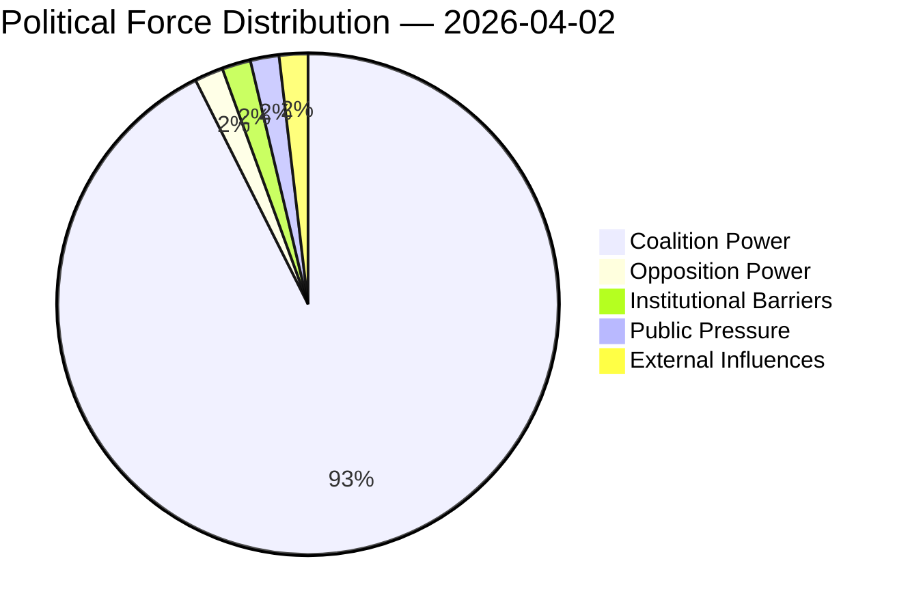

# Political Forces Analysis

## Forces Data

| Force | Trend | Strength | Key Actors | Confidence |
|-------|-------|----------|------------|------------|
| Coalition Power | stable | 50% | — | low |
| Opposition Power | stable | 0% | — | low |
| Institutional Barriers | stable | 0% | — | low |
| Public Pressure | stable | 0% | — | low |
| External Influences | stable | 0% | — | low |

## Balance

| Metric | Value |
|--------|-------|
| Coalition vs Opposition | 50% vs 1% |
| Dominant force | Coalition |
| Date | 2026-04-02 |

## Date: 2026-04-02
