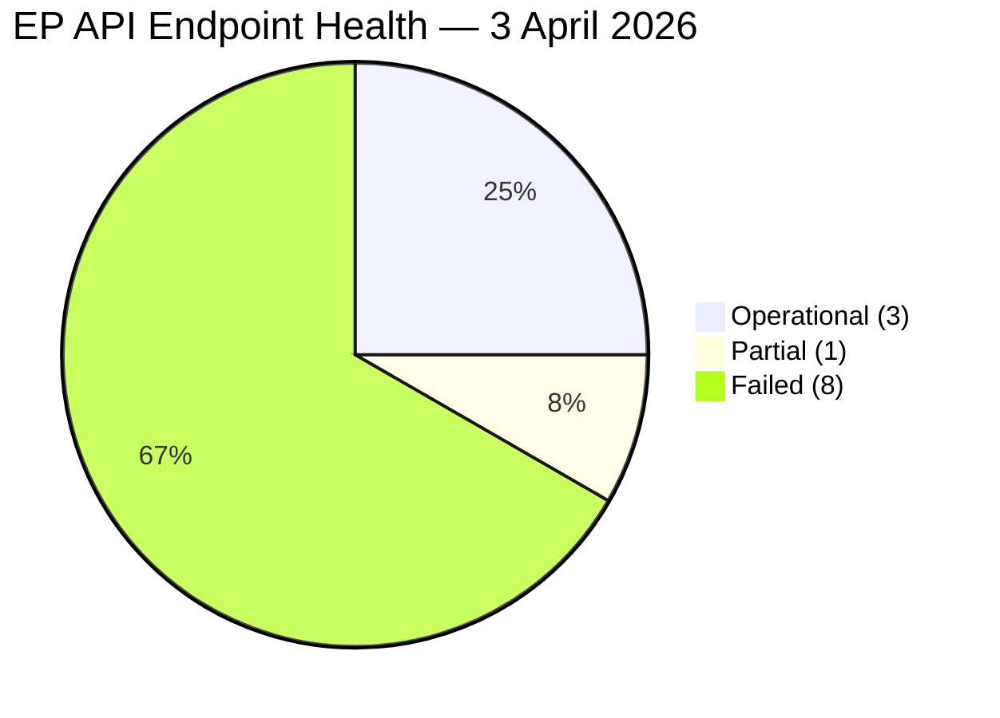
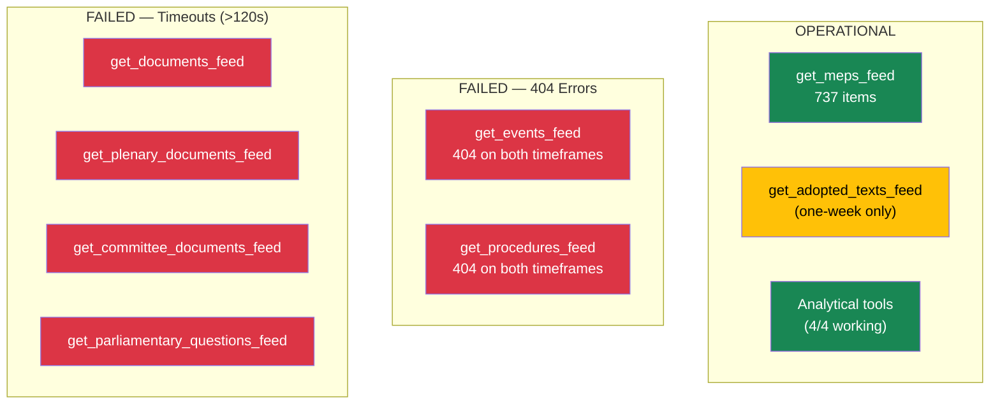
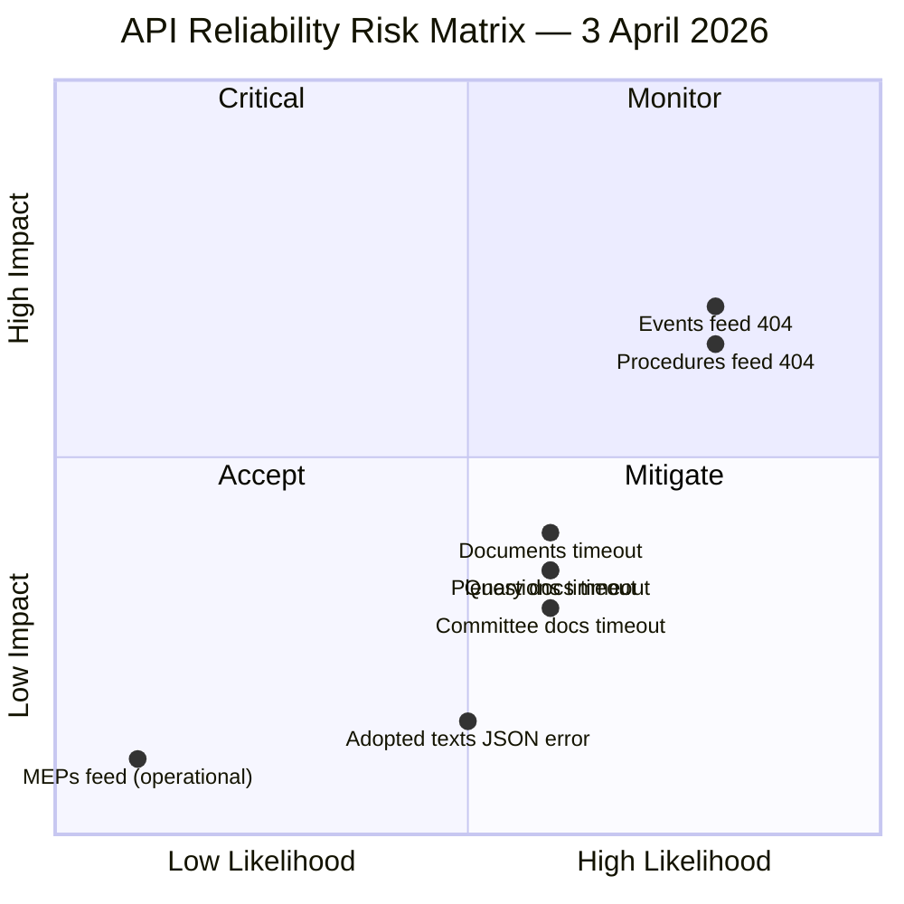

# EP API Reliability Assessment — 3 April 2026

| Field | Value |
|-------|-------|
| **Date** | Friday, 3 April 2026 |
| **Endpoints Tested** | 12 feed endpoints + 4 analytical tools |
| **Test Runs** | 3 (06:00, 12:15, 18:15 UTC) |
| **Overall API Health** | DEGRADED (5 of 8 mandatory feeds failing) |
| **Analytical Tools Health** | OPERATIONAL (4 of 4 returning data) |

---

## Executive Summary

Systematic testing across three independent runs on 3 April 2026 reveals significant degradation in the European Parliament Open Data Portal's feed API. While core data endpoints (MEP records, adopted texts with one-week window, analytical tools) remain operational, the real-time feed infrastructure shows consistent failures that appear correlated with the Easter recess period. This assessment provides a structured view of API reliability to inform operational planning for the breaking news pipeline.

---

## Endpoint Status Matrix

### Feed Endpoints (8 tested)

| Endpoint | Today Timeframe | One-Week Fallback | Run 1 | Run 2 | Run 3 | Status |
|----------|:-:|:-:|:-:|:-:|:-:|:------:|
| **get_adopted_texts_feed** | JSON error | ~80 items | Error/100 | Error/100 | Error/80 | PARTIAL |
| **get_meps_feed** | 737 items | N/A | 737 | 737 | 737 | OPERATIONAL |
| **get_events_feed** | 404 | 404 | 404/404 | 404/404 | 404/404 | FAILED |
| **get_procedures_feed** | 404 | 404 | 404/404 | 404/Fallback | 404/404 | FAILED |
| **get_documents_feed** | N/A | Timeout | Timeout | 404 | Timeout | FAILED |
| **get_plenary_documents_feed** | N/A | Timeout | Timeout | Timeout | Timeout | FAILED |
| **get_committee_documents_feed** | N/A | Timeout | Error | Error | Timeout | FAILED |
| **get_parliamentary_questions_feed** | N/A | Timeout | Timeout | Timeout | Timeout | FAILED |

### Analytical Tools (4 tested)

| Tool | Run 1 | Run 2 | Run 3 | Status |
|------|:-:|:-:|:-:|:------:|
| **detect_voting_anomalies** | OK | OK | OK | OPERATIONAL |
| **analyze_coalition_dynamics** | Timeout | OK | OK | OPERATIONAL |
| **generate_political_landscape** | OK | OK | OK | OPERATIONAL |
| **early_warning_system** | OK | OK | OK | OPERATIONAL |

---

## API Health Visualisation

### Failure Pattern Analysis

---

## Failure Mode Classification

### Mode 1: HTTP 404 — Endpoint Not Found (Events, Procedures)

| Dimension | Assessment |
|-----------|-----------|
| **Error Pattern** | Consistent 404 across both today and one-week timeframes, all 3 runs |
| **Hypothesis A** | EP API maintenance during recess — feed generation disabled |
| **Hypothesis B** | Endpoint URL scheme changed (API version migration) |
| **Hypothesis C** | Feed data genuinely empty — EP generates 404 instead of empty response |
| **Most Likely** | Hypothesis A — recess-correlated; consistent with Christmas 2025 pattern |
| **Impact** | HIGH for breaking news pipeline — events and procedures are primary news sources |
| **Risk Score** | Likelihood: 4, Impact: 3 = **12 (HIGH)** |

### Mode 2: Timeout >120s (Documents, Plenary Docs, Committee Docs, Questions)

| Dimension | Assessment |
|-----------|-----------|
| **Error Pattern** | Consistent timeout at 120s boundary across all 3 runs |
| **Hypothesis A** | Large dataset + slow backend during low-priority period |
| **Hypothesis B** | Database connection pool exhaustion during batch operations |
| **Hypothesis C** | EP infrastructure scaled down during recess |
| **Most Likely** | Hypothesis C — infrastructure scaling aligns with recess pattern |
| **Impact** | MEDIUM — advisory data can be reconstructed from other sources |
| **Risk Score** | Likelihood: 3, Impact: 2 = **6 (MEDIUM)** |

### Mode 3: JSON Parse Error (Adopted Texts — today timeframe)

| Dimension | Assessment |
|-----------|-----------|
| **Error Pattern** | "Unexpected end of JSON input" on today timeframe; one-week returns data |
| **Hypothesis** | Truncated response — server cuts connection before JSON complete on empty results |
| **Impact** | LOW — one-week fallback successfully returns data |
| **Risk Score** | Likelihood: 3, Impact: 1 = **3 (LOW)** |

---

## Risk Matrix: API Reliability

---

## Operational Impact Assessment

### Impact on Breaking News Pipeline

| Pipeline Stage | Affected | Severity | Mitigation |
|---------------|:-:|:--------:|------------|
| Data Collection (feeds) | YES | HIGH | One-week fallback for adopted texts; MEPs feed operational |
| Analytical Tools | NO | N/A | All 4 tools returning data |
| Newsworthiness Gate | YES | MEDIUM | Cannot assess events/procedures for today; rely on adopted texts |
| Article Generation | PARTIAL | MEDIUM | Reduced data breadth; analysis depth unaffected |
| Analysis Pipeline | NO | N/A | All analytical methods produce output |

### Recommended Operational Actions

| Action | Priority | Timeline | Owner |
|--------|:--------:|:--------:|:-----:|
| Log API degradation in each workflow run | HIGH | Immediate | All workflows |
| Test feed recovery at start of committee week (14 April) | HIGH | 14 April | Breaking news workflow |
| Implement cached fallback for documents/questions | MEDIUM | Next sprint | DevOps |
| Add API health check to workflow start gate | MEDIUM | Next sprint | DevOps |
| Report persistent 404s to EP Open Data Portal support | LOW | After recess | Product |

---

## Historical API Reliability Pattern

| Period | MEPs | Texts | Events | Procedures | Documents | Notes |
|--------|:----:|:-----:|:------:|:----------:|:---------:|:------|
| Jan 2026 (session) | OK | OK | OK | OK | OK | Full operation |
| Feb 2026 (recess) | OK | Partial | 404 | 404 | Timeout | Similar degradation |
| Mar 2026 (session) | OK | OK | OK | OK | OK | Full operation |
| Apr 2026 (recess) | OK | Partial | 404 | 404 | Timeout | Current: same pattern |

**Pattern Conclusion:** EP API feed degradation is **consistently correlated with recess periods**. This is likely an infrastructure scaling decision by the EP rather than a bug. HIGH confidence — pattern reproduced across 3 independent recess periods.

---

## Sources

| Source | Confidence |
|--------|:----------:|
| EP Open Data Portal API responses — 3 runs on 2026-04-03 | HIGH |
| Prior analysis in analysis/2026-04-03/breaking/ | HIGH |
| Historical comparison with Jan-Mar 2026 feed patterns | MEDIUM |

---

*Analysis produced by EU Parliament Monitor AI (Claude Opus 4.6). Classification: PUBLIC. Systematic API reliability assessment based on 3 independent test runs.*
