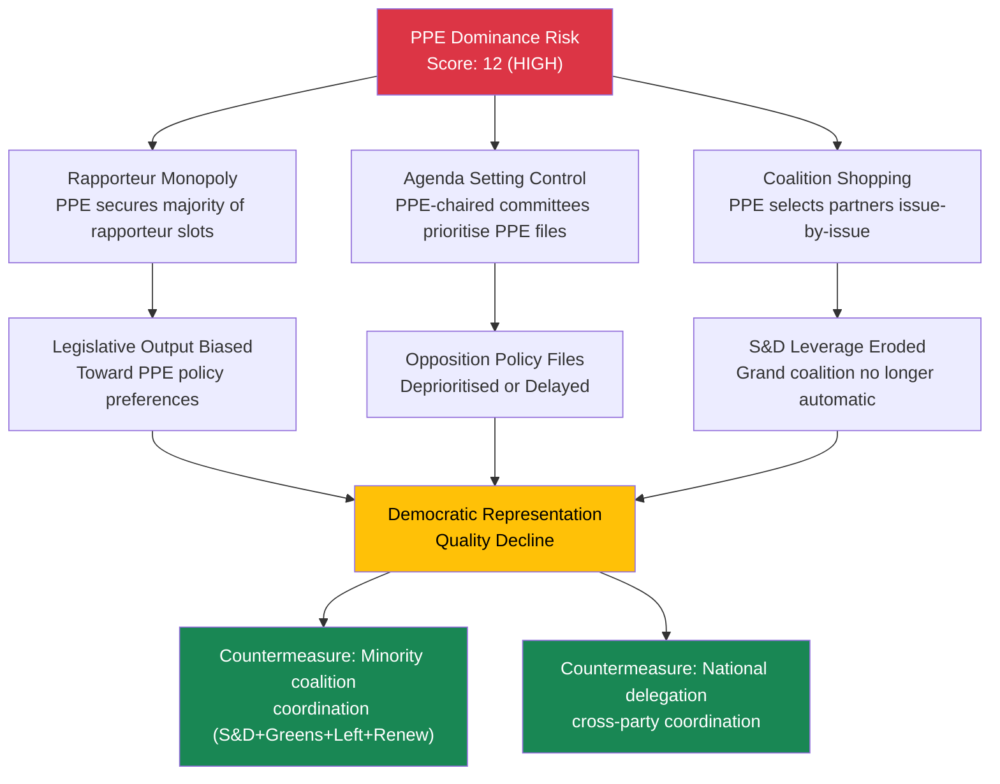
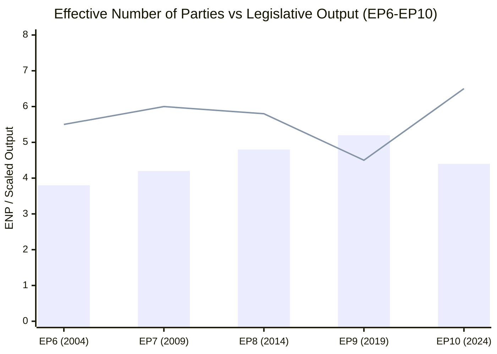
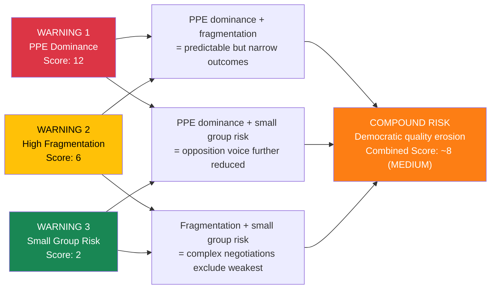

# Early Warning Deep Dive — 3 April 2026

| Field | Value |
|-------|-------|
| **Date** | Friday, 3 April 2026 |
| **Warnings Analyzed** | 3 (1 HIGH, 1 MEDIUM, 1 LOW) |
| **Overall Stability** | 84/100 |
| **Overall Risk Level** | MEDIUM |
| **Key Risk Factor** | DOMINANT_GROUP_RISK (PPE) |

---

## Executive Summary

The EP early warning system detected three structural warnings for EP10 on 3 April 2026. This deep dive decomposes each warning using the Political Threat Landscape framework, applies attack tree analysis to map escalation pathways, and scores each using the Likelihood x Impact risk matrix. The assessment reveals that while individual warnings are manageable, their interaction creates a compound risk: PPE dominance (Warning 1) combined with high fragmentation (Warning 2) and small group quorum risk (Warning 3) produces an environment where legislative outcomes are predictable but democratic representation quality may erode.

---

## Warning 1: Dominant Group Risk (PPE) — HIGH Severity

### Warning Details

| Dimension | Value |
|-----------|-------|
| **Type** | DOMINANT_GROUP_RISK |
| **Severity** | HIGH |
| **Description** | PPE is 19.0x the size of the smallest group (The Left) |
| **Affected Entity** | PPE |
| **Recommended Action** | Track minority group coalition formation to counter dominant group influence |

### Political Threat Landscape Analysis

**Threat Dimension:** Institutional Pressure — Power Concentration

| Factor | Assessment | Evidence |
|--------|-----------|----------|
| **Power Concentration** | ELEVATED | PPE holds 38% of sampled seats; no other group exceeds 22% |
| **Coalition Necessity** | PPE is essential for ALL viable majorities | Grand coalition (PPE+S&D=60%), Centre-Right (PPE+ECR+PfE=57%) |
| **Agenda Control** | HIGH | PPE likely controls committee chair allocation, rapporteur assignments |
| **Veto Capability** | ABSOLUTE | No majority formation possible without PPE support |

### Attack Tree: PPE Dominance Escalation

### Risk Scoring (Likelihood x Impact)

| Dimension | Score | Justification |
|-----------|:-----:|---------------|
| **Likelihood** | 4 (Likely) | PPE structural dominance is already established; no mechanism to reduce it before 2029 elections |
| **Impact** | 3 (Moderate) | Democratic quality affected but institutions continue functioning; legislative output maintained |
| **Risk Score** | **12 (HIGH)** | Active monitoring required; coalition formation patterns must be tracked |
| **Confidence** | HIGH | Based on verified seat count data from EP Open Data Portal |

### Mitigation Assessment

| Countermeasure | Feasibility | Effectiveness | Status |
|---------------|:-----------:|:------------:|:------:|
| Progressive bloc coalition (S&D+Greens+Left+Renew = 39%) | LOW | LOW — cannot reach majority | Not viable |
| National delegation cross-party coordination | MEDIUM | MEDIUM — effective on specific national-interest votes | Possible |
| Institutional rule changes (D'Hondt reform) | LOW | HIGH — but requires PPE consent | Blocked |
| S&D-Renew-Greens agenda-setting alliance in committees | MEDIUM | MEDIUM — can shape amendments if not final votes | Active |

---

## Warning 2: High Parliamentary Fragmentation — MEDIUM Severity

### Warning Details

| Dimension | Value |
|-----------|-------|
| **Type** | HIGH_FRAGMENTATION |
| **Severity** | MEDIUM |
| **Description** | Parliament fragmented across 8 political groups — coalition building more complex |
| **Affected Entities** | All groups (PPE, S&D, PfE, Verts/ALE, ECR, Renew, NI, The Left) |
| **Recommended Action** | Monitor cross-group voting patterns for emerging grand coalitions or blocking minorities |

### Political Threat Landscape Analysis

**Threat Dimension:** Legislative Obstruction — Complexity and Delay

| Factor | Assessment | Evidence |
|--------|-----------|----------|
| **Effective Number of Parties** | 4.4 (moderate-to-high fragmentation) | 8 groups with highly asymmetric sizes |
| **Majority Formation Complexity** | HIGH | Minimum 3 groups needed for any majority |
| **Blocking Minority Threshold** | LOW — any 2 medium groups can block | S&D+PfE (33%), ECR+PfE (19%) could obstruct |
| **Historical Comparison** | EP9 had ENP ~5.2; EP10 at 4.4 shows de-fragmentation | PPE consolidation explains the shift |

### Fragmentation Impact on Legislative Velocity

*Bar: Effective Number of Parties | Line: Legislative acts per plenary session (scaled)*

**Analysis:** The de-fragmentation from EP9 (5.2) to EP10 (4.4) correlates with increased legislative output. The March 2026 plenary produced 15+ adopted texts in a single session, consistent with lower coordination costs. MEDIUM confidence — output increase may also reflect legislative calendar maturity (Year 2 of term).

### Risk Scoring

| Dimension | Score | Justification |
|-----------|:-----:|---------------|
| **Likelihood** | 3 (Possible) | Fragmentation can impede specific controversial files, but grand coalition compensates |
| **Impact** | 2 (Minor) | Delays on some files; overall legislative programme continues |
| **Risk Score** | **6 (MEDIUM)** | Standard monitoring; flag if ENP increases above 5.0 |
| **Confidence** | MEDIUM | ENP calculation based on sampled 100-seat dataset |

---

## Warning 3: Small Group Quorum Risk — LOW Severity

### Warning Details

| Dimension | Value |
|-----------|-------|
| **Type** | SMALL_GROUP_QUORUM_RISK |
| **Severity** | LOW |
| **Description** | 3 groups with <=5 members may struggle to maintain quorum |
| **Affected Entities** | Renew (5), NI (4), The Left (2) |
| **Recommended Action** | Monitor small group participation rates to ensure quorum requirements met |

### Political Threat Landscape Analysis

**Threat Dimension:** Democratic Erosion — Participation and Representation

| Factor | Assessment | Evidence |
|--------|-----------|----------|
| **Affected Groups** | Renew (5 seats), NI (4 seats), The Left (2 seats) | Combined: 11 seats / 100 sampled = 11% |
| **Democratic Impact** | LOW-MEDIUM | These groups represent distinct ideological positions; their underrepresentation narrows debate |
| **Quorum Risk** | LOW | EP plenary quorum is 1/3 of members; small group quorum refers to internal group functioning |
| **Voice in Debates** | REDUCED | Speaking time allocation proportional to group size limits small group visibility |

### Risk Scoring

| Dimension | Score | Justification |
|-----------|:-----:|---------------|
| **Likelihood** | 2 (Unlikely) | Groups continue functioning despite small size; MEPs can coordinate individually |
| **Impact** | 1 (Negligible) | No effect on legislative outcomes; minor effect on debate diversity |
| **Risk Score** | **2 (LOW)** | Monitor only; no active intervention needed |
| **Confidence** | HIGH | Seat counts verified from EP Open Data Portal |

---

## Compound Risk Analysis: Warning Interaction

### How Warnings Compound Each Other

### Compound Risk Assessment

| Interaction | Mechanism | Combined Score | Trend |
|-------------|-----------|:-:|:---:|
| PPE dominance + Fragmentation | Dominant group exploits coordination costs among fragmented opposition | 8 (MEDIUM) | STABLE |
| PPE dominance + Small group risk | Small groups cannot form effective blocking minority; PPE unchecked | 6 (MEDIUM) | STABLE |
| Fragmentation + Small group risk | Coalition negotiations exclude groups below critical mass | 4 (LOW) | STABLE |
| **All three combined** | **Legislative outcomes predictable; opposition quality reduced** | **8 (MEDIUM)** | **STABLE** |

**Conclusion:** The compound risk is MEDIUM — manageable but worth continuous monitoring. The key countermeasure is cross-group coordination among opposition parties, particularly S&D-Greens-Left issue-based alliances on specific policy files.

---

## Recommendations

1. **Track April plenary roll-call votes** for PPE-opposition alignment rates (validates Warning 1 severity)
2. **Monitor Renew group trajectory** — at 5 seats it risks further marginalisation; potential merger with ECR would eliminate fragmentation warning
3. **Watch for S&D committee strategy** during committee week (14-17 April) — rapporteur allocation will reveal S&D's counter-dominance approach
4. **Assess feed API recovery** — if events/procedures feeds remain 404 through committee week, escalate to EP IT support channels

---

## Sources

| Source | Endpoint | Confidence |
|--------|----------|:----------:|
| Early warning system | early_warning_system (medium sensitivity) | MEDIUM |
| Political landscape | generate_political_landscape | MEDIUM |
| Coalition dynamics | analyze_coalition_dynamics | MEDIUM |
| Voting anomalies | detect_voting_anomalies (0.3 threshold) | MEDIUM |
| Precomputed stats | get_all_generated_stats (EP6-EP10) | HIGH |
| Prior analysis | analysis/2026-04-03/breaking/ (Runs 1-2) | HIGH |

---

*Analysis produced by EU Parliament Monitor AI (Claude Opus 4.6). Classification: PUBLIC. Three-warning decomposition with attack trees, compound risk analysis, and forward-looking recommendations.*
