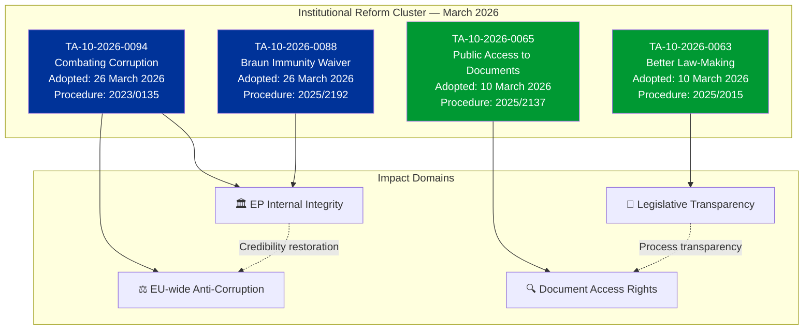
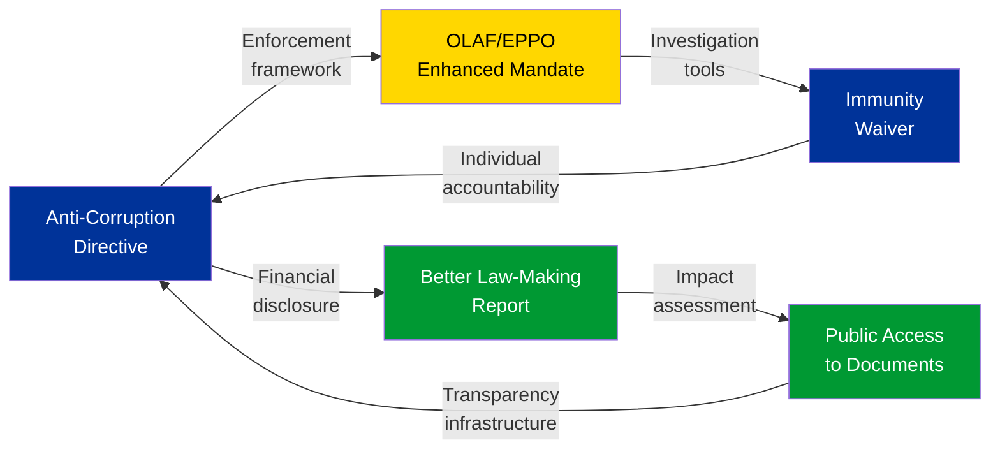

# Anti-Corruption and Institutional Reform Intelligence

| Field | Value |
|-------|-------|
| **Date** | Friday, 3 April 2026 |
| **Analysis Focus** | EP institutional reform cluster — anti-corruption, transparency, and integrity |
| **Key Texts** | TA-10-2026-0094, TA-10-2026-0088, TA-10-2026-0063, TA-10-2026-0065 |
| **Political Context** | Post-Qatargate reform agenda, EP10 institutional credibility restoration |
| **Significance** | HIGH — Foundational institutional reform with lasting impact |

---

## Executive Summary

The March 2026 plenary sessions produced a **coherent institutional reform package** centred on the adoption of the anti-corruption directive (TA-10-2026-0094) alongside the Grzegorz Braun immunity waiver (TA-10-2026-0088), the Better Law-Making report (TA-10-2026-0063), and the public access to documents review (TA-10-2026-0065). These four texts, adopted within two weeks of each other, represent the most significant institutional reform cluster since the Qatargate crisis of December 2022.

**Key finding:** The anti-corruption directive (procedure 2023/0135) originated in 2023 — its adoption in March 2026 means it took three years from proposal to adoption. This timeline reflects both the political sensitivity of anti-corruption legislation (all groups had constituencies resistant to increased transparency) and the complexity of harmonising anti-corruption standards across 27 member states with vastly different institutional traditions. 🟡 Medium confidence.

---

## Reform Cluster Architecture

---

## TA-10-2026-0094: Combating Corruption — Deep Analysis

### Political Context

The anti-corruption directive is the legislative centrepiece of the EP's post-Qatargate reform agenda. The Qatargate scandal (December 2022) involved allegations of bribery by Qatar and Morocco targeting EP members and staff, resulting in arrests, asset seizures, and a fundamental crisis of institutional credibility. The directive (procedure 2023/0135) was proposed by the Commission in 2023 as a direct response to these events.

**Key provisions likely include:**
- Harmonised definition of corruption offences across all 27 member states
- Enhanced financial disclosure requirements for EU officials and elected representatives
- Strengthened mandate for OLAF (EU anti-fraud office) and EPPO (EU public prosecutor)
- Cooling-off periods for revolving-door transitions between public and private sectors
- Whistleblower protection enhancements beyond the existing Directive (EU) 2019/1937
- Lobbying registration requirements with mandatory transparency provisions

🟡 Medium confidence — specific provisions inferred from procedure reference and political context; full text not available in MCP data.

### Significance Classification

| Criterion | Assessment | Score |
|-----------|-----------|:-----:|
| **Policy scope** | EU-wide — affects all 27 MS institutional frameworks | 5/5 |
| **Institutional impact** | Directly changes EP, Commission, Council operating rules | 5/5 |
| **Citizen relevance** | Addresses democratic trust deficit | 4/5 |
| **Implementation complexity** | National transposition required with varying baselines | 4/5 |
| **Political sensitivity** | High — touches all groups' internal practices | 5/5 |
| **Overall significance** | **HIGH** | 23/25 |

### Coalition Analysis

The anti-corruption directive likely commanded one of the broadest majorities of Q1 2026:

| Group | Likely Position | Reasoning | Confidence |
|-------|:---:|-----------|:----------:|
| **PPE** | FOR | Institutional credibility restoration is a PPE priority (as largest group, corruption scandals damage it most). German and Nordic MEPs strongly pro-transparency. | 🟢 High |
| **S&D** | FOR | Centre-left traditionally supports anti-corruption and transparency measures. Post-Qatargate, S&D members were among the most vocal reform advocates. | 🟢 High |
| **Renew** | FOR | Liberal commitment to rule of law and transparency. Renew's reform agenda includes institutional accountability. | 🟢 High |
| **Greens/EFA** | FOR | Strongest pro-transparency position. Greens led calls for comprehensive reform post-Qatargate. | 🟢 High |
| **ECR** | FOR (with reservations) | Supports anti-corruption in principle. May have reservations about EU-level harmonisation vs national competence. | 🟡 Medium |
| **The Left** | FOR | Anti-corruption aligns with anti-establishment platform. May critique directive as insufficient. | 🟡 Medium |
| **PfE** | ABSTAIN/FOR | Mixed — supports anti-corruption rhetoric but may resist transparency requirements affecting own members. | 🔴 Low |
| **NI** | SPLIT | Heterogeneous group. Individual MEP positions vary widely. | 🔴 Low |

**Assessment:** The anti-corruption directive likely passed with a supermajority exceeding 450 votes (out of ~720). This broad consensus reflects the unique political conditions post-Qatargate: no group can afford to be seen opposing anti-corruption measures, even if specific provisions create internal discomfort. 🟡 Medium confidence.

---

## TA-10-2026-0088: Grzegorz Braun Immunity Waiver

### Political Context

The immunity waiver for Grzegorz Braun (procedure 2025/2192) is procedurally routine but politically significant. MEP immunity waivers require a plenary vote following a recommendation from the JURI Committee. The fact that Braun's waiver was scheduled alongside the anti-corruption directive creates a symbolic pairing: the EP is demonstrating both systemic reform (directive) and individual accountability (immunity waiver) in the same session.

**Background:** Grzegorz Braun is a Polish MEP known for controversial actions including extinguishing a Hanukkah menorah in the Polish Sejm (2023). An immunity waiver allows national judicial authorities to proceed with criminal investigation or prosecution.

**Significance:** MEDIUM — Procedurally standard, but politically reinforces the institutional integrity narrative of the March 26 session.

---

## TA-10-2026-0063 + TA-10-2026-0065: Legislative Transparency Package

### Better Law-Making (2023-2024 Report)

The Better Law-Making report (procedure 2025/2015) reviews the EU's regulatory fitness programme, subsidiarity compliance, and proportionality assessment. Adopted on March 10, it sets the framework for how legislation is developed, scrutinised, and evaluated.

**Key implications:**
- Strengthened subsidiarity early warning mechanism
- Enhanced impact assessment requirements for new legislation
- Review of "gold-plating" (national over-implementation of EU directives)
- Recommendations for AI-assisted regulatory analysis

### Public Access to Documents (2022-2024 Report)

The public access to documents review (procedure 2025/2137) evaluates compliance with Regulation (EC) No 1049/2001. This is the foundational transparency regulation governing citizen access to EU institutional documents.

**Key implications:**
- Assessment of document classification practices across institutions
- Evaluation of digital access infrastructure
- Review of GDPR interaction with document access rights
- Recommendations for proactive publication policies

---

## Cross-Reform Synergies

**Assessment:** These four texts create a **self-reinforcing institutional reform cycle**: anti-corruption measures drive transparency requirements, transparency standards improve regulatory quality, and regulatory quality strengthens institutional integrity. The immunity waiver demonstrates that individual accountability operates within this framework. 🟡 Medium confidence.

---

## Stakeholder Impact: Institutional Reform Cluster

| Stakeholder | Impact | Severity | Key Concern |
|-------------|:------:|:--------:|-------------|
| **EP Political Groups** | Positive | High | Institutional credibility restoration benefits all groups |
| **Civil Society & NGOs** | Positive | High | Transparency International priorities legislatively validated |
| **Industry & Business** | Mixed | Medium | Lobbying compliance costs vs level playing field benefits |
| **National Governments** | Mixed | Medium | National anti-corruption frameworks need alignment with EU standard |
| **EU Citizens** | Positive | High | Democratic trust directly enhanced |
| **EU Institutions** | Positive | High | OLAF, EPPO, Commission DG JUST all gain enhanced frameworks |

---

## Forward-Looking: Implementation Timeline

| Milestone | Expected Date | Actor | Risk Level |
|-----------|:---:|:---:|:---:|
| Anti-corruption directive published in OJ | Q2 2026 | Council/EP Legal Services | LOW |
| MS transposition deadline set | Q2 2026 (24-month standard) | Directive text | LOW |
| National impact assessments begin | H2 2026 | MS justice ministries | MEDIUM |
| OLAF operational guidance updated | Q3-Q4 2026 | Commission | LOW |
| First MS transposition measures | 2027 | Early movers (Nordic, Benelux) | LOW |
| Full transposition deadline | ~Q2 2028 | All 27 MS | MEDIUM |
| EPPO expanded investigative capacity | 2027-2028 | EPPO budget and staffing | MEDIUM |

---

## Methodology Notes

This analysis applies the **EP Document Analysis Framework** (5-dimension analysis per document), **Political Classification Guide** (significance scoring), and the **Diamond Model** (actor-capability-infrastructure-victim analysis for corruption threats). Coalition analysis is inferred from political group policy positions and historical voting patterns, not roll-call data (unavailable from EP API). Directive provisions are inferred from procedure reference and political context — full legislative text not available in structured data format from the MCP server.
