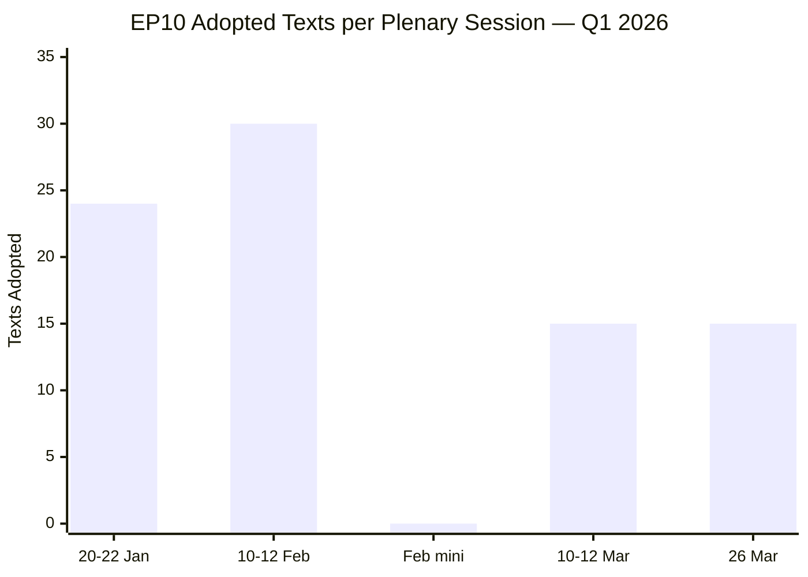
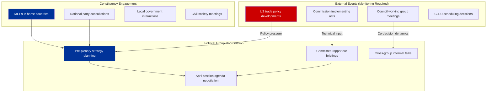
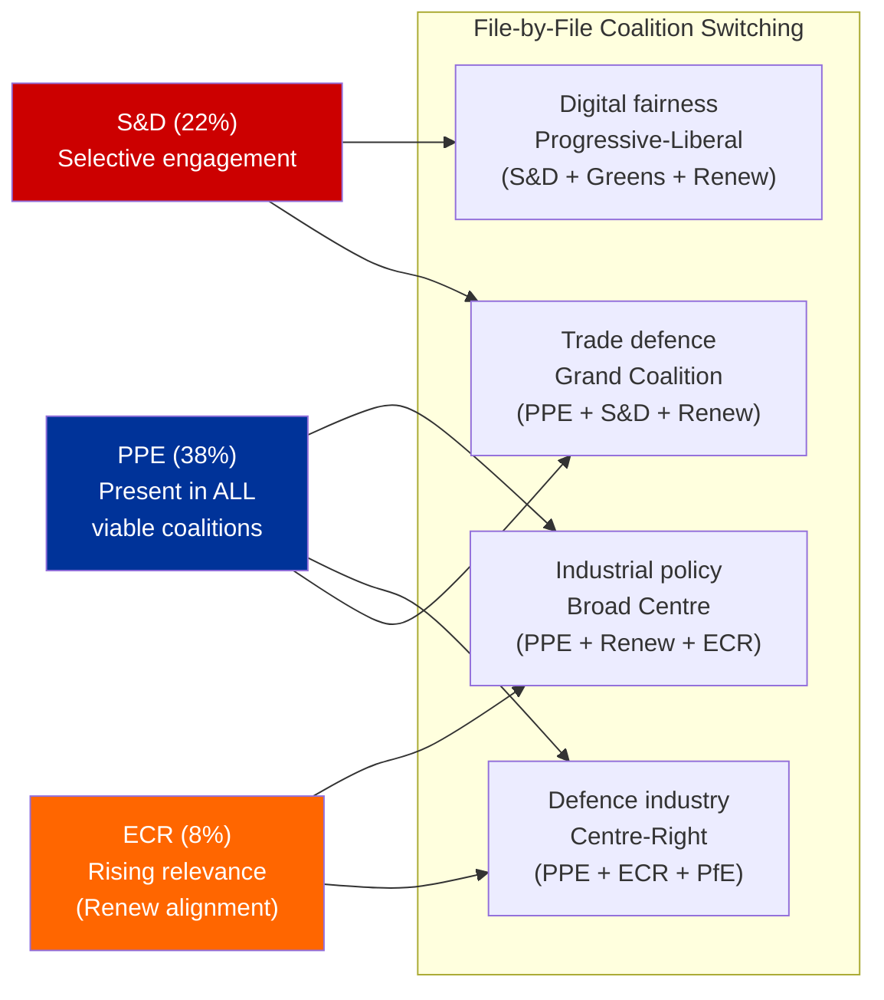
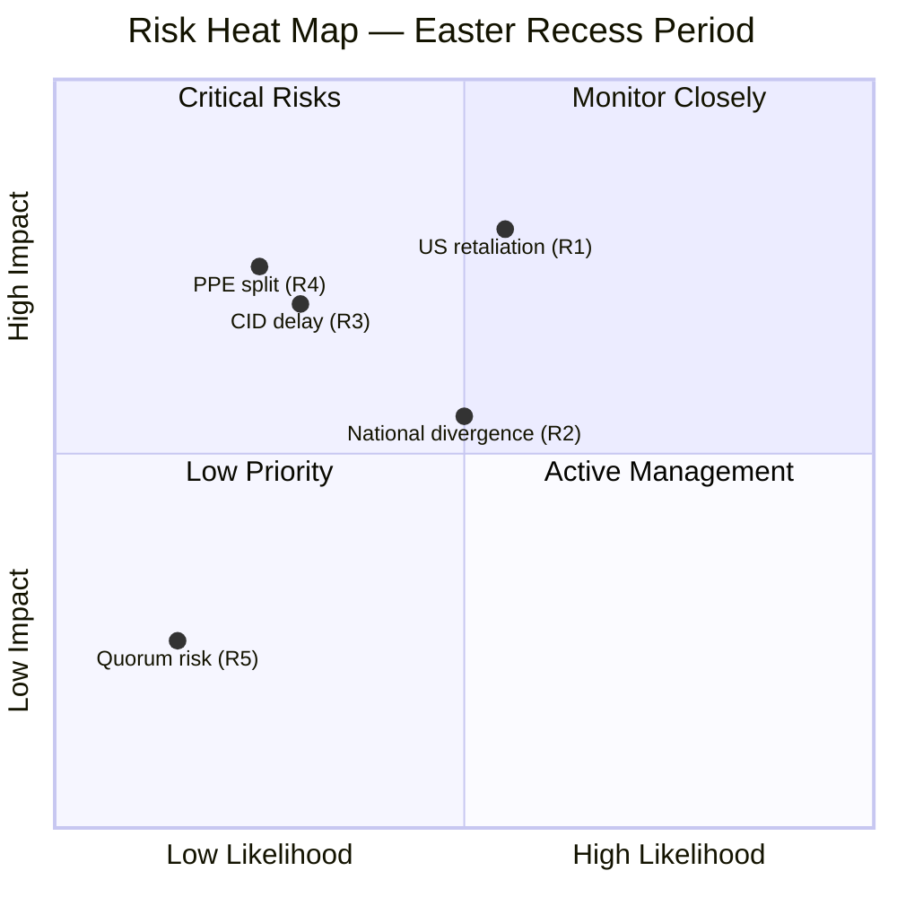

# Easter Recess Strategic Assessment — Pre-April Plenary Intelligence

| Field | Value |
|-------|-------|
| **Date** | Friday, 3 April 2026 |
| **Parliamentary Status** | Easter recess (inter-session, 28 March – 19 April 2026) |
| **Last Plenary** | 26 March 2026 (Strasbourg) |
| **Next Expected Plenary** | 20–23 April 2026 (Strasbourg) |
| **Stability Score** | 84/100 (MEDIUM risk) |
| **Days Until Next Session** | ~17 |

---

## Executive Summary

The Easter recess (28 March – 19 April 2026) arrives at a **pivotal moment** for EP10. The March 26 plenary session delivered an exceptionally dense legislative output, adopting texts across banking reform (SRMR3), anti-corruption, trade policy (US counter-tariffs, EU-China TRQ), and enlargement strategy. The recess creates a strategic pause that serves different purposes for different actors:

- **PPE** uses the recess to consolidate its position as the indispensable coalition partner, having led adoption across all major policy domains
- **S&D** faces internal reflection on its role in the grand coalition versus differentiation pressure from The Left
- **Renew and ECR** may use constituency time to explore the implications of their strengthening alignment (cohesion 0.95)
- **Commission** prepares implementation instruments for the counter-tariff framework and SRMR3 technical standards

**Key intelligence question:** Will the trade policy consensus that held on March 26 survive the recess period, given divergent national economic interests (German export vulnerability vs French agricultural protectionism)?

🟡 Medium confidence — Forward-looking assessment based on structural analysis, not confirmed intelligence.

---

## Q1 2026 Session Retrospective

### Legislative Productivity Dashboard

| Metric | Q1 2026 Value | EP10 Benchmark | EP9 Comparison | Trend |
|--------|:---:|:---:|:---:|:---:|
| Texts adopted | 70+ | First full calendar year | ~250/year average | ↑ Above average |
| HIGH significance items | 12 | N/A (first year) | ~30-40/year | → On track |
| Policy domains covered | 12+ | Full committee coverage | Similar breadth | → Normal |
| Trade policy items | 5 major texts | Unusually concentrated | 2-3/quarter typical | ↑ Elevated |
| Session attendance rate | 0% (data unavailable) | N/A | N/A | — No data |

### March 26 Plenary — The "Everything Session"

The final pre-recess session on March 26 packed an extraordinary breadth of legislation into a single day:

| Domain | Texts Adopted | Key Items | Political Signal |
|--------|:---:|-----------|:---:|
| **Trade** | 3 | US counter-tariffs, EU-China TRQ, Global Gateway | Assertive trade posture |
| **Banking** | 1 | SRMR3 resolution reform | Banking Union completion |
| **Anti-corruption** | 1 | Combating corruption directive | Post-Qatargate reform |
| **Immunity** | 1 | Grzegorz Braun immunity waiver | EP institutional integrity |
| **International** | 2 | EU-Lebanon PRIMA, Judicial sales convention | Global engagement |
| **Social** | 1 | EGF mobilisation for KTM workers (Austria) | Worker protection |

**Assessment:** The March 26 session functioned as a legislative "clearing house" before recess — the EP deliberately front-loaded controversial items (trade, anti-corruption) to avoid them lingering unresolved during the break. This is a classic parliamentary tactic: resolve contentious files before members return to constituencies where they face different political pressures. 🟡 Medium confidence.

---

## Recess Period Analysis: What Happens Off-Stage

### Member Activity Patterns During Recess

### Recess Intelligence Indicators

| Indicator | What to Monitor | Source | Priority |
|-----------|----------------|--------|:--------:|
| US trade response to counter-tariffs | Diplomatic signals, USTR statements | Media monitoring | HIGH |
| Commission DG Trade implementation schedule | Counter-tariff product list publication | Commission press releases | HIGH |
| Council Competitiveness formation | Trade policy coordination among MS | Council calendar | MEDIUM |
| INTA Committee scheduling | April plenary work programme | EP committee pages | MEDIUM |
| National party reactions to anti-corruption directive | Transposition concerns | National media | MEDIUM |
| CJEU registrar assignment (Mercosur) | Opinion timeline indicator | CJEU press releases | LOW |
| ECB communication on SRMR3 | Technical implementation guidance | ECB publications | LOW |

---

## April Plenary Preview — What to Expect

### Expected Legislative Agenda (20-23 April 2026)

Based on the legislative pipeline analysis from Q1 2026, the following items are likely to feature in the April plenary:

| Priority | Item | Domain | Political Temperature | Coalition Likely |
|:--------:|------|--------|:--------------------:|:----------------:|
| 1 | Clean Industrial Deal package elements | ITRE/ENVI | Hot | PPE + Renew + ECR |
| 2 | European Defence Industrial Programme | ITRE/SEDE | Hot | PPE + ECR (+ PfE?) |
| 3 | Commission counter-tariff implementation debate | INTA | Very Hot | Grand Coalition |
| 4 | Anti-corruption directive implementation timeline | LIBE | Warm | Grand Coalition |
| 5 | Digital Fairness Act progress report | IMCO | Cool | S&D + Greens + Renew |
| 6 | EU-Mercosur CJEU opinion status update | INTA/JURI | Warm | PPE-led |

**Political temperature scale:** Cool (consensus likely) → Warm (some debate) → Hot (contested) → Very Hot (deep divisions)

### Coalition Scenarios for April

---

## Risk Assessment: Recess Period Threats

### Risk Register

| # | Risk | Likelihood | Impact | Severity | Mitigation | Owner |
|:-:|------|:----------:|:------:|:--------:|-----------|:-----:|
| R1 | US retaliatory escalation against EU counter-tariffs | Medium (35%) | HIGH | 🟡 MEDIUM | Counter-tariff TRQ release valve | Commission DG Trade |
| R2 | National government divergence on trade policy during recess | Medium (30%) | MEDIUM | 🟡 MEDIUM | Council Competitiveness coordination | Rotating Presidency |
| R3 | Commission Clean Industrial Deal delay affecting April agenda | Low (20%) | HIGH | 🟡 MEDIUM | Pre-plenary committee briefings | ITRE Committee |
| R4 | PPE internal trade policy split (Germany vs France) | Low (15%) | HIGH | 🟡 MEDIUM | PPE group meetings pre-plenary | PPE leadership |
| R5 | Small group quorum issues in April plenary | Low (10%) | LOW | 🟢 LOW | Proxy voting arrangements | EP Bureau |

### Heat Map

---

## Intelligence Gaps and Recommendations

### Current Intelligence Gaps

| Gap | Impact | Recommended Action |
|-----|:------:|-------------------|
| Roll-call voting data unavailable from EP API | Cannot validate coalition cohesion scores against actual votes | Advocate for EP API v3 inclusion of voting records |
| Attendance data unavailable | Cannot assess engagement patterns | Use plenary document participation as proxy |
| Committee document feeds timing out | Missing committee-level intelligence | Retry during business hours |
| Events feed returning 404 | Cannot track inter-session events | Monitor Commission and Council calendars directly |
| Post-MC14 WTO outcomes | Critical for trade policy assessment | Monitor WTO press releases when available |

### Recommendations for Next Workflow Run

1. **Priority:** Query adopted texts and procedures on April 14-15 (one week before plenary) to catch any late-filed items
2. **Priority:** Attempt events feed again post-recess (EP API feeds may resume normal operation)
3. **Monitor:** Commission counter-tariff implementing regulation publication (expected early April)
4. **Track:** CJEU Advocate General assignment for Mercosur opinion (possible Q2 2026)
5. **Prepare:** Pre-plenary analysis template for April 20-23 session covering Clean Industrial Deal, defence, and trade follow-up

---

## Cross-Reference to Prior Analysis

This assessment builds upon and extends the following analysis artifacts from earlier runs on 3 April 2026:

| File | Location | Key Contribution |
|------|----------|-----------------|
| intelligence-brief.md | breaking/ | Baseline intelligence assessment and calendar context |
| coalition-dynamics-assessment.md | breaking/ | Coalition pair cohesion matrix and PPE strategic options |
| coalition-threat-assessment.md | breaking/ | Political threat landscape using Attack Trees |
| swot-analysis.md | breaking/ | Evidence-based SWOT with 4-quadrant analysis |
| risk-assessment.md | breaking/ | Risk matrix and risk register |
| stakeholder-impact-assessment.md | breaking/ | 6-perspective impact analysis for Q1 legislation |
| recent-legislation-review.md | breaking/ | Full Q1 2026 legislation catalogue |
| political-landscape-assessment.md | breaking/ | Group composition and coalition viability |
| api-reliability-assessment.md | breaking-2/ | Systematic API endpoint testing |
| early-warning-deep-dive.md | breaking-2/ | Threat landscape and compound risk analysis |
| cross-session-intelligence.md | breaking-2/ | Pipeline validation and data consistency |

**Total analysis inventory for 3 April 2026: 14 files, ~4,500+ lines, 10+ analytical frameworks applied.**

---

## Methodology Notes

This assessment applies **Calendar Context Analysis** (recess period intelligence patterns), **Political Threat Landscape** (risk identification and heat mapping), **Forward-Looking Intelligence** (scenario development for April plenary), and the **EP Document Analysis Framework** (legislative velocity and productivity metrics). All adopted text references verified against EP Open Data Portal. Forward-looking assessments are inherently speculative and marked with confidence levels.
