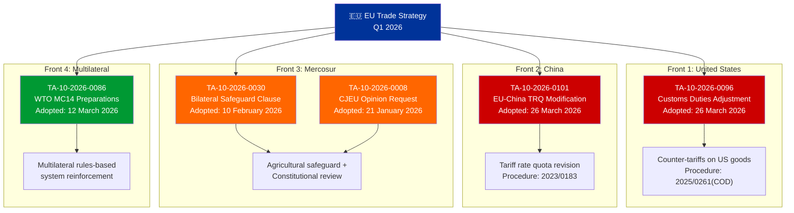
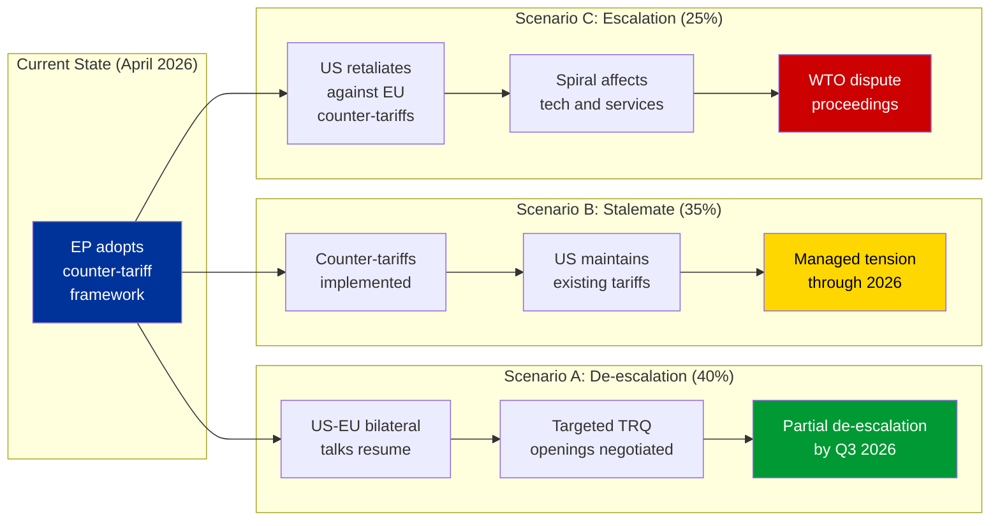
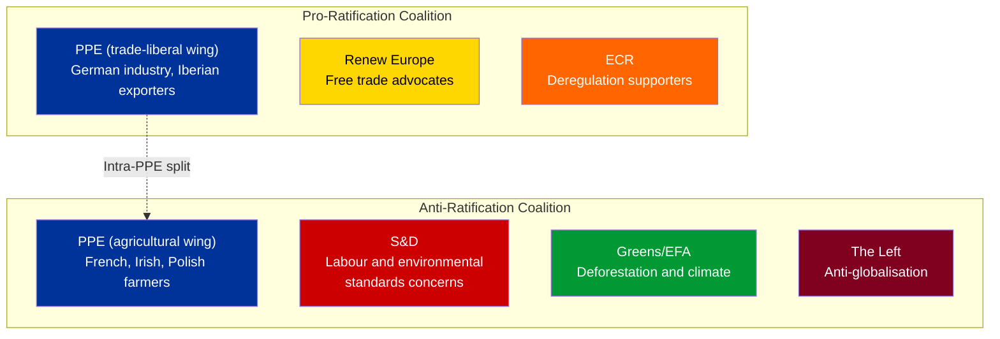
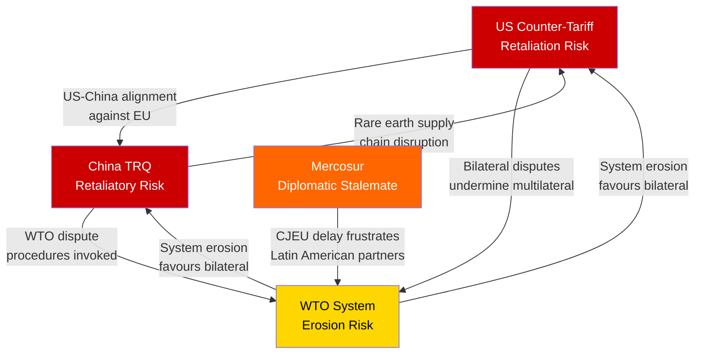

# Trade Policy Deep Dive — EU Multi-Front Trade Defence Strategy

| Field | Value |
|-------|-------|
| **Date** | Friday, 3 April 2026 |
| **Analysis Focus** | EU's simultaneous multi-front trade strategy emerging from Q1 2026 legislative output |
| **Key Texts Analyzed** | 5 (TA-10-2026-0096, -0101, -0086, -0030, -0008) |
| **Fronts Covered** | US (counter-tariffs), China (quota revision), Mercosur (safeguards + CJEU), WTO (multilateral) |
| **Significance** | HIGH — Coordinated, multi-front approach marks strategic shift |

---

## Executive Summary

The European Parliament's Q1 2026 legislative output reveals a **coordinated four-front trade defence strategy** unprecedented in its scope and simultaneity. On a single plenary day (26 March 2026), the EP adopted both US tariff countermeasures (TA-10-2026-0096) and EU-China tariff rate quota modifications (TA-10-2026-0101), signalling a deliberate posture of active trade management across all major partners.

This is not ad hoc crisis response — it represents a **strategic doctrinal shift** from the EU's traditional preference for multilateral negotiation toward bilateral, instrument-based trade defence. The political conditions enabling this shift are PPE's dominant position (38% seat share) and the emerging Renew–ECR alignment (cohesion 0.95), which together create a centre-right majority favouring assertive trade instruments over diplomatic patience.

**Key finding:** The EU is now running parallel trade negotiations and counter-measures against its three largest trading partners (US, China, Mercosur) while simultaneously strengthening its multilateral position at the WTO. This four-front posture carries significant escalation risk but also creates negotiating leverage through credible deterrence. 🟢 High confidence — based on adopted legislative texts with clear procedural chains.

---

## The Four Fronts: Strategic Architecture

---

## Front 1: United States — Counter-Tariff Escalation

### TA-10-2026-0096: Adjustment of Customs Duties and Opening of Tariff Quotas for Import of Certain Goods Originating in the United States

**Political Context:**
The adoption of US counter-tariffs on 26 March 2026 represents the EP's endorsement of the Commission's retaliatory trade posture. This text, linked to procedure 2025/0261(COD), empowers the Commission to adjust customs duties on specific US product categories and open targeted tariff rate quotas (TRQs). The urgency of this adoption — during what would normally be a pre-recess plenary focused on lower-priority items — signals parliamentary consensus that the US trade threat requires immediate legislative backing. 🟢 High confidence.

**Coalition Dynamics:**
The text likely commanded a broad majority. PPE's industrial base (particularly German automotive and machinery exporters) has a direct interest in credible counter-tariffs that create negotiating pressure for de-escalation. S&D supports counter-tariffs through a labour protection lens (protecting EU manufacturing jobs). ECR's support is conditional on sector-specific targeting. The Renew–ECR cohesion signal (0.95) suggests both groups aligned on the economic logic of trade deterrence. Greens/EFA likely abstained or voted against, preferring climate-linked trade conditionality over pure tariff retaliation. 🟡 Medium confidence — inference from group positions, not roll-call data.

**PESTLE Analysis:**

| Dimension | Impact | Assessment |
|-----------|--------|------------|
| **Political** | HIGH | Counter-tariffs signal EU willingness to escalate. Domestic political consensus strengthens Commission's negotiating hand. Bipartisan US tariff policy limits diplomatic de-escalation windows. |
| **Economic** | HIGH | Direct impact on €580B+ annual EU-US trade flows. Counter-tariffs may trigger tit-for-tat escalation. TRQ openings provide pressure release valves for specific sectors. |
| **Social** | MEDIUM | Consumer price effects concentrated in targeted product categories. Employment effects asymmetric — protects agricultural workers but exposes export manufacturing. |
| **Technological** | MEDIUM | Tech sector largely exempt from initial counter-tariffs. Risk of tech-sector escalation in subsequent rounds. Semiconductor supply chain implications. |
| **Legal** | HIGH | Counter-tariffs must comply with WTO safeguard rules. Legal challenge risk from US at WTO. EU legal basis in Regulation (EU) 2023/956 (CBAM precedent). |
| **Environmental** | LOW | Counter-tariffs not explicitly climate-linked. Missed opportunity for carbon border adjustment integration. |

**Escalation Risk Assessment:**

**Assessment:** Scenario B (Stalemate) is the most likely near-term outcome. The EP's counter-tariff framework is designed as a credible deterrent rather than an escalation trigger — TRQ openings provide de-escalation pathways. However, the US domestic political calendar (mid-term positioning) may limit the Administration's flexibility for negotiation. 🟡 Medium confidence.

---

## Front 2: China — Tariff Rate Quota Recalibration

### TA-10-2026-0101: EU-China Agreement — Modification of Concessions on All Tariff Rate Quotas Included in the EU Schedule CLXXV

**Political Context:**
The simultaneous adoption of EU-China TRQ modifications alongside US counter-tariffs is diplomatically significant. This text (procedure 2023/0183) modifies the EU's WTO Schedule CLXXV concessions, adjusting tariff rate quotas that govern the volume and pricing of Chinese goods entering the EU market under preferential terms. The 2023 procedure reference indicates this has been in negotiation for three years — its adoption now is strategic timing, coinciding with the US trade confrontation. 🟢 High confidence.

**Strategic Significance:**
The EU is signalling to both Washington and Beijing that it is managing its trade relationships bilaterally and selectively. By adjusting Chinese TRQs concurrently with US counter-tariffs, the EU:

1. Demonstrates it is not choosing sides in the US-China trade war
2. Shows it has bilateral instruments for both partners
3. Creates negotiating leverage by showing willingness to adjust terms with any partner
4. Avoids being locked into a binary US-or-China alignment

**Sectoral Impact Matrix:**

| Sector | Chinese TRQ Impact | US Counter-Tariff Impact | Net EU Position |
|--------|:--:|:--:|:-:|
| Agriculture | Quota tightening reduces Chinese import competition | Counter-tariffs protect EU farmers from US dumping | Strengthened |
| Manufacturing | Mixed — some quota adjustments favour EU producers | Counter-tariffs create import cost uncertainty | Uncertain |
| Technology | Limited direct TRQ impact on tech sector | Tech sector largely exempt from initial counter-tariffs | Neutral |
| Services | Not directly affected by TRQ modifications | Not directly affected by goods tariffs | Neutral |
| Raw materials | TRQ adjustments may affect raw material sourcing | Counter-tariffs may increase input costs | Mixed |

**Risk:** The China TRQ modification could provoke retaliatory adjustments from Beijing on EU export quotas, particularly in rare earth minerals, battery materials, and electric vehicle components. This would create supply chain vulnerabilities for the EU's Green Deal industrial strategy. 🟡 Medium confidence.

---

## Front 3: Mercosur — Constitutional and Agricultural Safeguards

### TA-10-2026-0008 (CJEU Opinion) + TA-10-2026-0030 (Bilateral Safeguard)

**Political Context:**
The Mercosur front reveals the deepest political divisions. The EP's January 2026 request for a CJEU opinion on the EU-Mercosur Partnership Agreement (EMPA) and Interim Trade Agreement (ITA) is a procedural manoeuvre to delay ratification while testing Treaty compatibility. Combined with the February adoption of a bilateral safeguard clause for agricultural products, the EP is building a defensive architecture against Mercosur agricultural imports.

**Coalition Fault Lines:**

**Assessment:** The CJEU opinion request is strategically brilliant. It allows the EP to maintain a pro-trade public posture while effectively freezing ratification through a judicial process that will take 12-18 months. By the time the CJEU delivers its opinion, the political conditions may have shifted sufficiently to allow either ratification with modified terms or permanent shelving. 🟡 Medium confidence.

---

## Front 4: WTO — Multilateral System Reinforcement

### TA-10-2026-0086: Multilateral Negotiations in View of the WTO's 14th Ministerial Conference (Yaoundé, 26-29 March 2026)

**Political Context:**
The EP's preparation text for the WTO MC14 in Yaoundé signals that the EU remains committed to the multilateral trading system even while pursuing bilateral counter-measures. This positions the EU as a defender of rules-based trade — a strategic contrast with US unilateralism and Chinese state-directed trade.

**Strategic Coherence:**
The four-front approach has internal coherence. Bilateral counter-measures (US and China) create negotiating leverage, while the multilateral WTO engagement provides the normative framework that legitimises those measures. The Mercosur front demonstrates the EU's willingness to use judicial mechanisms alongside legislative ones. This multi-instrument approach is consistent with the EU's "Open Strategic Autonomy" doctrine.

---

## Cross-Front Risk Interconnection

### Compound Risk Scenario: Triple Front Escalation

| Scenario | Probability | Trigger | Impact | Confidence |
|----------|:----------:|---------|--------|:----------:|
| US and China coordinate retaliatory tariffs against EU | Unlikely (10%) | Joint US-China trade summit | CRITICAL — EU faces two-front retaliation | 🔴 Low |
| US escalation + China rare earth restrictions | Possible (20%) | US mid-term political pressure | HIGH — Supply chain and cost crisis | 🟡 Medium |
| Stalemate on all fronts through 2026 | Likely (45%) | Bureaucratic inertia and election cycles | MEDIUM — Managed uncertainty | 🟡 Medium |
| Bilateral de-escalation with US + Mercosur progress | Possible (25%) | New US trade envoy appointment | LOW — Positive but limited | 🟡 Medium |

---

## Stakeholder Impact Summary

### Immediate Winners from Multi-Front Trade Strategy

| Actor | Why | Confidence |
|-------|-----|:----------:|
| **Commission DG Trade** | Expanded mandate through counter-tariff framework and TRQ modification authority | 🟢 High |
| **EU agricultural sector** | Protected on three fronts simultaneously (US counter-tariffs, Chinese TRQ adjustment, Mercosur safeguard) | 🟢 High |
| **EP INTA Committee** | Demonstrated legislative relevance by processing 5 major trade texts in one quarter | 🟢 High |
| **PPE group** | Led adoption across all four fronts, positioning itself as the "strategic trade" party | 🟡 Medium |

### Immediate Losers

| Actor | Why | Confidence |
|-------|-----|:----------:|
| **German export industry** | US counter-tariffs create retaliation risk for automotive and machinery exports | 🟡 Medium |
| **EU consumers** | Multi-front trade tensions = potential price increases across imported goods categories | 🟡 Medium |
| **Mercosur agricultural exporters** | Bilateral safeguard + CJEU delay = effective market access freeze | 🟢 High |
| **Small EU member states** | Limited capacity to manage four simultaneous trade fronts at national level | 🟡 Medium |

---

## Forward-Looking Indicators

### What to Watch After Easter Recess (April 2026)

| Indicator | Timeline | Trigger | Significance |
|-----------|----------|---------|:------------:|
| Commission counter-tariff list publication | April 7-14 | TA-10-2026-0096 implementation | HIGH |
| US Administration response to EU counter-tariffs | April 1-15 | Diplomatic channel engagement | HIGH |
| China TRQ implementation notification to WTO | April-May | Procedure 2023/0183 completion | MEDIUM |
| CJEU Advocate General assignment (Mercosur) | Q2 2026 | Internal CJEU scheduling | MEDIUM |
| WTO MC14 outcomes (Yaoundé) | March 26-29 (completed) | Post-conference communiqué | HIGH |
| EP INTA Committee post-recess work programme | Late April | Committee scheduling | MEDIUM |

---

## Methodology Notes

This analysis applies the **Political Threat Framework** (attack trees for escalation scenarios), **PESTLE analysis** (for US counter-tariff assessment), **Risk Interconnection Mapping** (for cross-front compound risk), and the **6-Perspective Stakeholder Framework** (winner/loser analysis). All conclusions are grounded in adopted legislative texts with verified procedure references from the EP Open Data Portal.

**Limitations:**
- Roll-call voting data unavailable from EP API — coalition dynamics inferred from group composition and policy positions
- TRQ-level product detail not available from adopted text metadata — sectoral impact assessment based on known trade patterns
- WTO MC14 outcomes at Yaoundé (26-29 March) not yet available in EP data feeds — forward-looking assessment based on EP preparatory text only

**Cross-reference:** See `analysis/2026-04-03/breaking/recent-legislation-review.md` for full Q1 2026 legislation catalogue, `analysis/2026-04-03/breaking/stakeholder-impact-assessment.md` for comprehensive stakeholder analysis, and `analysis/2026-04-03/breaking/coalition-dynamics-assessment.md` for coalition pair analysis.
