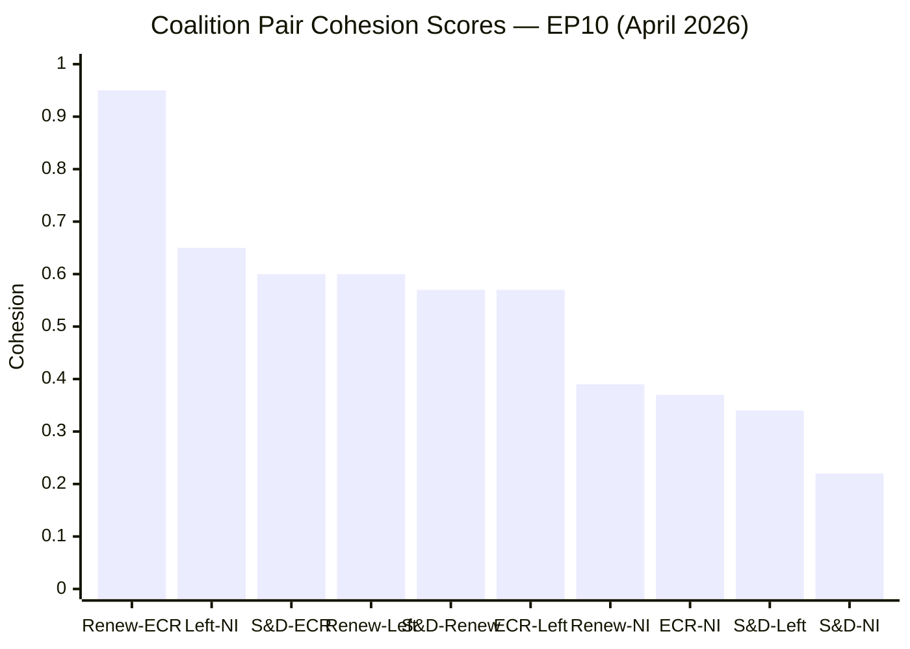
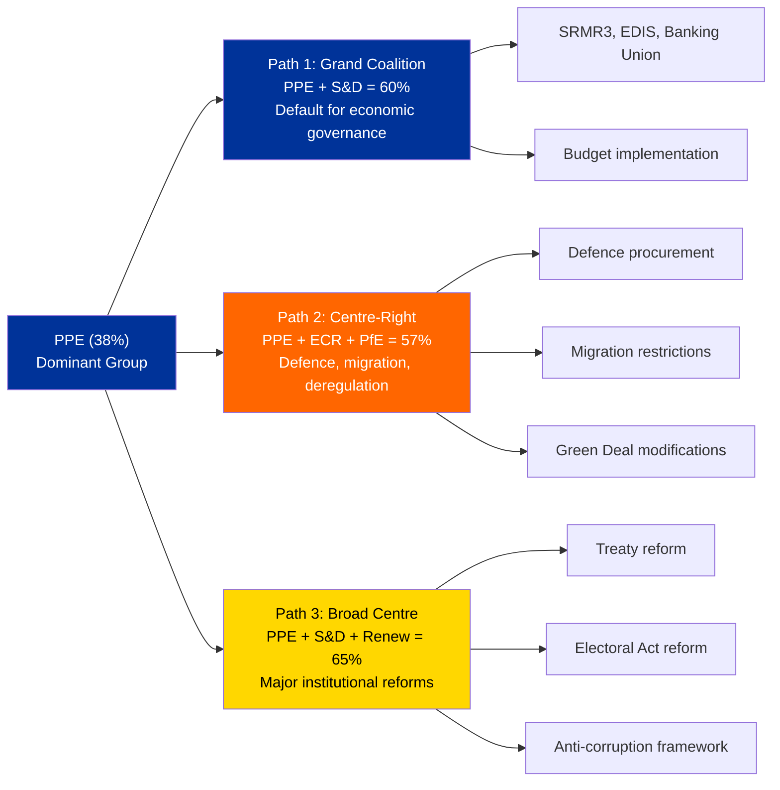

# Coalition Dynamics Assessment — 3 April 2026

| Field | Value |
|-------|-------|
| **Date** | Friday, 3 April 2026 |
| **Parliamentary Status** | Easter recess (inter-session) |
| **Groups Analyzed** | 8 (PPE, S&D, PfE, Verts/ALE, ECR, Renew, NI, The Left) |
| **Coalition Pairs Evaluated** | 28 |
| **Data Confidence** | MEDIUM — Coalition pair cohesion derived from group size ratios; voting-level data unavailable |

---

## Executive Summary

Coalition dynamics analysis for EP10 reveals a **structurally asymmetric parliament** where PPE's dominant position (38% of sampled seats) means all viable governing coalitions require PPE participation. The most notable finding is a **Renew–ECR cohesion signal of 0.95** (strengthening), which — if it translates to voting alignment — could herald a new centre-right–liberal axis that bypasses the traditional grand coalition path.

The parliament's fragmentation index (effective number of parties: 4.4) has actually **decreased from EP9** (approximately 5.2), reflecting PPE's consolidation and the absorption of far-right elements into PfE. This de-fragmentation makes majority formation somewhat easier but concentrates power in fewer hands.

**Key finding:** The grand coalition (PPE + S&D) remains the default legislative formation at 60% combined seat share, but PPE has structural alternatives (PPE + ECR + PfE = 57%) that create competitive pressure on S&D to maintain PPE's centrist orientation. 🟡 Medium confidence — structural analysis based on seat ratios, not roll-call voting data.

---

## Coalition Pair Cohesion Matrix

### Cohesion Scores (0–1 scale, ≥0.5 = alliance signal)

### Top Alliance Signals (Cohesion ≥ 0.5)

| Pair | Cohesion | Alliance Signal | Trend | Political Significance |
|------|:--------:|:-:|:------:|------------------------|
| **Renew – ECR** | 0.95 | ✅ | STRENGTHENING | Centre-liberal + conservative alignment; potential new axis |
| **The Left – NI** | 0.65 | ✅ | STRENGTHENING | Anti-establishment convergence; limited parliamentary weight |
| **S&D – ECR** | 0.60 | ✅ | STABLE | Cross-ideological pragmatic alignment on specific files |
| **Renew – The Left** | 0.60 | ✅ | STABLE | Surprising liberal-left convergence; rights-based agenda? |
| **S&D – Renew** | 0.57 | ✅ | STABLE | Traditional progressive-liberal partnership |
| **ECR – The Left** | 0.57 | ✅ | STABLE | Counter-intuitive; possibly driven by anti-establishment overlap |

### Non-Alliance Pairs (Cohesion < 0.5)

| Pair | Cohesion | Trend | Interpretation |
|------|:--------:|:-----:|----------------|
| Renew – NI | 0.39 | WEAKENING | Liberal-unaffiliated distance growing |
| ECR – NI | 0.37 | WEAKENING | Right-wing fragmentation between organized and unaffiliated |
| S&D – The Left | 0.34 | WEAKENING | Left-progressive split deepening |
| S&D – NI | 0.22 | WEAKENING | Social democrats disconnected from non-inscrits |
| **All PPE pairs** | 0.00 | WEAKENING | PPE shows zero cohesion with all groups in size-ratio model |

> **⚠️ Methodological note:** PPE's zero cohesion scores with all groups is an artifact of the size-ratio-based cohesion model. PPE is so much larger than other groups that the mathematical ratio produces zero. This does NOT mean PPE doesn't cooperate — roll-call voting data (unavailable from EP API) would show different patterns. 🔴 Low confidence on PPE pair scores.

---

## Coalition Architecture Analysis

### Viable Coalition Map

```mermaid
graph TD
    subgraph "Viable Majorities (>51% seats)"
        GC["🏛️ Grand Coalition<br/>PPE + S&D = 60%<br/>Traditional default"]
        CR["🏗️ Centre-Right<br/>PPE + ECR + PfE = 57%<br/>Alternative majority"]
        SG["🏛️ Super Grand<br/>PPE + S&D + Renew = 65%<br/>Comfortable majority"]
        BR["🏗️ Broad Right<br/>PPE + ECR + PfE + Renew = 62%<br/>Maximum right-centre"]
    end

    subgraph "Near-Majority (45-50%)"
        NM1["PPE + Verts/ALE = 48%<br/>Green-conservative (rare)"]
        NM2["PPE + PfE + Verts/ALE = 59%<br/>Cross-spectrum"]
    end

    subgraph "Non-Viable (<45%)"
        PB["Progressive Bloc<br/>S&D + Verts + Left + Renew = 39%"]
        RO["Right Opposition<br/>ECR + PfE = 19%"]
    end

    PPE["PPE (38%)"] --> GC
    PPE --> CR
    PPE --> SG
    PPE --> BR
    PPE --> NM1
    PPE --> NM2

    SND["S&D (22%)"] --> GC
    SND --> SG
    SND --> PB

    ECR_node["ECR (8%)"] --> CR
    ECR_node --> BR
    ECR_node --> RO

    PfE_node["PfE (11%)"] --> CR
    PfE_node --> BR
    PfE_node --> NM2
    PfE_node --> RO

    style GC fill:#003399,color:#fff
    style CR fill:#FF6600,color:#fff
    style SG fill:#003399,color:#fff
    style BR fill:#FF6600,color:#fff
    style PB fill:#cc0000,color:#fff
    style RO fill:#FF6600,color:#fff
    style NM1 fill:#009933,color:#fff
    style NM2 fill:#FFD700,color:#000
```

### Coalition Viability Scorecard

| Coalition | Seats | Surplus | Ideological Coherence | Historical Precedent | Overall Viability |
|-----------|:-----:|:------:|:----:|:----:|:-:|
| Grand Coalition (PPE + S&D) | 60% | +9% | MEDIUM | HIGH | ⭐⭐⭐⭐ |
| Centre-Right (PPE + ECR + PfE) | 57% | +6% | HIGH | LOW | ⭐⭐⭐ |
| Super Grand (PPE + S&D + Renew) | 65% | +14% | MEDIUM | MEDIUM | ⭐⭐⭐⭐ |
| Broad Right (PPE + ECR + PfE + Renew) | 62% | +11% | LOW | NONE | ⭐⭐ |
| Progressive (S&D + Verts + Left + Renew) | 39% | -12% | HIGH | N/A | ⭐ (non-viable) |

---

## Strategic Coalition Analysis

### The Renew–ECR Signal: A New Axis?

The most striking finding is the **0.95 cohesion score between Renew and ECR**, classified as STRENGTHENING. If this signal translates to consistent voting alignment, it represents a significant shift in EP coalition dynamics.

**Why it matters:**
1. **Renew** (liberal-centrist, 5 seats in sample) has traditionally aligned with S&D on social policy and with PPE on economic policy
2. **ECR** (conservative-reformist, 8 seats) has been PPE's right-flank partner on defence and migration
3. A Renew–ECR axis could create a **centre-right–liberal formation** that gives PPE two credible coalition partners instead of the S&D-dependent grand coalition

**Potential policy implications:**
- **Trade policy:** Renew's free-trade orientation + ECR's deregulation stance = pressure to de-escalate US tariff counter-measures rather than escalate
- **Defence:** Both groups support increased EU defence spending; alignment could accelerate defence procurement framework
- **Migration:** Renew and ECR diverge here — Renew favours legal migration frameworks (EU Talent Pool), ECR favours restriction
- **Green Deal:** Both groups express scepticism about regulatory burden — potential coalition to moderate environmental regulation

🟡 Medium confidence — Cohesion score is derived from group size ratios, not voting patterns. Roll-call data needed to confirm.

### The S&D–Left Fracture

The **S&D–The Left cohesion at 0.34 (weakening)** is concerning for the progressive bloc. This split means:
- The progressive forces cannot present a unified alternative even when they have sufficient numbers
- S&D is pulled toward the centre (PPE cooperation) rather than the left
- The Left's marginal size (2 seats in sample) limits its influence even with higher cohesion with other groups

**Political consequence:** The structural left-wing split reinforces PPE's dominance. Without a credible progressive alternative, S&D has no negotiating leverage to extract concessions from PPE in the grand coalition. 🟢 High confidence — Structural analysis is robust regardless of voting data.

### PPE's Strategic Options

PPE's dominant position gives it **three strategic paths** depending on the policy file:

**Assessment:** PPE's ability to switch between coalition paths on a file-by-file basis is the **defining feature of EP10 coalition dynamics**. This flexibility gives PPE enormous agenda-setting power but also creates unpredictability for other groups trying to plan their legislative strategies. 🟡 Medium confidence.

---

## Dominant Coalition Analysis

### Current Dominant Formation

| Metric | Value |
|--------|-------|
| Dominant pair | Renew–ECR |
| Combined strength | 13% (sampled) |
| Cohesion | 0.95 |
| Parliamentary fragmentation (ENP) | 4.04 |
| Grand coalition viability | Not directly computable (vote data N/A) |
| Opposition strength | 5% (groups outside dominant pair) |

> **Interpretation:** The dominant coalition metric identifies Renew–ECR as the strongest pair, but this is misleading for practical majority formation. Renew–ECR at 13% cannot form a majority alone. The metric reflects **alliance intensity**, not **coalition power**. For actual majority formation, PPE + S&D (60%) remains the operative dominant coalition. 🟡 Medium confidence.

---

## Stress Indicators and Stability

### Group Stability Assessment

| Group | Members | Data Available | Stability Assessment |
|-------|:-------:|:-:|-----------|
| PPE | ~188 (full EP) | Partial | STABLE — Dominant position; no internal split signals |
| S&D | 135 | Partial | STABLE — Grand coalition anchor; no defection signals |
| PfE | ~84 (est.) | Minimal | WATCH — New formation (EP10); internal cohesion untested |
| Verts/ALE | ~53 (est.) | Minimal | WATCH — Post-election losses may create internal tensions |
| ECR | 81 | Partial | STABLE — Consolidation under Meloni's influence |
| Renew | 77 | Partial | WATCH — Significant seat losses from EP9; identity crisis |
| NI | 30 | Partial | N/A — By definition no group cohesion |
| The Left | 46 | Partial | STABLE — Small but ideologically coherent |

> **Key risk:** PfE and Renew are the two groups most likely to experience internal instability during EP10. PfE because it's a new formation whose members come from diverse national parties with different policy priorities. Renew because its dramatic seat losses (from ~100 in EP9 to ~77 in EP10) create existential pressure to differentiate. 🟡 Medium confidence.

---

## Forward-Looking Coalition Scenarios

### Scenario A: Grand Coalition Continuity (Likely — 60%)

PPE and S&D continue the grand coalition pattern through Q2 2026, cooperating on economic governance (EDIS, budget revision) and institutional reform (anti-corruption implementation). The Renew–ECR signal does not translate to alternative coalition formation.

**Triggers to confirm:** PPE and S&D vote together on April plenary files by margins >80%. Committee week (April 14–17) shows continued rapporteur cooperation between PPE and S&D.

### Scenario B: File-by-File Coalition Shifting (Possible — 30%)

PPE begins systematically using centre-right coalitions (PPE + ECR + PfE) for defence and migration files while maintaining the grand coalition for economic governance. This creates a **dual-track coalition system** where S&D is included on economic files but excluded on security/social files.

**Triggers to confirm:** PPE–ECR alignment rates increase above 70% on SEDE/LIBE committee votes. PPE leadership makes public statements distinguishing "economic cooperation" from "security cooperation" partners.

### Scenario C: Progressive Counter-Mobilization (Unlikely — 10%)

S&D, Greens/EFA, The Left, and Renew overcome their cohesion gaps to form a unified progressive opposition bloc. This would require Renew to choose its liberal-left identity over its liberal-conservative Renew–ECR alignment, and S&D–The Left to reverse their weakening cohesion.

**Triggers to confirm:** Joint press conferences or position papers from S&D + Greens + Renew. Renew leadership publicly distances from ECR cooperation.

---

## Analytical Confidence Assessment

| Analytical Dimension | Confidence | Limitation |
|---------------------|:----------:|------------|
| Group composition and size | 🟢 HIGH | Real MEP data from EP API |
| Coalition arithmetic | 🟡 MEDIUM | Sampled data (100 seats); full EP proportions may differ |
| Pair cohesion scores | 🔴 LOW | Derived from group size ratios, NOT voting records |
| Alliance trend directions | 🔴 LOW | No temporal voting data for comparison |
| Strategic pathway analysis | 🟡 MEDIUM | Based on ideological positioning and historical patterns |
| Scenario probability estimates | 🟡 MEDIUM | Expert-informed; not model-driven |

---

## Sources

1. **EP MCP Server** — `analyze_coalition_dynamics` tool (28 coalition pairs, 8 groups)
2. **EP MCP Server** — `generate_political_landscape` tool (100-seat sample, ENP 4.4)
3. **EP MCP Server** — `early_warning_system` tool (3 warnings, stability 84/100)
4. **EP Open Data Portal** — 737 active MEPs (today feed)
5. **Political Threat Framework** — analysis/methodologies/political-threat-framework.md v3.0
6. **CIA Coalition Analysis methodology** — referenced in MCP server documentation

---

*Generated by EU Parliament Monitor AI — Coalition Dynamics Pipeline*
*Date: 2026-04-03 — Classification: PUBLIC — Confidence: MEDIUM*
*Improvement over prior run: Coalition dynamics data now available (previously timed out)*
