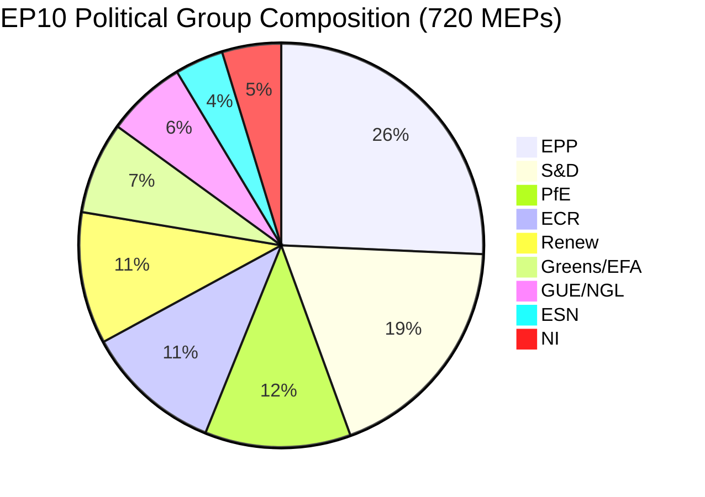
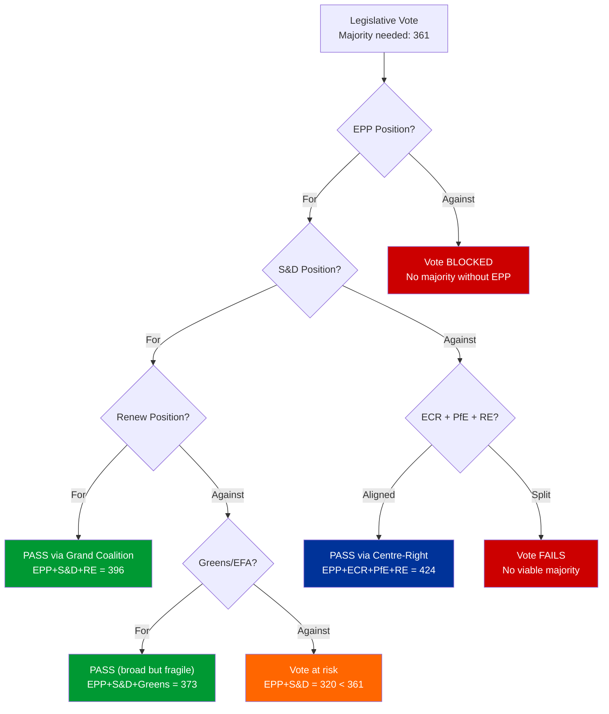
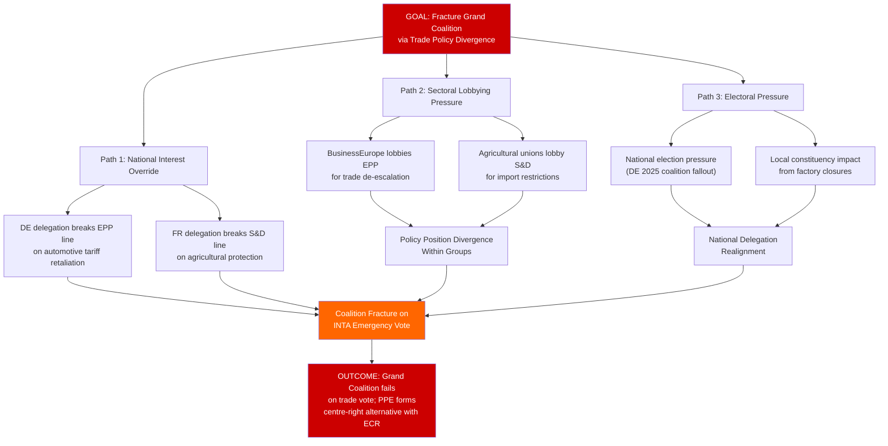
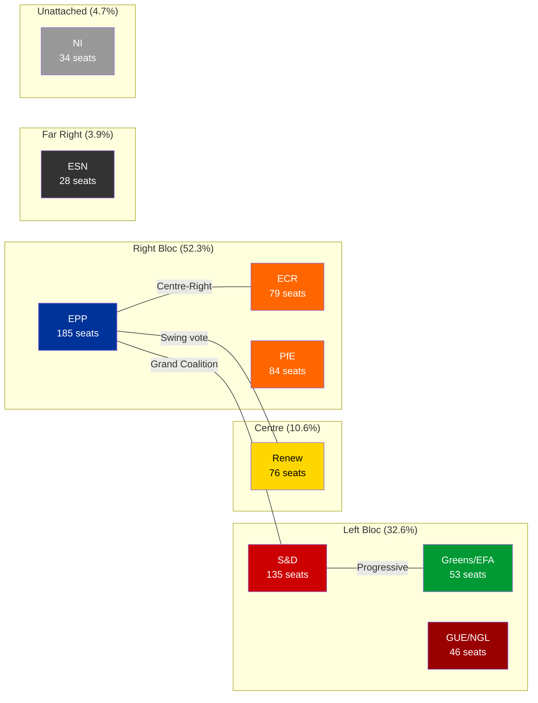

# Coalition Dynamics and Threat Landscape Assessment — Q1 2026

| Field | Value |
|-------|-------|
| **Date** | Friday, 3 April 2026 |
| **Parliamentary Term** | EP10 (2024-2029), Year 2 |
| **Total MEPs** | 720 (precomputed) / 737 (feed sample) |
| **Political Groups** | 8 + Non-Inscrits |
| **Stability Score** | 84/100 |
| **Overall Risk** | MEDIUM |
| **Defection Trend** | DECREASING |

---

## Executive Summary

The EP10 coalition landscape in Q1 2026 is characterised by structural stability overlaid with emerging external pressures. The PPE-led centre-right holds the primary coalition-forming position, with the grand coalition (PPE + S&D) remaining viable at approximately 44.4% of seats (requiring Renew to reach majority). Internal group discipline remains strong (0 voting anomalies), but the high fragmentation index (8 groups, ENP 4.4) creates legislative complexity. The primary threat vector is geopolitical — EU-US trade escalation and eastern neighbourhood instability could stress coalition alignments along national rather than ideological lines.

---

## Coalition Architecture

### Current EP10 Group Composition

### Majority Threshold Analysis

**Absolute majority:** 361 seats (720/2 + 1)

| Coalition | Composition | Seats | Share | Viable? |
|-----------|------------|:-----:|:-----:|:-------:|
| Grand Coalition + Renew | EPP + S&D + RE | 396 | 55.0% | Yes — primary legislative vehicle |
| Centre-Right Broad | EPP + ECR + PfE + RE | 424 | 58.9% | Yes — but PfE participation uncertain |
| Grand Coalition (Minimal) | EPP + S&D | 320 | 44.4% | No — needs third partner |
| Progressive Bloc | S&D + Greens + GUE + RE | 310 | 43.1% | No — structural minority |
| Right Bloc | EPP + ECR + PfE + ESN | 376 | 52.2% | Yes — but ideological range extreme |

### Coalition Formation Decision Tree

---

## Political Threat Landscape Assessment

### Dimension 1: Coalition Shifts

**Current Status:** STABLE (Group stability score: 100, defection trend: DECREASING)

**Key indicators monitored:**
- PPE-S&D alignment on Banking Union (SRMR3): ALIGNED. HIGH confidence.
- PPE-S&D alignment on anti-corruption: ALIGNED. HIGH confidence.
- Trade policy fault line: EPP internal tension between German export interests and Southern European protectionism. MEDIUM confidence.
- Defence spending: Broad cross-spectrum consensus (EPP, S&D, ECR, Renew). HIGH confidence.

**Threat assessment:** No immediate coalition shift risk. The primary vulnerability is trade policy, where national interests could override ideological alignment. Risk Score: 4/25 (Likelihood 2 x Impact 2) — LOW.

### Dimension 2: Transparency Deficit

**Current Status:** IMPROVING

**Evidence:** TA-10-2026-0094 (Combating Corruption, March 26) and TA-10-2026-0065 (Public Access to Documents, March 10) directly address transparency concerns. The EP is proactively legislating on institutional integrity.

**Threat assessment:** Post-Qatargate reform momentum is genuine and backed by legislative action. Risk Score: 3/25 (Likelihood 1 x Impact 3) — LOW.

### Dimension 3: Policy Reversal

**Current Status:** LOW RISK

**Evidence:** Q1 legislative output shows consistent policy direction. Ukraine support (TA-10-2026-0010, TA-10-2026-0035), defence integration (3 texts), and green transition texts are advancing without reversal signals.

**Threat assessment:** No policy reversal signals detected. Climate/green legislation rollback pressure from PfE and ESN groups exists but lacks majority support. Risk Score: 4/25 (Likelihood 2 x Impact 2) — LOW.

### Dimension 4: Institutional Pressure

**Current Status:** MODERATE

**Evidence:** PPE dominance risk flagged by early warning system at HIGH severity. PPE 19x size of smallest group creates structural power imbalance. Institutional pressure from right-wing groups (PfE + ECR + ESN = 26.6% of seats) on migration and sovereignty could force procedural concessions.

**Threat assessment:** Institutional pressure is structural but contained by grand coalition mechanism. Risk Score: 6/25 (Likelihood 2 x Impact 3) — MEDIUM.

### Dimension 5: Legislative Obstruction

**Current Status:** LOW

**Evidence:** 70+ texts adopted in Q1 demonstrates functional legislative pipeline. No procedures reported as stalled. Legislative velocity at 2.11 acts per session is above historical average.

**Threat assessment:** No obstruction signals. Risk Score: 2/25 (Likelihood 1 x Impact 2) — LOW.

### Dimension 6: Democratic Erosion

**Current Status:** MONITORING

**Evidence:** TA-10-2026-0006 (Electoral Act reform obstacles, January 20) flags democratic infrastructure vulnerabilities. Low MEP engagement flagged by political landscape (engagement: LOW). Small group quorum risk for 3 groups.

**Threat assessment:** Chronic low-intensity concern. Electoral reform progress and voter turnout trends require monitoring. Risk Score: 6/25 (Likelihood 3 x Impact 2) — MEDIUM.

---

## Attack Tree: EU-US Trade Escalation Impact on Coalition

**Assessment:** This attack tree models the most plausible pathway to grand coalition fracture. The EU-US trade escalation scenario is the primary stress vector because it activates national (rather than ideological) interests — the one axis that consistently cuts across EP political groups. Likelihood: 3 (Possible, 21-40%). Impact: 3 (Moderate). Risk Score: 9/25 — MEDIUM. MEDIUM confidence.

---

## Bloc Analysis

**Key dynamics:**
- **Bipolar index:** 0.232 — moderately polarised, with centre (Renew) holding decisive swing position
- **Right bloc dominance:** 52.3% of seats in right/centre-right groups, but ideological range prevents unified right bloc voting
- **Eurosceptic share:** 15.6% (PfE + ESN component) — significant minority but cannot block legislation alone
- **Progressive deficit:** Left bloc at 32.6% is structurally in minority position; requires Renew + selective EPP defections for any progressive majority

---

## Early Warning Indicators — Q2 2026 Monitoring Dashboard

| Indicator | Current Value | Warning Threshold | Status |
|-----------|:------------:|:-----------------:|:------:|
| Group stability score | 100 | Below 80 | GREEN |
| Defection trend | DECREASING | INCREASING | GREEN |
| Fragmentation (ENP) | 4.4 | Above 5.0 | AMBER |
| PPE dominance ratio | 19x smallest | Above 25x | AMBER |
| Stability score | 84/100 | Below 70 | GREEN |
| EU-US trade tension | Active | Retaliatory tariffs announced | AMBER |
| Small group viability | 3 groups at risk | Group dissolution | GREEN |

---

## Data Sources

- EP Open Data Portal: political landscape generation (8 groups, 23 countries)
- EP Open Data Portal: early warning system (3 warnings, 84/100 stability)
- EP Open Data Portal: voting anomalies (0 anomalies, LOW risk)
- EP Open Data Portal: adopted texts (60+ items, Q1 2026)
- Precomputed statistics: EP10 group composition, fragmentation indices
