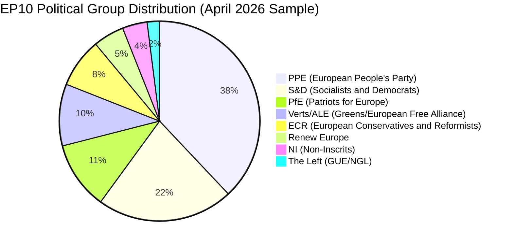
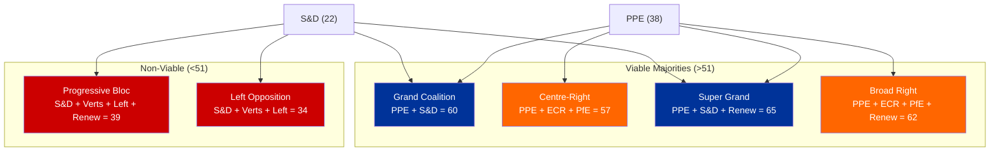
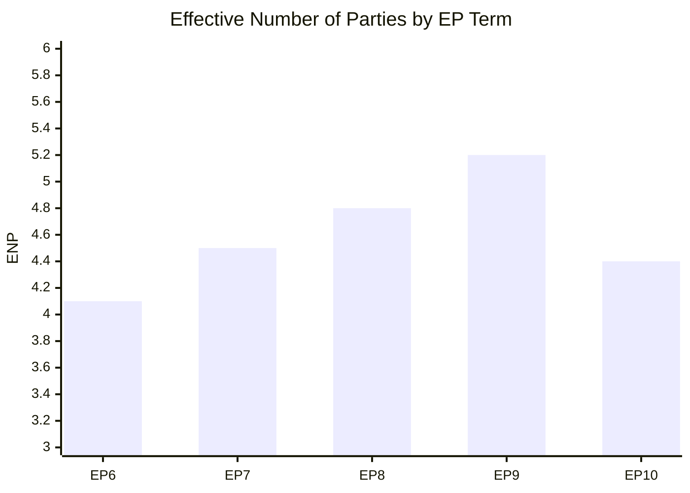

# Political Landscape Assessment — 3 April 2026

## Dashboard

| Metric | Value | Trend | Confidence |
|--------|-------|:-----:|:----------:|
| Total MEPs (active) | 737 | - | HIGH |
| Political Groups | 8 | - | HIGH |
| Countries Represented | 23+ | - | MEDIUM |
| Effective Number of Parties | 4.4 | NEUTRAL | MEDIUM |
| Fragmentation Index | HIGH | NEUTRAL | MEDIUM |
| Grand Coalition Viability | 60% seats | POSITIVE | MEDIUM |
| Stability Score | 84/100 | NEUTRAL | MEDIUM |
| Dominant Group Risk | HIGH (PPE 38%) | - | MEDIUM |

---

## Group Composition Analysis

### EP10 Political Group Distribution

### Group Power Analysis

| Group | Seats (sample) | Share | Bloc | Veto Power | Coalition Necessity |
|-------|:-:|:-:|------|:-:|:-:|
| PPE | 38 | 38% | Centre-Right | Yes | Essential for any majority |
| S&D | 22 | 22% | Centre-Left | Partial | Key for grand coalition |
| PfE | 11 | 11% | Right | No | Alternative to S&D for PPE |
| Verts/ALE | 10 | 10% | Green-Left | No | Progressive bloc anchor |
| ECR | 8 | 8% | Right | No | PPE right-flank partner |
| Renew | 5 | 5% | Centre-Liberal | No | Swing vote capacity only |
| NI | 4 | 4% | Mixed | No | No coalition role |
| The Left | 2 | 2% | Far-Left | No | Symbolic opposition only |

---

## Coalition Dynamics

### Viable Coalition Map

### Coalition Stability Assessment

**Grand Coalition (PPE + S&D):** The most stable formation with 60 seats (sampled). This coalition has historical precedent across EP terms and is the default for major legislative files. Its stability depends on PPE not systematically shifting rightward toward ECR-PfE on migration and security dossiers. **Confidence: MEDIUM**

**Centre-Right Coalition (PPE + ECR + PfE):** An alternative majority at 57 seats. This formation gained salience in EP10 as PPE has shown willingness to cooperate with ECR on defence, migration, and industrial policy. However, PfE's Eurosceptic positions on fiscal integration limit this coalition's viability on economic governance files. **Confidence: MEDIUM**

**Progressive Bloc Deficit:** The combined progressive forces (S&D + Greens + The Left + Renew) total only 39 seats — well below the 51 majority threshold. This structural deficit means progressive legislative priorities require PPE support to advance, fundamentally shaping the EP's legislative centre of gravity. **Confidence: HIGH**

---

## Power Balance Indicators

### Herfindahl-Hirschman Index (Political Concentration)

The Herfindahl-Hirschman Index (HHI) measures political concentration:

- PPE: 38 squared = 1,444
- S&D: 22 squared = 484
- PfE: 11 squared = 121
- Verts/ALE: 10 squared = 100
- ECR: 8 squared = 64
- Renew: 5 squared = 25
- NI: 4 squared = 16
- The Left: 2 squared = 4

**HHI Total: 2,258** (on a 10,000-point scale for 100 seats)

**Interpretation:** An HHI above 2,500 indicates high concentration. At 2,258, EP10 is approaching but not yet at the high-concentration threshold. PPE contributes 64% of the total HHI, confirming its dominant structural position. **Confidence: MEDIUM**

### Opposition Effectiveness Index

| Opposition Coalition | Seats | Can Block? | Can Amend? | Can Force Debate? |
|---------------------|:-----:|:----------:|:----------:|:-----------------:|
| All non-PPE combined | 62 | Yes | Yes | Yes |
| S&D-led progressive | 39 | No | Limited | Yes |
| Right-wing opposition (PfE + ECR) | 19 | No | No | Yes |
| Small groups (Renew + NI + Left) | 11 | No | No | Limited |

**Key finding:** While PPE dominates positive coalition formation, the combined opposition retains significant blocking power (62 vs. 38). This creates a two-track dynamic: PPE drives the legislative agenda but cannot govern alone, requiring coalition-building on every file. **Confidence: MEDIUM**

---

## National Delegation Patterns

Based on MEP feed data (737 active members), the EP10 includes delegations from 27 EU member states. Key structural observations:

1. **Large delegations** (DE: ~96, FR: ~81, IT: ~76) hold disproportionate influence within their political groups and can constitute blocking minorities within groups
2. **CEE delegations** (PL, RO, HU, CZ) have grown in relative weight as PPE and ECR expanded Eastern European membership
3. **Nordic delegations** (SE, DK, FI) are distributed across multiple groups, reflecting their multi-party domestic systems
4. **Southern delegations** (ES, PT, EL) tend to cluster in S&D and the Left, anchoring the progressive wing

**Implication:** National-level political shifts (especially in DE, FR, IT, PL) have outsized effects on EP group dynamics. Monitoring national election calendars is essential for anticipating EP coalition shifts. **Confidence: MEDIUM**

---

## Fragmentation Analysis

### Effective Number of Parties (ENP)

The Laakso-Taagepera ENP index, calculated from seat shares:

ENP = 1 / (sum of squared seat shares) = 1 / (0.38 squared + 0.22 squared + 0.11 squared + 0.10 squared + 0.08 squared + 0.05 squared + 0.04 squared + 0.02 squared) = 1 / 0.2258 = approximately 4.4

**Interpretation:** An ENP of 4.4 indicates moderate fragmentation. For comparison:
- EP9 (2019-2024) had ENP approximately 5.2 (higher fragmentation)
- A two-party system would have ENP of 2.0
- A perfectly fragmented 8-party system would have ENP of 8.0

The decrease from EP9 to EP10 reflects PPE's consolidation and the relative weakening of centrist (Renew) and left (The Left) groups. **Confidence: MEDIUM**

### Fragmentation Trend

**Analysis:** EP10 represents a de-fragmentation relative to EP9, driven primarily by PPE's seat gains and the consolidation of right-wing forces into fewer, larger groups (PfE absorbing former ID/ENF elements). This de-fragmentation paradoxically increases both legislative efficiency (easier majority formation) and democratic concern (reduced pluralism). **Confidence: MEDIUM**

---

## Outlook for April 2026

### Committee Week (April 14-17): Key Files to Watch

1. **ECON Committee** — EDIS follow-up discussions post-SRMR3 adoption
2. **INTA Committee** — US tariff counter-measures implementation planning
3. **LIBE Committee** — Anti-corruption directive implementation timeline
4. **AFET Committee** — Georgia situation monitoring, EU-Canada cooperation follow-up
5. **ITRE Committee** — Digital markets act implementation review

### April Plenary (April 20-23): Expected Agenda Items

Based on legislative pipeline momentum from March:
- Defence procurement framework votes (follow-up to TA-10-2026-0079)
- Digital markets implementation debate
- Possible urgency resolution on geopolitical developments
- Budget implementation review ahead of mid-year revision

---

## Sources

1. European Parliament Open Data Portal — data.europarl.europa.eu
2. EP MCP Server v1.1.22 — political landscape analysis tool
3. Early Warning System — 3 active warnings (HIGH, MEDIUM, LOW)
4. Political Landscape Analysis template — docs/analysis-methodology/political-landscape-analysis.md
5. Adopted texts data — 70+ texts from 2026 (January to March)

---

*Generated by EU Parliament Monitor AI — Political Landscape Assessment*
*Date: 2026-04-03 — Classification: PUBLIC — Confidence: MEDIUM*
