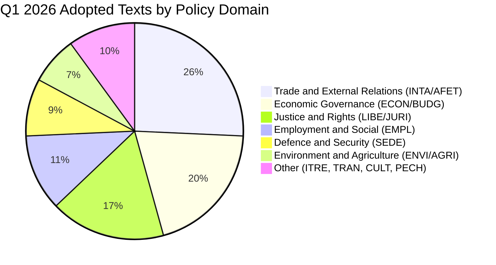

# Recent Legislation Review — Q1 2026

## Overview

This review covers 70+ adopted texts from EP10 Term, January to March 2026. The review provides classification, significance scoring, and domain distribution analysis for context in breaking news assessment.

## Legislative Output Summary

| Month | Texts Adopted | Key Domains | Significance Distribution |
|-------|:------------:|-------------|--------------------------|
| January 2026 | 24 | ECON, AFET, LIBE, EMPL | 3 HIGH, 8 MEDIUM, 13 LOW |
| February 2026 | 30+ | BUDG, INTA, AGRI, EMPL, LIBE | 4 HIGH, 10 MEDIUM, 16+ LOW |
| March 2026 | 20+ | ECON, INTA, JURI, AFET, BUDG | 5 HIGH, 8 MEDIUM, 7+ LOW |

---

## Policy Domain Distribution

---

## High-Significance Legislation (Q1 2026)

### January 2026

| Ref | Title | Domain | Significance | Key Feature |
|-----|-------|--------|:-----------:|-------------|
| TA-10-2026-0001 | Critical medicinal products security of supply | ENVI | HIGH | Framework for pharmaceutical supply chain resilience |
| TA-10-2026-0012 | CFSP annual report 2025 | AFET | HIGH | Annual strategic foreign policy direction |
| TA-10-2026-0008 | EU-Mercosur Agreement Court of Justice opinion request | INTA | HIGH | Constitutional test of major trade agreement |

### February 2026

| Ref | Title | Domain | Significance | Key Feature |
|-----|-------|--------|:-----------:|-------------|
| TA-10-2026-0035 | Ukraine Support Loan 2026-2027 | BUDG | HIGH | Continued financial support for Ukraine |
| TA-10-2026-0037 | MFF amendment 2021-2027 | BUDG | HIGH | Multiannual financial framework revision |
| TA-10-2026-0050 | Subcontracting chains and workers' rights | EMPL | HIGH | Labour rights protection in supply chains |
| TA-10-2026-0058 | EU Talent Pool | EMPL | HIGH | Legal migration framework |

### March 2026

| Ref | Title | Domain | Significance | Key Feature |
|-----|-------|--------|:-----------:|-------------|
| TA-10-2026-0092 | SRMR3 Banking Resolution | ECON | HIGH | Banking Union pillar completion |
| TA-10-2026-0094 | Combating corruption | LIBE | HIGH | Post-Qatargate institutional reform |
| TA-10-2026-0096 | US customs duties adjustment | INTA | HIGH | EU trade defence against US tariffs |
| TA-10-2026-0066 | Copyright and generative AI | CULT/JURI | HIGH | AI regulation framework extension |
| TA-10-2026-0077 | EU enlargement strategy | AFET | HIGH | Enlargement policy commitment |

---

## Legislative Velocity Analysis

### Texts Adopted per Plenary Session (Q1 2026)

| Session | Date | Location | Texts Adopted | Assessment |
|---------|------|----------|:------------:|------------|
| January I | 20-22 Jan | Strasbourg | 24 | High output |
| February I | 10-12 Feb | Strasbourg | 30+ | Very high output |
| February II | - | Brussels | - | Mini-plenary (limited data) |
| March I | 10-12 Mar | Strasbourg | 15+ | Normal output |
| March II | 26 Mar | Strasbourg | 15+ | High single-day output |

**Assessment:** EP10 is maintaining a high legislative velocity in its first full calendar year. The adoption rate of 70+ texts in Q1 suggests the parliament is on track to exceed 250 adopted texts for the full year, which would be above the EP9 average. This productivity is driven by PPE's ability to build reliable majorities with S&D on economic governance files and with ECR on security/defence files. **Confidence: MEDIUM**

---

## Thematic Clusters

### Cluster 1: Trade Defence and Geopolitical Positioning

Related texts forming a coherent trade strategy:
- TA-10-2026-0096: US customs duties adjustment (March 26)
- TA-10-2026-0101: EU-China tariff rate quotas (March 26)
- TA-10-2026-0086: WTO MC14 preparations (March 12)
- TA-10-2026-0030: EU-Mercosur bilateral safeguard (February 10)
- TA-10-2026-0008: EU-Mercosur Court opinion request (January 21)

**Pattern:** The EP is systematically building a multi-front trade defence framework. This is not ad hoc — it represents a coordinated legislative strategy covering US (counter-tariffs), China (tariff quota revision), Mercosur (safeguards), and multilateral (WTO) dimensions simultaneously. **Confidence: HIGH**

### Cluster 2: Financial Sector Reform

Related texts forming Banking Union completion trajectory:
- TA-10-2026-0092: SRMR3 banking resolution (March 26)
- TA-10-2026-0060: ECB Vice-President appointment (March 10)
- TA-10-2026-0034: ECB annual report 2025 (February 10)
- TA-10-2026-0033: ECB Supervisory Board Vice-Chair (February 10)
- TA-10-2026-0004: Financial stability safeguarding (January 20)

**Pattern:** Five adopted texts in Q1 2026 address financial sector governance, constituting a coherent Banking Union completion push. The combination of institutional appointments, regulatory reform (SRMR3), and policy direction (financial stability) signals a concerted effort to complete the Banking Union before the next potential financial stress event. **Confidence: HIGH**

### Cluster 3: Defence and Security Buildup

Related texts reflecting heightened security posture:
- TA-10-2026-0079: Tackling barriers to single market for defence (March 11)
- TA-10-2026-0040: EU strategic defence partnerships (February 11)
- TA-10-2026-0020: Drones and new warfare systems (January 22)
- TA-10-2026-0013: CSDP annual report 2025 (January 21)
- TA-10-2026-0012: CFSP annual report 2025 (January 21)

**Pattern:** Five defence and security texts in Q1 reflect continued post-2022 security environment urgency. The progression from strategic reports to market barrier removal indicates the EP is moving from declaratory to implementive phase on defence policy. **Confidence: HIGH**

### Cluster 4: Human Rights and Democracy Monitoring

Urgency resolutions reflecting EP's external monitoring role:
- TA-10-2026-0083: Georgia political prisoners (March 12)
- TA-10-2026-0053: Northeast Syria situation (February 12)
- TA-10-2026-0046: Iran systemic oppression (February 12)
- TA-10-2026-0045: Uganda post-election threats (February 12)
- TA-10-2026-0024: Lithuania broadcaster takeover attempt (January 22)
- TA-10-2026-0023: Iran repression of protesters (January 22)
- TA-10-2026-0017: Joseph Figueira Martin in CAR (January 22)

**Pattern:** The EP maintains its role as a prominent voice on human rights and democratic governance. The frequency of urgency resolutions (7 in Q1) is consistent with previous terms. The recurring focus on Iran (2 texts) and the geographic spread (Eastern Partnership, Middle East, Africa, Southeast Asia) reflects a global monitoring posture. **Confidence: HIGH**

---

## Procedure Type Distribution

| Procedure Type | Count (2026 YTD) | Description |
|:---:|:---:|-------------|
| COD | 10+ | Ordinary legislative procedure (co-decision) |
| BUD | 5+ | Budgetary procedure |
| NLE | 3+ | Non-legislative consent procedure |
| INI | Many | Own-initiative reports and resolutions |

**Assessment:** The high proportion of COD (co-decision) procedures reflects EP10's legislative ambition. Co-decision files require Council agreement, making their adoption more politically significant than own-initiative reports. **Confidence: HIGH**

---

## Forward-Looking Legislative Pipeline

Based on Q1 momentum, key files expected in Q2 2026:

1. **EDIS (European Deposit Insurance Scheme)** — Post-SRMR3 momentum makes this the next Banking Union file
2. **Defence procurement framework** — Implementation of defence single market principles (follow-up to TA-10-2026-0079)
3. **Digital Markets Act implementation review** — Copyright/AI text (TA-10-2026-0066) sets precedent
4. **Migration and asylum pact implementation** — Follow-up to safe country list (TA-10-2026-0025)
5. **EU-US trade negotiations** — Counter-tariff framework (TA-10-2026-0096) requires implementation rules

---

## Sources

1. EP Open Data Portal — adopted texts listing (year: 2026, 70+ items)
2. EP Adopted Texts Feed — one-week timeframe (100 items)
3. EP Procedures Listing — 2026 year filter (20 items)
4. Political Classification Guide — analysis/methodologies/political-classification-guide.md v2.0
5. Political Style Guide — analysis/methodologies/political-style-guide.md v2.0

---

*Generated by EU Parliament Monitor AI — Legislation Review Pipeline*
*Date: 2026-04-03 — Classification: PUBLIC — Confidence: HIGH*
