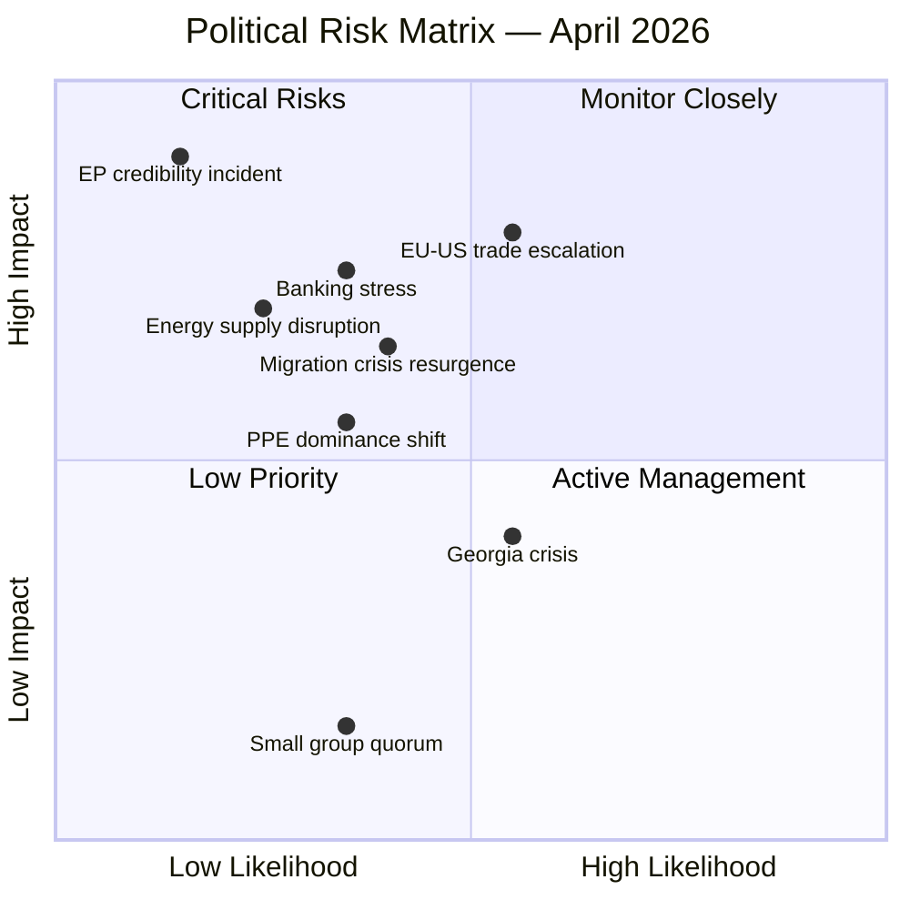
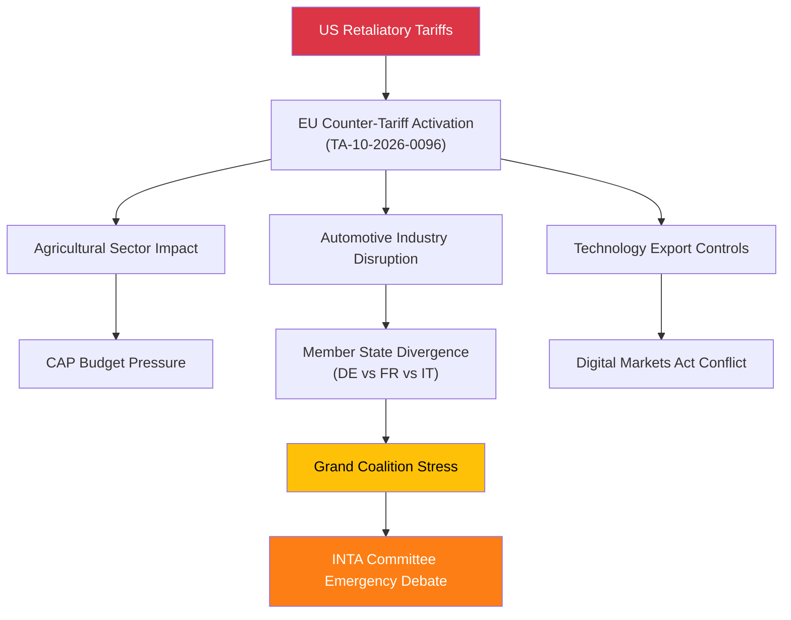
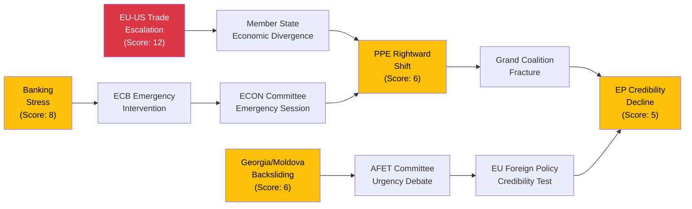

# Political Risk Assessment — 3 April 2026

## Risk Dashboard

| Category | Risk Level | Score Range | Trend | Key Driver |
|----------|:---------:|:-----------:|:-----:|------------|
| Grand Coalition Stability | LOW | 2-6 | STABLE | PPE + S&D majority holds at 60% |
| Policy Implementation | LOW | 3-5 | STABLE | 15+ texts adopted March 26 |
| Institutional Integrity | LOW-MEDIUM | 5 | STABLE | Anti-corruption directive addresses reform pressure |
| Economic Governance | MEDIUM | 8 | WATCH | SRMR3 adopted; banking stress test pending |
| Social Cohesion | LOW | 3-4 | STABLE | No acute migration or energy crisis |
| Geopolitical Standing | HIGH | 12 | ELEVATED | EU-US trade tensions; Georgia/Iran instability |

**Overall Risk Level: MEDIUM** (weighted average: 6.2/25)
**Stability Score: 84/100**

---

## Risk Matrix Visualization

---

## Detailed Risk Register

### Risk 1: EU-US Trade War Escalation

| Dimension | Assessment |
|-----------|------------|
| **Category** | geopolitical-standing |
| **Likelihood** | 3 (Possible — 21-40%) |
| **Impact** | 4 (Major — Severe disruption to trade policy and economic governance) |
| **Risk Score** | 12 — HIGH |
| **Trend** | INCREASING |
| **Confidence** | MEDIUM |

**Evidence:** TA-10-2026-0096 (adjustment of customs duties for US imports, adopted March 26) establishes the EU's counter-tariff framework. This is not a defensive posture — it creates binding tariff obligations that US trading partners must respond to. The concurrent adoption of TA-10-2026-0086 (WTO MC14 preparations) suggests the EU is coordinating multilateral and bilateral trade strategies simultaneously.

**Threat Pathway (Attack Tree):**

**Stakeholder Impact:**
- **Immediate winners:** EU domestic producers in affected sectors gain temporary protection
- **Immediate losers:** Import-dependent industries; consumers facing price increases
- **Member state divergence:** DE (export-oriented) likely pushes for de-escalation; FR and IT (protectionist-leaning) may support escalation

**Mitigation:** INTA committee monitoring; Commission trade defence communications tracking; bilateral diplomatic channels

---

### Risk 2: Banking Sector Stress (Post-SRMR3)

| Dimension | Assessment |
|-----------|------------|
| **Category** | economic-governance |
| **Likelihood** | 2 (Unlikely — 5-20%) |
| **Impact** | 4 (Major — Systemic banking stress tests SRMR3 provisions) |
| **Risk Score** | 8 — MEDIUM |
| **Trend** | STABLE |
| **Confidence** | MEDIUM |

**Evidence:** TA-10-2026-0092 (SRMR3, adopted March 26) creates new early intervention triggers for failing banks. The Q2 2026 ECB stress test results will be the first real test of these provisions. If stress tests reveal vulnerabilities in mid-sized eurozone banks, the new SRMR3 tools will be activated for the first time, creating implementation risk.

**Second-Order Effects:** Banking stress could cascade into:
1. Political pressure on ECON committee for emergency legislation
2. National government resistance to EU-level resolution actions (subsidiarity concerns)
3. Market confidence impacts affecting euro area stability

---

### Risk 3: PPE Rightward Shift

| Dimension | Assessment |
|-----------|------------|
| **Category** | grand-coalition-stability |
| **Likelihood** | 2 (Unlikely — 5-20%) |
| **Impact** | 3 (Moderate — Grand coalition fracture on specific files) |
| **Risk Score** | 6 — MEDIUM |
| **Trend** | STABLE |
| **Confidence** | MEDIUM |

**Evidence:** PPE's structural dominance (38% in sample) gives it the option to form centre-right majorities (PPE + ECR + PfE = 57) without S&D. While the grand coalition has held through Q1 2026, specific policy files on migration, defence, and deregulation could test PPE-S&D alignment.

**Indicators to watch:**
- PPE-ECR voting alignment rate in committee week (April 14-17)
- Public statements from PPE group leadership on upcoming defence files
- National election results in member states with large PPE delegations

---

### Risk 4: Georgia/Moldova Democratic Backsliding

| Dimension | Assessment |
|-----------|------------|
| **Category** | geopolitical-standing |
| **Likelihood** | 3 (Possible) |
| **Impact** | 2 (Minor — EP issues urgency resolution but limited policy leverage) |
| **Risk Score** | 6 — MEDIUM |
| **Trend** | STABLE |
| **Confidence** | HIGH |

**Evidence:** TA-10-2026-0083 (Elene Khoshtaria and political prisoners in Georgia, adopted March 12) signals ongoing EP concern about democratic deterioration under the Georgian Dream regime. The EP has limited enforcement tools beyond resolutions and visa policy, but persistent deterioration could trigger Article 7-style mechanisms for EU accession candidates.

---

### Risk 5: EP Institutional Credibility Incident

| Dimension | Assessment |
|-----------|------------|
| **Category** | institutional-integrity |
| **Likelihood** | 1 (Rare) |
| **Impact** | 5 (Severe — Post-Qatargate vulnerability to new scandals) |
| **Risk Score** | 5 — MEDIUM |
| **Trend** | DECREASING |
| **Confidence** | MEDIUM |

**Evidence:** The adoption of TA-10-2026-0094 (combating corruption, March 26) demonstrates institutional self-reform capacity. However, the Qatargate fallout created lasting vulnerability — any new integrity incident would compound the credibility damage. The anti-corruption directive creates both a compliance framework and a benchmark against which future incidents will be judged more harshly.

---

## Cascading Risk Analysis

**Key Insight:** The highest-scoring risk (EU-US trade escalation at 12) has cascading pathways that could activate lower-probability risks. Trade tensions could exacerbate member state divergence, which in turn pressures the grand coalition. A banking stress event would amplify this cascade through the economic governance channel. The EP's ability to maintain institutional cohesion under simultaneous trade and financial pressure is the key resilience indicator for Q2 2026. **Confidence: MEDIUM**

---

## Risk Monitoring Priorities for April 2026

| Priority | Risk | Monitoring Action | Frequency |
|:--------:|------|-------------------|-----------|
| 1 | EU-US trade escalation | INTA committee tracking; Commission trade communications | Daily |
| 2 | Banking stress indicators | ECB stress test calendar; ECON committee agenda | Weekly |
| 3 | PPE coalition alignment | Voting pattern analysis in committee week | Per session |
| 4 | Geopolitical instability | AFET/SEDE committee alerts | Weekly |
| 5 | EP integrity indicators | Public statements; OLAF activity | Monthly |

---

## Sources

1. EP Adopted Texts — TA-10-2026-0092, 0094, 0096, 0083, 0086, 0101, 0104 (March 2026 plenary)
2. EP Early Warning System — Stability score 84/100, 3 active warnings
3. EP Political Landscape — 8 groups, HIGH fragmentation, PPE dominant
4. Political Risk Methodology — analysis/methodologies/political-risk-methodology.md v2.0
5. Political Threat Framework — analysis/methodologies/political-threat-framework.md v3.0

---

*Generated by EU Parliament Monitor AI — Risk Assessment Pipeline*
*Date: 2026-04-03 — Classification: PUBLIC — Confidence: MEDIUM*
