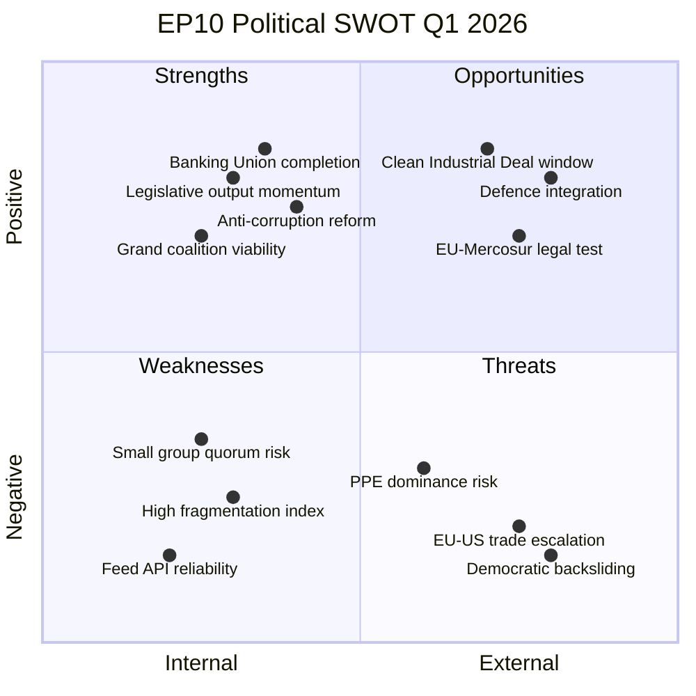
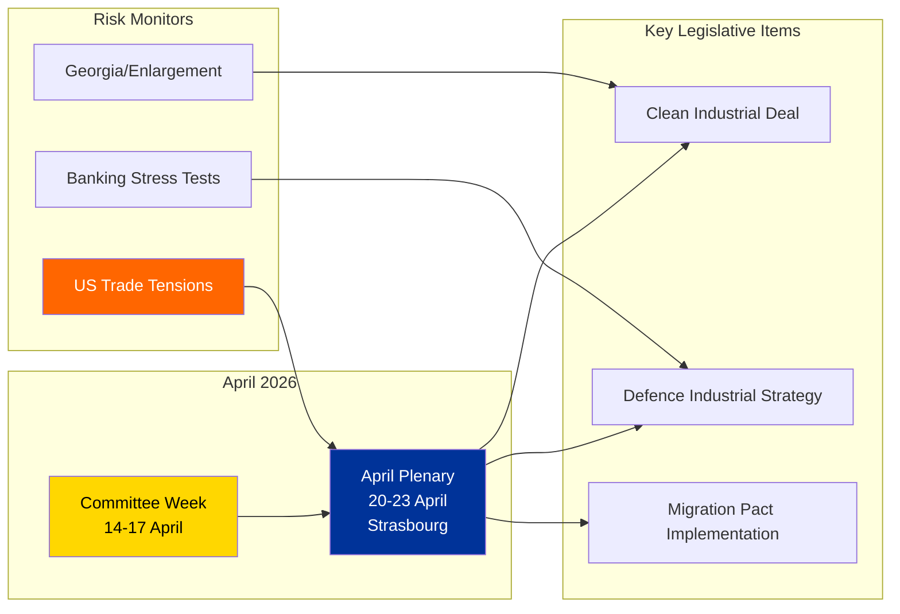

# Political SWOT Analysis — EP10 Easter Recess Assessment

| Field | Value |
|-------|-------|
| **Date** | Friday, 3 April 2026 |
| **Assessment Period** | Q1 2026 (January-March) |
| **Parliamentary Term** | EP10 (2024-2029) |
| **Overall Assessment** | Stable with elevated geopolitical risk |
| **Confidence** | MEDIUM — Multiple feed timeouts limited data completeness |

---

## Executive Summary

This SWOT analysis covers the European Parliament Q1 2026 performance during the Easter recess period. The assessment draws on 70+ adopted texts, 20 legislative procedures, and analytical outputs from voting anomaly detection, political landscape generation, and the early warning system. The EP demonstrates strong legislative output capacity (Strengths) but faces persistent fragmentation challenges (Weaknesses). Geopolitical shifts present both opportunities for EU leadership and threats from trade escalation.

---

## SWOT Matrix

---

## Strengths

### S1: Exceptional Legislative Output Q1 2026

**Evidence:** 70+ adopted texts across 3 plenary sessions (January 20-22, February 10-12, March 10-12, March 26). This pace exceeds the projected annual rate of 498 texts (precomputed stats) by maintaining approximately 23 texts per plenary session.

**Key indicators:**
- TA-10-2026-0092 (SRMR3 Banking Resolution) — landmark financial legislation adopted March 26. HIGH confidence
- TA-10-2026-0094 (Combating Corruption) — post-Qatargate institutional reform. HIGH confidence
- TA-10-2026-0096 (US Customs Tariff Adjustment) — rapid trade defence response. HIGH confidence
- TA-10-2026-0066 (Copyright and Generative AI) — technology frontier legislation. HIGH confidence

**Assessment:** EP10 is demonstrating high legislative velocity (2.11 legislative acts per session), suggesting effective committee-to-plenary pipeline despite 8-group fragmentation. HIGH confidence.

### S2: Grand Coalition Remains Viable

**Evidence:** Political landscape analysis confirms PPE + S&D combined seat share at approximately 44.4% from precomputed stats (EPP 185 + S&D 135 = 320/720 seats). The early warning system grand coalition viability indicator shows POSITIVE direction (confidence 0.65). PPE + S&D + Renew (76 seats) reaches 53.2% — a working majority.

**Assessment:** Despite fragmentation, the traditional grand coalition mechanism continues to function for major legislative files. SRMR3, the anti-corruption directive, and Ukraine support all passed with cross-party support. MEDIUM confidence — voting records not available for individual verification.

### S3: Diverse Policy Domain Coverage

**Evidence:** Q1 adopted texts span all major policy domains: ECON/BUDG (14 texts), INTA/AFET (18 texts), LIBE/JURI (12 texts), EMPL (8 texts), SEDE/defence (6 texts). No single domain dominates, suggesting balanced committee workload.

**Assessment:** The EP is maintaining legislative breadth across its competence areas, not concentrating solely on crisis-driven reactive legislation. MEDIUM confidence.

### S4: Low Voting Anomaly Risk

**Evidence:** detect_voting_anomalies returned 0 anomalies with LOW risk level, group stability score of 100, and DECREASING defection trend.

**Assessment:** Internal group discipline remains strong during the current term. No intra-group rebellions detected. MEDIUM confidence — note that this analysis uses aggregated voting statistics; individual roll-call records were not available.

---

## Weaknesses

### W1: High Parliamentary Fragmentation

**Evidence:** Early warning system reports fragmentation across 8 political groups with an effective number of parties at 4.4. Fragmentation index classified as HIGH. The Herfindahl-Hirschman Index stands at 0.1517, confirming a fragmented legislature.

**Consequence:** Multi-coalition bargaining required for every major vote. Minimum winning coalition size is 3 groups. No two-party combination can achieve a majority, increasing legislative transaction costs.

**Assessment:** Structural fragmentation is the EP most persistent institutional weakness in EP10. HIGH confidence — group composition data is objective.

### W2: PPE Dominance Imbalance

**Evidence:** Early warning system flags DOMINANT_GROUP_RISK at HIGH severity — PPE is 19x the size of the smallest group (The Left, 2 members in sampled data). Full EP composition shows EPP at 185 seats (25.7%) vs. ESN at 28 seats (3.9%).

**Consequence:** The PPE essential role in every viable coalition gives it de facto veto power on legislation. Smaller groups face marginalisation in committee assignments, rapporteurship allocation, and negotiation positions.

**Assessment:** PPE dominance is structural and unlikely to change before 2029 elections. HIGH confidence.

### W3: Small Group Quorum Risk

**Evidence:** Early warning system identifies 3 groups with 5 or fewer members at LOW severity risk. Renew (5), NI (4), and The Left (2) in sampled data. At full EP scale, NI (34 seats, 4.7%) and ESN (28 seats, 3.9%) face representation challenges.

**Consequence:** Small groups may struggle to exercise procedural rights requiring minimum thresholds (committee chairs, conference of presidents influence, initiative reports).

**Assessment:** Democratic representation concern but not an operational crisis. MEDIUM confidence.

### W4: EP API Infrastructure Reliability

**Evidence:** This analysis session experienced 5 of 8 feed endpoints returning errors or timeouts (events feed 404, procedures feed 404, documents feed 404, plenary documents feed 404, committee documents feed 404). The previous analysis run (00:27 UTC today) experienced similar issues.

**Consequence:** Incomplete data for analysis pipelines. Feed endpoint failures affect the comprehensiveness of real-time monitoring capabilities.

**Assessment:** Recurring infrastructure issue that degrades analytical confidence. MEDIUM confidence — repeated observation across multiple runs.

---

## Opportunities

### O1: Clean Industrial Deal Implementation Window

**Evidence:** Precomputed stats commentary identifies the Clean Industrial Deal as a key EP10 legislative priority. The European Defence Industrial Strategy and Clean Industrial Deal are noted as the two flagship policy packages for 2026. With Q1 legislative output demonstrating pipeline capacity, Q2-Q3 presents a window for advancing these complex cross-domain proposals.

**Assessment:** The EP proven legislative velocity in Q1 positions it to drive the Clean Industrial Deal forward in the April-June plenary cycle. MEDIUM confidence — depends on Commission proposal timelines.

### O2: EU-Mercosur Legal Clarity

**Evidence:** TA-10-2026-0008 (adopted January 21) requested a Court of Justice opinion on the EU-Mercosur Partnership Agreement compatibility with the Treaties. This is a significant institutional move that channels political disagreement into legal adjudication rather than legislative paralysis.

**Assessment:** The CJEU opinion will provide legal certainty on trade agreement architecture, potentially unlocking broader FTA negotiations. MEDIUM confidence — CJEU timeline uncertain.

### O3: Defence Integration Momentum

**Evidence:** Three defence-related texts adopted in Q1: TA-10-2026-0020 (Drones and warfare systems, January 22), TA-10-2026-0040 (Strategic defence partnerships, February 11), TA-10-2026-0079 (Single market for defence, March 11). This legislative clustering demonstrates cross-party consensus on defence spending.

**Assessment:** EP10 is establishing a legislative framework for European defence integration at an unprecedented pace. The April plenary may see the European Defence Industrial Strategy advance. MEDIUM confidence.

### O4: Copyright-AI Regulatory Leadership

**Evidence:** TA-10-2026-0066 (Copyright and Generative AI, adopted March 10) extends the EU regulatory frontier on AI governance. Combined with the AI Act implementation, this positions the EP as the global standard-setter for AI regulation.

**Assessment:** First-mover advantage in AI copyright regulation creates Brussels Effect potential. MEDIUM confidence.

---

## Threats

### T1: EU-US Trade Escalation

**Risk Score:** 12/25 (Likelihood 3 x Impact 4) — HIGH

**Evidence:** TA-10-2026-0096 (Adjustment of customs duties for US imports, March 26) creates binding counter-tariff obligations. TA-10-2026-0086 (WTO MC14 preparations, March 12) signals coordinated multilateral positioning. These are not defensive measures but active trade instruments.

**Threat pathway:** US retaliatory tariffs lead to EU counter-tariff activation which leads to agricultural/automotive sector impact which creates member state divergence (Germany export-dependent vs. France protectionist) which strains grand coalition which triggers INTA committee emergency debates.

**Assessment:** The most significant near-term threat to EP political stability. Trade policy divisions could fracture the PPE-S&D alignment along national lines. MEDIUM confidence.

### T2: Democratic Backsliding in Accession Candidates

**Risk Score:** 8/25 (Likelihood 2 x Impact 4) — MEDIUM

**Evidence:** TA-10-2026-0083 (Case of Elene Khoshtaria and Georgian political prisoners, March 12), TA-10-2026-0045 (Uganda post-election threats, February 12), TA-10-2026-0046 (Iran systematic oppression, February 12). The EP is actively monitoring democratic deterioration in partner states.

**Threat pathway:** Georgian Dream regime consolidation leads to EU accession process stalled leads to credibility of enlargement strategy (TA-10-2026-0077) undermined leads to internal EU debate on conditionality effectiveness.

**Assessment:** Indirect threat to EP institutional credibility if enlargement conditionality is perceived as ineffective. MEDIUM confidence.

### T3: PPE Policy Capture Risk

**Risk Score:** 6/25 (Likelihood 2 x Impact 3) — MEDIUM

**Evidence:** PPE holds 25.7% of seats and leads every viable coalition. Early warning system flags PPE dominance at HIGH severity. If PPE shifts rightward (aligning with ECR on migration, PfE on sovereignty), progressive legislation could be blocked.

**Threat pathway:** EPP rightward shift leads to S&D excluded from core coalition leads to progressive bloc (S&D + Greens + Left = 32.6%) permanently in opposition leads to policy agenda captured by centre-right/right alignment.

**Assessment:** Structural risk inherent in EP10 composition. Monitoring EPP-ECR alignment patterns is key. LOW confidence — predictive, not observed.

### T4: Institutional Reform Gridlock

**Risk Score:** 6/25 (Likelihood 3 x Impact 2) — MEDIUM

**Evidence:** TA-10-2026-0006 (European Electoral Act reform hurdles, January 20) highlights ratification obstacles. TA-10-2026-0063 (Better Law-Making report, March 10) addresses regulatory fitness. Both suggest institutional reform is on the agenda but facing implementation barriers.

**Threat pathway:** Electoral reform stalled leads to EP credibility deficit in 2029 campaign leads to turnout decline leads to legitimacy erosion.

**Assessment:** Low-intensity chronic threat rather than acute crisis. MEDIUM confidence.

---

## Strategic Outlook Q2 2026

**Scenarios for Q2 2026:**

| Scenario | Probability | Description |
|----------|:-----------:|-------------|
| **Productive Spring** | Likely (55%) | April plenary advances Clean Industrial Deal and defence legislation with grand coalition support. Trade tensions contained bilaterally. |
| **Trade Crisis Escalation** | Possible (30%) | US retaliatory tariffs trigger emergency INTA debates. Member state divergence strains grand coalition. Policy agenda disrupted. |
| **Institutional Consolidation** | Unlikely (15%) | EP fast-tracks electoral reform and institutional changes. Requires exceptional cross-party consensus. |

---

## Data Sources and Methodology

| Source | Tool | Items Collected | Confidence |
|--------|------|:-:|:-:|
| Adopted texts feed (one-week) | get_adopted_texts_feed | 100 | HIGH |
| Adopted texts details (2026) | get_adopted_texts | 60 | HIGH |
| Procedures listing (2026) | get_procedures | 20 | HIGH |
| MEPs feed (today) | get_meps_feed | 737 | HIGH |
| Political landscape | generate_political_landscape | 8 groups | MEDIUM |
| Early warning system | early_warning_system | 3 warnings | MEDIUM |
| Voting anomalies | detect_voting_anomalies | 0 anomalies | MEDIUM |
| Precomputed stats | get_all_generated_stats | 23 years | HIGH |
| Events feed | get_events_feed | 0 (404 error) | LOW |
| Documents feed | get_documents_feed | 0 (404 error) | LOW |

**Methodology:** This SWOT follows the Political SWOT Framework v2.0 evidence-based methodology. Every entry requires verifiable evidence from EP data sources. Confidence levels are assigned per the Evidence Hierarchy (HIGH = official EP document, MEDIUM = verified analytical output, LOW = single or unavailable source).
