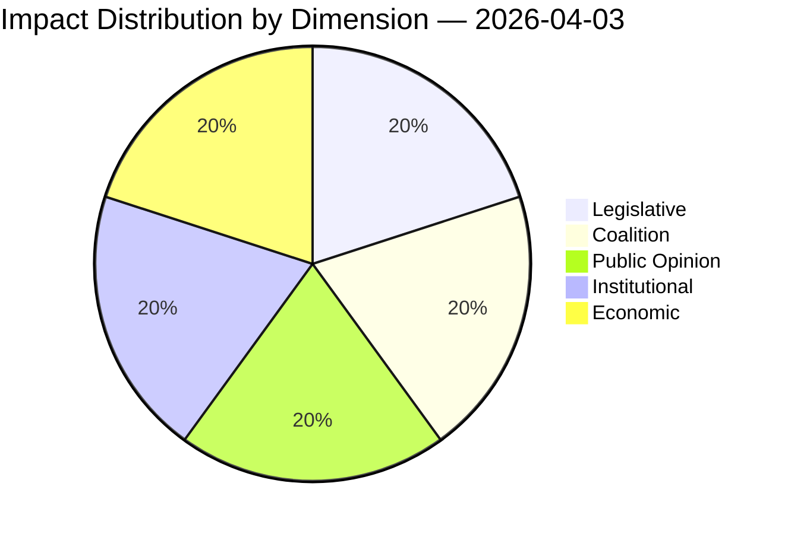

# Political Impact Matrix

## Overall Significance: **ROUTINE**

## Impact Dimensions

| Dimension | Level | Indicator | Numeric |
|-----------|-------|-----------|---------|
| Legislative | none | 🟢 | 5 |
| Coalition | none | 🟢 | 5 |
| Public Opinion | none | 🟢 | 5 |
| Institutional | none | 🟢 | 5 |
| Economic | none | 🟢 | 5 |

## Summary

| Metric | Value |
|--------|-------|
| Overall significance | ROUTINE |
| Highest impact | Legislative |
| Date | 2026-04-03 |

## Date: 2026-04-03
