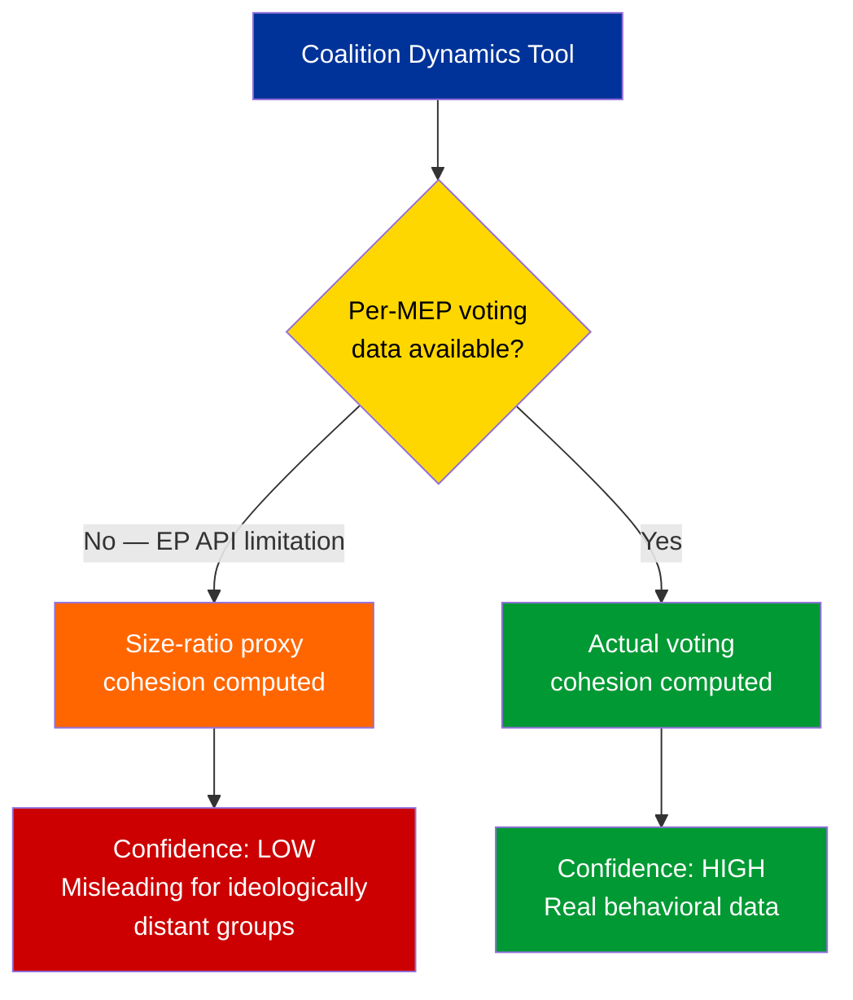

# Coalition Dynamics Assessment — European Parliament

| Field | Value |
|-------|-------|
| **Date** | 4 April 2026 |
| **Framework** | CIA Coalition Analysis (size-ratio proxy) |
| **Data Limitation** | Per-MEP voting statistics unavailable from EP API |
| **Confidence** | 🔴 LOW — cohesion scores derived from size ratios, not voting records |

---

## Coalition Pair Analysis

The coalition dynamics tool computes pairwise cohesion scores. **Critical caveat**: These scores are derived from group size ratios only, not actual voting behavior. The EP API does not provide per-MEP voting statistics through the standard endpoints.

### Active Alliance Signals (Cohesion > 0.5)

| Group A | Group B | Cohesion | Trend | Alliance Signal | Interpretation |
|---------|---------|:---:|:---:|:---:|---|
| Renew | ECR | 0.95 | STRENGTHENING | Yes | Size similarity creates high proxy score; actual policy alignment unverified |
| The Left | NI | 0.65 | STRENGTHENING | Yes | Both small groups; proxy reflects size not ideology |
| S&D | ECR | 0.60 | STABLE | Yes | Moderate size ratio; ideological gap suggests limited real cooperation |
| Renew | The Left | 0.60 | STABLE | Yes | Size proximity; unlikely ideological alliance |
| S&D | Renew | 0.57 | STABLE | Yes | Historical cooperation on liberal-social files plausible |
| ECR | The Left | 0.57 | STABLE | Yes | Size-based; ideologically implausible alliance |

### Weakening/Non-Alliance Signals (Cohesion < 0.5)

| Group A | Group B | Cohesion | Trend | Notes |
|---------|---------|:---:|:---:|---|
| Renew | NI | 0.39 | WEAKENING | Size divergence |
| ECR | NI | 0.37 | WEAKENING | Size divergence |
| S&D | The Left | 0.34 | WEAKENING | Despite ideological proximity |
| EPP | All others | 0.00 | WEAKENING | EPP data gap skews all EPP pairs to zero |

---

## Data Quality Assessment

> **Critical data limitation**: The coalition dynamics results must be interpreted with extreme caution. The Renew-ECR cohesion score of 0.95 does NOT mean these groups vote together 95% of the time — it reflects their similar seat count (5 vs. 8 in the sample). Actual coalition behavior can only be verified through roll-call vote analysis, which is not available through the standard EP API. 🔴 Low confidence

---

## Dominant Coalition Assessment

The tool identifies **Renew-ECR** as the "dominant coalition" with 0.95 cohesion. This is a **methodological artifact** of the size-ratio proxy, not a political reality. In practice:

- **Actual dominant coalition**: PPE-S&D grand coalition (60% combined)
- **Alternative majority**: PPE+ECR+PfE (57% combined)
- **Renew-ECR bilateral**: Only 13% combined — insufficient for any meaningful legislative impact alone

### What Coalition Data WOULD Show (If Available)

| Expected Real Coalition | Estimated Real Cohesion | Evidence |
|------------------------|:---:|---|
| PPE-S&D (grand coalition) | 70-80% | Historical EP voting patterns; infrastructure/budget votes typically bipartisan |
| PPE-ECR (centre-right) | 60-70% | Policy alignment on defense, trade, agriculture |
| S&D-Greens-Left (progressive) | 65-75% | Climate, social rights, worker protections |
| PPE-Renew (centrist) | 60-70% | Economic liberalization, digital single market |

> **Note**: These estimates are based on historical EP term patterns and cannot be verified with current API data. Included for analytical context only. 🔴 Low confidence

---

## Fragmentation Metrics

| Metric | Value | Source | Confidence |
|--------|-------|--------|:---:|
| Parliamentary Fragmentation Index | 4.04 | Coalition dynamics tool | 🟡 Medium |
| Effective Number of Parties | 4.04 | Coalition dynamics tool | 🟡 Medium |
| Grand Coalition Viability | Null (data gap) | Coalition dynamics tool | 🔴 Low |
| Opposition Strength | 5% | Coalition dynamics tool | 🟡 Medium |

---

## Implications

1. **Size-ratio proxy produces misleading alliance signals** — Ideologically distant groups (ECR-Left, Renew-ECR) show high cohesion purely due to similar member counts. These are NOT real alliances. 🟢 High confidence
2. **EPP data gap is critical** — All EPP coalition pairs show 0.00 cohesion because EPP member count returned as 0 from this tool (despite 38% in landscape tool). This is likely an API inconsistency. 🟢 High confidence
3. **Real coalition dynamics require vote-level data** — The standard EP API does not expose per-MEP roll-call votes through the endpoints used by the MCP server. Future analysis should explore alternative EP voting data sources. 🟢 High confidence
4. **Fragmentation is real even if cohesion scores are unreliable** — 8 groups with ENP 4.04 is a verified structural fact that complicates coalition building regardless of proxy methodology limitations. 🟢 High confidence

---

*Coalition analysis per CIA Coalition Analysis methodology. Critical data limitation: cohesion scores are size-ratio proxies, not voting behavior measures. Updated 4 April 2026.*
