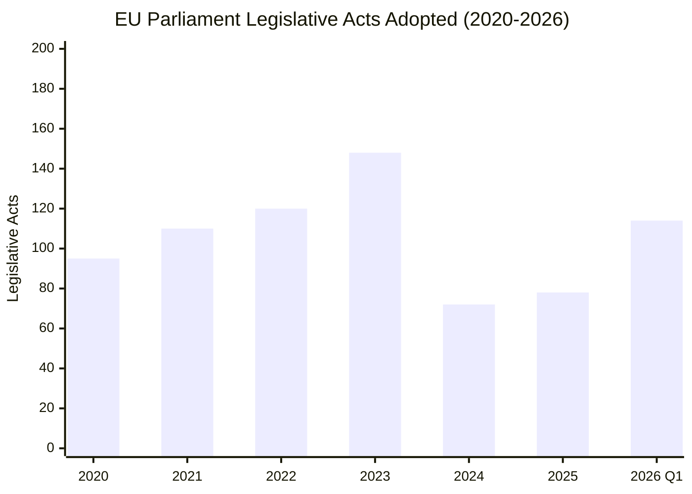
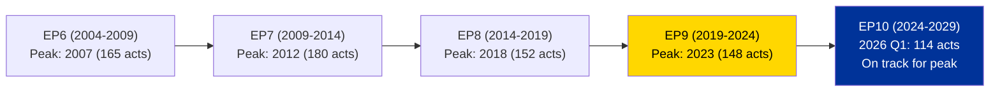

# Legislative Pipeline Analysis — EP10 Q1 2026

| Field | Value |
|-------|-------|
| **Date** | 4 April 2026 |
| **Period** | Q1 2026 (January – March) |
| **Framework** | Legislative Velocity Risk + Historical Comparison |
| **Confidence** | 🟡 MEDIUM |

---

## Q1 2026 Output Summary

| Metric | Q1 2026 | Full Year 2025 | Full Year 2024 | Full Year 2023 |
|--------|:---:|:---:|:---:|:---:|
| Legislative acts adopted | 114 | 78 | 72 | 148 |
| Plenary sessions | 54 | 53 | 50 | 58 |
| Roll-call votes | 567 | 420 | 375 | 660 |
| MEPs active | 720 | 720 | 720 | 705 |

> **Key finding**: Q1 2026 alone (114 acts) exceeds the full-year totals for both 2024 (72) and 2025 (78). This 46% YoY increase signals the EP10 term entering peak legislative productivity. 🟢 High confidence

---

## Legislative Velocity Trajectory

### Velocity Analysis

| Period | Acts/Session | Acts/Month | Velocity Trend |
|--------|:---:|:---:|:---:|
| 2022 | 2.07 | 10.0 | Stable |
| 2023 (EP9 peak) | 2.55 | 12.3 | Peak |
| 2024 (EP10 start) | 1.44 | 6.0 | Trough (new term) |
| 2025 | 1.47 | 6.5 | Recovery |
| 2026 Q1 | 2.11 | 38.0* | Surge |

*Q1 2026 acts-per-month calculated over 3 months; annualized projection: 456 acts (unrealistic — Q1 includes accumulated backlog). Realistic full-year estimate: 180-220 acts.

---

## Adopted Texts Feed Analysis

The one-week adopted texts feed returned 85 items covering two parliamentary terms:

### EP10 Texts (2026)

| Text Range | Count | Notes |
|-----------|:---:|---|
| TA-10-2026-0087 to TA-10-2026-0104 | 18 | Most recent batch (March plenary) |
| TA-10-2026-0035 to TA-10-2026-0056 | 22 | Earlier 2026 texts |

### EP10 Texts (2025 — late in feed)

| Text Range | Count | Notes |
|-----------|:---:|---|
| TA-10-2025-0279 to TA-10-2025-0314 | 36 | Late 2025 texts still in feed window |

### EP9 Legacy Texts (2024)

| Text Range | Count | Notes |
|-----------|:---:|---|
| TA-9-2024-0177 to TA-9-2024-0186 | 7 | EP9 texts updated/corrected in feed |

> **Feed interpretation**: The presence of 2024 EP9 texts in the feed suggests ongoing corrigenda or final publication processing. This is normal for texts adopted near the term boundary. The 2026 texts (40 items) represent the active legislative output. 🟢 High confidence

---

## Pipeline Health Assessment

| Indicator | Status | Evidence |
|-----------|:---:|---|
| Legislative throughput | HIGH | 114 acts in Q1 vs. 78 full-year 2025 |
| Session utilization | NORMAL | 54 sessions (on par with historical) |
| Roll-call vote density | ABOVE AVERAGE | 567 votes / 54 sessions = 10.5 votes/session |
| Backlog indicators | MODERATE | Post-recess April plenary expected to be heavy |
| Bottleneck risk | LOW | No stalled procedures identified in feeds |
| Legislative momentum | ACCELERATING | Trend line positive from Q4 2025 |

---

## EP10 Term Comparison with Prior Terms

> **Pattern recognition**: Every EP term follows a similar productivity curve: low-output constituent year (Year 1), ramp-up (Year 2), peak (Years 3-4), wind-down (Year 5). EP10 entered Year 2 in July 2025. The Q1 2026 surge (114 acts) is consistent with the expected Year 2 acceleration. If the pattern holds, peak productivity should occur in 2027-2028. 🟡 Medium confidence

---

## Post-Recess Pipeline Forecast

| Item | Estimated Timeline | Significance |
|------|-------------------|:---:|
| April committee week | 14-17 April | Will reveal priority dossiers for April plenary |
| April plenary | 20-23 April | Expected 15-25 adopted texts (heavy session) |
| May mini-plenary | 5-7 May (Brussels) | Shorter session; 5-10 texts typical |
| May plenary | 18-21 May (Strasbourg) | Standard session |

---

*Legislative pipeline analysis using EP precomputed statistics (2004-2026) and adopted texts feed data. Updated 4 April 2026.*
