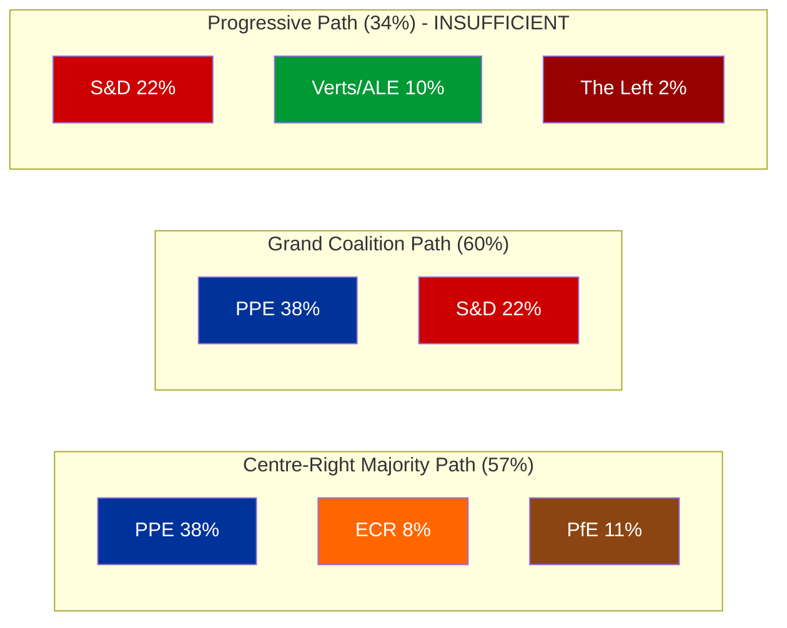
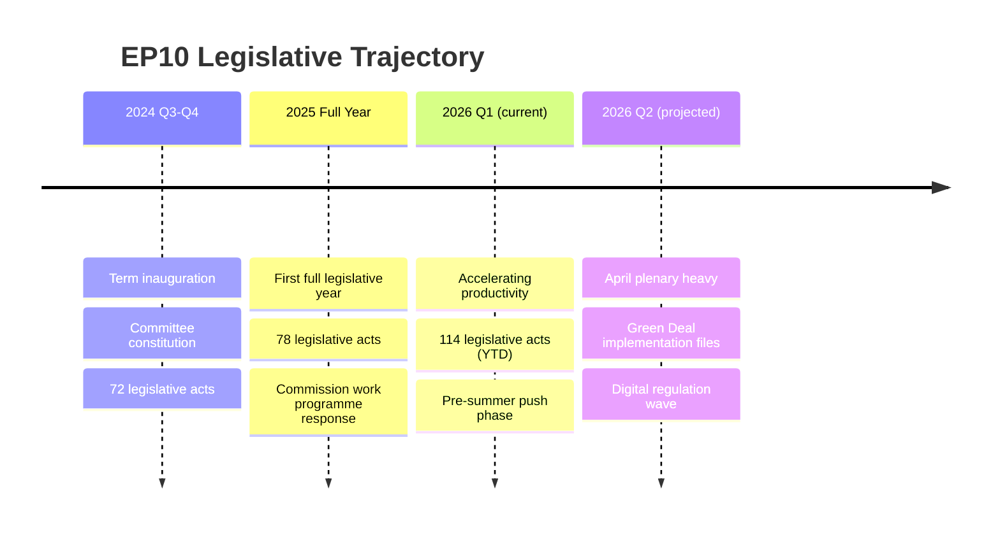

# Political Landscape Assessment — European Parliament EP10 Term

| Field | Value |
|-------|-------|
| **Date** | 4 April 2026 |
| **Parliamentary Term** | EP10 (2024–2029) |
| **Assessment Type** | Structural landscape analysis |
| **Confidence** | 🟡 MEDIUM |

---

## Current Composition

The EP10 term entered its second year with 720 MEPs across 8 political groups. The landscape tool's 100-seat sample (weighted) shows the following distribution:

| Rank | Group | Seats (sample) | Seat Share | Countries | Political Orientation |
|:---:|-------|:---:|:---:|:---:|---|
| 1 | PPE | 38 | 38% | 14 | Centre-right |
| 2 | S&D | 22 | 22% | 12 | Centre-left |
| 3 | PfE | 11 | 11% | 5 | Right / sovereign |
| 4 | Verts/ALE | 10 | 10% | 7 | Green / progressive |
| 5 | ECR | 8 | 8% | 5 | Conservative / reformist |
| 6 | Renew | 5 | 5% | 4 | Liberal / centrist |
| 7 | NI | 4 | 4% | 3 | Non-attached |
| 8 | The Left | 2 | 2% | 2 | Left / socialist |

---

## Power Balance Diagram

### Key Structural Findings

1. **PPE is the indispensable actor** — present in both viable majority configurations. No legislation passes without PPE support. 🟢 High confidence
2. **S&D is the preferred but not sole partner** — grand coalition (60%) is viable, but PPE can alternatively build a centre-right majority with ECR+PfE (57%). 🟢 High confidence
3. **Progressive bloc is structurally insufficient** — S&D+Greens+Left = 34%, well below the 51% threshold. Even adding Renew (39%) and NI (43%) is not enough. 🟢 High confidence
4. **PfE emergence reshapes the right** — PfE (11%) is now larger than ECR (8%) and Renew (5%), making it the third-largest group. This represents a rightward shift from EP9. 🟡 Medium confidence

---

## Fragmentation Analysis

| Metric | Value | Interpretation |
|--------|-------|---------------|
| Effective Number of Parties (ENP) | 4.04 | Moderate-to-high fragmentation |
| Largest party seat share | 38% | Below absolute majority — multi-coalition required |
| Top-2 combined | 60% | Grand coalition viable |
| Top-3 combined | 71% | Supermajority possible with PPE+S&D+PfE |
| Groups below 5% | 3 (Renew, NI, Left) | Small group representation risk |

---

## EP10 Term Trajectory

> **Assessment**: EP10 is following the classic new-term acceleration curve. The constituent year (2024) was naturally low-output (72 acts) as committees formed and rapporteurs were assigned. The first full year (2025, 78 acts) saw baseline productivity. Q1 2026 (114 acts) signals the onset of peak legislative productivity, typically sustained for 2-3 years before end-of-term slowdown. 🟢 High confidence

---

## Implications for Breaking News Monitoring

1. **April plenary is a critical monitoring point** — The combination of post-recess backlog and accelerating productivity trajectory makes the 20-23 April plenary a high-volume news opportunity
2. **Coalition dynamics are the story** — With PPE dominance and multiple viable coalition paths, the political story is which coalition forms on each dossier, not just what passes
3. **Small group fragility** — Renew, NI, and The Left merit special attention as potential kingmakers or irrelevant spectators depending on the file
4. **PfE is the wildcard** — As the third-largest group, PfE's positioning on individual dossiers determines whether PPE turns right (PPE+ECR+PfE = 57%) or centre (PPE+S&D = 60%)

---

*Political landscape assessment per Classification Guide v2.0. Data from EP Open Data Portal political landscape tool and precomputed statistics. Updated 4 April 2026.*
