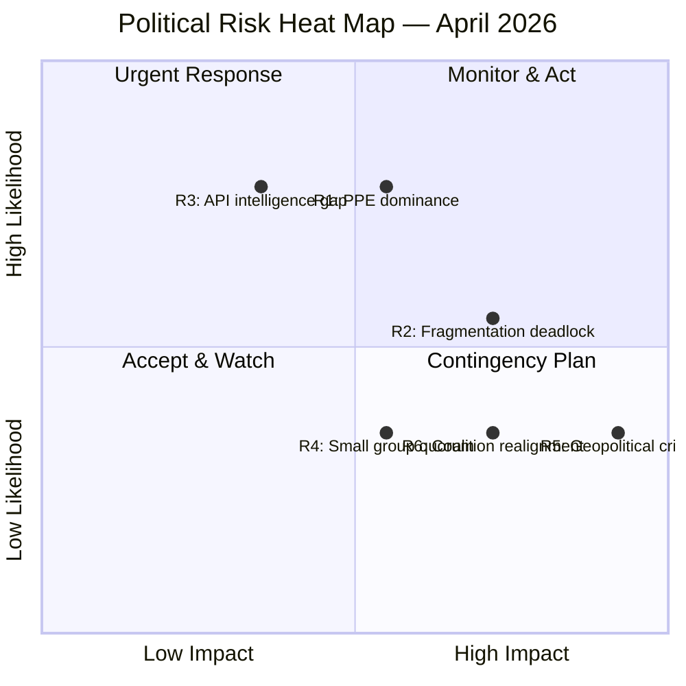
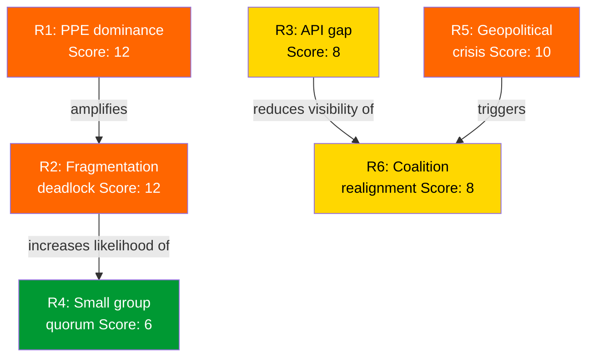

# Political Risk Assessment — European Parliament

| Field | Value |
|-------|-------|
| **Date** | 4 April 2026 |
| **Period** | Easter Recess (27 March – 13 April 2026) |
| **Framework** | Political Risk Methodology v2.0 |
| **Overall Risk Level** | 🟡 MEDIUM |
| **Confidence** | 🟡 MEDIUM |

---

## Risk Register

### Active Risks

| ID | Risk | Category | Likelihood (1-5) | Impact (1-5) | Risk Score | Trend |
|----|------|----------|:-:|:-:|:-:|:-:|
| R1 | PPE dominance blocks minority legislative initiatives | Coalition | 4 (Likely) | 3 (Moderate) | 12 | → Stable |
| R2 | Parliamentary fragmentation causes deadlock on contentious files | Policy | 3 (Possible) | 4 (Major) | 12 | → Stable |
| R3 | Recess-period intelligence gap from API degradation | Institutional | 4 (Likely) | 2 (Minor) | 8 | ↑ Increasing |
| R4 | Small group quorum failure in committee votes | Institutional | 2 (Unlikely) | 3 (Moderate) | 6 | → Stable |
| R5 | External geopolitical crisis during parliamentary recess | Geopolitical | 2 (Unlikely) | 5 (Severe) | 10 | → Stable |
| R6 | Coalition realignment triggered by post-recess dossier | Coalition | 2 (Unlikely) | 4 (Major) | 8 | → Stable |

### Risk Heat Map

---

## Detailed Risk Analysis

### R1: PPE Dominance Blocks Minority Initiatives (Score: 12)

**Description**: PPE holds 38% of seats — no majority is possible without PPE participation. This creates structural asymmetry where PPE can effectively veto any legislative initiative it opposes.

**Evidence**: Political landscape tool shows PPE at 38%, nearest competitor S&D at 22%. Early warning system flags DOMINANT_GROUP_RISK at HIGH severity. PPE is 19x the size of the smallest group (The Left, 2%). 🟢 High confidence

**Mitigation**: Monitor post-recess voting patterns for PPE blocking behavior. Track EPP-S&D alignment index. Watch for minority coalition formation (S&D + Greens/EFA + Renew + The Left = 39% — still insufficient without PPE).

**Bayesian update**: No new evidence during recess to adjust prior probability. Maintaining Likelihood = 4.

### R2: Fragmentation Deadlock on Contentious Files (Score: 12)

**Description**: With 8 political groups and effective number of parties at 4.04, complex multi-party negotiations are required for every significant vote. Contentious dossiers (trade policy, migration, digital regulation) risk stalemate.

**Evidence**: Coalition dynamics tool: fragmentation index 4.04, ENP 4.4. Political landscape: MULTI_COALITION_REQUIRED assessment. No single coalition configuration can pass legislation without at least 3 groups cooperating. 🟡 Medium confidence

**Mitigation**: Track committee-stage amendments for early coalition formation signals in April. Monitor rapporteur appointments for key dossiers.

### R3: Recess API Intelligence Gap (Score: 8)

**Description**: During Easter recess, EP API endpoints show degraded availability (6 of 8 feeds returning 404 or timeout). This creates a monitoring blind spot where significant developments could be missed.

**Evidence**: Feed collection: events (404), procedures (404), documents (timeout), plenary documents (timeout), committee documents (timeout), questions (timeout). Only adopted texts and MEPs feeds operational. 🟢 High confidence

**Mitigation**: Increase monitoring frequency as recess ends. Cross-reference with EP press releases and Europarl News. Expected normalization by 7 April.

### R4: Small Group Quorum Failure (Score: 6)

**Description**: Three political groups have 5 or fewer members in the sample: Renew (5), NI (4), The Left (2). These groups may struggle to maintain representation in all committees and delegations.

**Evidence**: Political landscape tool: Renew 5%, NI 4%, The Left 2%. Early warning: SMALL_GROUP_QUORUM_RISK at LOW severity. 🟡 Medium confidence

**Mitigation**: Monitor committee attendance rates when parliament resumes. Track substitute member activation patterns.

### R5: Geopolitical Crisis During Recess (Score: 10)

**Description**: While Parliament is in recess, its ability to respond to external crises (military escalation, trade war, pandemic) is severely limited. Emergency session requires EP President convocation.

**Evidence**: Calendar: no scheduled meetings until 14 April. Recess = reduced institutional responsiveness. Historical precedent: EP has recalled from recess for COVID-19 (2020) and Ukraine crisis (2022). 🔴 Low confidence (speculative)

**Mitigation**: Inherent risk accepted. EP emergency procedures exist. Conference of Presidents can be convened within 48 hours.

### R6: Post-Recess Coalition Realignment (Score: 8)

**Description**: The April plenary could surface a dossier that triggers unexpected coalition realignment, particularly if PPE pivots toward ECR+PfE on a centre-right dossier.

**Evidence**: Coalition dynamics: Renew-ECR cohesion at 0.95 (size-ratio proxy); S&D-ECR at 0.60. These unusual alignments suggest potential for non-traditional coalitions. 🔴 Low confidence (limited by proxy methodology)

**Mitigation**: Monitor April plenary agenda (expected 17 April). Track rapporteur recommendations for key files.

---

## Risk Interconnection Map

---

## Summary Statistics

| Metric | Value |
|--------|-------|
| Total risks | 6 |
| Critical risks (Score 16-25) | 0 |
| High risks (Score 10-15) | 3 (R1, R2, R5) |
| Medium risks (Score 5-9) | 3 (R3, R4, R6) |
| Low risks (Score 1-4) | 0 |
| Average risk score | 9.3 |
| Maximum risk score | 12 |
| Risks with increasing trend | 1 (R3) |

---

*Risk assessment per Political Risk Methodology v2.0. Likelihood x Impact scoring on 1-5 scales. Updated 4 April 2026.*
