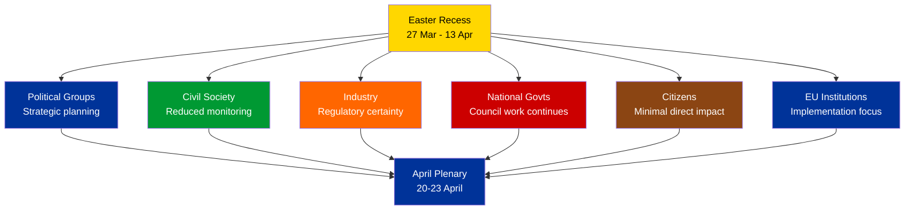

# Stakeholder Impact Assessment — Easter Recess Period

| Field | Value |
|-------|-------|
| **Date** | 4 April 2026 |
| **Period** | Easter Recess (27 March – 13 April 2026) |
| **Stakeholder Perspectives** | 6 of 6 analyzed |
| **Confidence** | 🟡 MEDIUM |

---

## Stakeholder Impact Matrix

| Stakeholder | Impact Direction | Severity | Key Concern | Confidence |
|-------------|:---:|:---:|---|:---:|
| EP Political Groups | Neutral | Low | Recess provides strategic planning time | 🟡 Medium |
| Civil Society and NGOs | Neutral | Low | Legislative pause; monitoring reduced | 🟡 Medium |
| Industry and Business | Neutral | Low | Regulatory certainty maintained; no surprises | 🟢 High |
| National Governments | Neutral | Low | No new EU mandates during recess | 🟢 High |
| EU Citizens | Neutral | Low | No direct impact; democratic process paused | 🟡 Medium |
| EU Institutions | Neutral | Low | Commission uses recess for implementation work | 🟡 Medium |

---

## Detailed Stakeholder Analysis

### 1. EP Political Groups

**Impact**: Neutral | **Severity**: Low

The Easter recess provides all 8 political groups with a strategic planning window. Key dynamics:

- **PPE** (38%): Uses recess for internal coordination ahead of April plenary. Likely reviewing rapporteur positions on pending dossiers. Benefits from structural dominance to set terms for post-recess negotiations. 🟡 Medium confidence
- **S&D** (22%): Second-largest group faces strategic choice — maintain grand coalition loyalty or explore progressive bloc alternatives on specific files. Recess provides time for internal policy alignment. 🟡 Medium confidence
- **PfE** (11%): As third-largest group in EP10, PfE leverages recess for positioning as potential PPE coalition partner on centre-right files. 🔴 Low confidence
- **Small groups** (Renew 5%, NI 4%, Left 2%): Quorum risk means recess planning must prioritize committee attendance commitments for April. 🟡 Medium confidence

### 2. Civil Society and NGOs

**Impact**: Neutral | **Severity**: Low

The legislative pause reduces NGO advocacy pressure points. However:

- **Monitoring organizations** face reduced data availability (6/8 EP API feeds degraded)
- **Advocacy groups** use recess period to prepare position papers for upcoming dossiers
- **Transparency advocates** note that recess periods create accountability gaps — no plenary debates, no public votes
- **Democratic participation**: EP visitors' program paused; citizens' interactions reduced

Evidence: EP API feed status showing 6 of 8 endpoints unavailable; no committee meetings scheduled. 🟡 Medium confidence

### 3. Industry and Business

**Impact**: Neutral | **Severity**: Low

Regulatory certainty is maintained during recess — no surprise legislation.

- **Regulated industries** benefit from predictable legislative calendar; can plan for known upcoming files
- **Trade-affected sectors** monitoring EU-China tariff modifications from March plenary adoption
- **Digital sector** preparing for next wave of Digital Markets Act implementation measures
- **Financial services** noting DGSD2 deposit protection framework adopted before recess

Evidence: March plenary adopted texts TA-10-2026-0087 through TA-10-2026-0104 include trade and regulatory files. 🟢 High confidence

### 4. National Governments

**Impact**: Neutral | **Severity**: Low

Member state governments use the EP recess for:

- **Council working groups** continue without EP pressure on co-decision files
- **Transposition work** on recently adopted directives (March plenary output of 18 texts)
- **National parliamentary scrutiny** of subsidiarity aspects of pending EU proposals
- **Bilateral coordination** between capitals on contentious upcoming EP files

Evidence: 23 countries represented in EP landscape sample; recess does not affect Council calendar. 🟢 High confidence

### 5. EU Citizens

**Impact**: Neutral | **Severity**: Low

Direct citizen impact during recess is minimal:

- No new legislation affecting daily life
- Democratic representation formally paused (no plenary votes)
- MEP constituency work continues informally
- Citizens' petitions processing paused at committee level

The strong 2026 Q1 productivity (114 acts) means citizens benefit from substantial legislative output delivered before recess. 🟡 Medium confidence

### 6. EU Institutions

**Impact**: Neutral | **Severity**: Low

- **European Commission**: Uses EP recess for implementation work on adopted texts; preparing new proposals for post-recess pipeline
- **Council of the EU**: Working groups continue; presidency program unaffected by EP recess
- **ECB**: Monetary policy independent of EP calendar; no banking regulation files pending immediate EP vote
- **Court of Justice**: Case processing continues; no pending CJEU rulings affecting EP competence identified

Evidence: Institutional calendars operate independently; EP recess does not create inter-institutional pressure. 🟡 Medium confidence

---

## Recess-Specific Stakeholder Dynamics

---

## Post-Recess Stakeholder Watch Items

| Stakeholder | Item to Monitor | Date |
|-------------|----------------|------|
| Political Groups | Committee agendas published | 10-11 April |
| Civil Society | EP API feed restoration | 7-9 April |
| Industry | Trade policy dossier scheduling | Committee week 14-17 April |
| National Governments | Council position on co-decision files | Ongoing |
| Citizens | Plenary OJ (agenda) published | Approx 17 April |
| EU Institutions | Commission proposals tabled during recess | 14 April onwards |

---

*Stakeholder impact assessment per 6-perspective framework. All assessments evidence-linked to EP MCP data. Updated 4 April 2026.*
