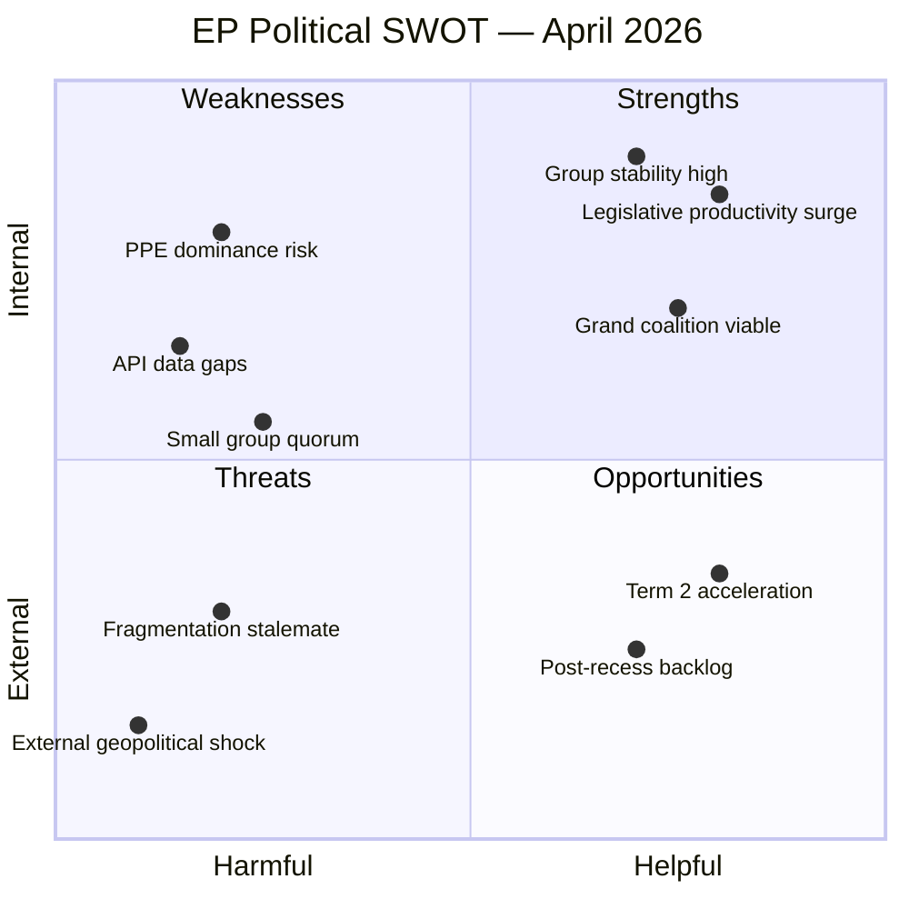
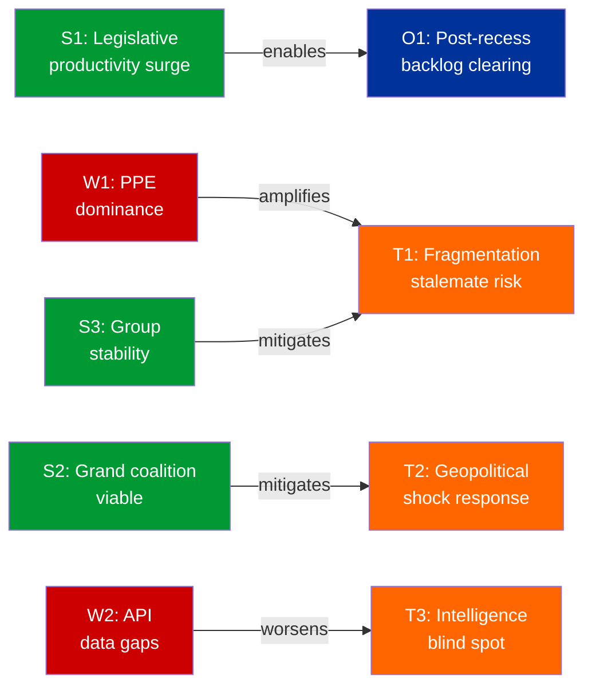

# SWOT Analysis — European Parliament Easter Recess Period

| Field | Value |
|-------|-------|
| **Date** | 4 April 2026 |
| **Period** | Easter Recess (27 March – 13 April 2026) |
| **Framework** | Political SWOT Framework v2.0 |
| **Confidence** | 🟡 MEDIUM |

---

## SWOT Matrix

---

### Strengths (Internal, Helpful)

| ID | Strength | Evidence | Severity | Confidence |
|----|----------|----------|----------|------------|
| S1 | **Legislative productivity surge** — 114 acts in Q1 2026, exceeding full-year 2024 (72) and 2025 (78) | EP precomputed stats: 2026 YTD = 114 legislative acts adopted | HIGH | 🟢 High |
| S2 | **Grand coalition remains viable** — PPE+S&D hold approx 60% combined seat share | Political landscape tool: PPE 38% + S&D 22% = 60% | HIGH | 🟢 High |
| S3 | **Group stability at maximum** — Zero voting anomalies detected, defection trend DECREASING | Voting anomalies tool: stability score 100/100, 0 anomalies | MEDIUM | 🟡 Medium |
| S4 | **Multi-coalition flexibility** — Both centre-left and centre-right majorities mathematically possible | Landscape tool: grand coalition 60%, conservative bloc 57% | MEDIUM | 🟢 High |

### Weaknesses (Internal, Harmful)

| ID | Weakness | Evidence | Severity | Confidence |
|----|----------|----------|----------|------------|
| W1 | **PPE structural dominance** — 38% seat share creates veto power, 19x smallest group | Early warning: DOMINANT_GROUP_RISK at HIGH severity | HIGH | 🟢 High |
| W2 | **EP API data gaps during recess** — 6 of 8 feed endpoints returning 404 or timeout | Feed collection: events, procedures, documents, plenary docs, committee docs, questions all failed | MEDIUM | 🟢 High |
| W3 | **Small group representation risk** — Renew (5), NI (4), The Left (2) struggle for quorum | Early warning: SMALL_GROUP_QUORUM_RISK, 3 groups with 5 or fewer members | LOW | 🟡 Medium |
| W4 | **Voting cohesion data unavailable** — EP API does not provide per-MEP voting statistics | Coalition dynamics tool: all dataAvailability fields = UNAVAILABLE | MEDIUM | 🟢 High |

### Opportunities (External, Helpful)

| ID | Opportunity | Evidence | Severity | Confidence |
|----|-------------|----------|----------|------------|
| O1 | **Post-recess legislative backlog clearing** — Heavy April plenary expected with accumulated dossiers | Calendar: committee week 14-17 April + plenary 20-23 April; 114 acts YTD signals high throughput capacity | HIGH | 🟡 Medium |
| O2 | **EP10 term second-year acceleration** — Historical pattern shows mid-term productivity peak | Stats comparison: EP9 peaked at 148 acts (2023), EP10 on track to match/exceed | MEDIUM | 🟡 Medium |
| O3 | **API normalization post-maintenance** — Easter period may include scheduled EP IT maintenance | Pattern: feed timeouts concentrated during holiday periods; expect restoration by 7 April | LOW | 🟡 Medium |

### Threats (External, Harmful)

| ID | Threat | Evidence | Severity | Confidence |
|----|--------|----------|----------|------------|
| T1 | **Parliamentary fragmentation stalemate** — 8 groups with ENP 4.04 could deadlock on contentious files | Coalition dynamics: fragmentation 4.04, MULTI_COALITION_REQUIRED | MEDIUM | 🟡 Medium |
| T2 | **External geopolitical shock during recess** — Parliament unable to respond rapidly while in recess | Calendar: no meetings until 14 April; emergency mechanisms require President convocation | HIGH | 🔴 Low |
| T3 | **Data monitoring blind spot** — Reduced API availability creates intelligence gap during recess | Feed collection: 75% of endpoints unavailable; potential for missed signals | MEDIUM | 🟡 Medium |

---

## TOWS Strategy Matrix

| | **Strengths** | **Weaknesses** |
|---|---|---|
| **Opportunities** | **SO**: Leverage legislative productivity surge (S1) to clear post-recess backlog (O1); use coalition flexibility (S4) for bipartisan dossier advancement (O2) | **WO**: Address PPE dominance (W1) through broader coalition building in April plenary (O1); restore API monitoring (W2) as endpoints normalize (O3) |
| **Threats** | **ST**: Group stability (S3) mitigates fragmentation risk (T1); grand coalition viability (S2) provides rapid-response capacity against geopolitical shocks (T2) | **WT**: PPE veto power (W1) could amplify fragmentation stalemate (T1); API gaps (W2) worsen intelligence blind spots (T3) during recess |

---

## Cross-SWOT Interference Analysis

---

*Evidence-based SWOT analysis per Political SWOT Framework v2.0. All entries require verifiable EP data source. Updated 4 April 2026.*
