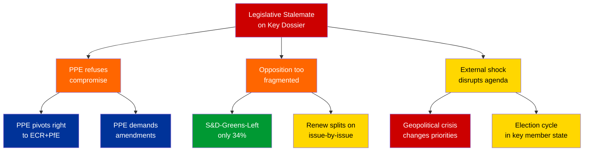

# Political Threat Assessment — European Parliament

| Field | Value |
|-------|-------|
| **Date** | 4 April 2026 |
| **Period** | Easter Recess (27 March – 13 April 2026) |
| **Framework** | Political Threat Framework v3.0 |
| **Overall Threat Level** | 🟡 MODERATE |
| **Confidence** | 🟡 MEDIUM |

---

## Threat Landscape Overview (6 Dimensions)

```mermaid
radar
    title Political Threat Landscape — April 2026
```

| Dimension | Threat Level | Key Indicator | Confidence |
|-----------|:---:|-------------|:---:|
| **Institutional Integrity** | LOW | No institutional crises; recess period normal | 🟢 High |
| **Coalition Stability** | MODERATE | Fragmentation high (ENP 4.04) but stability 84/100 | 🟡 Medium |
| **Legislative Effectiveness** | LOW | 114 acts YTD — above historical average | 🟢 High |
| **Democratic Representation** | MODERATE | PPE dominance risk; 3 groups below quorum threshold | 🟡 Medium |
| **External Resilience** | MODERATE | Recess reduces rapid-response capacity | 🔴 Low |
| **Information Environment** | MODERATE | API degradation creates monitoring gaps | 🟡 Medium |

---

## Threat Actor Analysis (Diamond Model Adaptation)

### Primary Structural Threat: PPE Hegemonic Positioning

| Diamond Model Element | Assessment |
|----------------------|------------|
| **Adversary** | Not adversarial — structural dynamics. PPE operates within institutional rules |
| **Capability** | 38% seat share provides effective veto. Grand coalition partnership possible but not guaranteed |
| **Infrastructure** | Committee chairs, rapporteur assignments, Conference of Presidents representation |
| **Victim (affected)** | Smaller groups (Renew, NI, The Left) whose legislative initiatives require PPE cooperation |

**Assessment**: PPE structural dominance is not a threat in the hostile-actor sense but rather a systemic power asymmetry that shapes all parliamentary outcomes. The risk is not PPE acting maliciously but rather that the structural incentive for PPE to cooperate broadly diminishes as its seat share approaches effective majority. 🟡 Medium confidence

---

## Attack Tree: Legislative Stalemate Scenario



**Assessment**: The most probable path to stalemate runs through fragmented opposition (branch B) rather than PPE refusal (branch A). With S&D+Greens+Left controlling only 34%, any initiative lacking PPE support requires building a 4+ group coalition including groups with divergent priorities. 🟡 Medium confidence

---

## Scenario Planning: Post-Recess April Plenary

### Scenario 1: Business as Usual (Probability: LIKELY — 55%)

**Description**: Parliament returns from recess, clears legislative backlog through normal grand coalition cooperation. April plenary adopts 10-15 texts. No coalition surprises.

**Indicators**: Committee agendas show routine dossiers. PPE-S&D pre-plenary coordination proceeds normally. No contentious files in rapporteur recommendations.

**Stakeholder impact**: All groups benefit from institutional normality. Citizens see legislative progress. Commission satisfied with legislative throughput.

### Scenario 2: Heavy Session with Coalition Friction (Probability: POSSIBLE — 30%)

**Description**: Accumulated dossiers include 1-2 contentious files (trade tariffs, migration quotas, digital regulation) that expose PPE-S&D fault lines. Individual votes require non-standard coalitions.

**Indicators**: Rapporteur disagrees with shadow rapporteurs. Amendment counts spike above 200 on single file. Floor debates extend past scheduled time. Roll-call vote results show unusual group splits.

**Stakeholder impact**: Policy uncertainty for industry on affected dossiers. ECR and PfE gain leverage as potential swing voters. Citizens see democratic deliberation.

### Scenario 3: Coalition Realignment Signal (Probability: UNLIKELY — 15%)

**Description**: A major dossier vote reveals a new persistent voting pattern — PPE aligning with ECR+PfE on a centre-right majority, sidelining S&D. This would signal a structural shift in EP10 coalition dynamics.

**Indicators**: PPE votes against S&D on a major legislative file. EPP leadership makes public statements distancing from grand coalition. ECR/PfE celebrate the vote as a coalition breakthrough.

**Stakeholder impact**: S&D loses influence in legislative negotiations. Progressive NGOs alarmed. Industry may welcome less regulated outcome. EU institutional balance shifts rightward.

---

## PESTLE Assessment (Recess Period)

| Dimension | Current State | Post-Recess Outlook | Confidence |
|-----------|--------------|-------------------|:---:|
| **Political** | Recess calm; no institutional crises | April plenary will test coalition cohesion | 🟡 Medium |
| **Economic** | EU economy stable; no recession signals | Trade policy dossiers may surface tensions | 🟡 Medium |
| **Social** | No major social unrest affecting EP agenda | Migration file could trigger social debate | 🔴 Low |
| **Technological** | EP API degradation during recess | Expected normalization; digital legislation pending | 🟡 Medium |
| **Legal** | No CJEU rulings pending affecting EP competence | Ordinary legislative procedure functioning normally | 🟢 High |
| **Environmental** | Climate legislation in pipeline | Greens/EFA pushing for environmental dossiers in April | 🟡 Medium |

---

## Recommendations

1. **Increase monitoring frequency from 10 April** — Committee week preparations will signal April plenary content
2. **Track PPE-S&D alignment index** — Any divergence from historical pattern is an early coalition stress indicator
3. **Monitor Renew and NI participation** — Small groups at quorum risk; their absence could shift vote outcomes
4. **Cross-reference EP press releases** — While API feeds are degraded, EP Newsroom may surface developments missed by data feeds

---

*Threat assessment per Political Threat Framework v3.0. Purpose-built political intelligence frameworks only — no software-centric models applied. Updated 4 April 2026.*
