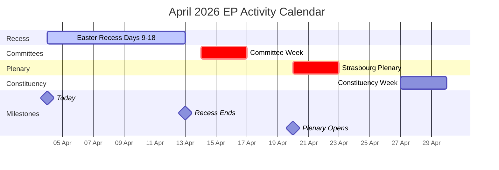
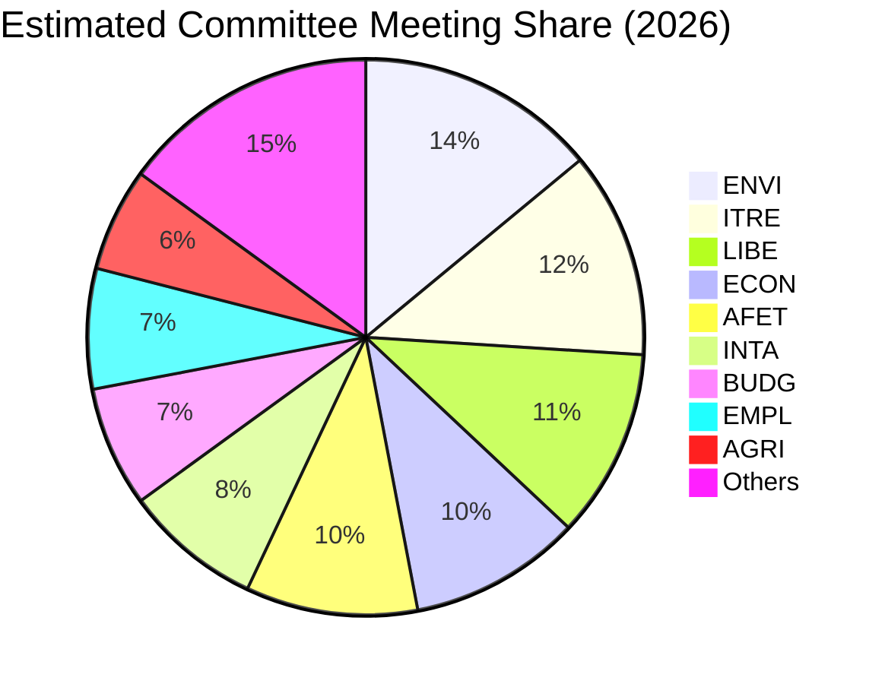
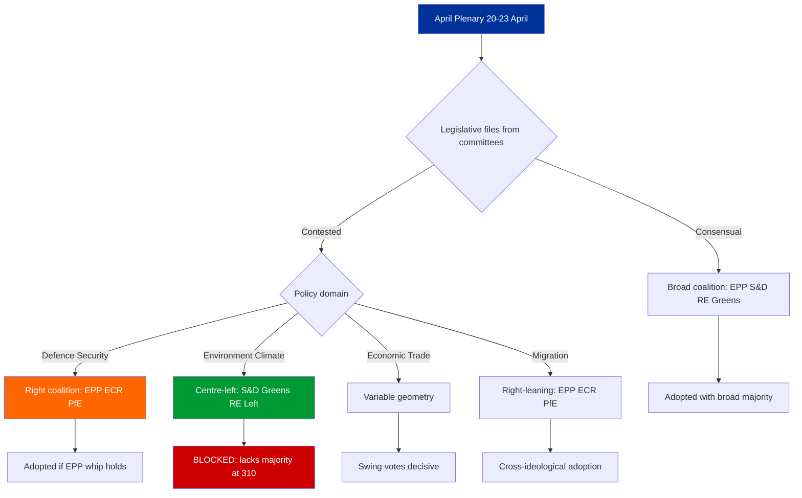

# Forward Outlook: Post-Easter Intelligence Preparation — 4 April 2026

| Field | Value |
|-------|-------|
| **Assessment Date** | Saturday, 4 April 2026 |
| **Outlook Period** | 14 April – 30 April 2026 |
| **Key Events** | Committee Week (14-17 Apr), Strasbourg Plenary (20-23 Apr) |
| **Current Status** | Easter Recess — Day 9 of 18 |
| **Risk Level** | 🟡 MEDIUM — Standard recess-to-session transition |

---

## Executive Summary

This forward outlook prepares intelligence baselines for the critical post-Easter transition period. The April 2026 legislative calendar features two high-priority weeks: committee week (14-17 April) for pipeline preparation and Strasbourg plenary (20-23 April) for legislative adoption. EP10's Year-2 productivity surge makes this period particularly significant for monitoring coalition dynamics, legislative velocity, and political group positioning.

The analysis identifies three priority intelligence targets: (1) EPP-ECR voting alignment patterns at the first post-recess plenary, (2) legislative output volume confirming or challenging the 114-act Year-2 projection, and (3) committee agenda signals indicating policy priorities for the April-June legislative sprint.

---

## Calendar Intelligence: April 2026

---

## Committee Week Preparation (14-17 April)

### Expected Committee Activity Profile

Based on EP10 patterns and the Q1 2026 legislative pipeline:

| Committee | Priority | Expected Activity | Key Dossiers | Political Tension |
|-----------|:--------:|-------------------|-------------|:-----------------:|
| **ENVI** | 🔴 High | Amendment votes, rapporteur presentations | Clean Industrial Deal environmental conditions | EPP vs Greens |
| **ITRE** | 🔴 High | Hearings, report adoptions | European Defence Industrial Strategy | Cross-party |
| **LIBE** | 🟡 Medium | Report discussions, expert hearings | AI Act implementation, migration policy | Right vs Left |
| **ECON** | 🟡 Medium | Monetary dialogue prep, report drafting | Fiscal framework review | Hawks vs expansionists |
| **INTA** | 🟡 Medium | Trade agreement scrutiny | EU-China tariff adjustments | Cross-party |
| **AFET** | 🔴 High | Urgency assessments, strategic debates | Neighbourhood policy, enlargement | Cross-party |
| **BUDG** | 🟡 Medium | Budget execution review | 2026 amendments, MFF mid-term | EPP-S&D vs ECR |
| **EMPL** | 🟢 Low | Standard meetings | Social pillar implementation | S&D-led |
| **AGRI** | 🟢 Low | Standard meetings | CAP strategic plans review | EPP-led |
| **IMCO** | 🟡 Medium | Digital markets, consumer protection | Single Market reforms | Consensus-oriented |

> **Intelligence note**: Committee agendas are typically published 5-7 days before meetings. Monitor EP website from approximately 10 April for April committee week agendas. 🟡 Medium confidence

### Committee Workload Distribution (EP10 2026)

Based on precomputed statistics showing 2,363 projected committee meetings for 2026:

> **Note**: Estimated distribution based on EP10 committee mandates and Q1 2026 activity patterns. ENVI and ITRE carry disproportionate workloads due to the Clean Industrial Deal and defence legislative packages. 🟡 Medium confidence

---

## Strasbourg Plenary Preparation (20-23 April)

### Expected Plenary Output

Based on post-Easter historical patterns:

| Metric | Conservative | Central | Optimistic |
|--------|:-----------:|:------:|:----------:|
| Adopted texts | 8-10 | 12-18 | 20-25 |
| Roll-call votes | 15-20 | 25-35 | 40-50 |
| Debates | 6-8 | 10-14 | 15-20 |
| Resolutions | 2-3 | 4-6 | 8-10 |

### Likely Agenda Categories

| Category | Expected Items | Coalition Dynamic | Confidence |
|----------|:--------------:|-------------------|:----------:|
| Legislative reports (COD) | 3-5 | EPP-led variable geometry | 🟡 Medium |
| Non-legislative resolutions | 2-4 | Cross-party or bloc-dependent | 🟡 Medium |
| Commission statements | 1-2 | All groups participate | 🟢 High |
| Question Time | 1 | Oversight function | 🟢 High |
| Urgency debates | 0-2 | Depends on external events | 🔴 Low |

---

## Coalition Dynamics: Post-Recess Scenarios

### Key Coalition Questions for April Plenary

### Critical Coalition Arithmetic

| Coalition | Seats | Majority (361) | Typical Policy Areas |
|-----------|:-----:|:--------------:|---------------------|
| EPP + S&D | 320 | ❌ (-41) | Insufficient alone |
| EPP + S&D + RE | 396 | ✅ (+35) | Economic/trade; traditional centre |
| EPP + ECR + PfE | 348 | ❌ (-13) | Close but insufficient |
| EPP + ECR + PfE + RE | 424 | ✅ (+63) | Right-of-centre economic agenda |
| S&D + Greens + GUE + RE | 310 | ❌ (-51) | Progressive bloc insufficient |
| EPP + S&D + Greens | 373 | ✅ (+12) | Environment/climate legislation |
| EPP + ECR + RE | 340 | ❌ (-21) | Insufficient |
| EPP + S&D + RE + Greens | 449 | ✅ (+88) | Super-majority; consensus items |

> **Strategic insight**: No two-party coalition achieves majority. Minimum winning coalitions require 3 groups. EPP's pivotal position (required in virtually all majority coalitions) gives it outsized agenda-setting power. The key variable is whether EPP looks right (ECR, PfE) or left (S&D, Greens) for its third partner on each file. 🟢 High confidence

---

## Early Warning Indicators to Monitor

### Pre-Plenary Signals (10-19 April)

| Signal | Source | Meaning | Priority |
|--------|--------|---------|:--------:|
| Extended plenary agenda | EP website | High legislative output expected | 🔴 High |
| Urgency debate requests | Conference of Presidents | Geopolitical disruption | 🔴 High |
| Group press conferences | Communications channels | Priority positioning revealed | 🟡 Medium |
| Amendment flooding | Committee agendas | Contested vote incoming | 🟡 Medium |
| Rapporteur changes | Committee announcements | Coalition dynamics shift | 🔴 High |

### During Plenary Signals (20-23 April)

| Signal | Source | Meaning | Priority |
|--------|--------|---------|:--------:|
| Roll-call deviations from group positions | Voting records | Group discipline breakdown | 🔴 High |
| EPP-ECR joint voting on contested files | Roll-call analysis | Right-bloc consolidation | 🔴 High |
| High abstention rates (above 15%) | Attendance records | Group indecision or whip failure | 🟡 Medium |
| Commission urgency statements | Plenary announcements | Crisis management mode | 🟡 Medium |
| Opposition walkout | Plenary proceedings | Coalition breakdown signal | 🔴 High |

---

## Threat Assessment: Post-Easter Period

### Political Threat Landscape

| Threat Vector | Likelihood | Impact | Score | Mitigation |
|---------------|:----------:|:------:|:-----:|------------|
| Right-bloc overreach on security votes | 3 | 3 | 9 🟡 | Monitor EPP-ECR alignment |
| Progressive bloc obstruction | 3 | 2 | 6 🟡 | Track S&D/Greens amendments |
| Small group walkouts | 2 | 1 | 2 🟢 | Low significance unless escalated |
| Trade policy external shock | 2 | 4 | 8 🟡 | Watch US/China trade developments |
| EP API total outage during plenary | 1 | 3 | 3 🟢 | Fallback to manual monitoring |

---

## Intelligence Priority Matrix

### Tier 1: Must Monitor (Daily from 14 April)

1. **April plenary agenda** — Published approximately 10 April; reveals legislative priorities and session scope
2. **EPP-ECR voting alignment** — First test of right-bloc consolidation hypothesis at post-recess plenary
3. **Legislative act adoption volume** — Confirms or challenges 114-act Year-2 productivity projection

### Tier 2: Should Monitor (Weekly)

4. **Committee amendment patterns** — Early signals of contested April plenary votes
5. **MEP roster changes** — Any group switches during or after recess
6. **EP API feed recovery** — All 8 endpoints should return to operational status by 14 April

### Tier 3: Watch (Situational)

7. **Commission communications** — New legislative proposals tabled for April
8. **Council positioning** — Trilogue progress on pending COD files
9. **Civil society advocacy** — NGO campaigns targeting specific plenary votes

---

## Confidence Assessment Summary

| Finding | Confidence | Basis |
|---------|:----------:|-------|
| Easter recess ends 13 April | 🟢 High | EP institutional calendar |
| Committee week 14-17 April | 🟢 High | EP institutional calendar |
| Strasbourg plenary 20-23 April | 🟢 High | EP institutional calendar |
| 12-18 adopted texts at April plenary | 🟡 Medium | Historical pattern extrapolation |
| Right-bloc consolidation at plenary | 🔴 Low | Projection without pre-recess data |
| EP API feed recovery by 14 April | 🟡 Medium | Historical pattern; recess degradation expected to resolve |
| Committee agendas published by 10 April | 🟡 Medium | Standard EP publishing timeline |

---

## Analytical Methodology

This outlook applies three complementary frameworks:

1. **Weekly Intelligence Brief** — Structured situational awareness with colour-coded alert levels and confidence indicators
2. **Political Landscape Analysis** — Group composition, coalition arithmetic, and bloc dynamics mapping
3. **Scenario Planning** — Three-scenario framework (standard/sprint/disruption) with probability indicators and stakeholder impact assessment

The 4-pass refinement cycle was applied: (1) Initial forecast based on historical patterns, (2) Stakeholder challenge identifying alternative interpretations, (3) Evidence cross-validation against precomputed statistics and analytical tool outputs, (4) Synthesis with confidence levels and scenario probabilities.

---

*Analysis produced by EU Parliament Monitor AI (Claude Opus 4.6) — 4 April 2026*
*Methodology: Weekly Intelligence Brief + Political Landscape + Scenario Planning*
*4-pass refinement cycle completed*
*Classification: PUBLIC | Confidence: MEDIUM*
