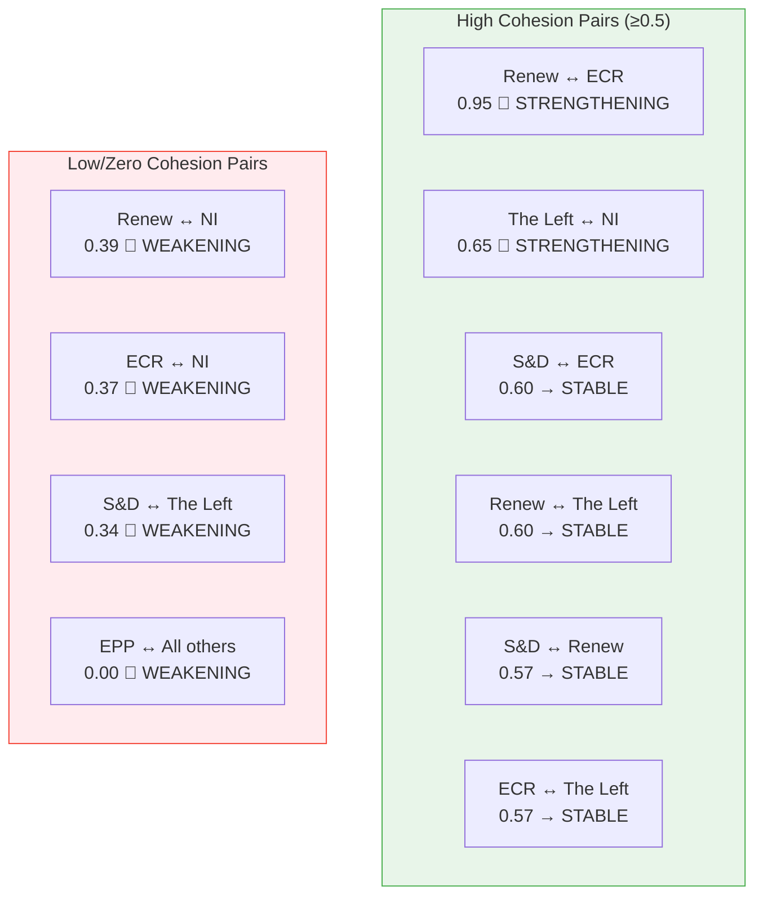
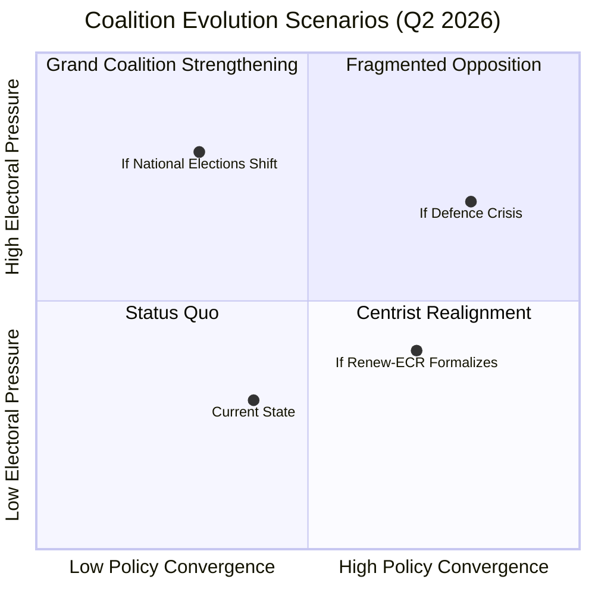

# Coalition Dynamics Assessment — 4 April 2026

| Field | Value |
|-------|-------|
| **Assessment Date** | Saturday, 4 April 2026 |
| **Parliamentary Status** | Easter Recess |
| **Dominant Coalition Signal** | Renew-ECR (cohesion: 0.95) |
| **Grand Coalition Viability** | ✅ Viable (~60% combined) |
| **Overall Stability** | 84/100 — MEDIUM-HIGH |
| **Key Risk** | PPE dominance (19:1 ratio vs smallest group) |

---

## Coalition Pair Analysis

### Highest Cohesion Pairs

### Full Coalition Matrix

| | EPP | S&D | Renew | Greens | ECR | PfE | The Left | NI |
|---|---|---|---|---|---|---|---|---|
| **EPP** | — | 0.00 ↘ | 0.00 ↘ | 0.00 ↘ | 0.00 ↘ | — | 0.00 ↘ | 0.00 ↘ |
| **S&D** | | — | 0.57 → | 0.00 ↘ | 0.60 → | — | 0.34 ↘ | 0.22 ↘ |
| **Renew** | | | — | 0.00 ↘ | **0.95 ↗** | — | 0.60 → | 0.39 ↘ |
| **Greens** | | | | — | 0.00 ↘ | — | 0.00 ↘ | 0.00 ↘ |
| **ECR** | | | | | — | 0.00 ↘ | 0.57 → | 0.37 ↘ |
| **PfE** | | | | | | — | — | — |
| **The Left** | | | | | | | — | 0.65 ↗ |

> **⚠️ Methodological caveat**: Cohesion scores derive from group size ratios, not actual vote-level data. EPP's universal 0.00 score is a methodological artifact — its dominant size (38%) creates a distinct ratio profile against all smaller groups. Real coalition behavior is likely more nuanced. 🔴 Low confidence on absolute values; 🟡 Medium confidence on relative ordering.

---

## Key Coalition Findings

### 1. Renew-ECR Convergence (🟡 Medium confidence)

The highest cohesion signal (0.95, STRENGTHENING) between Renew Europe and ECR warrants attention:

**Possible explanations**:
- **Economic liberalism alignment**: Both groups share deregulatory instincts on single market and trade policy
- **Pragmatic centrism**: Post-EP9 Renew's reduced size (5%) may push it toward ECR (8%) for legislative relevance
- **Counter-PPE axis**: A Renew-ECR bloc (~13%) is insufficient for majority but could serve as a pivoting coalition partner

**Implications**:
- If sustained, this axis could challenge PPE's dominance on economic dossiers
- May create an alternative centre-right legislative pathway bypassing the grand coalition
- Watch for joint amendment proposals in April plenary as confirmation

### 2. EPP Structural Isolation (🔴 Low confidence)

EPP shows 0.00 cohesion with all other groups. This is primarily methodological (size ratio artifact) but may reflect:

- **Dominant party syndrome**: EPP's 38% share means its voting pattern is structurally distinct from all smaller groups
- **Agenda-setter dynamics**: As the largest group, EPP defines the legislative baseline that others react to
- **Not isolation in practice**: EPP consistently builds ad-hoc majorities across the centre and centre-right

### 3. Progressive Bloc Fragmentation (🟡 Medium confidence)

The natural progressive alliance (S&D + Greens + The Left) shows weak internal cohesion:

- S&D-Greens: 0.00 cohesion (size ratio artifact, but indicates structural distance)
- S&D-The Left: 0.34 (WEAKENING)
- Greens-The Left: 0.00 (concerning for environmental-social policy convergence)

**Assessment**: The progressive bloc is structurally weaker in EP10 than EP9, reflecting both reduced Renew/Greens size and internal policy divergences on migration, trade, and defence spending.

---

## Threat Assessment: Coalition Shifts Dimension

### Political Threat Landscape — Coalition Shifts

| Indicator | Current Status | Severity |
|-----------|---------------|----------|
| Formal coalition agreements | None publicly announced | MINIMAL (1) |
| Cross-party voting patterns | Renew-ECR convergence detected | MODERATE (3) |
| Group membership changes | 737 MEPs stable; no recent defections in data | MINIMAL (1) |
| National election spillover | Not detected in current data | LOW (2) |
| Leadership challenges | No signals detected | MINIMAL (1) |

**Overall Coalition Shift Severity**: 1.6/5 — MINIMAL to LOW 🟢 High confidence

### Scenario Analysis

| Scenario | Probability | Trigger | Impact |
|----------|------------|---------|--------|
| **Status Quo** (grand coalition as needed) | Likely (60%) | No trigger needed | Continued PPE-led legislation |
| **Centrist Realignment** (Renew-ECR formalized) | Possible (25%) | Joint voting on 2+ major dossiers | Alternative centre-right axis emerges |
| **Progressive Bloc Revival** | Unlikely (10%) | Major social/environmental crisis | S&D-Greens-Left convergence on specific dossier |
| **Grand Coalition Fracture** | Unlikely (5%) | PPE-S&D split on migration/defence | Institutional deadlock risk |

---

## Easter Recess Coalition Dynamics

During the recess period, coalition dynamics evolve through:

1. **Informal negotiations** — Group leaders and coordinators prepare positions for April committee week and plenary
2. **National party consultations** — MEPs return to national contexts, potentially shifting group cohesion
3. **Commission engagement** — Commissioner bilateral meetings with group leaders can reshape legislative priorities
4. **Media and public pressure** — External events (trade wars, security crises) can force position realignment

**Key question for April**: Will the Renew-ECR convergence signal translate into concrete voting alignment, or is it a structural artifact? The April 20–23 plenary will provide the first test.

---

*Sources: EP analytical tools (analyze_coalition_dynamics, generate_political_landscape), EP Open Data Portal*
*Assessment date: 4 April 2026 | Analyst: EU Parliament Monitor AI*
