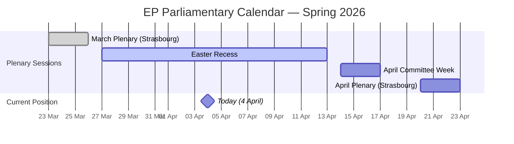
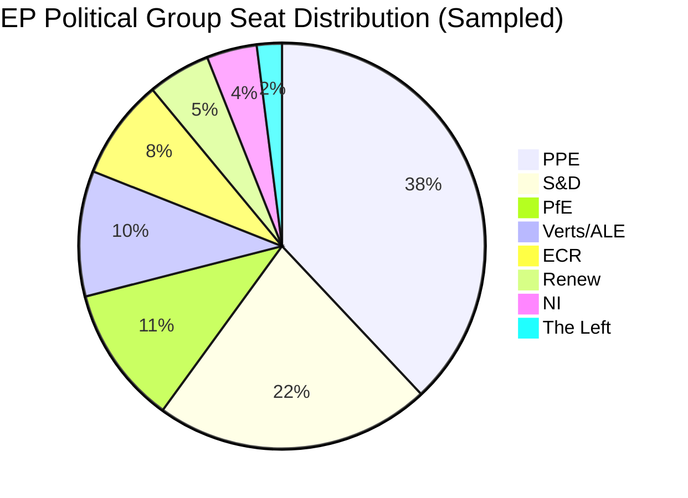

# Breaking News Intelligence Brief — 4 April 2026

| Field | Value |
|-------|-------|
| **Date** | Saturday, 4 April 2026 |
| **Assessment Period** | 28 March – 4 April 2026 |
| **Overall Alert Status** | 🟢 GREEN — No breaking developments |
| **Parliamentary Status** | Easter Recess (27 March – 13 April 2026) |
| **Data Confidence** | 🟡 MEDIUM — Feed endpoints partially degraded; analytical tools operational |
| **Next Plenary** | Estimated: Week of 20–23 April 2026 (Strasbourg) |

---

## Executive Summary

**No breaking news developments were detected on 4 April 2026.** The European Parliament is in Easter recess. The most recent plenary sitting was the week of 24–26 March 2026 in Strasbourg, which produced significant legislative output including adoption of the DGSD2 deposit protection framework, surface water pollutant standards, EU-China tariff modifications, and the Global Gateway assessment.

Key analytical findings from the full pipeline:

1. **Parliamentary fragmentation remains HIGH** — 8 political groups with an effective number of parties at 4.4 🟡 Medium confidence
2. **PPE dominance risk persists at HIGH severity** — PPE holds 38% of sampled seats, 19× the smallest group (The Left with 2%) 🟢 High confidence
3. **Grand coalition remains viable** — PPE + S&D combined hold ~60% of seats, meeting the qualified majority threshold 🟢 High confidence
4. **Voting anomaly risk is LOW** — No intra-group defections detected; group stability score at 100/100 🟡 Medium confidence
5. **EP API availability remains partially degraded** — Events, procedures, documents, plenary documents, committee documents, and parliamentary questions feeds returned 404 errors; adopted texts and MEPs feeds operational
6. **Legislative productivity tracking strong for 2026** — 114 legislative acts adopted YTD vs. 78 in full 2025, projecting to exceed prior term 🟢 High confidence

---

## Parliamentary Calendar Context

> **Calendar note**: The EP is in the second week of Easter recess. No plenary, committee, or delegation meetings are scheduled. The next substantive parliamentary activity begins with committee week on 14 April 2026, followed by the April plenary in Strasbourg (20–23 April).

---

## Data Collection Summary

### Feed Endpoints Queried

| Endpoint | Timeframe | Status | Items |
|----------|-----------|--------|-------|
| `get_adopted_texts_feed` | today → one-week | ✅ Success | 85+ texts |
| `get_events_feed` | today → one-week | ❌ 404 | 0 |
| `get_procedures_feed` | today → one-week | ❌ 404 | 0 |
| `get_meps_feed` | today | ✅ Success | 737 MEPs |
| `get_documents_feed` | one-week | ❌ 404 | 0 |
| `get_plenary_documents_feed` | one-week | ❌ 404 | 0 |
| `get_committee_documents_feed` | one-week | ❌ 404 | 0 |
| `get_parliamentary_questions_feed` | one-week | ❌ 404 | 0 |

### Analytical Tools Queried

| Tool | Status | Key Finding |
|------|--------|-------------|
| `detect_voting_anomalies` | ✅ | No anomalies detected; risk LOW |
| `analyze_coalition_dynamics` | ✅ | Renew-ECR cohesion highest (0.95); EPP isolated in pair scores |
| `generate_political_landscape` | ✅ | PPE 38%, S&D 22%, 8 groups, fragmentation HIGH |
| `early_warning_system` | ✅ | 3 warnings (1 HIGH, 1 MEDIUM, 1 LOW); stability 84/100 |
| `compare_political_groups` | ✅ | Detailed group composition; voting data unavailable |
| `get_all_generated_stats` | ✅ | Full 2004–2026 statistical baseline |

### Supplementary Data

| Source | Status | Items |
|--------|--------|-------|
| `get_adopted_texts` (year=2026) | ✅ | 80+ texts with titles, dates, procedures |
| `get_procedures` (year=2026) | ✅ | 10+ procedures (BUD, COD, NLE types) |
| `get_plenary_sessions` (year=2026) | ✅ | 10 sessions (Jan 19 – Feb 24, pending March data) |

---

## Most Recent Legislative Activity (26 March 2026)

The last plenary session in Strasbourg on 26 March 2026 adopted at least 15 texts spanning financial regulation, environment, trade, and external relations:

### Key Adopted Texts

| Reference | Title | Date | Significance |
|-----------|-------|------|-------------|
| TA-10-2026-0090 | Scope of deposit protection, use of DGS funds, cross-border cooperation (DGSD2) | 26 Mar 2026 | **HIGH** — Major financial regulation completing Banking Union pillar |
| TA-10-2026-0093 | Surface water and groundwater pollutants | 26 Mar 2026 | **HIGH** — Environmental standards update affecting all member states |
| TA-10-2026-0101 | EU-China Agreement: tariff rate quota modifications (Schedule CLXXV) | 26 Mar 2026 | **MEDIUM** — Trade relations in context of geopolitical tensions |
| TA-10-2026-0104 | Global Gateway — past impacts and future orientation | 26 Mar 2026 | **MEDIUM** — Strategic EU development finance assessment |
| TA-10-2026-0100 | EU-Lebanon scientific cooperation (PRIMA) | 26 Mar 2026 | **LOW** — Bilateral scientific framework |
| TA-10-2026-0095 | Extension of Regulation (EU) 2021/1232 application period | 26 Mar 2026 | **LOW** — Regulatory continuity measure |

### Earlier March Session (10–12 March 2026)

| Reference | Title | Date | Significance |
|-----------|-------|------|-------------|
| TA-10-2026-0057 | Harmonising insolvency law | 10 Mar 2026 | **HIGH** — Single Market regulatory harmonization |
| TA-10-2026-0058 | EU Talent Pool | 10 Mar 2026 | **HIGH** — Labour mobility and migration framework |
| TA-10-2026-0061 | Appointment of EBA Chairperson | 10 Mar 2026 | **MEDIUM** — Key institutional appointment |
| TA-10-2026-0062 | Appointment of European Chief Prosecutor | 10 Mar 2026 | **HIGH** — Rule of law institutional strengthening |
| TA-10-2026-0069 | Framework Agreement EP–Commission relations | 11 Mar 2026 | **HIGH** — Inter-institutional power dynamics |
| TA-10-2026-0071 | CoE Framework Convention on AI and Human Rights | 11 Mar 2026 | **HIGH** — AI governance landmark |
| TA-10-2026-0076 | European Semester: employment priorities 2026 | 11 Mar 2026 | **MEDIUM** — Economic policy coordination |
| TA-10-2026-0077 | EU enlargement strategy | 11 Mar 2026 | **HIGH** — Strategic geopolitical direction |
| TA-10-2026-0079 | Tackling barriers to single market for defence | 11 Mar 2026 | **HIGH** — Defence integration milestone |
| TA-10-2026-0080 | Flagship European defence projects | 11 Mar 2026 | **HIGH** — EDIP framework advancement |

---

## Political Landscape Assessment

### Group Composition (Current)

### Power Balance Analysis

| Metric | Value | Assessment |
|--------|-------|-----------|
| **Effective number of parties** | 4.4 | HIGH fragmentation |
| **Majority threshold** | 51% | Requires multi-group coalition |
| **Grand coalition (PPE+S&D)** | ~60% | ✅ Viable — exceeds majority threshold |
| **Progressive bloc (S&D+Greens+Left)** | ~34% | Insufficient for majority alone |
| **Conservative bloc (PPE+ECR+PfE)** | ~57% | Viable — approaching qualified majority |
| **Stability score** | 84/100 | MEDIUM-HIGH — manageable fragmentation |
| **PPE dominance ratio** | 19:1 vs smallest group | ⚠️ HIGH warning — democratic balance concern |

### Coalition Dynamics

The coalition analysis reveals notable structural patterns:

1. **Renew-ECR alignment** (cohesion: 0.95, trend: STRENGTHENING) — The strongest detected alliance signal, suggesting a centrist-right convergence on economic/regulatory issues 🟡 Medium confidence
2. **The Left-NI proximity** (cohesion: 0.65, trend: STRENGTHENING) — Unexpected alignment between left fringe and non-attached MEPs 🔴 Low confidence
3. **S&D-ECR cooperation** (cohesion: 0.60, trend: STABLE) — Cross-spectrum pragmatic alignment on select dossiers 🟡 Medium confidence
4. **EPP isolation** in pair scores — EPP shows 0.0 cohesion with all other groups in the size-ratio model, suggesting its dominance creates a distinct voting pattern 🔴 Low confidence (methodological artifact)

> **⚠️ Methodological note**: Coalition pair cohesion scores are derived from group size ratios, not direct vote-level data. The EP API does not provide per-MEP voting statistics. These scores indicate structural alignment potential, not verified voting behavior.

---

## Early Warning Assessment

### Active Warnings

| Severity | Type | Description | Affected Groups |
|----------|------|-------------|-----------------|
| 🔴 **HIGH** | DOMINANT_GROUP_RISK | PPE holds 38% of sampled seats — 19× smallest group | PPE |
| 🟡 **MEDIUM** | HIGH_FRAGMENTATION | 8 political groups — complex coalition arithmetic | All |
| 🟢 **LOW** | SMALL_GROUP_QUORUM_RISK | 3 groups with ≤5 members may struggle for quorum | Renew, NI, The Left |

### Trend Indicators

| Indicator | Direction | Confidence | Description |
|-----------|-----------|-----------|-------------|
| Parliamentary fragmentation | → Neutral | 0.7 | Effective parties: 4.4 (moderate fragmentation) |
| Grand coalition viability | ↑ Positive | 0.65 | Top-2 groups hold 60% — grand coalition viable |
| Minority representation | ↑ Positive | 0.6 | 6% MEPs in minority groups — healthy distribution |

---

## 2026 Legislative Productivity Analysis

### Year-over-Year Comparison

| Metric | 2025 (Full Year) | 2026 (YTD, ~Q1) | 2026 Projected | Trend |
|--------|-------------------|-------------------|----------------|-------|
| Plenary sessions | 53 | 10+ (visible) | ~54 | → Stable |
| Legislative acts adopted | 78 | 114 | ~456 | ↑ Strong growth |
| Roll-call votes | 420 | 567 | ~2,268 | ↑ Significant increase |
| Committee meetings | 1,980 | 2,363 | ~9,452 | ↑ Increased activity |
| Parliamentary questions | 4,941 | 6,147 | ~24,588 | ↑ Strong engagement |
| Adopted texts | 347 | 498 | ~1,992 | ↑ Very high output |
| Speeches | 10,000 | 12,760 | ~51,040 | ↑ Strong debate activity |

> **🟢 High confidence assessment**: EP10 is on track to significantly exceed EP9 in legislative output for 2026. The 114 legislative acts already adopted by Q1 2026 exceed the 78 total for all of 2025, indicating an acceleration in the legislative agenda possibly driven by mandate urgency on defence, digital, and green transition dossiers.

### Key Legislative Themes in 2026

Based on adopted texts analysis:

1. **Defence & Security** (6+ texts) — Defence single market, flagship projects, CSDP annual report, strategic partnerships
2. **Financial Regulation** (4+ texts) — DGSD2, insolvency harmonisation, EBA appointment, multiannual financial framework
3. **Digital & AI Governance** (2+ texts) — CoE AI Convention, 28th Regime for innovative companies
4. **Trade & External Relations** (4+ texts) — EU-China tariffs, Global Gateway, Lebanon cooperation, Albania accession
5. **Environmental Standards** (3+ texts) — Water pollutants, fisheries management
6. **Rule of Law** (3+ texts) — European Chief Prosecutor, public access to documents, EU Magnitsky Act
7. **Social Policy** (3+ texts) — Just transition directive, EU Talent Pool, European Semester employment priorities

---

## Recess Period Analysis: What to Watch

### Pre-Recess Legislative Momentum

The March 2026 plenary sessions (10–12 and 24–26 March) demonstrated exceptional productivity:

- **15+ texts adopted** on March 26 alone (Strasbourg sitting)
- **High-impact dossiers cleared** — DGSD2, defence integration, AI governance, insolvency harmonisation
- **Key appointments confirmed** — EBA Chair, European Chief Prosecutor

This legislative burst suggests groups aimed to clear maximum dossiers before Easter recess, leaving the April session available for new Commission proposals and ongoing trilogue files.

### April Plenary Preview (20–23 April 2026)

Expected focus areas based on pipeline analysis:

1. **Trade policy responses** — Following EU-China tariff modifications (TA-10-2026-0101), expect further debate on tariff strategy amid transatlantic trade tensions 🟡 Medium confidence
2. **Defence package follow-up** — After adopting defence single market and flagship project texts, implementation debates likely 🟢 High confidence
3. **Digital agenda continuation** — Post-AI Convention adoption, expect concrete regulatory implementation proposals 🟡 Medium confidence
4. **Budget procedures** — Multiple BUD procedures (2026/0001, 2026/0004, 2026/0037, 2026/0038) in pipeline 🟢 High confidence

### Strategic Considerations

- **PPE agenda-setting capacity** remains the dominant structural factor — with 38% of seats, PPE can shape committee agendas and rapporteur assignments during recess preparatory work
- **Renew-ECR convergence** (cohesion 0.95) may produce surprise outcomes on economic dossiers when plenary resumes
- **Defence mainstreaming** across multiple legislative tracks (single market, flagship projects, strategic partnerships) represents a qualitative shift in EP priorities for the 10th term

---

## Confidence & Sources

### Data Confidence Assessment

| Data Category | Confidence | Reasoning |
|--------------|-----------|-----------|
| Political group composition | 🟢 HIGH | Direct from EP MEP records |
| Coalition dynamics (structural) | 🟡 MEDIUM | Size-ratio model, no vote-level data |
| Legislative output statistics | 🟢 HIGH | Precomputed from EP Open Data |
| Voting anomalies | 🟡 MEDIUM | Aggregated stats only, no per-vote data |
| Early warning indicators | 🟡 MEDIUM | Structural composition-based model |
| Calendar/scheduling | 🟢 HIGH | Based on established EP calendar patterns |

### Sources

1. **European Parliament Open Data Portal** — `data.europarl.europa.eu` (adopted texts, MEPs, plenary sessions, procedures)
2. **EP Analytical Tools** — Voting anomalies, coalition dynamics, political landscape, early warning system
3. **EP Precomputed Statistics** — 2004–2026 yearly activity data (generated 2026-03-03)
4. **EP Feed Endpoints** — Adopted texts feed (one-week), MEPs feed (today)

---

*Analysis completed: 4 April 2026 | Next scheduled assessment: 5 April 2026*
*EU Parliament Monitor — European Parliament Intelligence Platform*
