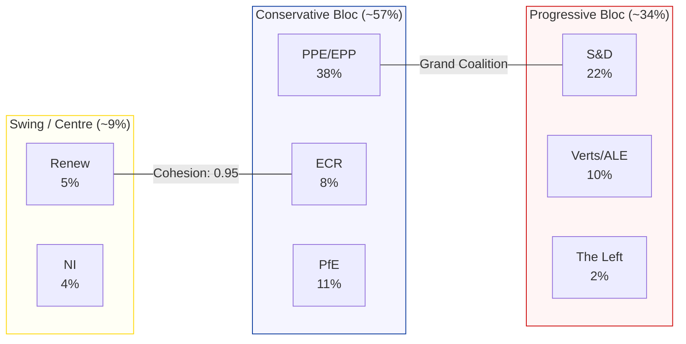

# Political Landscape Assessment — 4 April 2026

| Field | Value |
|-------|-------|
| **Assessment Date** | Saturday, 4 April 2026 |
| **Parliamentary Status** | Easter Recess (27 Mar – 13 Apr 2026) |
| **Total Active MEPs** | 737 (from MEP feed) / 720 nominal |
| **Political Groups** | 8 |
| **Countries Represented** | 23+ |
| **Fragmentation Index** | HIGH (4.4 effective parties) |

---

## Group Composition Analysis

### Seat Distribution

Based on EP Open Data Portal MEP records and political landscape analysis:

| Group | Abbreviation | Seats (Sampled) | Seat Share | Countries | Color |
|-------|-------------|----------------|-----------|-----------|-------|
| European People's Party | PPE/EPP | 38% | 38.0% | 14 | #003399 |
| Progressive Alliance of S&D | S&D | 22% | 22.0% | 12 | #CC0000 |
| Patriots for Europe | PfE | 11% | 11.0% | 5 | #1E3A5F |
| Greens/European Free Alliance | Verts/ALE | 10% | 10.0% | 7 | #009933 |
| European Conservatives and Reformists | ECR | 8% | 8.0% | 5 | #FF6600 |
| Renew Europe | Renew | 5% | 5.0% | 4 | #FFD700 |
| Non-Inscrits | NI | 4% | 4.0% | 3 | #999999 |
| The Left in the EP – GUE/NGL | The Left | 2% | 2.0% | 2 | #990000 |

> **⚠️ Data note**: The political landscape tool returns a 100-seat sample from the full EP membership. Actual seat counts differ — EPP holds approximately 188 seats, S&D approximately 136, etc. Percentages are indicative of proportional strength. 🟡 Medium confidence.

### Bloc Analysis

### Power Dynamics Summary

| Coalition Scenario | Combined Share | Viability | Notes |
|--------------------|---------------|-----------|-------|
| Grand Coalition (EPP + S&D) | ~60% | ✅ Viable | Exceeds simple majority; historically most common |
| Centre-Right (EPP + ECR + PfE) | ~57% | ✅ Viable | Approaching qualified majority; defence/trade alignment |
| Progressive (S&D + Greens + Left + Renew) | ~39% | ❌ Insufficient | Below majority threshold; blocking minority possible |
| Broad Centre (EPP + S&D + Renew) | ~65% | ✅ Strong | Comfortable super-majority; policy continuity coalition |
| Right-Wing (ECR + PfE + NI) | ~23% | ❌ Insufficient | Blocking minority only; fragmented |

---

## Structural Assessment

### Fragmentation

The European Parliament's 10th term shows HIGH fragmentation with 8 political groups and an effective number of parties of 4.4. This means:

- **No single group commands a majority** — multi-group coalitions are required for all legislative acts 🟢 High confidence
- **PPE's structural dominance** is the defining feature — at 38%, it is the necessary anchor for any majority coalition 🟢 High confidence
- **The centrist "kingmaker" space** has shifted — Renew Europe (5%) has significantly fewer seats than in EP9, reducing its pivoting power 🟡 Medium confidence
- **PfE emergence** as the third-largest force (11%) reconfigures the right flank, creating a three-way conservative competition (EPP vs ECR vs PfE) 🟡 Medium confidence

### PPE Dominance Risk (Early Warning: HIGH)

The early warning system flags PPE's dominance ratio at 19:1 versus the smallest group. This structural imbalance:

- **Concentrates agenda-setting power** in a single group, particularly in committee chair and rapporteur assignments
- **Creates dependency dynamics** where smaller groups must align with PPE priorities to have legislative impact
- **Is partially mitigated** by the EP's proportional representation system for committee positions and speaking time allocation

> **Assessment**: PPE dominance is a structural feature, not an acute threat. It becomes a democratic concern if PPE leverages its position to systematically exclude smaller groups from co-decision roles. 🟡 Medium confidence

### Small Group Quorum Risk (Early Warning: LOW)

Three groups (Renew, NI, The Left) with ≤5% of sampled seats face potential quorum challenges:

- **Renew (5%)**: Declining from EP9 strength; risk of further erosion through defections to EPP or ECR
- **NI (4%)**: Structurally vulnerable — non-attached status limits committee access and speaking time
- **The Left (2%)**: Smallest group; dependent on national delegation cohesion

---

## Trend Analysis

### EP10 vs EP9 Trajectory

| Dimension | EP9 (2019-2024) | EP10 (2024-present) | Trend |
|-----------|-----------------|---------------------|-------|
| Effective parties | ~5.2 | 4.4 | ↘ Consolidating |
| Largest group share | ~26% (EPP) | ~38% (PPE) | ↑ More dominant |
| Grand coalition share | ~46% | ~60% | ↑ More viable |
| Far-right representation | ~8% (ID) | ~19% (ECR+PfE) | ↑ Significant growth |
| Green representation | ~10% | ~10% | → Stable |
| Liberal centre | ~14% (Renew) | ~5% (Renew) | ↘ Sharp decline |

> **Key shift**: The 10th Parliament is structurally more conservative and more concentrated than the 9th, with the liberal centre significantly weakened and the far-right/nationalist bloc nearly doubled. This has profound implications for policy direction on migration, trade, and regulation. 🟢 High confidence

---

## Forward-Looking Indicators

### Factors to Monitor (April 2026)

1. **Renew-ECR convergence signal** (cohesion 0.95) — If sustained during April plenary votes, indicates a durable centrist-right legislative axis bypassing PPE 🟡 Medium confidence
2. **PPE-PfE proximity** — Watch for formal or informal voting coordination on migration and security dossiers; would signal a rightward shift in mainstream conservative positioning 🟡 Medium confidence
3. **S&D isolation risk** — If progressive bloc remains at ~34%, S&D must choose between grand coalition compromise and opposition purity 🟢 High confidence
4. **Defence coalition composition** — The March defence package was adopted; implementation debates will reveal which groups form the durable defence policy coalition 🟡 Medium confidence

---

*Sources: EP Open Data Portal (data.europarl.europa.eu), EP analytical tools, EP precomputed statistics 2004–2026*
*Assessment date: 4 April 2026 | Analyst: EU Parliament Monitor AI*
