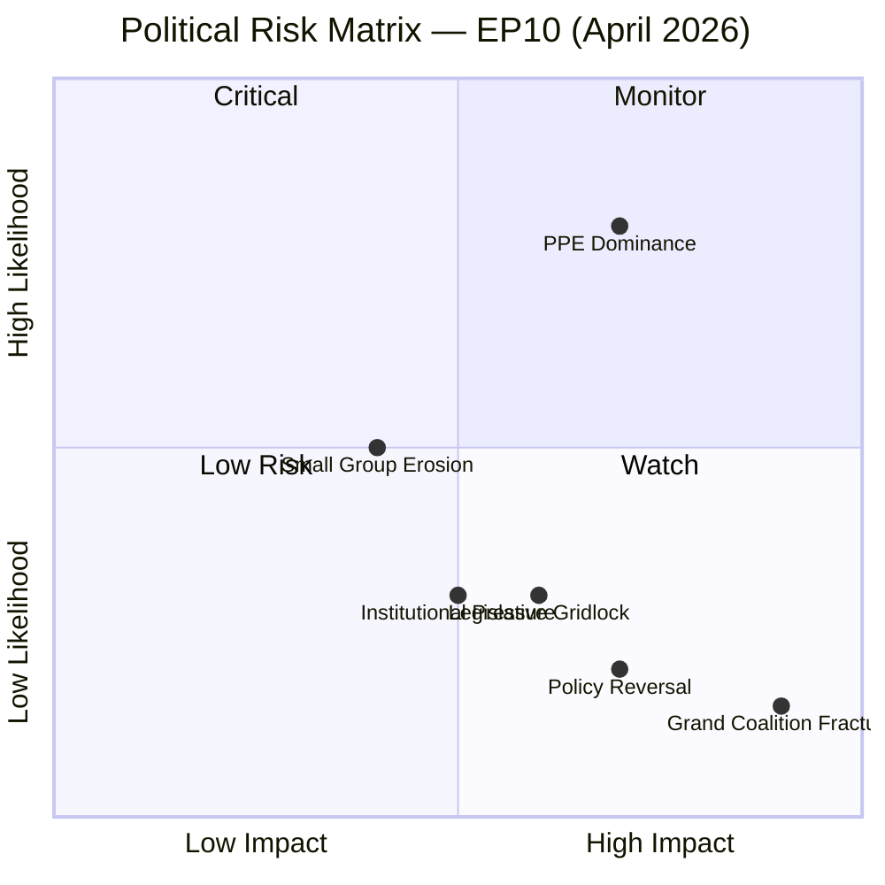
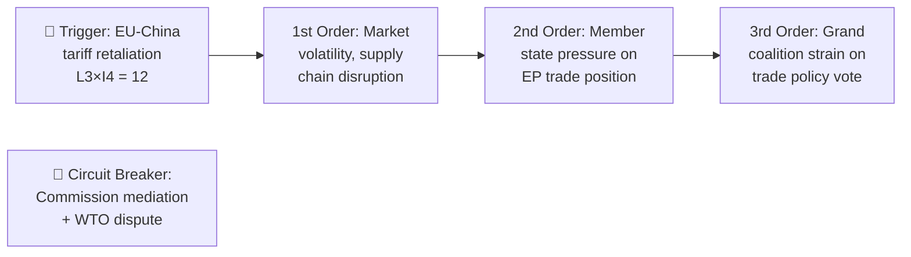
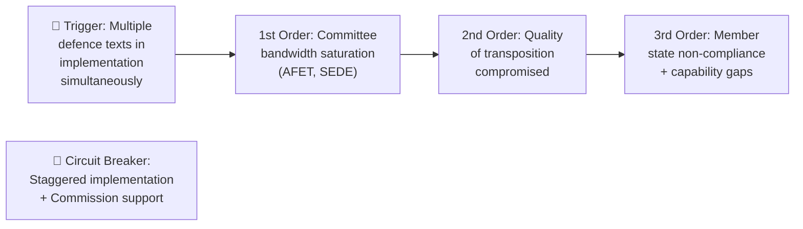

# Risk Assessment — 4 April 2026

| Field | Value |
|-------|-------|
| **Assessment Date** | Saturday, 4 April 2026 |
| **Risk Framework** | 5×5 Likelihood × Impact Matrix |
| **Overall Risk Level** | 🟡 MEDIUM (Weighted Score: 7.2/25) |
| **Stability Score** | 84/100 |
| **Risk Trend** | → Stable (no material changes from prior assessment) |

---

## Risk Matrix Summary

## Detailed Risk Scores

### 1. Grand Coalition Stability (Weight: 0.30)

| Factor | Likelihood | Impact | Score | Level |
|--------|-----------|--------|-------|-------|
| EPP-S&D split on defence spending | 2 | 4 | 8 | 🟡 MEDIUM |
| EPP-S&D split on migration policy | 3 | 4 | 12 | 🟠 HIGH |
| Grand coalition failure on budget | 1 | 5 | 5 | 🟡 MEDIUM |
| **Weighted category score** | | | **7.5** | **🟡 MEDIUM** |

**Evidence**: Grand coalition holds ~60% of seats (EP political landscape data). March 2026 session showed functional coalition — DGSD2 (TA-10-2026-0090) and insolvency harmonisation (TA-10-2026-0057) both adopted, requiring cross-group support. Migration remains the primary fault line (established pattern from EP9). 🟡 Medium confidence

**Bayesian update**: No new evidence since last assessment. Prior estimate maintained.

### 2. Policy Implementation (Weight: 0.25)

| Factor | Likelihood | Impact | Score | Level |
|--------|-----------|--------|-------|-------|
| Regulatory delay on AI Convention implementation | 3 | 3 | 9 | 🟡 MEDIUM |
| Defence package implementation gaps | 2 | 4 | 8 | 🟡 MEDIUM |
| DGSD2 transposition challenges | 3 | 3 | 9 | 🟡 MEDIUM |
| **Weighted category score** | | | **8.7** | **🟡 MEDIUM** |

**Evidence**: Multiple high-impact texts adopted in March 2026 now enter implementation phase — CoE AI Convention (TA-10-2026-0071), defence single market (TA-10-2026-0079), flagship defence projects (TA-10-2026-0080), DGSD2 (TA-10-2026-0090). Implementation risk elevated by volume of concurrent directives. 🟡 Medium confidence

### 3. Economic Governance (Weight: 0.20)

| Factor | Likelihood | Impact | Score | Level |
|--------|-----------|--------|-------|-------|
| EU-China tariff retaliation escalation | 3 | 4 | 12 | 🟠 HIGH |
| Budget procedure delays (2026/0001, 0004) | 2 | 3 | 6 | 🟡 MEDIUM |
| MFF revision pressure | 2 | 4 | 8 | 🟡 MEDIUM |
| **Weighted category score** | | | **8.7** | **🟡 MEDIUM** |

**Evidence**: EU-China tariff modifications (TA-10-2026-0101) adopted March 26 — schedule CLXXV adjustments indicate active trade recalibration. MFF amendment (TA-10-2026-0037) adopted February 11 for 2021–2027 period. Multiple BUD procedures filed for 2026. 🟡 Medium confidence

### 4. Institutional Integrity (Weight: 0.15)

| Factor | Likelihood | Impact | Score | Level |
|--------|-----------|--------|-------|-------|
| EP-Commission Framework Agreement tensions | 2 | 3 | 6 | 🟡 MEDIUM |
| EPPO capacity constraints | 2 | 3 | 6 | 🟡 MEDIUM |
| Transparency/access to documents disputes | 2 | 2 | 4 | 🟢 LOW |
| **Weighted category score** | | | **5.3** | **🟡 MEDIUM** |

**Evidence**: New EP-Commission Framework Agreement adopted (TA-10-2026-0069) March 11 — redefines inter-institutional power balance. European Chief Prosecutor appointed (TA-10-2026-0062) March 10 — strengthens rule of law infrastructure. Public access report (TA-10-2026-0065) adopted — transparency monitoring ongoing. 🟢 High confidence

### 5. Social Cohesion (Weight: 0.05)

| Factor | Likelihood | Impact | Score | Level |
|--------|-----------|--------|-------|-------|
| Just transition backlash | 2 | 3 | 6 | 🟡 MEDIUM |
| EU Talent Pool political resistance | 3 | 2 | 6 | 🟡 MEDIUM |
| **Weighted category score** | | | **6.0** | **🟡 MEDIUM** |

**Evidence**: Just Transition Directive (TA-10-2026-0003) adopted January 20. EU Talent Pool (TA-10-2026-0058) adopted March 10. Both face national implementation challenges. 🟡 Medium confidence

### 6. Geopolitical Standing (Weight: 0.05)

| Factor | Likelihood | Impact | Score | Level |
|--------|-----------|--------|-------|-------|
| Ukraine support loan political fatigue | 2 | 4 | 8 | 🟡 MEDIUM |
| Enlargement strategy setbacks | 2 | 3 | 6 | 🟡 MEDIUM |
| Global Gateway effectiveness questions | 3 | 2 | 6 | 🟡 MEDIUM |
| **Weighted category score** | | | **6.7** | **🟡 MEDIUM** |

**Evidence**: Ukraine support loan 2026-2027 (TA-10-2026-0035) adopted February 11. Four-year Ukraine war resolution (TA-10-2026-0056) adopted February 24. EU enlargement strategy (TA-10-2026-0077) adopted March 11. Global Gateway assessment (TA-10-2026-0104) adopted March 26. 🟢 High confidence on data; 🟡 Medium confidence on risk trajectories.

---

## Aggregated Risk Score

| Category | Weight | Score | Weighted |
|----------|--------|-------|----------|
| Grand Coalition Stability | 0.30 | 7.5 | 2.25 |
| Policy Implementation | 0.25 | 8.7 | 2.18 |
| Economic Governance | 0.20 | 8.7 | 1.74 |
| Institutional Integrity | 0.15 | 5.3 | 0.80 |
| Social Cohesion | 0.05 | 6.0 | 0.30 |
| Geopolitical Standing | 0.05 | 6.7 | 0.34 |
| **TOTAL** | **1.00** | | **7.60** |

**Overall: 🟡 MEDIUM RISK (7.60/25)**

---

## Risk Trend Indicators

| Risk Category | Prior (3 Apr) | Current (4 Apr) | Trend |
|--------------|--------------|-----------------|-------|
| Grand Coalition | 🟡 MEDIUM | 🟡 MEDIUM | → Stable |
| Policy Implementation | 🟡 MEDIUM | 🟡 MEDIUM | → Stable |
| Economic Governance | 🟡 MEDIUM | 🟡 MEDIUM | → Stable |
| Institutional Integrity | 🟡 MEDIUM | 🟡 MEDIUM | → Stable |
| Social Cohesion | 🟡 MEDIUM | 🟡 MEDIUM | → Stable |
| Geopolitical Standing | 🟡 MEDIUM | 🟡 MEDIUM | → Stable |

> **Assessment**: No material risk changes during Easter recess Saturday. All categories stable. The next risk inflection point is the April committee week (14–17 April) when preparatory work for the April plenary begins. 🟢 High confidence

---

## Cascading Risk Analysis

### Primary Risk Chain: EU-China Trade Escalation

### Secondary Risk Chain: Defence Implementation Overload

---

*Sources: EP analytical tools (early_warning_system, detect_voting_anomalies), EP Open Data Portal (adopted texts 2026), EP precomputed statistics*
*Assessment date: 4 April 2026 | Analyst: EU Parliament Monitor AI*
