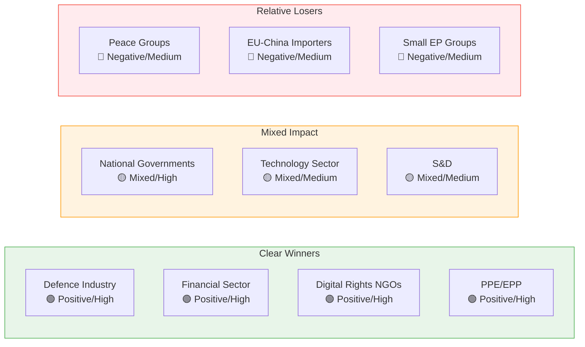

# Stakeholder Impact Assessment — 4 April 2026

| Field | Value |
|-------|-------|
| **Assessment Date** | Saturday, 4 April 2026 |
| **Scope** | Impact of March 2026 legislative output on 6 stakeholder categories |
| **Key Dossiers Analyzed** | DGSD2, AI Convention, Defence Package, EU-China Tariffs, Global Gateway |

---

## Stakeholder Impact Matrix

### Summary Grid

| Stakeholder | DGSD2 (TA-0090) | AI Convention (TA-0071) | Defence Package (TA-0079/0080) | EU-China Tariffs (TA-0101) | Global Gateway (TA-0104) |
|------------|------------------|------------------------|-------------------------------|---------------------------|--------------------------|
| EP Political Groups | Mixed/Medium | Positive/High | Mixed/High | Mixed/Medium | Positive/Low |
| Civil Society & NGOs | Positive/Medium | Positive/High | Neutral/Low | Neutral/Low | Positive/Medium |
| Industry & Business | Positive/High | Mixed/Medium | Positive/High | Negative/High | Positive/Medium |
| National Governments | Mixed/High | Positive/Medium | Mixed/High | Mixed/High | Neutral/Low |
| EU Citizens | Positive/Medium | Positive/High | Neutral/Medium | Mixed/Medium | Positive/Low |
| EU Institutions | Positive/High | Positive/High | Positive/Medium | Mixed/Medium | Positive/Medium |

---

## Detailed Stakeholder Analysis

### 1. EP Political Groups

**Impact Direction**: Mixed | **Severity**: High

The March 2026 legislative output reinforced the grand coalition model while exposing emerging fault lines:

- **PPE/EPP**: Net winner — all 5 key dossiers advanced with PPE support or leadership. PPE consolidates position as indispensable legislative partner. Defence package and DGSD2 align with PPE's economic competitiveness and security priorities. 🟢 High confidence
- **S&D**: Partial winner — Just transition, social dimension of European Semester, and DGSD2 consumer protection align with S&D priorities. Defence spending acceleration and EU-China trade recalibration create internal tensions between pro-trade and protectionist wings. 🟡 Medium confidence
- **ECR**: Strategic positioning — Defence integration texts align with ECR's security emphasis but single market integration aspects create sovereignty tension. EU-China tariff modifications align with ECR's hawkish trade stance. 🟡 Medium confidence
- **Greens/EFA**: Mixed outcome — Surface water pollutant standards (TA-10-2026-0093) is a win; defence spending escalation and trade liberalisation conflict with Green priorities. 🟡 Medium confidence
- **Renew**: Relevance preservation — AI Convention and single market measures align with liberal agenda, but reduced group size limits influence on implementation details. 🟡 Medium confidence
- **PfE/The Left**: Limited direct impact — sovereignty-focused PfE resists further integration; The Left opposed defence spending acceleration. Both groups' legislative footprint is minimal in March output. 🟡 Medium confidence

### 2. Civil Society & NGOs

**Impact Direction**: Positive | **Severity**: Medium

- **Digital rights organisations**: Strong positive — CoE AI Convention (TA-10-2026-0071) establishes human rights framework for AI, addressing core advocacy demands for algorithmic accountability and transparency. NGOs gain new legal tools for challenging AI deployments that violate rights. 🟢 High confidence
- **Environmental groups**: Moderate positive — Surface water pollutant standards (TA-10-2026-0093) strengthens environmental protection. However, implementation timeline and enforcement mechanisms are the real battleground. 🟡 Medium confidence
- **Consumer protection**: Positive — DGSD2 (TA-10-2026-0090) expands deposit guarantee coverage and cross-border cooperation, directly protecting consumers in banking crises. Package travel reform (TA-10-2026-0085) also strengthens traveller rights. 🟢 High confidence
- **Peace and anti-militarism organisations**: Negative — Defence package (TA-10-2026-0079/0080) represents a qualitative shift toward EU defence integration that these groups oppose. 🟡 Medium confidence

### 3. Industry & Business

**Impact Direction**: Mixed | **Severity**: High

- **Financial sector**: Strong positive from DGSD2 — harmonised deposit protection framework and cross-border cooperation reduce compliance fragmentation. EBA appointment (TA-10-2026-0061) provides supervisory continuity. Insolvency harmonisation (TA-10-2026-0057) reduces cross-border uncertainty. However, new requirements impose compliance costs. 🟢 High confidence
- **Defence industry**: Major positive — Defence single market (TA-10-2026-0079) and flagship projects (TA-10-2026-0080) create new procurement opportunities, joint development frameworks, and EU-level funding streams. Estimated market expansion potential is significant. 🟡 Medium confidence
- **Technology sector**: Mixed — AI Convention creates regulatory certainty but imposes human rights obligations on AI deployment. The "28th Regime" (TA-10-2026-0002) for innovative companies adopted in January provides regulatory sandbox benefits. 🟡 Medium confidence
- **Agricultural sector**: Moderate impact — Wine sector amendments (TA-10-2026-0028) and agri-food enforcement cooperation (TA-10-2026-0048) adjust regulatory burden. EU-China tariff modifications (TA-10-2026-0101) may affect agricultural trade flows. 🟡 Medium confidence
- **Importers/exporters**: Negative risk from EU-China tariff modifications — Schedule CLXXV changes signal potential trade friction that could disrupt established supply chains. 🟡 Medium confidence

### 4. National Governments

**Impact Direction**: Mixed | **Severity**: High

- **Fiscally conservative members (e.g., Netherlands, Finland, Austria)**: Concern over MFF amendment (TA-10-2026-0037) expanding multiannual budget. Ukraine support loan (TA-10-2026-0035) adds fiscal commitments. DGSD2 cross-border mechanisms may create asymmetric fiscal exposures. 🟡 Medium confidence
- **Defence-oriented members (e.g., Poland, Baltic states, France)**: Strong positive from defence package — validates their security investment arguments and creates EU co-financing mechanisms. 🟢 High confidence
- **Trade-dependent members (e.g., Germany, Netherlands)**: Cautious on EU-China tariff modifications — risk of retaliation affecting export-dependent economies. 🟡 Medium confidence
- **Candidate countries (Albania, others)**: Positive signals from enlargement strategy (TA-10-2026-0077) and Albania accession text (TA-10-2026-0055). 🟢 High confidence

### 5. EU Citizens

**Impact Direction**: Positive | **Severity**: Medium

- **Depositors**: Direct protection from DGSD2 — enhanced deposit guarantee scope, improved cross-border transfer of protection when banks fail. Concrete consumer benefit. 🟢 High confidence
- **Job seekers**: EU Talent Pool (TA-10-2026-0058) creates new mobility framework for matching skills with opportunities across member states. Just transition directive (TA-10-2026-0003) supports workers in transitioning industries. 🟡 Medium confidence
- **Travellers**: Package travel reform (TA-10-2026-0085) improves insolvency protection and simplifies complaint procedures. 🟢 High confidence
- **Residents near water bodies**: Surface water pollutant standards (TA-10-2026-0093) strengthens drinking water and ecosystem protection. 🟡 Medium confidence
- **AI users**: CoE AI Convention establishes rights framework but practical impact depends on implementation and enforcement mechanisms. 🟡 Medium confidence

### 6. EU Institutions

**Impact Direction**: Positive | **Severity**: Medium

- **European Commission**: Strengthened through new Framework Agreement (TA-10-2026-0069) — redefines EP-Commission working relationship. EPPO appointment (TA-10-2026-0062) enhances prosecutorial independence under Commission oversight framework. 🟢 High confidence
- **Council of the EU**: Trade policy coordination intensifies with EU-China tariff modifications. Defence package requires Council-EP cooperation on implementation acts. 🟡 Medium confidence
- **European Banking Authority**: New chairperson (TA-10-2026-0061) confirmed — institutional continuity assured. DGSD2 implementation will expand EBA's supervisory coordination role. 🟢 High confidence
- **European Public Prosecutor's Office**: New chief prosecutor (TA-10-2026-0062) appointed — signals commitment to cross-border criminal justice. 🟢 High confidence
- **European Court of Justice**: Insolvency harmonisation (TA-10-2026-0057) may reduce preliminary reference caseload by harmonising divergent national rules. 🟡 Medium confidence

---

## Impact Heatmap

---

*Sources: EP Open Data Portal (adopted texts 2026, procedures, MEP records), EP analytical tools*
*Assessment date: 4 April 2026 | Analyst: EU Parliament Monitor AI*
