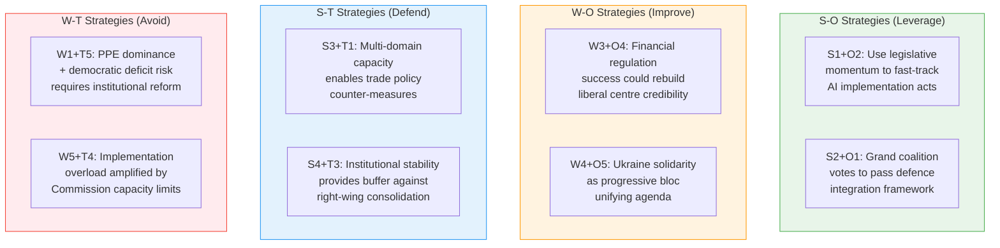

# SWOT Analysis — European Parliament, 4 April 2026

| Field | Value |
|-------|-------|
| **Assessment Date** | Saturday, 4 April 2026 |
| **Scope** | EP10 Institutional & Legislative Assessment |
| **Evidence Standard** | All entries require EP document reference or MCP tool output |
| **Confidence Decay** | Entries valid for 90 days at current confidence level |

---

## SWOT Matrix

### Strengths

| # | Strength | Evidence | Confidence | Impact |
|---|----------|----------|-----------|--------|
| S1 | **Accelerated legislative output** — 114 legislative acts adopted in Q1 2026 vs. 78 for all of 2025 | EP precomputed stats: 2026 acts=114, 2025 acts=78 | 🟢 HIGH | HIGH |
| S2 | **Grand coalition viability** — EPP + S&D combined hold ~60% of seats, exceeding simple majority | EP political landscape: grand coalition size = 60% | 🟢 HIGH | HIGH |
| S3 | **Multi-domain legislative capacity** — simultaneous progress on defence (TA-10-2026-0079/0080), finance (TA-10-2026-0090), digital (TA-10-2026-0071), trade (TA-10-2026-0101) | EP adopted texts March 2026 | 🟢 HIGH | HIGH |
| S4 | **Institutional stability** — stability score 84/100, voting anomaly risk LOW, no detected intra-group defections | EP early warning: stability=84; EP voting anomalies: anomalies=0 | 🟡 MEDIUM | MEDIUM |
| S5 | **Key institutional appointments completed** — EBA Chair (TA-10-2026-0061) and European Chief Prosecutor (TA-10-2026-0062) confirmed | EP adopted texts 10 March 2026 | 🟢 HIGH | MEDIUM |

### Weaknesses

| # | Weakness | Evidence | Confidence | Impact |
|---|----------|----------|-----------|--------|
| W1 | **PPE dominance imbalance** — 38% seat share creates 19:1 ratio vs smallest group, flagged HIGH severity by early warning | EP early warning: DOMINANT_GROUP_RISK severity=HIGH | 🟢 HIGH | HIGH |
| W2 | **EP API data availability gaps** — 6 of 8 feed endpoints returned 404 errors, limiting real-time monitoring | Feed query results: 6/8 feeds 404 | 🟢 HIGH | MEDIUM |
| W3 | **Liberal centre erosion** — Renew at ~5% (down from ~14% in EP9) reduces centrist balancing capacity | EP political landscape: Renew=5% | 🟡 MEDIUM | MEDIUM |
| W4 | **Progressive bloc insufficiency** — S&D + Greens + Left at ~34%, below majority threshold | EP political landscape: progressive bloc = 34% | 🟡 MEDIUM | HIGH |
| W5 | **Implementation bandwidth risk** — 80+ adopted texts in 2026 Q1 create concurrent transposition burden | EP adopted texts: 80+ texts year-to-date | 🟡 MEDIUM | MEDIUM |

### Opportunities

| # | Opportunity | Evidence | Confidence | Impact |
|---|------------|----------|-----------|--------|
| O1 | **Defence integration momentum** — Multiple defence texts adopted, creating political capital for deeper EU defence cooperation | TA-10-2026-0040, 0079, 0080 (defence texts adopted) | 🟡 MEDIUM | HIGH |
| O2 | **AI governance leadership** — CoE AI Convention adoption positions EU as global standard-setter | TA-10-2026-0071 (AI Convention adopted 11 March 2026) | 🟢 HIGH | HIGH |
| O3 | **Enlargement strategy advancement** — EU enlargement text adopted, signalling political will for Western Balkans accession progress | TA-10-2026-0077 (enlargement strategy adopted 11 March 2026) | 🟡 MEDIUM | MEDIUM |
| O4 | **Financial architecture strengthening** — DGSD2 completion strengthens Banking Union; insolvency harmonisation deepens single market | TA-10-2026-0090, 0057 (adopted March 2026) | 🟢 HIGH | HIGH |
| O5 | **Ukraine support renewal** — Support loan 2026-2027 adopted with cross-party backing, demonstrating sustained solidarity | TA-10-2026-0035 (Ukraine loan adopted 11 February 2026) | 🟢 HIGH | MEDIUM |

### Threats

| # | Threat | Evidence | Confidence | Impact |
|---|--------|----------|-----------|--------|
| T1 | **EU-China trade escalation** — Tariff rate quota modifications signal active recalibration amid bilateral tensions | TA-10-2026-0101 (EU-China tariff text adopted 26 March 2026) | 🟡 MEDIUM | HIGH |
| T2 | **Small group quorum erosion** — 3 groups with ≤5% seats risk legislative irrelevance if defections occur | EP early warning: SMALL_GROUP_QUORUM_RISK | 🟡 MEDIUM | MEDIUM |
| T3 | **Right-wing bloc consolidation** — ECR + PfE combined at ~19%, approaching PPE as partner-of-choice for conservative majority | EP political landscape: ECR=8%, PfE=11% | 🟡 MEDIUM | HIGH |
| T4 | **Implementation fatigue** — Volume of concurrent directives (defence, finance, digital, environment) may strain Commission and member state capacity | 80+ adopted texts 2026 Q1 (EP precomputed stats) | 🟡 MEDIUM | MEDIUM |
| T5 | **Democratic representation concerns** — PPE dominance ratio + liberal decline reduces legislative diversity and plural voice representation | EP early warning: dominance ratio 19:1; Renew decline | 🟡 MEDIUM | HIGH |

---

## SWOT Intersection Analysis

---

## TOWS Strategic Options Matrix

### SO Strategy: Capitalise on legislative momentum for defence and digital leadership

**Action**: Use the functional grand coalition (S2) and accelerated legislative output (S1) to push through ambitious AI implementation regulations (O2) and defence integration measures (O1) during the April plenary.

**Evidence**: March 2026 showed both defence texts (TA-10-2026-0079/0080) and the AI Convention (TA-10-2026-0071) receiving sufficient cross-group support for adoption. 🟡 Medium confidence on sustainability of this coalition for implementation acts.

### WT Strategy: Address implementation overload before it becomes institutional crisis

**Action**: Prioritise and sequence the implementation of 80+ adopted texts (W5) to prevent transposition delays (T4). The Commission should focus on the highest-impact dossiers (DGSD2, AI Convention, defence package) while phasing lower-priority items.

**Evidence**: Historical pattern from EP9 shows that concentrated legislative bursts followed by implementation bottlenecks lead to infringement proceedings and political friction. The Q1 2026 output (114 acts vs. 78 in all of 2025) represents an unprecedented volume for the term. 🟡 Medium confidence

---

## Confidence & Validity

| Entry | Evidence Age | Current Confidence | Decays to MEDIUM | Decays to LOW |
|-------|-------------|-------------------|-------------------|---------------|
| S1-S5 | ≤14 days | 🟢/🟡 | 4 July 2026 | 2 October 2026 |
| W1-W5 | ≤14 days | 🟢/🟡 | 4 July 2026 | 2 October 2026 |
| O1-O5 | ≤14 days | 🟢/🟡 | 4 July 2026 | 2 October 2026 |
| T1-T5 | ≤14 days | 🟡 | 4 July 2026 | 2 October 2026 |

---

*Sources: EP Open Data Portal (adopted texts, MEP records), EP analytical tools (political landscape, early warning, voting anomalies), EP precomputed statistics 2004–2026*
*Assessment date: 4 April 2026 | Analyst: EU Parliament Monitor AI*
