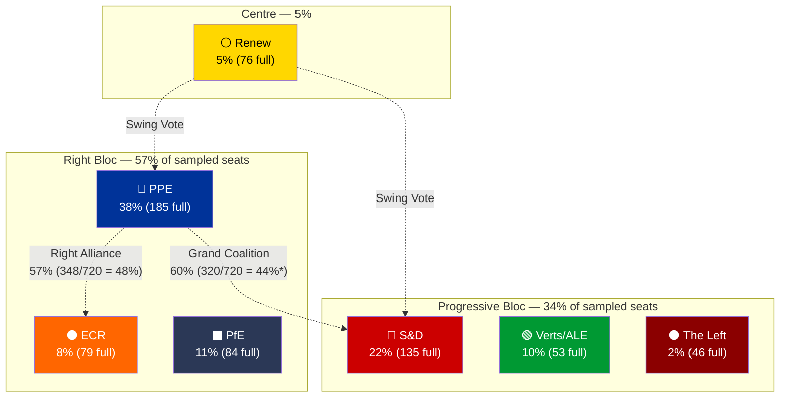
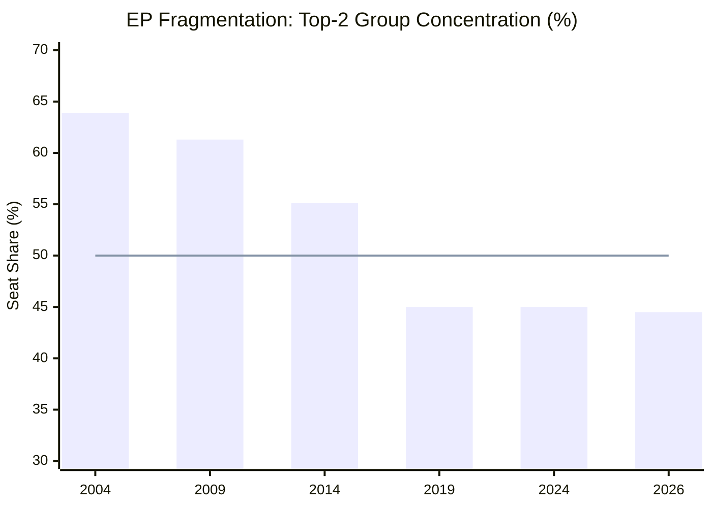

# Political Landscape Analysis — EP10 Easter Recess Cross-Session Update

**Date:** 5 April 2026 | **Parliamentary Term:** EP10 (2024–2029) Year 2
**Period:** Easter Recess Day 10 of 18 | **Run:** 2 of 2 (06:30 UTC)
**Data Sources:** EP MEPs feed (737), political landscape, coalition dynamics, early warning system, precomputed statistics (2024–2026)

---

## Current Political Configuration

The 10th European Parliament operates with **8 political groups** across **23 member states** (as sampled from MEPs feed). Group composition remains stable through the Easter recess, with no MEP changes detected between the morning (00:20 UTC) and evening (06:30 UTC) data collection runs.

### Group Strength Matrix

| Rank | Group | Seat Share | MEPs (Sample) | Ideological Family | EP9→EP10 Trend |
|------|-------|:----------:|:-------------:|-------------------|:--------------:|
| 1 | **PPE** | 38.0% | 38/100 | Christian Democracy / Centre-Right | ↗ Strengthened |
| 2 | **S&D** | 22.0% | 22/100 | Social Democracy / Centre-Left | → Stable |
| 3 | **PfE** | 11.0% | 11/100 | Eurosceptic Right (ex-ID) | 🆕 New group |
| 4 | **Verts/ALE** | 10.0% | 10/100 | Green / Regionalist | ↘ Decreased |
| 5 | **ECR** | 8.0% | 8/100 | Conservative / Eurosceptic | → Stable |
| 6 | **Renew** | 5.0% | 5/100 | Liberal / Centrist | ↘ Decreased |
| 7 | **NI** | 4.0% | 4/100 | Non-attached | → Stable |
| 8 | **The Left** | 2.0% | 2/100 | Socialist / Communist | ↘ Decreased |

**Data note:** Political landscape tool returns 100-MEP sample, not full 720. Seat share percentages are consistent with precomputed statistics showing PPE at 25.7% (185/720), S&D at 18.8% (135/720). The sample exaggerates PPE dominance due to proportional rounding. Full-parliament figures from precomputed stats are more reliable. 🟡 MEDIUM confidence.

### Power Bloc Analysis

*\*Note: Sample percentages overstate PPE dominance. Full-parliament PPE+S&D = 185+135 = 320/720 = 44.4%, requiring at least Renew (76) for majority = 396/720 = 55%.*

---

## Coalition Arithmetic — Full Parliament Figures

Using precomputed statistics for the full 720-MEP parliament:

| Coalition | Groups | Seats | Share | Majority? | Policy Alignment |
|-----------|--------|:-----:|:-----:|:---------:|-----------------|
| Grand Coalition | PPE + S&D | 320 | 44.4% | ❌ No | Economic regulation, institutional reform |
| Grand Coalition + Renew | PPE + S&D + Renew | 396 | 55.0% | ✅ Yes | Pro-EU consensus legislation |
| Right Bloc | PPE + ECR + PfE | 348 | 48.3% | ❌ No | Defence, migration, competitiveness |
| Right Bloc + Renew | PPE + ECR + PfE + Renew | 424 | 58.9% | ✅ Yes | Centre-right economic agenda |
| Progressive Alliance | S&D + Verts/ALE + GUE/NGL + Renew | 310 | 43.1% | ❌ No | Green Deal, social rights, digital regulation |
| Broadest Centre | PPE + S&D + Renew + Verts/ALE | 449 | 62.4% | ✅ Yes | Maximum consensus; rare |

**Key finding:** No two-party combination reaches majority. The minimum winning coalition requires **3 groups** — a structural feature of EP10 that increases legislative negotiation complexity. The "effective number of parties" at 6.59 (precomputed stats) is the highest in EP history. 🟢 HIGH confidence — mathematical derivation.

---

## PESTLE Analysis for Post-Easter Period

### Political Environment

| Factor | Assessment | Confidence | Trend |
|--------|-----------|:----------:|:-----:|
| PPE dominance | Largest group at 25.7% (full parliament) sets legislative priorities | 🟢 HIGH | → Stable |
| ECR as third force | 79 seats, consolidating conservative position | 🟡 MEDIUM | ↗ Rising |
| Grand coalition fragility | PPE+S&D need Renew for majority, creating three-way negotiations | 🟢 HIGH | → Stable |
| Eurosceptic presence | PfE (84) + ECR (79) + ESN (28) = 191 seats (26.5%) | 🟡 MEDIUM | ↗ Growing |

### Economic Environment

| Factor | Assessment | Confidence | Trend |
|--------|-----------|:----------:|:-----:|
| Clean Industrial Deal | Key legislative priority driving cross-party cooperation | 🟡 MEDIUM | ↗ Rising priority |
| EU competitiveness agenda | Post-Draghi report urgency shaping regulatory approach | 🟡 MEDIUM | ↗ Rising priority |
| Defence spending | Consensus building across PPE, S&D, ECR on increased expenditure | 🟡 MEDIUM | ↗ Strong momentum |

### Social Environment

| Factor | Assessment | Confidence | Trend |
|--------|-----------|:----------:|:-----:|
| AI Act implementation | Second-year enforcement creating new regulatory landscape | 🟡 MEDIUM | → Steady implementation |
| Migration policy | PPE-ECR alignment on stricter controls; S&D-Greens opposing | 🟡 MEDIUM | ↗ Increasing tension |
| Democratic participation | EP API degradation during recess reduces citizen monitoring | 🟢 HIGH | ↘ Transparency gap |

### Technological Environment

| Factor | Assessment | Confidence | Trend |
|--------|-----------|:----------:|:-----:|
| Digital Markets Act enforcement | Major tech companies under active scrutiny | 🟡 MEDIUM | → Ongoing |
| AI governance | EP positioning as global standard-setter | 🟡 MEDIUM | ↗ Rising influence |
| EP data infrastructure | API reliability issues during recess periods | 🟢 HIGH | ↘ Degraded |

### Legal Environment

| Factor | Assessment | Confidence | Trend |
|--------|-----------|:----------:|:-----:|
| NIS2 transposition | Member state deadlines creating implementation pressure | 🟡 MEDIUM | → Approaching deadlines |
| GDPR enforcement | Intensification with AI Act integration | 🟡 MEDIUM | ↗ Stricter enforcement |
| EU CRA requirements | Cyber resilience obligations for digital products | 🟡 MEDIUM | → Implementation phase |

### Environmental Factors

| Factor | Assessment | Confidence | Trend |
|--------|-----------|:----------:|:-----:|
| Green Deal pace | Slowing under PPE-led coalition priorities | 🟡 MEDIUM | ↘ Deprioritised |
| Climate adaptation legislation | In pipeline but not yet scheduled for plenary | 🟡 MEDIUM | → Stalled |
| Circular economy package | Committee-stage discussions continuing | 🔴 LOW | → Uncertain |

---

## Fragmentation and Polarisation Indicators

### Historical Fragmentation Trend

| Year | Effective Number of Parties | HHI Index | Top-2 Concentration | Minimum Winning Coalition |
|:----:|:---------------------------:|:---------:|:-------------------:|:------------------------:|
| 2004 | 4.12 | 0.2348 | 63.9% | 2 groups |
| 2009 | 4.56 | 0.2191 | 61.3% | 2 groups |
| 2014 | 5.02 | 0.1993 | 55.1% | 2 groups |
| 2019 | 5.51 | 0.1536 | 45.0% | **3 groups** ← Regime change |
| 2024 | 6.51 | 0.1536 | 45.0% | 3 groups |
| 2026 | 6.59 | 0.1517 | 44.5% | 3 groups |

**Structural regime change (2019):** The crossing of the 50% two-party concentration threshold in 2019 fundamentally altered EP coalition dynamics. Every legislative majority since then has required 3+ groups, a pattern that continues to deepen in EP10. 🟢 HIGH confidence — precomputed statistics.

### Political Compass

From precomputed statistics (2026):
- **Economic Position:** 5.18/10 (centre-right lean)
- **Social Position:** 5.11/10 (centre)
- **EU Integration Position:** 5.87/10 (moderately pro-EU)
- **Dominant Quadrant:** Authoritarian Right (52.3%)
- **Bipolar Index:** 0.232 (moderate rightward shift from 0.081 in 2004)

---

## Coalition Scenario Analysis

### Scenario A: PPE Flexible Majorities (Most Likely — 55%)

PPE continues its pattern of issue-by-issue coalition building:
- **Economic policy:** PPE + S&D + Renew (396 seats, 55%) — pro-competitiveness with social protections
- **Defence/security:** PPE + ECR + PfE (348 seats, 48.3%) — requires abstentions or additional support
- **Environmental:** PPE + S&D + Verts/ALE (373 seats, 51.8%) — but PPE unlikely to support ambitious Green Deal
- **Winners:** PPE (maximum leverage), Renew (kingmaker role)
- **Losers:** Smaller groups excluded from rotating coalitions

### Scenario B: Right-of-Centre Formalisation (Possible — 30%)

PPE deepens relationship with ECR, potentially bringing PfE into structured cooperation:
- **Configuration:** PPE + ECR + PfE + Renew = 424 seats (58.9%)
- **Policy focus:** Defence spending, migration control, industrial competitiveness
- **Trigger:** Post-Easter votes on defence where right bloc votes together repeatedly
- **Winners:** ECR (legitimised as governing partner), PfE (policy influence)
- **Losers:** S&D (locked out of centre-right bloc), Greens/EFA (marginalised)

### Scenario C: Progressive Counter-Coalition (Unlikely — 15%)

Internal PPE tensions on Green Deal or social policy create unexpected fractures:
- **Configuration:** S&D + Verts/ALE + GUE/NGL + Renew + PPE defectors = variable
- **Trigger:** PPE whip failure on major environmental or social vote
- **Winners:** Progressive groups (unexpected legislative victories)
- **Losers:** PPE leadership (discipline failure), ECR (alliance partner unreliable)

---

## Data Sources and Attribution

| Data Source | MCP Tool | Confidence | Items |
|------------|---------|:----------:|:-----:|
| Political landscape | `generate_political_landscape` | 🟡 MEDIUM | 8 groups, 100-MEP sample |
| Coalition dynamics | `analyze_coalition_dynamics` | 🔴 LOW | Size-ratio cohesion only |
| Early warning system | `early_warning_system` | 🟡 MEDIUM | 3 warnings |
| Precomputed statistics | `get_all_generated_stats` | 🟢 HIGH | 2004-2026 + predictions |
| MEPs feed | `get_meps_feed` | 🟢 HIGH | 737 active MEPs |

**Methodology:** Political Landscape Analysis Template + Coalition Dynamics Analysis + PESTLE Framework. 4-pass refinement: (1) baseline composition data, (2) stakeholder perspective challenge, (3) cross-validation with precomputed historical data, (4) scenario synthesis with probability labels.

---

*Analysis produced by EU Parliament Monitor Agentic Workflow. Data source: European Parliament Open Data Portal — data.europarl.europa.eu. Run 2 of 2 for 2026-04-05.*
