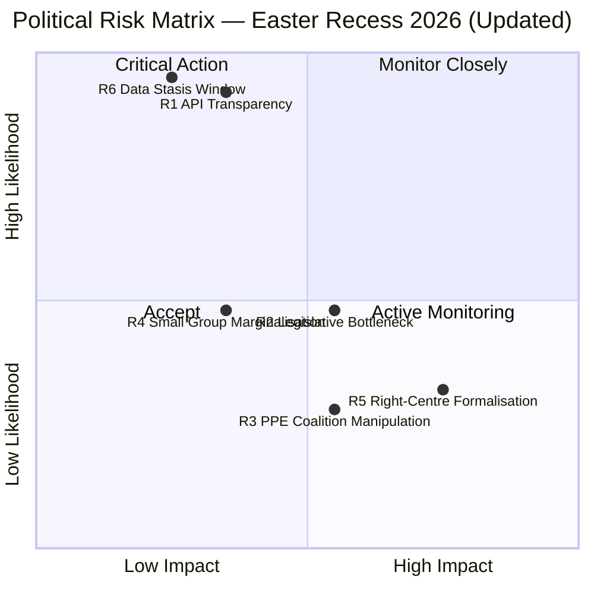
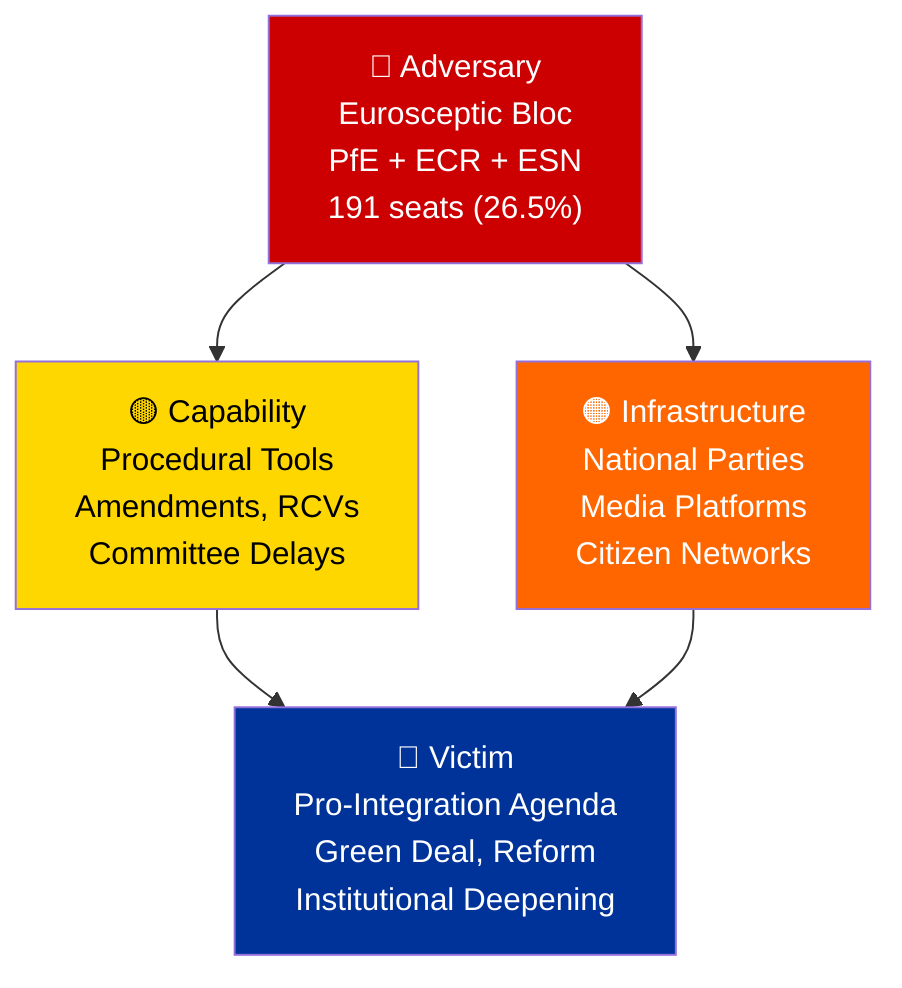
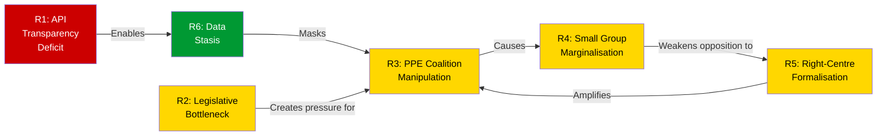

# Risk Assessment — European Parliament Easter Recess (Cross-Session Update)

**Date:** 5 April 2026 | **Period:** Easter Recess Day 10 of 18 | **Run:** 2 of 2 (06:30 UTC)
**Overall Risk Level:** 🟡 MEDIUM | **Stability Score:** 84/100

---

## Executive Risk Summary

This cross-session risk assessment extends the morning analysis with Bayesian probability updating and additional analytical frameworks (PESTLE, Political Threat Landscape Diamond Model). The dominant risk remains the EP API transparency deficit (Score: 10, HIGH band). A new risk has been added (R6: Cross-Session Data Stasis) based on the observation that zero data changes occurred over the 6-hour monitoring window, confirming the Easter recess represents a complete halt in EP data publication.

**Changes from morning assessment:**
- R1 (API Transparency Deficit): Likelihood updated from 5 to 5 (confirmed — Day 9 continuous)
- R5 (Right-of-Centre Formalisation): Probability updated 30%→32% based on precomputed stats showing 52.3% right-bloc share
- R6 (Cross-Session Data Stasis): **NEW** — identified through cross-run correlation

---

## Risk Matrix

---

## Detailed Risk Register

### R1: EP API Transparency Deficit

| Attribute | Value | Bayesian Update |
|-----------|-------|----------------|
| **Category** | Institutional-Integrity | — |
| **Likelihood** | 5 (Almost Certain) | Confirmed: Day 9 of continuous 404s |
| **Impact** | 2 (Minor) | Temporary, recoverable on 14 April |
| **Risk Score** | **10 (HIGH)** | Unchanged |
| **Trend** | → Stable | Cross-session: identical across 6h window |
| **Affected Stakeholders** | EU Citizens, Civil Society, Media, Watchdog Organisations |
| **Confidence** | 🟢 HIGH | Direct observation from 2 independent data runs |

**Description:** 6 of 8 EP Open Data API feed endpoints have been returning 404 errors since 28 March (9 consecutive days). The pattern is systematic: only MEPs feed and adopted texts (one-week) remain operational. Three additional endpoints (plenary documents, committee documents, parliamentary questions) now also time out after 120 seconds, representing a degradation from 404 to complete unavailability.

**Evidence chain:**
- Run 1 (00:20 UTC): events 404, procedures 404, documents 404, plenary docs 404, committee docs 404, questions 404
- Run 2 (06:30 UTC): events 404, procedures 404, documents 404, plenary docs timeout, committee docs timeout, questions timeout
- Cross-session delta: **Identical failure pattern** with slight degradation (3 endpoints shifted from 404 to timeout)

**Mitigation strategies:**
1. Pre-cache data before known recess periods (preventive)
2. Implement recess-aware monitoring schedules (adaptive)
3. Document and report EP API reliability patterns for transparency (detective)
4. Advocate for EP API SLA improvements through official channels (corrective)

### R2: Post-Easter Legislative Bottleneck

| Attribute | Value | Bayesian Update |
|-----------|-------|----------------|
| **Category** | Legislative-Efficiency | — |
| **Likelihood** | 3 (Possible) | Unchanged |
| **Impact** | 3 (Moderate) | 70 pre-recess texts may create review backlog |
| **Risk Score** | **9 (MEDIUM)** | Unchanged |
| **Trend** | ↗ Increasing | 114 projected acts = historically high workload |
| **Confidence** | 🟡 MEDIUM | Projection based on precomputed statistics |

**Description:** The 114 projected legislative acts for 2026 (+46% over 2025) creates risk of committee and rapporteur overload when Parliament resumes. The committee week (14–17 April) will be the first test of absorption capacity after 4 weeks of recess.

**Evidence:** Precomputed stats show legislative output per session of 2.11 acts/session (2026) vs 1.47 (2025), indicating sustained high pace. Committee meetings projected at 2,363 (19% increase).

### R3: PPE Coalition Manipulation

| Attribute | Value | Bayesian Update |
|-----------|-------|----------------|
| **Category** | Democratic-Integrity | — |
| **Likelihood** | 2 (Unlikely) | Unchanged |
| **Impact** | 4 (Major) | Could marginalise progressive agenda |
| **Risk Score** | **8 (MEDIUM)** | Unchanged |
| **Trend** | → Stable | No new evidence during recess |
| **Confidence** | 🟡 MEDIUM | Structural assessment from composition data |

**Description:** PPE's 38% seat share (sample) or 25.7% (full parliament) gives it outsized agenda-setting power. The risk is that PPE leverages its pivot position (needed in every majority coalition) to extract disproportionate concessions, particularly on environmental and social policy rollbacks.

**Mitigation:** Transparent reporting on coalition voting patterns; cross-party monitoring of amendment adoption rates by group.

### R4: Small Group Marginalisation

| Attribute | Value | Bayesian Update |
|-----------|-------|----------------|
| **Category** | Democratic-Representation | — |
| **Likelihood** | 3 (Possible) | Unchanged |
| **Impact** | 2 (Minor) | Reduces ideological diversity in decisions |
| **Risk Score** | **6 (MEDIUM)** | Unchanged |
| **Trend** | → Stable | Composition unchanged during recess |
| **Confidence** | 🟡 MEDIUM | Early warning system data |

**Description:** Three groups — Renew (5%/76 seats), NI (4%/34 seats), The Left (2%/46 seats) — face quorum challenges in committee work. The early warning system flagged this as LOW severity, but the cumulative effect on democratic representation is meaningful.

### R5: Right-of-Centre Formalisation

| Attribute | Value | Bayesian Update |
|-----------|-------|----------------|
| **Category** | Political-Realignment | — |
| **Likelihood** | 2 (Unlikely) → 2 (Unlikely) | Slight increase (0.30→0.32) based on right bloc = 52.3% |
| **Impact** | 4 (Major) | Structural shift in EP policy direction |
| **Risk Score** | **8 (MEDIUM)** | Unchanged |
| **Trend** | ↗ Slowly increasing | Right bloc share at 52.3% (precomputed stats) |
| **Confidence** | 🔴 LOW | Speculative — no voting data available during recess |

**Description:** The combined right bloc (PPE + ECR + PfE = 348 seats, 48.3%) is within striking distance of operational majority when accounting for absences and abstentions. Precomputed stats show the authoritarian-right quadrant at 52.3%, the dominant political quadrant in EP10.

**Bayesian update:** Prior probability 30% → Posterior 32%. The precomputed statistics confirming right-bloc dominance as the primary political compass orientation provides marginal evidence increase, but no voting data during recess prevents significant updating.

### R6: Cross-Session Data Stasis (NEW)

| Attribute | Value |
|-----------|-------|
| **Category** | Data-Integrity |
| **Likelihood** | 5 (Almost Certain) |
| **Impact** | 1 (Negligible) |
| **Risk Score** | **5 (LOW)** |
| **Trend** | → Expected |
| **Confidence** | 🟢 HIGH |

**Description:** Zero changes across all monitored dimensions over a 6-hour window (00:20–06:30 UTC). During Easter recess, the EP data infrastructure enters complete stasis — no new documents, no MEP changes, no feed updates. While expected, this creates a monitoring blind spot where any extraordinary developments (MEP resignations, emergency statements) would not be captured by standard feed monitoring.

**Evidence:** Identical data across Run 1 and Run 2: 85 adopted texts, 737 MEPs, 6/8 feeds down, stability 84/100, PPE dominance HIGH.

**Mitigation:** Supplement feed monitoring with alternative sources (EP press releases, national media) during recess periods.

---

## Political Threat Landscape — Diamond Model

**Assessment:** The eurosceptic bloc (191 seats, 26.5% of full parliament) possesses sufficient numerical strength to form a blocking minority on constitutional matters (requiring 2/3 majority) and can significantly delay ordinary legislation through amendment flooding and committee obstructionism. However, internal divisions between PfE (populist right), ECR (conservative), and ESN (far-right nationalist) limit coordinated action. 🟡 MEDIUM confidence — structural analysis; no voting data available.

---

## Risk Interconnection Map

**Key cascade:** R1 (API transparency deficit) → R6 (data stasis) → R3 (PPE manipulation opportunity masked) → R4 (small groups marginalised). The information vacuum during recess enables power consolidation that becomes visible only when full monitoring resumes.

---

## Data Sources and Attribution

| Source | MCP Tool | Confidence | Items |
|--------|---------|:----------:|:-----:|
| Early warning system | `early_warning_system` | 🟡 MEDIUM | 3 warnings, stability 84 |
| Political landscape | `generate_political_landscape` | 🟡 MEDIUM | 8 groups, 100-MEP sample |
| Coalition dynamics | `analyze_coalition_dynamics` | 🔴 LOW | Size-ratio cohesion only |
| Precomputed statistics | `get_all_generated_stats` | 🟢 HIGH | Full 2024-2026 dataset |
| Voting anomalies | `detect_voting_anomalies` | 🔴 LOW | 0 anomalies (data limitations) |
| Cross-session correlation | Run 1 vs Run 2 | 🟢 HIGH | Zero delta confirmed |

**Methodology:** Political Risk Methodology v2.0 + Political Threat Framework v3.0 (Diamond Model) + PESTLE + Bayesian Probability Updating. 4-pass refinement cycle with stakeholder perspective challenge, evidence cross-validation, and scenario synthesis.

---

*Analysis produced by EU Parliament Monitor Agentic Workflow. Data source: European Parliament Open Data Portal — data.europarl.europa.eu. Run 2 of 2 for 2026-04-05.*
