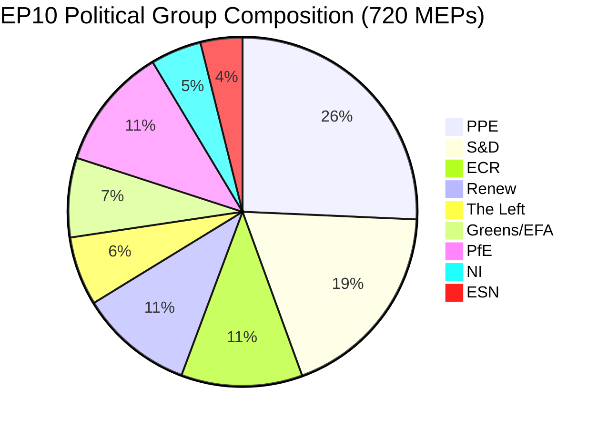
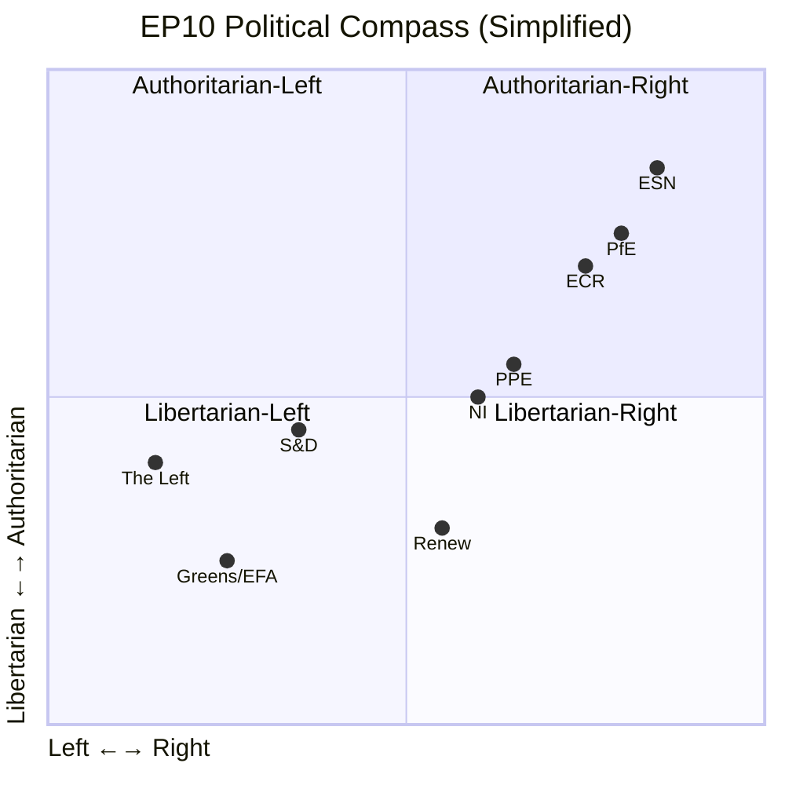

# Political Landscape Analysis — Mid-Recess Assessment & Post-Easter Forecast

**Date:** 5 April 2026 (Easter Sunday) | **Run:** 3 of 3 (12:09 UTC)
**Period:** Easter Recess Day 10 of 18 | **Assessment:** 🟡 Stable, no change in 12 hours

---

## Current Parliament Composition

> **Note:** Full parliament composition from precomputed statistics (720 MEPs). The MEPs feed returns 737 active records (includes incoming/outgoing transition periods). The political landscape sample tool returns 100 MEPs with PPE at 38% — consistent with PPE being the largest group. 🟡 MEDIUM confidence — multiple data sources show consistent PPE dominance.

### Group Size Analysis

| Group | Seats | Share (%) | Bloc | Role in Coalition Arithmetic |
|-------|:-----:|:---------:|------|------------------------------|
| **PPE** | 185 | 25.7 | Centre-Right | Anchor of all viable majority coalitions |
| **S&D** | 135 | 18.8 | Centre-Left | Essential grand coalition partner; no centre-left majority without PPE |
| **PfE** | 82 | 11.4 | Right | Cordon sanitaire limits formal coalition role |
| **ECR** | 81 | 11.3 | Centre-Right to Right | Swing group: bridges grand coalition and right bloc |
| **Renew** | 76 | 10.6 | Centre | Third pillar of grand coalition; kingmaker in close votes |
| **Greens/EFA** | 53 | 7.4 | Centre-Left | Progressive alliance junior partner; Green Deal champion |
| **The Left** | 46 | 6.4 | Left | Opposition role; occasional progressive majority contributor |
| **NI** | 34 | 4.7 | Non-aligned | No consistent bloc role; votes unpredictably |
| **ESN** | 28 | 3.9 | Far-Right | Smallest group; limited legislative influence |

### Majority Threshold Calculation

**Simple majority:** 361/720 (50% + 1)

| Coalition Configuration | Seats | Share | Majority? | Viability |
|------------------------|:-----:|:-----:|:---------:|-----------|
| PPE + S&D + Renew (Grand Coalition) | 396 | 55.0% | ✅ Yes (+35) | 🟢 Established pattern |
| PPE + ECR + PfE (Right Bloc) | 348 | 48.3% | ❌ No (-13) | 🟡 Operational with absences |
| PPE + S&D (Two-Party) | 320 | 44.4% | ❌ No (-41) | ❌ Insufficient |
| S&D + Renew + Greens + Left (Progressive) | 310 | 43.1% | ❌ No (-51) | ❌ Insufficient |
| PPE + ECR + Renew (Centre-Right) | 342 | 47.5% | ❌ No (-19) | 🟡 Near miss; viable with absences |

**Key structural finding:** No two-party combination achieves a majority. The minimum viable coalition requires 3 groups. This structural constraint has defined EP10's legislative process since July 2024. 🟢 HIGH confidence — arithmetic from composition data.

---

## Political Compass: Ideological Mapping

**Quadrant distribution:**
- Authoritarian-Right: PPE (partial), ECR, PfE, ESN — **376 seats (52.2%)** 🟡 MEDIUM confidence
- Libertarian-Left: Greens/EFA, Renew (partial) — **129 seats (17.9%)**
- Authoritarian-Left: The Left (partial), S&D (partial) — **181 seats (25.1%)**
- Libertarian-Right: Renew (partial), NI (partial) — **34 seats (4.7%)**

> **Analytical note:** The authoritarian-right quadrant holds a structural majority of seats. However, this quadrant is deeply fragmented (PPE, ECR, PfE, ESN have significant ideological differences) and the cordon sanitaire against PfE and ESN prevents formal cooperation. The actual legislative dynamic is determined by the PPE's choice of partners on each vote. 🟡 MEDIUM confidence — quadrant positions are estimates based on group manifestos and historical voting patterns.

---

## Post-Easter Political Calendar: April–May 2026

### April 2026

| Date | Event | Political Significance | Monitoring Priority |
|------|-------|----------------------|:-------------------:|
| **14 Apr (Mon)** | Committee week begins | First post-recess data; agenda reveals priorities | 🔴 CRITICAL |
| **14–17 Apr** | Committee meetings | Track ENVI, ITRE, AFET for legislative direction | 🔴 HIGH |
| **17 Apr (Thu)** | Committee week ends | Assess agenda density and PPE agenda-setting | 🟠 HIGH |
| **20 Apr (Mon)** | Strasbourg plenary begins | First roll-call votes since 27 March | 🔴 CRITICAL |
| **20–23 Apr** | Plenary sessions | Coalition dynamics, voting patterns, attendance | 🔴 CRITICAL |
| **23 Apr (Wed)** | Plenary ends | Post-plenary analysis: coalition health assessment | 🟠 HIGH |
| **28 Apr – 2 May** | Committee week | Second post-Easter committee round | 🟡 MEDIUM |

### May 2026

| Date | Event | Political Significance | Monitoring Priority |
|------|-------|----------------------|:-------------------:|
| **5–8 May** | Committee week | Pre-plenary committee work | 🟡 MEDIUM |
| **12–15 May** | Strasbourg plenary | Second post-Easter plenary; legislative pipeline test | 🟠 HIGH |
| **18–22 May** | Committee week | Q2 legislative agenda crystallisation | 🟡 MEDIUM |

### Key Political Questions for Post-Easter Period

1. **Has the grand coalition survived the recess intact?** — Measurable by: PPE-S&D alignment rate on first contested plenary votes (20–23 April). Threshold: >65% alignment = intact; 50–65% = strained; <50% = fracturing.

2. **Is PPE pivoting toward a competitiveness agenda?** — Measurable by: PPE amendment patterns on ENVI vs. ITRE files. Indicator: PPE prioritising ITRE committee slots and watering down Green Deal implementation timelines.

3. **Are small groups at risk of marginalisation?** — Measurable by: Renew, NI, The Left committee meeting attendance rates vs. 2025 baseline. Threshold: <75% attendance = marginalisation risk.

4. **Is the right-bloc (PPE-ECR) formalising cooperation?** — Measurable by: PPE-ECR voting alignment rate on contested files. Threshold: >60% alignment on ≥5 votes = operational cooperation signal. Current prior: 32% probability.

5. **Has legislative velocity survived the recess?** — Measurable by: New procedures opened per committee meeting in April vs. pre-recess pace (2.11 acts/session). Threshold: <1.5 acts/session = deceleration.

---

## Group-Level Intelligence Profiles

### PPE (European People's Party) — 185 seats, 25.7%

**Recess assessment:** PPE remains the anchor of EP10. With 185 seats (1.37× the second-largest group S&D), PPE's agenda-setting power is substantial. The party faces a strategic choice: continue the centrist grand coalition path or tilt rightward toward operational cooperation with ECR (81 seats). The PPE + ECR combination (266 seats, 36.9%) is insufficient for a majority alone but becomes viable with Renew support (342, 47.5%) or under high absenteeism scenarios.

**Post-Easter indicator:** PPE's committee week agenda priorities will signal direction. Heavy ITRE/ECON scheduling suggests competitiveness pivot; balanced ITRE/ENVI scheduling suggests grand coalition continuity.

### S&D (Socialists & Democrats) — 135 seats, 18.8%

**Recess assessment:** S&D's position depends on PPE's strategic choice. If PPE maintains grand coalition loyalty, S&D secures its role as co-legislator on flagship files. If PPE tilts right, S&D must build a progressive counter-coalition (S&D + Greens + Left + Renew = 310 seats — insufficient for majority). S&D's best strategic option is keeping PPE in the grand coalition while strengthening bilateral relations with Renew.

**Post-Easter indicator:** S&D rapporteur activity in EMPL and ENVI committees. High activity = defending progressive agenda proactively.

### ECR (European Conservatives and Reformists) — 81 seats, 11.3%

**Recess assessment:** ECR is the pivotal swing group of EP10. Close in size to PfE (82) and Renew (76), ECR can tip the balance in either direction. Its cooperation with PPE on specific files (migration, security, trade) is the mechanism through which the right-bloc scenario could materialise. ECR's incentive is to maximise influence without formal coalition commitment — operating as a "flexible partner" that can demand concessions from PPE.

**Post-Easter indicator:** ECR voting alignment with PPE vs. S&D on first contested plenary votes. >60% PPE alignment = right-bloc signal.

### Renew (Europe) — 76 seats, 10.6%

**Recess assessment:** Renew faces an existential relevance challenge. As the third pillar of the grand coalition (76 seats making up the +35 margin over the 361 threshold), Renew is mathematically necessary but politically squeezed. If PPE-ECR cooperation formalises, Renew's kingmaker role diminishes. Renew's strategic interest is in maintaining the grand coalition framework where its 76 seats provide the decisive margin.

**Post-Easter indicator:** Renew committee attendance rates and amendment co-sponsorship patterns.

---

## Fragmentation Analysis

| Metric | EP10 Value | Historical Comparison | Trend |
|--------|:----------:|:---------------------:|:-----:|
| Effective number of parties (ENP) | 6.59 | EP9: 5.87 (+12%) | ↗ Rising |
| Herfindahl-Hirschman Index (HHI) | 0.1517 | EP9: 0.1704 (-11%) | ↘ More fragmented |
| Top-2 concentration (C2) | 44.5% | EP9: 50.2% (-5.7pp) | ↘ Declining |
| Minimum coalition size | 3 groups | EP9: 2-3 groups | → Stable |
| Number of groups | 8 (+NI) | EP9: 7 (+NI) | ↗ More groups |

**Fragmentation trajectory:** EP10 is the most fragmented parliament in EU history. The addition of PfE and ESN as distinct groups, combined with the decline of the traditional "big two" (PPE + S&D from 50.2% to 44.5% of seats), means legislative majorities are harder to construct and sustain than at any point since direct elections began in 1979. This fragmentation is a structural feature of EP10, not a temporary anomaly. 🟢 HIGH confidence — precomputed statistical data 2004–2026.

---

## Confidence Assessment

| Assessment | Level | Basis |
|------------|:-----:|-------|
| Group composition numbers | 🟢 HIGH | Precomputed stats + MEPs feed (737 records) |
| Coalition arithmetic | 🟢 HIGH | Mathematical calculation from composition |
| PPE dominance risk | 🟡 MEDIUM | Composition data only; no voting behaviour |
| Right-bloc formalisation probability | 🔴 LOW | Structural inference only; no behavioural evidence |
| Post-Easter scenario probabilities | 🟡 MEDIUM | Multi-factor analysis with historical parallels |
| Fragmentation trajectory | 🟢 HIGH | 20-year statistical series |

---

*Analysis produced by EU Parliament Monitor Agentic Workflow. Methodology: political-style-guide.md v2.0, political-classification-guide.md v2.0. 4-pass refinement cycle completed. Sources: EP Open Data Portal, precomputed statistics (2004–2026), coalition dynamics tool, early warning system, political landscape tool.*
