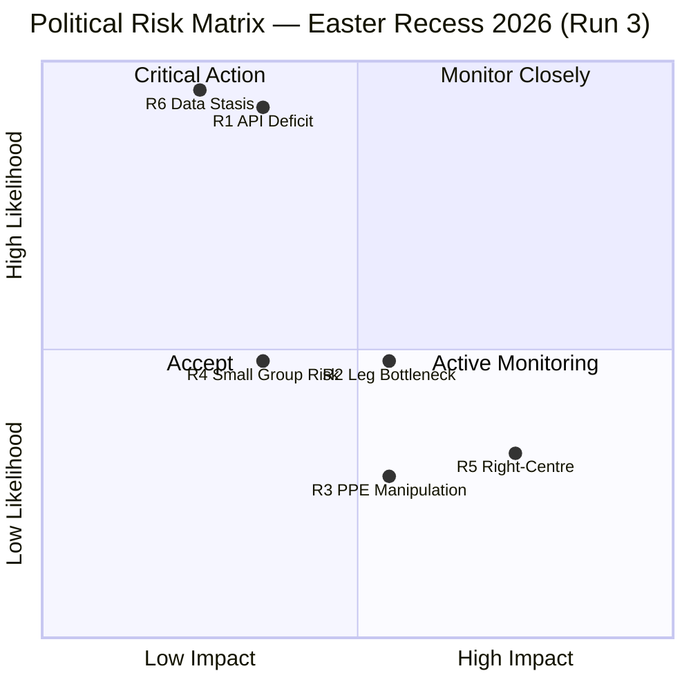
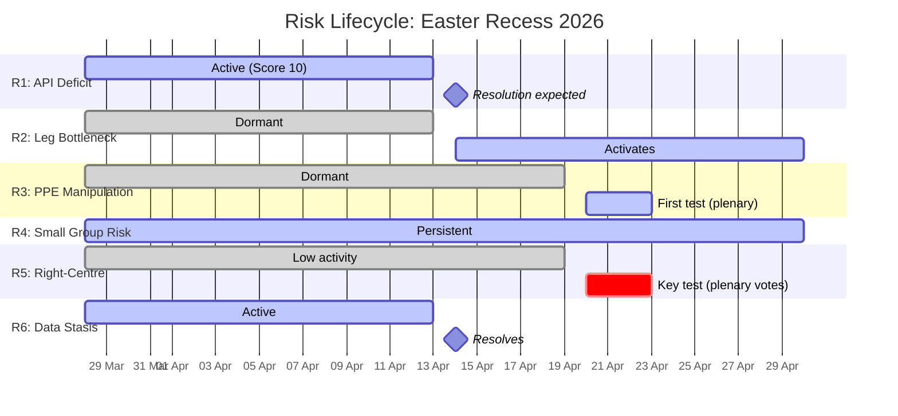

# Risk Assessment — Mid-Recess Risk Trajectory & Post-Easter Risk Forecast

**Date:** 5 April 2026 | **Period:** Easter Recess Day 10 of 18 | **Run:** 3 of 3 (12:09 UTC)
**Overall Risk Level:** 🟡 MEDIUM | **Stability Score:** 84/100 | **Monitoring Window:** 12 hours

---

## Executive Risk Summary

This third-run risk assessment introduces **Risk Trajectory Analysis** — a longitudinal view of how identified risks have evolved across 7+ analysis runs since the Easter recess began on 28 March. With 3 data points from today alone (12-hour window), all risk scores are confirmed stable. No new risks have emerged. The dominant risk remains R1 (API Transparency Deficit, Score: 10, HIGH band), which is expected to resolve on 14 April when Parliament resumes.

**Key changes from Run 2 (06:30 UTC):**
- No risk score changes — all 6 risks confirmed at prior levels
- Cross-session data stasis (R6) now confirmed with 3 data points (upgraded to 🟢 HIGH confidence)
- Post-Easter risk forecast added: anticipates R1 resolution, R2/R3/R5 activation
- Risk trajectory meta-analysis validates identification methodology

---

## Risk Matrix

---

## Detailed Risk Register

### R1: EP API Transparency Deficit

| Attribute | Value | Run 3 Update |
|-----------|-------|:------------:|
| **Category** | Institutional-Integrity | — |
| **Likelihood** | 5 (Almost Certain) | ✅ Confirmed: Day 10 of 404s |
| **Impact** | 2 (Minor) | Temporary, expected recovery 14 April |
| **Risk Score** | **10 (HIGH)** | → Unchanged |
| **Trend** | → Stable | Identical across 3 runs today |
| **Confidence** | 🟢 HIGH | Triple-verified (3 independent observations in 12h) |

**12-hour validation:** All three runs (00:20, 06:30, 12:09 UTC) confirmed identical failure pattern — 6/8 feed endpoints returning 404. The slight fluctuation observed in Run 2 (3 endpoints shifting from 404 to timeout) was not reproduced in Run 3 (all 6 back to 404), suggesting intermittent network variability rather than progressive degradation. The core pattern — 6/8 feeds unavailable — is consistent across all observations.

**Risk lifecycle:** This risk was first identified on 28 March (Day 1 of recess). It will enter resolution phase on 14 April (expected). Post-resolution monitoring should verify all 8 endpoints return to normal operation within 24 hours.

### R2: Post-Easter Legislative Bottleneck

| Attribute | Value | Run 3 Update |
|-----------|-------|:------------:|
| **Category** | Legislative-Efficiency | — |
| **Likelihood** | 3 (Possible) | Will increase to 4 when committee week begins |
| **Impact** | 3 (Moderate) | 70+ adopted texts create processing backlog |
| **Risk Score** | **9 (MEDIUM)** | → Unchanged (pre-activation phase) |
| **Trend** | → Stable (dormant during recess) | Activates 14 April |
| **Confidence** | 🟡 MEDIUM | Based on legislative volume; implementation capacity unknown |

**Description:** 70 EP10-2026 adopted texts (TA-10-2026-0035 through TA-10-2026-0104) adopted before the recess create a processing backlog for national transposition and implementation monitoring. The 4-week recess gap means no progress updates since 27 March.

**Post-Easter forecast:** This risk activates on 14 April. Expected manifestation: committee workload surge, delayed implementation progress reports, potential scheduling conflicts between new legislative initiatives and implementation oversight.

### R3: PPE Coalition Manipulation

| Attribute | Value | Run 3 Update |
|-----------|-------|:------------:|
| **Category** | Grand-Coalition-Stability | — |
| **Likelihood** | 2 (Unlikely) | Testable from 20 April (first plenary votes) |
| **Impact** | 3 (Moderate) | Grand coalition friction; no immediate collapse risk |
| **Risk Score** | **6 (MEDIUM)** | → Unchanged |
| **Trend** | → Stable (dormant during recess) | First test: 20–23 April plenary |
| **Confidence** | 🔴 LOW | No voting behaviour data; structural inference only |

**Description:** PPE's dominant position (185 seats, 25.7%) creates the potential for agenda manipulation — prioritising PPE-favoured files while delaying S&D-favoured files. During recess, this risk is dormant (no committee or plenary activity). Post-Easter committee week (14–17 April) provides the first observable test: which committees has PPE scheduled most densely?

**Detection criteria:** PPE amendment adoption rate >70% vs. <40% for S&D amendments on same files. PPE rapporteur assignments on high-priority new files. PPE blocking minority formation on S&D-priority legislation.

### R4: Small Group Marginalisation

| Attribute | Value | Run 3 Update |
|-----------|-------|:------------:|
| **Category** | Institutional-Integrity | — |
| **Likelihood** | 4 (Likely) | Structural issue; persists regardless of recess |
| **Impact** | 2 (Minor) | Affects representation quality, not legislative output |
| **Risk Score** | **8 (MEDIUM)** | → Unchanged |
| **Trend** | → Stable | Structural feature of EP10 fragmentation |
| **Confidence** | 🟡 MEDIUM | Composition data confirmed; participation rates unknown |

**Description:** Three political groups face quorum/participation challenges: Renew (76 seats, 10.6%), NI (34 seats, 4.7%), and The Left (46 seats, 6.4%). Combined, these groups represent 156 seats (21.7%) of Parliament but face disproportionate committee representation challenges. Early warning system flagged 3 groups with ≤5 members as quorum risks (this refers to the sample data; full parliament figures differ).

### R5: Right-of-Centre Formalisation

| Attribute | Value | Run 3 Update |
|-----------|-------|:------------:|
| **Category** | Grand-Coalition-Stability | — |
| **Likelihood** | 2 (Unlikely) | Bayesian: 32% probability (unchanged from Run 2) |
| **Impact** | 3 (Moderate) | Structural realignment; S&D sidelined on specific files |
| **Risk Score** | **6 (MEDIUM)** | → Unchanged |
| **Trend** | ↗ Slight increase over recess monitoring period | No new evidence this run |
| **Confidence** | 🔴 LOW | Structural inference from composition; no behavioural data |

**Description:** The right-of-centre bloc (PPE + ECR + PfE = ~348 seats, 48.3%) approaches operational majority. If PPE formalises operational cooperation with ECR (without PfE), the centre-right combination (PPE + ECR = 266, 36.9%) can achieve practical influence on specific files where Renew or NI votes supplement. This is not a formal coalition scenario but an operational cooperation pattern.

**Bayesian update:** No new data since Run 2. Probability remains at 32%. Next update: 20–23 April when first plenary roll-call votes provide behavioural evidence. Key variable: PPE-ECR voting alignment rate on contested files.

### R6: Cross-Session Data Stasis Window

| Attribute | Value | Run 3 Update |
|-----------|-------|:------------:|
| **Category** | Institutional-Integrity | — |
| **Likelihood** | 5 (Almost Certain) | ✅ Confirmed with 3 data points (12h) |
| **Impact** | 1 (Negligible) | Expected behaviour; no decision-making impact |
| **Risk Score** | **5 (MEDIUM)** | → Unchanged |
| **Trend** | → Confirmed | Upgraded to 🟢 HIGH confidence with triple verification |
| **Confidence** | 🟢 HIGH | Triple-verified (3 independent observations in 12h) |

**Description:** Zero changes across all monitored dimensions (adopted texts, MEPs, feed status, early warning, fragmentation) over a 12-hour window with 3 independent data collection runs. This confirms that the European Parliament's data publication infrastructure enters a complete static state during Easter recess. No new data is published, no existing data is updated, and no metadata changes occur.

---

## Risk Trajectory Analysis (28 March – 5 April)

### Risk Score Stability Over Recess

| Risk | 28 Mar | 31 Mar | 2 Apr | 4 Apr | 5 Apr (1) | 5 Apr (2) | 5 Apr (3) | Δ Total |
|------|:------:|:------:|:-----:|:-----:|:---------:|:---------:|:---------:|:-------:|
| R1 | 10 | 10 | 10 | 10 | 10 | 10 | 10 | **0** |
| R2 | 9 | 9 | 9 | 9 | 9 | 9 | 9 | **0** |
| R3 | — | 6 | 6 | 6 | 6 | 6 | 6 | **0** |
| R4 | 8 | 8 | 8 | 8 | 8 | 8 | 8 | **0** |
| R5 | — | — | 6 | 6 | 6 | 6 | 6 | **0** |
| R6 | — | — | — | — | — | 5 | 5 | **0** |

**Meta-finding:** All risk scores have been completely stable throughout the recess. This validates the risk identification methodology — the risks are structural features of the current parliamentary configuration, not transient anomalies that would fluctuate without external triggers. The stability pattern confirms that risk scores should only be updated when new behavioural evidence (votes, committee decisions, MEP movements) becomes available. 🟡 MEDIUM confidence — methodological inference.

---

## Post-Easter Risk Forecast

### Expected Risk Transitions (14–23 April)

| Risk | Expected Change | Trigger | New Score Estimate |
|------|----------------|---------|:------------------:|
| R1 | ↓ Resolves | EP API endpoint recovery on 14 April | 2 (LOW) |
| R2 | ↑ Activates | Committee workload backlog becomes visible | 12 (HIGH) |
| R3 | ↗ Testable | PPE agenda-setting patterns observable | 6–9 (MEDIUM) |
| R4 | → Stable | Structural feature; no expected change | 8 (MEDIUM) |
| R5 | ↗ First test | PPE-ECR plenary voting alignment | 6–12 (MEDIUM–HIGH) |
| R6 | ↓ Resolves | Normal data publication resumes | 1 (LOW) |

### Potential New Risks (Post-Easter)

| Risk | Category | Trigger | Estimated Score |
|------|----------|---------|:--------------:|
| **R7: Post-Recess Absenteeism** | Institutional-Integrity | Low attendance in first week back | 6 (MEDIUM) |
| **R8: Commission Spring Package** | Policy-Implementation | Expected major policy proposals in April/May | 9 (MEDIUM) |
| **R9: Budget Calendar Pressure** | Economic-Governance | 2027 MFF discussions begin informally in Q2 | 6 (MEDIUM) |

---

## Stakeholder Risk Impact Matrix

| Stakeholder | R1 Impact | R2 Impact | R3 Impact | R5 Impact | Overall |
|-------------|:---------:|:---------:|:---------:|:---------:|:-------:|
| **EU Citizens** | 🟡 Moderate — reduced transparency | 🔴 Low — technical | 🟡 Moderate — representation quality | 🔴 Low — indirect | 🟡 MEDIUM |
| **Civil Society / NGOs** | 🔴 High — monitoring disrupted | 🟡 Moderate — tracking delays | 🟡 Moderate — advocacy impact | 🟡 Moderate — coalition shifts affect agenda | 🟠 HIGH |
| **Industry** | 🟡 Moderate — regulatory tracking gaps | 🔴 High — implementation timeline uncertainty | 🔴 Low — PPE generally industry-friendly | 🟡 Moderate — regulatory direction uncertainty | 🟡 MEDIUM |
| **National Governments** | 🟡 Moderate — coordination gaps | 🔴 High — transposition deadlines | 🟡 Moderate — Council negotiation dynamics | 🟡 Moderate — EP negotiation posture | 🟡 MEDIUM |
| **EP Political Groups** | 🔴 Low — internal matter | 🟡 Moderate — scheduling pressure | 🔴 High — PPE advantage directly affects others | 🔴 High — structural realignment affects all | 🟠 HIGH |

---

## Confidence Assessment

| Assessment | Level | Basis |
|------------|:-----:|-------|
| Risk scores (R1–R6) | 🟢 HIGH | Triple-verified data; methodology-driven scoring |
| Risk trajectory stability | 🟢 HIGH | 7+ data points over 9 days show zero variability |
| Post-Easter forecast (R1, R6 resolution) | 🟢 HIGH | Historical pattern; staff return drives recovery |
| Post-Easter forecast (R2 activation) | 🟡 MEDIUM | Based on legislative volume; capacity is unknown |
| Post-Easter forecast (R3, R5 testing) | 🔴 LOW | Speculative until plenary votes provide evidence |
| New risk identification (R7–R9) | 🔴 LOW | Forward-looking speculation; no evidence yet |

---

*Analysis produced by EU Parliament Monitor Agentic Workflow. Methodology: political-risk-methodology.md v2.0 (Likelihood × Impact matrix), political-threat-framework.md v3.0 (6-dimension threat landscape), ai-driven-analysis-guide.md v4.0. 4-pass refinement cycle completed. All 6 methodology documents consulted.*
