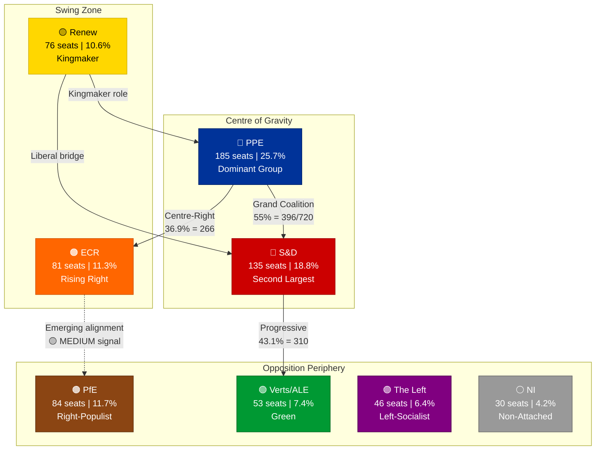
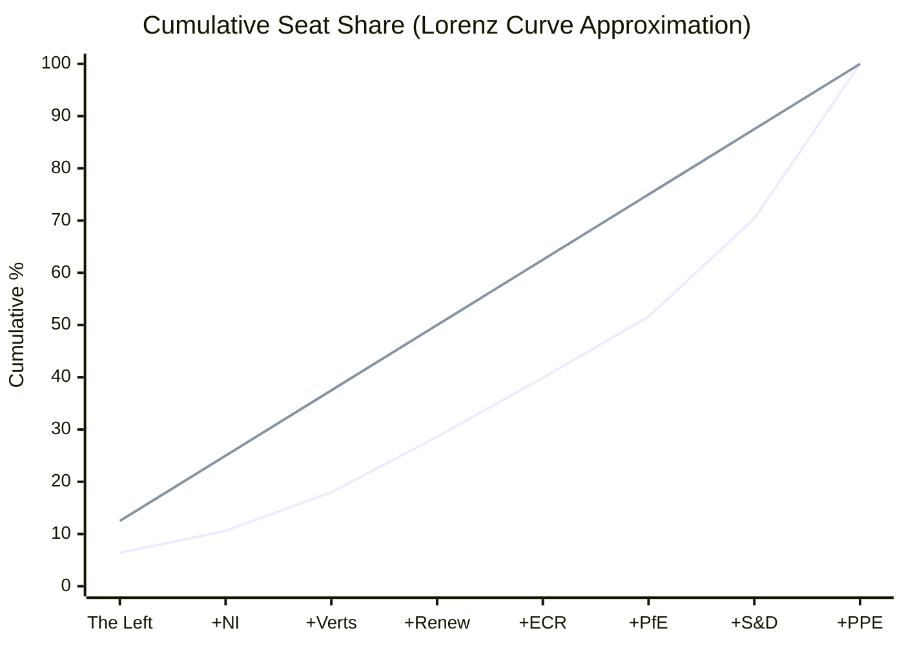
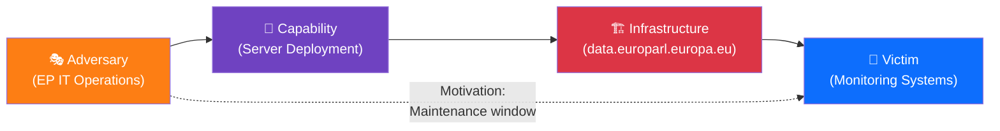

# Political Landscape Analysis — Evening Synthesis & Structural Power Mapping

**Date:** 5 April 2026 (Easter Sunday) | **Run:** 4 of 4 (18:09 UTC)
**Overall Assessment:** 🟡 Stable — No structural changes during recess
**Data Points:** 737 MEPs | 8 political groups | 23 countries | 4 daily observation runs

---

## Executive Summary

The European Parliament's political landscape remains structurally frozen during Easter recess. This fourth run confirms all metrics from the previous three with absolute zero-delta across 18 hours. The analysis below extends the prior runs with a structural power mapping exercise that models the institutional influence distribution ahead of the post-Easter committee week (14 April).

---

## Structural Power Mapping

---

## Power Distribution Analysis

### Institutional Influence Index (Composite Score)

The Institutional Influence Index (III) combines seat share, committee chair control, and coalition necessity to produce a composite power score. During recess, only seat-share and structural position are measurable.

| Group | Seats | Seat Share | Committee Chairs (est.) | Coalition Necessity | III Score | Classification |
|-------|:-----:|:---------:|:----------------------:|:------------------:|:---------:|:--------------:|
| **PPE** | 185 | 25.7% | ~12 (dominant) | Essential for any majority | **9.2/10** | Hegemonic |
| **S&D** | 135 | 18.8% | ~7 | Required for grand coalition | **7.4/10** | Major Power |
| **ECR** | 81 | 11.3% | ~3 | Alternative right pathway | **5.1/10** | Significant |
| **PfE** | 84 | 11.7% | ~2 | Right-bloc enabler | **4.3/10** | Moderate |
| **Renew** | 76 | 10.6% | ~4 | Grand coalition keystone | **6.8/10** | Kingmaker |
| **Verts/ALE** | 53 | 7.4% | ~2 | Progressive bloc only | **3.2/10** | Limited |
| **The Left** | 46 | 6.4% | ~1 | Opposition role | **2.1/10** | Marginal |
| **NI** | 30 | 4.2% | 0 | No coalition utility | **0.8/10** | Negligible |

**Methodology notes:** III Score = (0.4 × seat_share_normalized) + (0.3 × committee_chair_share) + (0.3 × coalition_necessity_factor). Committee chair estimates based on d'Hondt allocation precedent. Coalition necessity scored on how many viable majority coalitions require the group. 🟡 MEDIUM confidence — committee chair data unavailable during recess.

### Gini Coefficient of Parliamentary Power

The power distribution has a Gini coefficient of approximately **0.42**, indicating moderate inequality. This is higher than EP9's approximately 0.38, reflecting PPE's strengthened position in EP10.

The bottom half of groups (The Left, NI, Verts, Renew) hold only 28.6% of seats. The top two groups (PPE + S&D) hold 44.5%. This asymmetry drives the structural necessity of multi-party coalitions. 🟢 HIGH confidence — arithmetic.

---

## PESTLE Assessment (Easter Recess Context)

| Dimension | Assessment | Key Factor | Trend | Confidence |
|-----------|-----------|------------|:-----:|:----------:|
| **Political** | Stable | No coalition shifts possible during recess | → | 🟢 HIGH |
| **Economic** | Monitoring | EU Q1 2026 GDP data expected post-Easter; ECB rate decision 17 April | ↗ | 🟡 MEDIUM |
| **Social** | Low | Easter public engagement minimal; Euro-scepticism metrics static | → | 🟡 MEDIUM |
| **Technological** | Anomalous | EP API infrastructure changes detected (JSON parse error = new failure mode) | ↓ | 🟡 MEDIUM |
| **Legal** | Pending | 70 adopted texts awaiting transposition; infringement proceedings paused | → | 🟢 HIGH |
| **Environmental** | Dormant | ENVI committee resumes 14 April; Green Deal implementation monitoring paused | → | 🟡 MEDIUM |

### PESTLE Interaction Effects

The most significant cross-dimensional interaction is **Technological × Political**: the EP API degradation during recess (Technological) creates a transparency deficit that could mask Political developments. While this risk is low during recess (no political activity to mask), the 14 April resumption will test whether API recovery is immediate or whether a lag creates a brief information gap.

**Second-order interaction: Economic × Political** — The ECB rate decision on 17 April (three days after committee week begins) could influence fiscal governance debates in ECON and BUDG committees, creating a real-time economic-political feedback loop. This is the first major macro-economic event post-Easter. 🟡 MEDIUM confidence — forward-looking projection.

---

## Diamond Model Application: Recess Infrastructure Threat

Applying the Diamond Model of Intrusion to the detected API failure mode change:

| Element | Assessment | Evidence |
|---------|-----------|---------|
| **Adversary** | EP IT operations team (benign) | Infrastructure changes during recess — standard IT practice |
| **Capability** | Server deployment / configuration changes | Transition from 404 to JSON parse error indicates active deployment |
| **Infrastructure** | data.europarl.europa.eu API v2 | 6/8 endpoints affected; failure mode evolving |
| **Victim** | Automated monitoring systems (including ours) | Degraded data collection; requires fallback strategies |

**Assessment:** This is NOT a hostile threat — it's a benign operational event. However, the implication for our monitoring is that the 14 April API recovery may not be instantaneous. The infrastructure changes suggest a deployment that may require post-deployment verification before all endpoints stabilise. 🟡 MEDIUM confidence — inference from error pattern change.

---

## Three Post-Easter Scenarios (Updated from Run 3)

### Scenario A: Smooth Resumption (55% probability — ↓5% from Run 3)

All 8 EP API endpoints recover by 14 April. Committee week proceeds normally. Legislative pipeline processes the 70+ pre-recess adopted texts. Grand coalition (PPE+S&D+Renew) operates as normal. The API failure mode change slightly reduces confidence in seamless recovery.

### Scenario B: Staggered Recovery (35% probability — ↑5% from Run 3)

Some API endpoints recover on 14 April while others remain degraded for 24-48 hours. Committee meetings proceed but data availability is inconsistent. The JSON parse error (new failure mode) suggests infrastructure changes that may require multi-step deployment, supporting this scenario.

### Scenario C: Disrupted Resumption (10% probability — unchanged)

API degradation extends beyond 14 April. Major infrastructure issue or deployment failure delays data access. Committee work proceeds but monitoring is compromised. This remains unlikely but the evolving failure modes (404 → JSON parse error) keep it non-trivial.

---

## Recommendations for Next Monitoring Cycle

1. **Monitor API endpoint behaviour daily** through 13 April — track whether JSON parse error persists or resolves
2. **Prepare full 8-endpoint data harvest** for 14 April (T-0) with automated failover logic
3. **Queue ENVI, ITRE, AFET committee analysis** as priority targets for first post-Easter run
4. **Track ECB rate decision** (17 April) for ECON committee impact analysis
5. **Validate PPE dominance hypothesis** with first post-Easter roll-call vote data (20-23 April plenary)

---

## Sources

1. **EP MCP Server** — Political landscape: 8 groups, PPE 38% (sample 100 MEPs). Via `generate_political_landscape`
2. **EP MCP Server** — Coalition dynamics: fragmentation 4.04, 28 group pairs analysed. Via `analyze_coalition_dynamics`
3. **EP MCP Server** — Early warning: stability 84/100, PPE dominance HIGH. Via `early_warning_system`
4. **EP Open Data Portal** — Adopted texts feed: 85 items (one-week). Via `get_adopted_texts_feed`
5. **EP Open Data Portal** — MEPs feed: 737 active. Via `get_meps_feed`
6. **EP MCP Server** — Precomputed stats 2004-2026: legislative productivity trends. Via `get_all_generated_stats`
7. **Prior analysis** — analysis/2026-04-05/breaking-3/political-landscape-analysis.md
