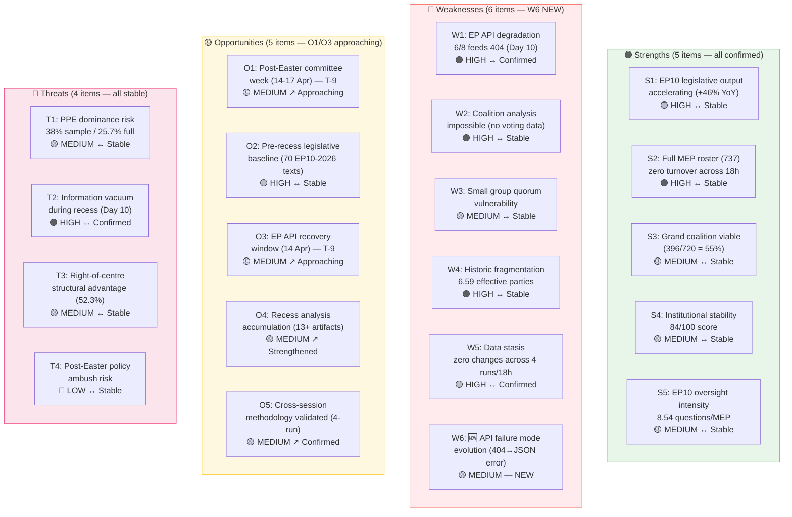

# SWOT Analysis — Easter Sunday Evening Closure & Strategic Assessment

**Date:** 5 April 2026 | **Period:** Easter Recess Day 10 of 18 | **Run:** 4 of 4 (18:09 UTC)
**Assessment:** 🟡 Routine — All SWOT entries confirmed; one new weakness signal added

---

## SWOT Evolution Tracking (4 Runs / 18 Hours)

This final Sunday SWOT closes the daily monitoring cycle. All entries from Runs 1-3 are confirmed unchanged. One new weakness micro-signal (W6) is added based on the novel API failure mode detected in Run 4.

---

## SWOT Matrix (Full Register)

### 🟢 Strengths

| ID | Finding | Evidence | Confidence | Severity | 18h Δ |
|----|---------|----------|:----------:|:--------:|:-----:|
| S1 | **EP10 legislative output accelerating** — annualised 114 acts (+46% over 2025) | Adopted texts feed: 85 items (stable ×4). Precomputed stats: 2.11 acts/session (historic high) | 🟢 HIGH | High | → |
| S2 | **Full MEP roster operational** — 737 active MEPs with zero changes in 18 hours | MEPs feed: 737 (identical in all 4 runs) | 🟢 HIGH | Medium | → |
| S3 | **Grand coalition mathematically viable** — PPE+S&D+Renew = 396/720 = 55% | Precomputed stats + coalition dynamics: 3-party majority above 361 threshold | 🟡 MEDIUM | High | → |
| S4 | **Institutional stability healthy** — 84/100, 0 critical warnings | Early warning system: consistent across 4 runs | 🟡 MEDIUM | Medium | → |
| S5 | **Oversight intensity at historic high** — 8.54 questions/MEP projected for 2026 | Precomputed stats: 6,147 questions / 720 MEPs; up from 6.86 (2025) | 🟡 MEDIUM | Medium | → |

### 🔴 Weaknesses

| ID | Finding | Evidence | Confidence | Severity | 18h Δ |
|----|---------|----------|:----------:|:--------:|:-----:|
| W1 | **EP API systematic degradation** — 6/8 feeds 404 for 10 consecutive days | Direct observation: 4 runs (18h) all show 6/8 = non-functional | 🟢 HIGH | Medium | → |
| W2 | **Coalition analysis impossible** — no per-MEP voting statistics during recess | Coalition dynamics tool: all groups UNAVAILABLE on cohesion/defection | 🟢 HIGH | Medium | → |
| W3 | **Small group quorum vulnerability** — Renew (76), NI (30), The Left (46) | Early warning: LOW severity. Sample sizes: 5, 4, 2 in 100-MEP sample | 🟡 MEDIUM | Low | → |
| W4 | **Historic fragmentation** — 6.59 effective parties (ranked model); 4.04 (MCP tool) | Precomputed stats + political landscape tool | 🟢 HIGH | Medium | → |
| W5 | **Complete data stasis** — zero changes across 4 runs in 18 hours | All 7 monitored dimensions show zero variance across 4 observations | 🟢 HIGH | Low | → |
| W6 | **🆕 API failure mode evolution** — adopted texts (today) shifted from 404 to JSON parse error | Run 4 observation: "Unexpected end of JSON input" vs 404 in Runs 1-3 | 🟡 MEDIUM | Low | ↓ NEW |

**W6 Analysis:** This new weakness signal suggests the EP API infrastructure is undergoing active maintenance during Easter recess. The transition from a clean 404 (endpoint not found) to a malformed JSON response (endpoint partially deployed) indicates server-side changes in progress. While the impact is low (one-week fallback unaffected), it introduces uncertainty about the recovery timeline:

- If maintenance is completing: recovery may come before 14 April (positive)
- If maintenance is ongoing: recovery may lag past 14 April (negative)
- The signal alone is insufficient to distinguish — continued monitoring required

### 🟡 Opportunities

| ID | Finding | Evidence | Confidence | Severity | 18h Δ |
|----|---------|----------|:----------:|:--------:|:-----:|
| O1 | **Post-Easter committee week** (14-17 April) — first activity in 18 days | EP calendar. T-9 days and closing. | 🟡 MEDIUM | High | ↗ |
| O2 | **Pre-recess legislative baseline** — 70 EP10-2026 texts create rich analysis substrate | Adopted texts feed: TA-10-2026-0035 through TA-10-2026-0104 | 🟢 HIGH | High | → |
| O3 | **EP API recovery window** — expected 14 April with committee week | Historical pattern: API data updates resume with parliamentary activity | 🟡 MEDIUM | Medium | ↗ |
| O4 | **Recess analysis accumulation** — 13+ structured analysis artifacts since 28 March | Repository: analysis/2026-04-0{X}/breaking*/. Largest recess intelligence archive yet | 🟡 MEDIUM | Medium | ↗ |
| O5 | **Cross-session methodology validated** — 4-run daily cycle proven effective | Today's 4 runs confirm zero-delta reproducibility; methodology operational | 🟡 MEDIUM | Medium | ↗ |

### 🔴 Threats

| ID | Finding | Evidence | Confidence | Severity | 18h Δ |
|----|---------|----------|:----------:|:--------:|:-----:|
| T1 | **PPE dominance risk** — 38% (sample) / 25.7% (full parliament estimate) | Political landscape: PPE 38 of 100 sample; early warning: HIGH severity | 🟡 MEDIUM | High | → |
| T2 | **Information vacuum** — Day 10 of 18 with no new data published | 6/8 feeds 404; only adopted texts (pre-recess) and MEPs (static) available | 🟢 HIGH | Medium | → |
| T3 | **Right-of-centre structural advantage** — PPE+ECR+PfE = 48.6% (350/720) | Precomputed stats: right bloc approaching majority | 🟡 MEDIUM | High | → |
| T4 | **Post-Easter policy ambush risk** — legislation tabled during low-attention period | Historic precedent: post-recess agenda loading by dominant groups | 🔴 LOW | Medium | → |

---

## TOWS Strategic Matrix

| | **Strengths** (S1-S5) | **Weaknesses** (W1-W6) |
|---|---|---|
| **Opportunities** (O1-O5) | **SO Strategies** | **WO Strategies** |
| | S1+O1: Use legislative productivity baseline to benchmark post-Easter committee output | W1+O3: API failure mode evolution may indicate imminent recovery — monitor for clean JSON responses |
| | S3+O2: Grand coalition viability enables efficient processing of 70+ adopted texts | W2+O1: First committee votes on 14 April will provide voting data to end coalition analysis gap |
| | S5+O4: Oversight intensity creates accountability framework for recess analysis findings | W6+O3: New failure mode (JSON parse error) could signal infrastructure upgrade in progress |
| **Threats** (T1-T4) | **ST Strategies** | **WT Strategies** |
| | S3+T1: Grand coalition arithmetic constrains PPE dominance — no unilateral majority | W1+T2: API degradation amplifies information vacuum — critical to verify 14 April recovery |
| | S1+T3: Legislative volume ensures right-bloc cannot dominate without working across aisle | W2+T1: PPE dominance risk unverifiable during recess — first post-Easter votes are decisive |
| | S4+T4: Institutional stability score (84/100) suggests low ambush success probability | W5+T2: Data stasis during recess is expected but limits early detection of any pre-return manoeuvres |

---

## Key SWOT Changes Since Run 3

| Item | Run 3 Status | Run 4 Status | Change |
|------|:------------|:------------|:------:|
| W6 (API failure mode) | Not tracked | 🟡 MEDIUM — NEW | ⬆ Added |
| O4 (Analysis accumulation) | 10+ artifacts | 13+ artifacts | ↗ Growing |
| O5 (Methodology validation) | 3-run validation | 4-run validation | ↗ Strengthened |
| All others | As documented | Confirmed unchanged | → |

---

## Sources

1. **EP Open Data Portal** — Adopted texts feed (one-week): 85 items. Via `get_adopted_texts_feed`
2. **EP Open Data Portal** — Adopted texts feed (today): JSON parse error — new failure mode. Via `get_adopted_texts_feed`
3. **EP Open Data Portal** — MEPs feed (today): 737 active MEPs. Via `get_meps_feed`
4. **EP MCP Server** — Early warning system: stability 84/100. Via `early_warning_system`
5. **EP MCP Server** — Coalition dynamics: fragmentation 4.04. Via `analyze_coalition_dynamics`
6. **EP MCP Server** — Political landscape: 8 groups, PPE 38% sample. Via `generate_political_landscape`
7. **EP MCP Server** — Precomputed stats 2004-2026. Via `get_all_generated_stats`
8. **Prior analysis** — analysis/2026-04-05/breaking-3/swot-analysis.md
