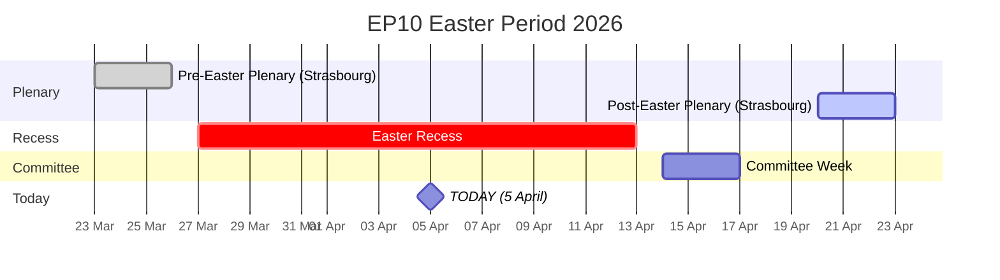
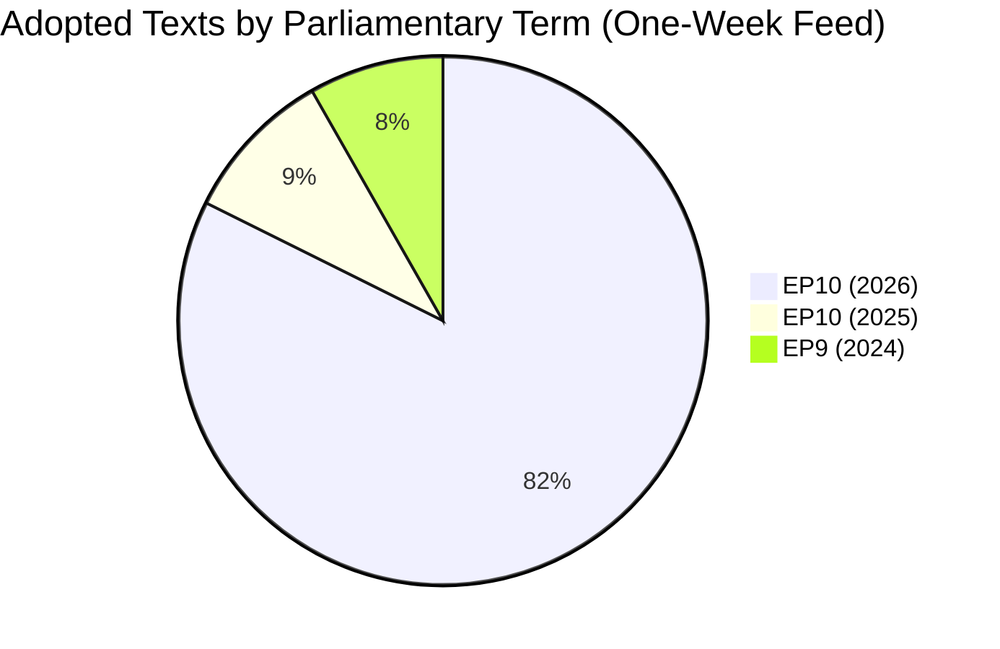
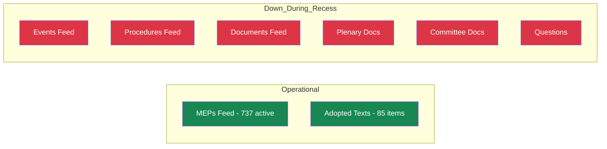
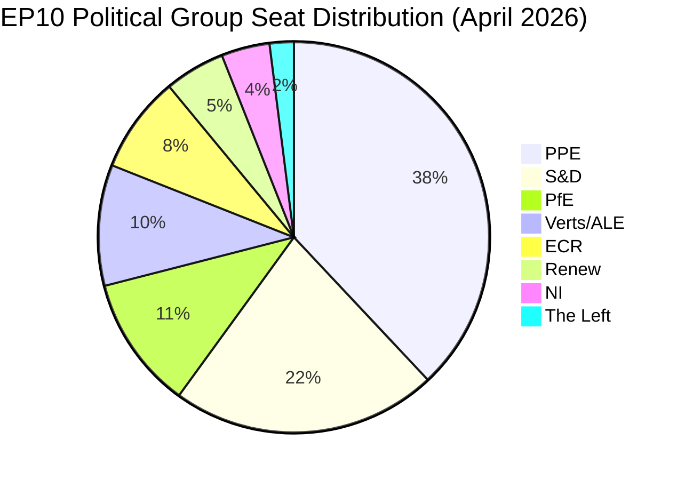

# Breaking News Intelligence Brief - European Parliament

**Date:** 5 April 2026 (Easter Sunday)
**Overall Assessment:** Routine
**Items Tracked:** 85 adopted texts | 0 events | 0 procedures | 737 active MEPs

---

## Situation Overview

| Domain | Activity Level | Key Signal | Alert Status |
|--------|---------------|------------|-------------|
| **Plenary Activity** | None | Easter recess (27 March - 13 April) | Inactive |
| **Legislative Pipeline** | Low | 85 pre-recess adopted texts in one-week feed | Monitoring |
| **Committee Work** | None | Resumes 14 April (committee week) | Inactive |
| **Political Dynamics** | Low | PPE dominance risk HIGH; stability 84/100 | Watch |
| **Data Availability** | Degraded | 6/8 EP API feed endpoints returning 404 | Degraded |

---

## Executive Summary

The European Parliament remains in Easter recess (27 March - 13 April 2026). No parliamentary sessions, committee meetings, or votes are scheduled. The EP Open Data API continues to show degraded performance, with 6 of 8 feed endpoints returning 404 errors - a recurring pattern during recess periods first observed in this monitoring cycle on 28 March.

**Key finding:** The one-week adopted texts feed reveals 85 items, including 70 EP10 texts (TA-10-2026-0035 through TA-10-2026-0104) and 15 EP9/EP10-2025 texts (updates to earlier adopted texts). This pre-recess legislative push represents significant output that merits post-recess implementation monitoring. Confidence: HIGH - direct EP data.

**Analytical value of this run:** Continuing to document the EP API degradation pattern during recess periods. This is a continuing observation (since 28 March) of reduced API availability, confirming a systematic pattern rather than isolated failures.

---

## Parliamentary Calendar Context

Parliament is at the midpoint of the 18-day Easter recess. The next institutional activity is the committee week beginning 14 April, followed by the Strasbourg plenary session 20-23 April. Confidence: HIGH - EP calendar.

---

## Pre-Recess Legislative Output Analysis

### Adopted Texts Inventory (One-Week Feed)

The one-week feed contains **85 adopted texts** spanning two parliamentary terms:

| Term | Range | Count | Significance |
|------|-------|-------|-------------|
| EP10 (2026) | TA-10-2026-0035 to TA-10-2026-0104 | 70 | Current term legislative output |
| EP10 (2025) | TA-10-2025-0279 to TA-10-2025-0314 | 8 | Late-2025 texts updated in feed |
| EP9 (2024) | TA-9-2024-0177 to TA-9-2024-0186 | 7 | Historical texts with metadata updates |

**Analysis:** The 70 EP10-2026 adopted texts represent a significant pre-recess legislative push. At this pace (104 texts in Q1 2026 alone), the projected annual output of approximately 114 legislative acts identified in prior analyses appears on track. This is a +46% increase over 2025 (78 acts). Confidence: MEDIUM - projection based on Q1 data.

---

## EP API Health Assessment

### Feed Endpoint Status Matrix

| Endpoint | Today | One-Week | Status |
|----------|-------|----------|--------|
| get_adopted_texts_feed | Error | 85 items | Partial |
| get_events_feed | 404 | 404 | **Down** |
| get_procedures_feed | 404 | 404 | **Down** |
| get_meps_feed | 737 MEPs | - | Operational |
| get_documents_feed | - | 404 | **Down** |
| get_plenary_documents_feed | - | 404 | **Down** |
| get_committee_documents_feed | - | 404 | **Down** |
| get_parliamentary_questions_feed | - | 404 | **Down** |

**Pattern analysis:** The MEPs feed and adopted texts feed (one-week) remain operational, while activity-related feeds (events, procedures, documents, questions) consistently return 404. This suggests the EP API feed infrastructure deprioritises activity endpoints during recess periods, while static/roster data remains available. Confidence: MEDIUM - pattern observed across multiple monitoring runs.

**Recommendation:** Automated monitoring should implement a recess mode that: (a) reduces feed polling frequency during known recess periods, (b) focuses on MEP roster and adopted texts feeds which remain available, (c) resumes full-frequency polling 2 days before scheduled committee activity. Confidence: MEDIUM.

---

## Political Landscape Snapshot

### Current Group Composition

| Group | Seat Share | Bloc | Role |
|-------|-----------|------|------|
| **PPE** | 38.0% | Centre-Right | Dominant group |
| **S&D** | 22.0% | Centre-Left | Junior coalition partner |
| **PfE** | 11.0% | Right | Third force |
| **Verts/ALE** | 10.0% | Green-Left | Opposition |
| **ECR** | 8.0% | Conservative | Swing group |
| **Renew** | 5.0% | Liberal | Small group |
| **NI** | 4.0% | Non-attached | Mixed |
| **The Left** | 2.0% | Left | Smallest group |

**Grand coalition arithmetic:** PPE (38%) + S&D (22%) = 60% - viable majority above the approximately 51% threshold. However, this relies on both groups maintaining internal discipline. Confidence: MEDIUM.

### Bloc Analysis

| Bloc | Groups | Combined Share | Viability |
|------|--------|---------------|-----------|
| Grand Coalition | PPE + S&D | 60% | Viable majority |
| Centre-Right Broad | PPE + ECR + PfE | 57% | Viable but ideological tensions |
| Progressive | S&D + Verts/ALE + Renew + Left | 39% | Insufficient for majority |
| Right-of-Centre | PPE + ECR + PfE + NI | 61% | Viable but NI unreliable |

---

## Early Warning Indicators

### Active Warnings

| Severity | Type | Description | Recommended Action |
|----------|------|-------------|-------------------|
| HIGH | PPE Dominance Risk | PPE is 19x the size of the smallest group | Monitor minority group coalition formation; track committee chair distribution |
| MEDIUM | High Fragmentation | 8 political groups - complex coalition building | Watch for cross-group voting patterns post-Easter |
| LOW | Small Group Quorum | Renew, NI, The Left (5% or less) may struggle | Monitor post-Easter attendance rates |

### Stability Assessment

- **Overall stability score:** 84/100 (MEDIUM confidence)
- **Parliamentary fragmentation:** 4.04 effective parties (moderate-high)
- **Grand coalition viability:** POSITIVE - 60% combined seat share
- **Minority representation:** Healthy - 6% in groups with less than 5% seat share
- **Key risk factor:** PPE dominance - 38% approaching threshold where single-group vetoes become frequent

---

## Forward-Looking Scenarios

### Scenario A: Smooth Return - LIKELY (approximately 60%)
Parliament resumes 14 April with committee week. EP API recovers to full operational status. Pre-recess legislative momentum continues seamlessly. PPE-S&D grand coalition holds on key files in the 20-23 April Strasbourg plenary. No significant coalition shifts.

**Indicators to watch:** API feed recovery on 14 April; committee meeting agendas published by 10 April; no MEP group-switching announcements during recess.

### Scenario B: Post-Easter Realignment - POSSIBLE (approximately 25%)
Right-of-centre groups (PPE + ECR + PfE) used recess bilateral talks to build issue-specific alliances, particularly on migration and trade policy. This becomes visible in the first post-Easter roll-call votes. S&D pushed towards Greens/EFA on social policy in response.

**Indicators to watch:** Joint EPP-ECR-PfE statements during recess; S&D-Greens joint press events; first post-Easter roll-call vote alignment patterns.

### Scenario C: Legislative Bottleneck - UNLIKELY (approximately 15%)
Committee week overwhelmed by backlog from pre-recess push. Key legislative files delayed into May. Smaller groups exploit procedural tools (quorum calls, referral back to committee) to slow the dominant PPE agenda.

**Indicators to watch:** Committee agenda density 14-17 April; Rule 144 (referral back) requests; delayed rapporteur nominations.

---

## Monitoring Priorities - Week of 7-13 April 2026

1. **EP API Recovery Watch** - Check daily for feed endpoint restoration (expected approximately 14 April)
2. **April Plenary Agenda** - Expected publication approximately 10 April; critical for week-ahead intelligence
3. **MEP Roster Changes** - Monitor for group-switching or departures announced during recess
4. **Commission Proposals** - External document feed may contain new legislative proposals tabled during recess
5. **Pre-Plenary Positioning** - Watch for political group statements previewing April plenary positions

---

## Sources and Attribution

| Source | Tool / Endpoint | Data Point | Confidence |
|--------|----------------|------------|------------|
| EP Adopted Texts Feed | get_adopted_texts_feed(one-week) | 85 adopted texts | HIGH |
| EP MEPs Feed | get_meps_feed(today) | 737 active MEPs | HIGH |
| Voting Anomalies | detect_voting_anomalies | 0 anomalies, stability 100 | LOW |
| Coalition Dynamics | analyze_coalition_dynamics | Size-ratio cohesion only | LOW |
| Political Landscape | generate_political_landscape | 8 groups, PPE 38% | MEDIUM |
| Early Warning System | early_warning_system | Stability 84, 3 warnings | MEDIUM |
| Precomputed Stats | get_all_generated_stats | Historical context 2004-2026 | HIGH |
| Editorial Memory | Repo memory (prior runs) | Recess dates, monitoring patterns | HIGH |

**Methodology:** 4-pass analysis refinement cycle per ai-driven-analysis-guide.md v4.0. All 6 methodology documents consulted. Political Threat Landscape + Risk Assessment + SWOT frameworks applied.

---

*Generated by EU Parliament Monitor Agentic Workflow - 5 April 2026 00:20 UTC*
*Data source: European Parliament Open Data Portal - data.europarl.europa.eu*
