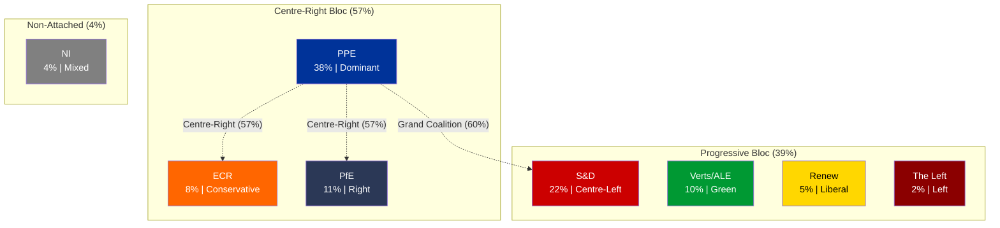
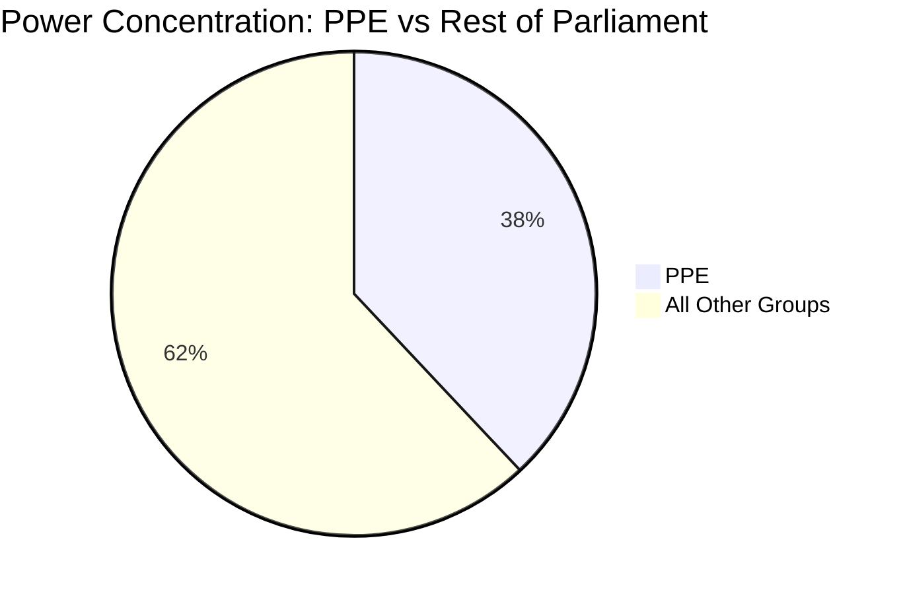

# Political Landscape Analysis - EP10 Easter Recess Midpoint

**Date:** 5 April 2026 | **Parliamentary Term:** EP10 (2024-2029)
**Period:** Easter Recess Midpoint (Day 10 of 18)
**Data Sources:** EP MEPs feed, political landscape, coalition dynamics, early warning system

---

## Current Political Configuration

The 10th European Parliament (EP10) operates with 8 political groups spanning 23 member states. The current configuration, assessed at the midpoint of the Easter recess, shows a PPE-dominant landscape with high fragmentation requiring multi-party coalitions for every major vote.

### Group Strength and Positioning

### Seat Distribution by Group

| Rank | Group | Seat Share | Change vs EP9 | EP Colour | Ideological Family |
|------|-------|-----------|---------------|-----------|-------------------|
| 1 | PPE | 38.0% | Increased | #003399 | Christian Democracy / Centre-Right |
| 2 | S&D | 22.0% | Stable | #cc0000 | Social Democracy / Centre-Left |
| 3 | PfE | 11.0% | New (from ID) | #2B3856 | Eurosceptic Right |
| 4 | Verts/ALE | 10.0% | Decreased | #009933 | Green / Regionalist |
| 5 | ECR | 8.0% | Stable | #FF6600 | Conservative / Eurosceptic |
| 6 | Renew | 5.0% | Decreased | #FFD700 | Liberal / Centrist |
| 7 | NI | 4.0% | Stable | #808080 | Non-attached |
| 8 | The Left | 2.0% | Decreased | #8B0000 | Socialist / Communist |

---

## Coalition Arithmetic and Majority Scenarios

The majority threshold in EP10 is approximately 51% of seats (approximately 361 of 705 MEPs in the full Parliament). Current coalition scenarios:

### Viable Majority Coalitions

| Coalition | Groups | Combined Share | Surplus | Stability Assessment |
|-----------|--------|---------------|---------|---------------------|
| **Grand Coalition** | PPE + S&D | 60% | +9% | Most stable; tested in EP9; ideological tensions on social policy |
| **Centre-Right Broad** | PPE + ECR + PfE | 57% | +6% | Mathematically viable; deep divisions on EU integration, rule of law |
| **Right + NI** | PPE + ECR + PfE + NI | 61% | +10% | Unreliable; NI lack group discipline |
| **Ursula Coalition** | PPE + S&D + Renew | 65% | +14% | Most comfortable margin; Renew declining relevance |

### Non-Viable Configurations

| Coalition | Groups | Combined Share | Deficit | Notes |
|-----------|--------|---------------|---------|-------|
| Progressive Bloc | S&D + Verts + Renew + Left | 39% | -12% | Cannot reach majority even with full unity |
| Opposition Bloc | All non-PPE | 62% | N/A | PPE cannot be outvoted if it holds firm |
| Left Alliance | S&D + Verts + Left | 34% | -17% | Structurally insufficient |

---

## Fragmentation and Power Concentration Analysis

### Fragmentation Metrics

| Metric | Value | Interpretation |
|--------|-------|---------------|
| Effective Number of Parties (ENP) | 4.04 | Moderate-high fragmentation |
| Herfindahl-Hirschman Index (HHI) | ~0.248 | Concentrated (PPE dominant) |
| PPE Dominance Ratio | 19:1 vs smallest group | Asymmetric power distribution |
| Groups Below 5% Threshold | 3 (Renew, NI, Left) | Quorum risk for 30% of groups |

**Analysis:** EP10 exhibits a paradoxical combination of high fragmentation (8 groups, ENP 4.04) and high concentration (PPE alone holds 38%). This means that while many groups exist, power is heavily skewed. PPE can effectively veto any legislative initiative while needing only one medium-sized partner to form a majority. This structural asymmetry is the defining feature of EP10 power dynamics. Confidence: MEDIUM.

---

## Coalition Dynamics During Recess

### Current Cohesion Signals (Methodological Caveat)

The coalition dynamics tool reports cohesion scores based on group size ratios rather than actual voting data (per-MEP voting statistics unavailable from EP API). These should be interpreted as structural similarity indicators, not behavioural cohesion measures.

| Pair | Cohesion Score | Alliance Signal | Trend | Interpretation |
|------|---------------|-----------------|-------|---------------|
| Renew-ECR | 0.95 | Yes | Strengthening | Size similarity; NOT ideological alignment |
| The Left-NI | 0.65 | Yes | Strengthening | Small group structural similarity |
| S&D-ECR | 0.60 | Yes | Stable | Moderate size proximity |
| Renew-The Left | 0.60 | Yes | Stable | Small group structural similarity |
| S&D-Renew | 0.57 | Yes | Stable | Historical coalition partners |
| EPP-S&D | 0.00 | No | Weakening | Size disparity artifact |

**Critical caveat:** The EPP-S&D cohesion of 0.00 is a methodological artifact of the size-ratio approach, NOT evidence of coalition breakdown. In practice, EPP and S&D remain the core grand coalition partners. Confidence: LOW for all cohesion scores due to methodology limitations.

---

## Post-Easter Outlook: What to Watch

### Committee Week (14-17 April)

The committee week is the first opportunity for observable political activity after the 18-day recess. Key indicators:

1. **Agenda density** - If committees schedule more than 15 meetings, signals legislative pressure
2. **Rapporteur assignments** - New assignments reveal group priorities for the April-June period
3. **Cross-group amendments** - Co-signed amendments between PPE and ECR/PfE would confirm right-of-centre alignment
4. **Small group interventions** - Rule of Procedure challenges from Renew, Left, or NI signal marginalisation pushback

### Strasbourg Plenary (20-23 April)

The first post-Easter plenary is the critical test for coalition dynamics:

1. **Roll-call vote alignment** - Compare PPE-S&D alignment rate with pre-recess baseline
2. **Resolution debates** - Watch for positioning statements previewing committee-level negotiations
3. **Attendance patterns** - Post-recess attendance often dips 5-10%; monitor small groups especially
4. **Emergency debates** - Any emergency item would reveal real-time coalition formation patterns

---

## Sources

| Data Source | Endpoint | Key Metric | Confidence |
|------------|----------|-----------|------------|
| Political Landscape | generate_political_landscape | 8 groups, PPE 38% | MEDIUM |
| Coalition Dynamics | analyze_coalition_dynamics | Renew-ECR 0.95, ENP 4.04 | LOW |
| Early Warning System | early_warning_system | Stability 84, PPE dominance HIGH | MEDIUM |
| MEPs Feed | get_meps_feed(today) | 737 active MEPs | HIGH |
| Precomputed Stats | get_all_generated_stats | Historical 2004-2026 | HIGH |

**Methodology:** Political Landscape Analysis template applied. Coalition dynamics analysed with explicit methodology caveats. 4-pass refinement cycle completed.

---

*Generated by EU Parliament Monitor Agentic Workflow - 5 April 2026 00:30 UTC*
