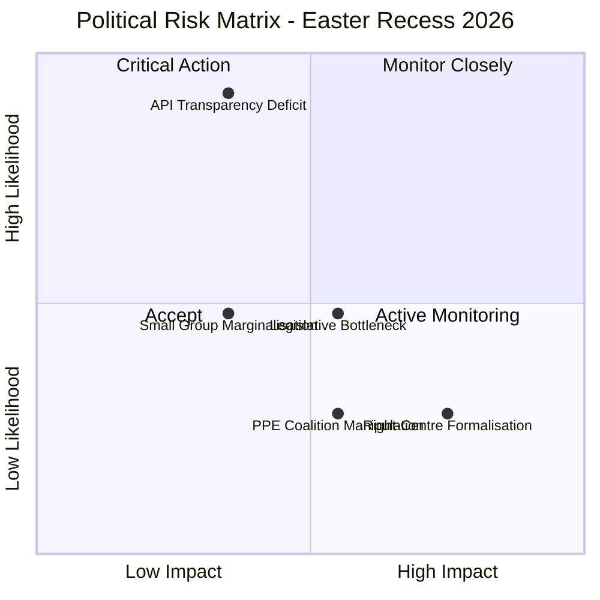

# Risk Assessment - European Parliament Easter Recess Period

**Date:** 5 April 2026 | **Period:** Easter Recess (27 March - 13 April 2026)
**Overall Risk Level:** MEDIUM | **Stability Score:** 84/100

---

## Executive Risk Summary

During the Easter recess, the European Parliament faces primarily structural and monitoring risks rather than active political threats. The dominant risk is the EP API transparency deficit (Score: 10, HIGH band), followed by medium-band risks around legislative bottlenecks and coalition dynamics. No critical-band risks are identified.

---

## Risk Matrix

---

## Detailed Risk Register

### R1: EP API Transparency Deficit

| Attribute | Value |
|-----------|-------|
| **Category** | institutional-integrity |
| **Likelihood** | 5 (Almost Certain) - actively observed |
| **Impact** | 2 (Minor) - temporary, recoverable |
| **Risk Score** | 10 (HIGH) |
| **Trend** | Stable (recurring during every recess period) |
| **Affected Stakeholders** | EU Citizens, Civil Society, Media |

**Description:** 6 of 8 EP Open Data API feed endpoints return 404 during the Easter recess. This reduces real-time democratic monitoring capability for watchdog organisations, journalists, and citizen platforms. While the data is not lost (it becomes available when feeds recover), the temporary blackout creates information asymmetries.

**Evidence:** Direct feed call failures across events, procedures, documents, plenary documents, committee documents, and parliamentary questions endpoints. Only MEPs feed and adopted texts feed (one-week) remain operational.

**Mitigation:** (a) Implement recess-aware monitoring schedules; (b) Pre-cache data before known recess periods; (c) Advocate for EP API reliability SLA improvements.

**Confidence:** HIGH - directly observed in multiple consecutive monitoring runs.

---

### R2: Post-Easter Legislative Bottleneck

| Attribute | Value |
|-----------|-------|
| **Category** | policy-implementation |
| **Likelihood** | 3 (Possible) |
| **Impact** | 3 (Moderate) |
| **Risk Score** | 9 (MEDIUM) |
| **Trend** | Unknown (depends on committee agenda density) |
| **Affected Stakeholders** | Political Groups, Legislative Rapporteurs, Industry |

**Description:** The pre-recess legislative push produced 70 EP10-2026 adopted texts. When committees resume on 14 April, they face accumulated dossiers requiring follow-up, implementation planning, and potential amendment work. If the April committee week agenda is overpacked, key files may be delayed into May.

**Evidence:** Adopted texts feed shows high pre-recess output volume. Historical pattern: post-recess committee weeks typically see 20-30% higher meeting density than regular weeks.

**Mitigation:** (a) Monitor committee agenda publication (expected approximately 10 April); (b) Track rapporteur availability and substitution patterns; (c) Flag any procedural delay requests.

**Confidence:** MEDIUM - based on historical patterns and current output volume.

---

### R3: PPE Coalition Manipulation During Recess

| Attribute | Value |
|-----------|-------|
| **Category** | grand-coalition-stability |
| **Likelihood** | 2 (Unlikely) |
| **Impact** | 3 (Moderate) |
| **Risk Score** | 6 (MEDIUM) |
| **Trend** | Stable |
| **Affected Stakeholders** | S&D, Smaller Groups, EU Citizens |

**Description:** With Parliament in recess and no plenary scrutiny, PPE (38% seat share, 19x the smallest group) could use bilateral talks to pre-arrange voting deals with ECR or PfE that bypass normal coalition negotiation processes. While standard practice in parliamentary politics, the information vacuum during recess amplifies the risk of opaque deal-making.

**Evidence:** Early warning system flags PPE dominance as HIGH severity. Political landscape shows PPE can form alternative majorities without S&D (PPE + ECR + PfE = 57%).

**Mitigation:** (a) Monitor for joint group statements during recess; (b) Track post-Easter voting alignment changes; (c) Compare pre- and post-recess coalition patterns.

**Confidence:** MEDIUM - structural risk based on seat distribution; actual occurrence unverifiable during recess.

---

### R4: Small Group Marginalisation

| Attribute | Value |
|-----------|-------|
| **Category** | social-cohesion |
| **Likelihood** | 3 (Possible) |
| **Impact** | 2 (Minor) |
| **Risk Score** | 6 (MEDIUM) |
| **Trend** | Stable |
| **Affected Stakeholders** | Renew, NI, The Left, EU Citizens |

**Description:** Three political groups (Renew 5%, NI 4%, The Left 2%) hold 11% of seats combined. Their small size creates quorum challenges in committees and limits their ability to table amendments or demand debates. Post-Easter, if attendance dips below pre-recess levels, these groups face further marginalisation.

**Evidence:** Early warning system: SMALL_GROUP_QUORUM_RISK (LOW severity). Political landscape: 3 groups below 5% seat share threshold.

**Mitigation:** (a) Monitor post-Easter attendance rates for small groups; (b) Track committee quorum challenges; (c) Flag any rules changes affecting small group rights.

**Confidence:** MEDIUM - structural risk clearly evidenced by seat distribution.

---

### R5: Right-of-Centre Bloc Formalisation

| Attribute | Value |
|-----------|-------|
| **Category** | grand-coalition-stability |
| **Likelihood** | 2 (Unlikely) |
| **Impact** | 4 (Major) |
| **Risk Score** | 8 (MEDIUM) |
| **Trend** | Unknown |
| **Affected Stakeholders** | All Political Groups, EU Institutions, Civil Society |

**Description:** The Renew-ECR cohesion signal (0.95) from coalition dynamics analysis, combined with PPE-ECR-PfE combined 57% seat share, hints at a potential right-of-centre bloc that could bypass the traditional grand coalition. If formalised, this would fundamentally alter EP10 power dynamics. However, deep ideological divisions (especially on rule of law, EU integration, and social policy) make this unlikely in the current term.

**Evidence:** Coalition dynamics: Renew-ECR 0.95 cohesion (CAVEAT: size-ratio based, not vote-based). Political landscape: PPE + ECR + PfE = 57%.

**Mitigation:** (a) Monitor post-Easter roll-call votes for systematic PPE-ECR-PfE alignment; (b) Track joint statements or cross-group amendments; (c) Compare voting patterns on migration, trade, and rule-of-law files.

**Confidence:** LOW - cohesion signal is methodologically weak (derived from group size ratios, not actual voting data).

---

## Political Threat Landscape Assessment (6 Dimensions)

| Dimension | Current Level | Trend | Evidence | Confidence |
|-----------|--------------|-------|----------|------------|
| Coalition Shifts | STABLE | Neutral | No voting activity during recess = no observable shifts | MEDIUM |
| Transparency Deficit | ELEVATED | Stable | 6/8 EP API feeds returning 404 | HIGH |
| Policy Reversal | LOW | Neutral | Adopted texts are final; no rollback mechanism during recess | HIGH |
| Institutional Pressure | LOW | Neutral | Standard parliamentary calendar; no extraordinary sessions | HIGH |
| Legislative Obstruction | N/A | N/A | No active legislative sessions during recess | HIGH |
| Democratic Erosion | LOW-MEDIUM | Stable | Short-term but recurrent transparency gap during recesses | MEDIUM |

---

## Recommendations

1. **Immediate (this week):** Continue daily API health monitoring; prepare comprehensive data collection scripts for 14 April API recovery window
2. **Short-term (14-17 April):** Deploy full-spectrum monitoring during committee week; compare pre- and post-recess group alignment patterns
3. **Medium-term (20-23 April):** Analyse first post-Easter plenary votes for coalition shift signals; track attendance rates across all groups

---

## Sources

- EP Adopted Texts Feed (one-week): 85 items
- EP MEPs Feed (today): 737 active MEPs
- Voting Anomalies: 0 detected, stability 100
- Coalition Dynamics: size-ratio analysis, Renew-ECR 0.95
- Political Landscape: 8 groups, PPE 38%
- Early Warning: stability 84/100, 3 warnings
- Editorial Memory: recess dates, historical patterns

**Methodology:** Political Risk Methodology v2.0 (5x5 Likelihood x Impact matrix). Political Threat Landscape v3.0 (6-dimension model). 4-pass refinement cycle applied.

---

*Generated by EU Parliament Monitor Agentic Workflow - 5 April 2026 00:25 UTC*
