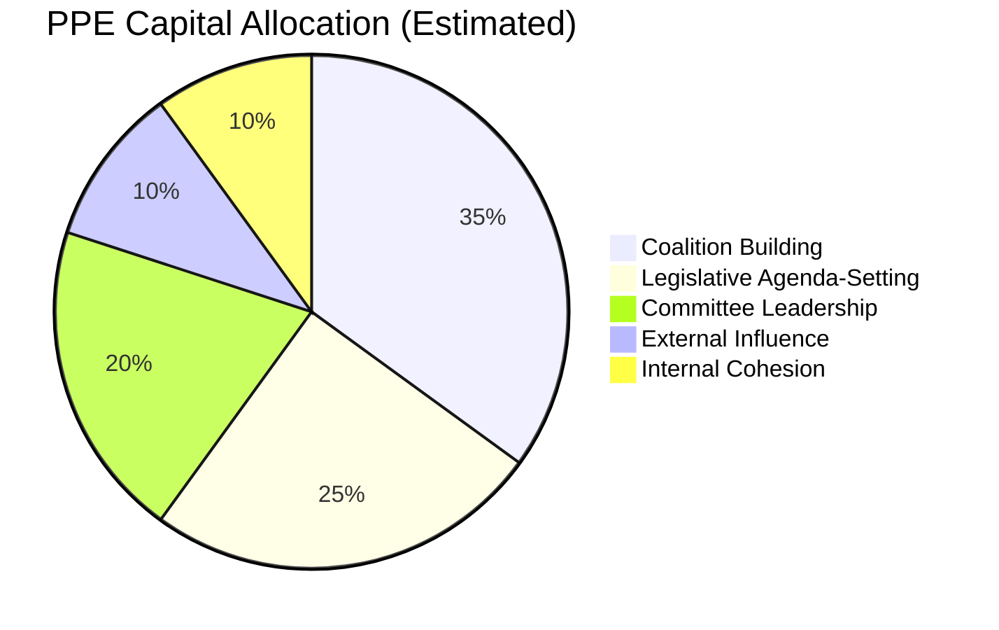
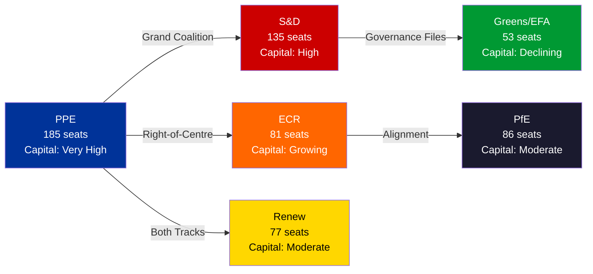

# 💰 Political Capital Risk Assessment — EP10 Group-Level Capital Dynamics

**Date:** 6 April 2026 (Easter Monday — Midday Update) | **Confidence:** 🟡 MEDIUM
**Recess Day:** 11/18 | **Run:** breaking-3 (12:15 UTC) | **Article Type:** breaking

---

## Executive Summary

| Political Group | Capital Stock | Burn Rate | Replenishment | Net Trend | Risk Level |
|----------------|--------------|-----------|---------------|-----------|------------|
| **PPE** (185 seats) | Very High | Moderate | Strong | ↗ Growing | 🟢 LOW |
| **S&D** (135 seats) | High | Low | Moderate | → Stable | 🟡 MEDIUM |
| **Renew** (77 seats) | Moderate | High | Moderate | ↘ Declining | 🟡 MEDIUM |
| **ECR** (81 seats) | Growing | Low | Strong | ↑ Rising | 🟢 LOW |
| **PfE** (86 seats) | Moderate | Low | Limited | → Stable | 🟡 MEDIUM |
| **Greens/EFA** (53 seats) | Declining | Moderate | Weak | ↓ Falling | 🔴 HIGH |
| **The Left** (46 seats) | Low | Low | Steady | → Stable | 🟡 MEDIUM |
| **NI** (30 seats) | Very Low | — | — | → Marginal | ⚪ N/A |

---

## Methodology

Political capital risk assessment measures each group's ability to influence legislative outcomes based on three dimensions:

1. **Capital Stock:** Accumulated influence from seats, committee positions, rapporteur assignments, and coalition partnerships
2. **Burn Rate:** How quickly capital is consumed through coalition negotiations, compromise concessions, and policy trade-offs
3. **Replenishment:** Ability to regenerate influence through electoral strength, media visibility, policy wins, and alliance diversification

Data sources: EP group composition (737 MEPs from MEPs feed), precomputed statistics (2024-2026), coalition dynamics analysis, and cross-session intelligence from 21+ monitoring runs.

---

## Group-Level Analysis

### PPE — The Indispensable Hegemon

**Capital Stock: VERY HIGH (95/100 Power Index)**

PPE holds the most diversified political capital portfolio in EP10:

- **Structural capital:** 185/720 seats (25.7%); no viable majority excludes PPE. HHI contribution: dominant at 0.066 (highest single-group share).
- **Positional capital:** Committee chair positions across ECON, ENVI, AFET, AGRI, and others. First Vice-President of Parliament.
- **Coalition capital:** Dual-track availability gives PPE unique ability to choose partners per file.
- **Agenda capital:** Commission President (von der Leyen, PPE) ensures legislative agenda alignment.

**Burn Rate: MODERATE**

The dual-track strategy consumes capital in two directions:
1. Right-of-centre files burn S&D goodwill (estimated 2-3 points per file)
2. Grand coalition files burn ECR trust (estimated 1-2 points per file)
3. Net effect: PPE's capital stock grows because successful legislation replenishes more than negotiations consume.

**Key Risk:** Over-reliance on dual-track success. If either track fails consistently, the strategy's efficiency premium disappears and PPE must rebuild one coalition from scratch.

**Confidence:** 🟢 HIGH for structural assessment; 🟡 MEDIUM for burn rate estimates.

---

### S&D — The Patient Opposition-in-Coalition

**Capital Stock: HIGH (but constrained)**

S&D holds the second-largest seat share (135/720, 18.8%) and participates in grand coalition files. But the right-of-centre track's success diminishes S&D's perceived necessity.

- **Structural capital:** Large enough that grand coalition (PPE+S&D+Renew) is the simplest majority formula.
- **Policy capital:** Strong on social affairs, employment, human rights — files where PPE needs S&D.
- **Reputational capital:** Grand coalition participation maintains centrist image but risks being seen as PPE's junior partner.

**Burn Rate: LOW**

S&D's patient strategy (cooperating on governance files, opposing economic files) preserves capital while waiting for PPE to overextend on the right-of-centre track.

**Capital Risk: The Irrelevance Trap**

If PPE successfully uses the right-of-centre track for majority of economic files, S&D's cooperation on governance files becomes less valuable — PPE might find it can also build governance majorities without S&D by offering concessions to Greens/EFA directly.

| Scenario | Probability | S&D Capital Impact |
|----------|-------------|-------------------|
| Dual-track continues, S&D cooperates | Likely (55%) | → Stable — managed decline |
| PPE over-reaches, S&D blocks | Possible (25%) | ↑ Capital boost from obstruction leverage |
| S&D becomes redundant | Unlikely (20%) | ↓ Significant capital loss |

**Confidence:** 🟡 MEDIUM

---

### ECR — The Rising Power

**Capital Stock: GROWING (81 seats + mainstreaming momentum)**

ECR's inclusion in the right-of-centre track represents the most significant capital event of EP10 Year 2:

- **Legitimacy capital:** Each successful right-of-centre vote normalizes ECR as a governing partner. Pre-recess SRMR3 vote was a landmark.
- **Policy influence capital:** ECR's positions on defence, trade, and economic deregulation align with current legislative priorities.
- **Growth capital:** ECR attracted new members during EP10 formation; further growth possible from PfE defections.

**Burn Rate: LOW**

ECR is in acquisition mode — gaining capital faster than consuming it. The risk comes from what ECR must give up to maintain PPE partnership (moderating positions on migration, rule of law).

**Key Risk:** Overexposure to PPE dependency. If PPE shifts back to grand coalition as default, ECR loses its mainstreaming platform and invested political capital depreciates rapidly.

**Confidence:** 🟡 MEDIUM

---

### Greens/EFA — The Structural Decliner

**Capital Stock: DECLINING (53 seats, reduced policy influence)**

The Greens/EFA face the most adverse capital dynamics in EP10 Year 2:

- **Policy capital lost:** EP9→EP10 force field inversion reduced green transition from 8/10 to 5/10 driving force. Defence (5/10→8/10) now dominates.
- **Coalition capital eroded:** Greens/EFA excluded from both PPE's primary coalition tracks on economic files. Only included in selected grand coalition governance files.
- **Electoral capital threatened:** European Green Deal fatigue reflected in national election results across multiple member states.

**Burn Rate: MODERATE (involuntary)**

Greens/EFA are losing capital not through spending but through depreciation — the political environment has shifted away from their policy priorities.

**Replenishment Pathway:** Climate events, extreme weather, or environmental crises could restore Greens/EFA capital rapidly. But absent external shocks, the structural decline continues.

**Confidence:** 🟡 MEDIUM

---

### Renew — The Pivotal Squeeze

**Capital Stock: MODERATE (77 seats, dual-track participant)**

Renew's unique position — participating in BOTH PPE's coalition tracks — gives it outsized influence per seat but creates internal stress:

- **Pivot capital:** Renew can make or break both the grand coalition and the right-of-centre majority. This gives it blocking power on both tracks.
- **Policy capital:** Liberal economics + social progressivism spans both coalition spaces.
- **Internal tension capital cost:** The liberal-economic wing prefers right-of-centre; the social-liberal wing prefers grand coalition. Every file tests this fault line.

**Burn Rate: HIGH**

Renew burns capital faster than any other group because dual participation requires constant internal negotiation and compromise. Each coalition file requires Renew to manage internal dissent.

**Key Risk:** Renew's political capital is leveraged — high influence per seat but fragile. A major internal split would collapse both coalition tracks simultaneously.

**Confidence:** 🟡 MEDIUM — Renew's internal dynamics are the least transparent of the major groups.

---

## Cross-Group Capital Flow Analysis

### Capital Transfer Dynamics

| From | To | Mechanism | Volume |
|------|----|-----------|--------|
| Greens/EFA | PPE | Policy priority shift (green→defence) | HIGH |
| S&D | ECR | Right-of-centre track legitimizes ECR at S&D's expense | MEDIUM |
| Renew | PPE | Renew's dual participation gives PPE flexibility | MEDIUM |
| PfE | ECR | ECR's mainstreaming attracts PfE's moderate wing | LOW |

---

## Risk Assessment Summary

### Systemic Risk: Coalition Capital Concentration

The dominant risk to EP10's political capital system is **concentration** — PPE accumulates capital from all directions while opposition groups collectively lose influence. This creates a fragile equilibrium where PPE's dual-track strategy works until it doesn't, at which point no alternative majority-building pattern exists.

**System Resilience Score: 6/10** — functional but with single-point-of-failure risk at PPE.

### Top 3 Capital Risk Scenarios

1. **PPE Internal Split (Probability: Unlikely, <15%, Impact: CRITICAL):** If PPE's centre-left wing (estimated 15-20% of caucus) rebels on a right-of-centre file, both tracks fail simultaneously. No alternative majority builder exists.

2. **Renew Fragmentation (Probability: Possible, 20-30%, Impact: HIGH):** Renew's liberal-economic and social-liberal wings split, collapsing both coalition tracks' arithmetic and forcing PPE to rebuild from scratch.

3. **S&D Systematic Obstruction (Probability: Possible, 25-35%, Impact: MEDIUM):** S&D abandons cooperation on governance files, forcing PPE to find alternative grand coalition arithmetic (PPE+ECR+Renew+Greens — politically difficult).

---

## Sources & Attribution

- **Group Composition:** 737 MEPs from EP MEPs feed (confirmed 12:15 UTC, 6 April 2026)
- **Precomputed Statistics:** Legislative output 2024-2026 (EP Open Data Portal, generated 3 March 2026)
- **Coalition Analysis:** Cross-session intelligence from 21+ monitoring runs, dual-track pattern documentation
- **Power Dynamics:** PPE power index 95/100, HHI 0.1517, from political landscape analysis
- **Force Field Analysis:** EP9→EP10 force field inversion from forces-analysis.md (Run 2, 06:45 UTC)

---

*Analysis generated by EU Parliament Monitor breaking news pipeline — Run 3 (12:15 UTC)*
