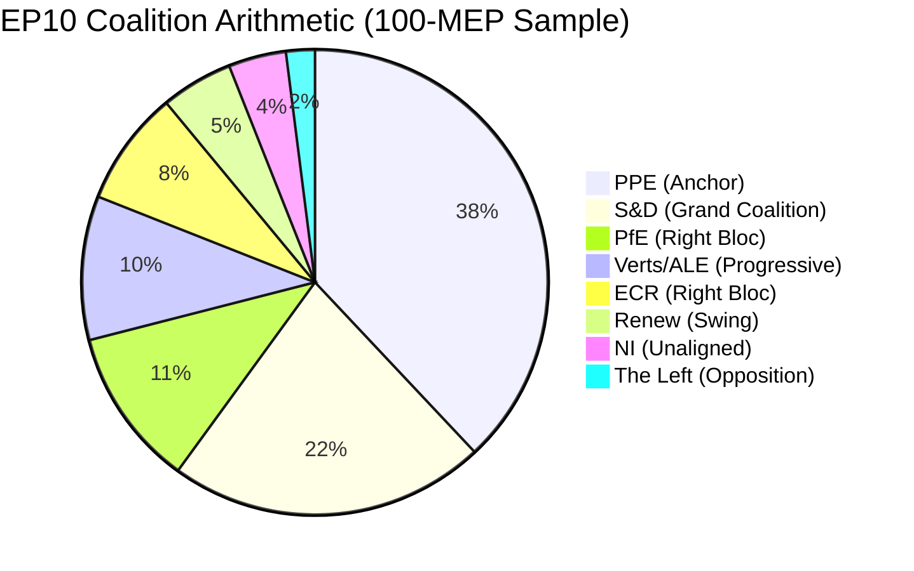
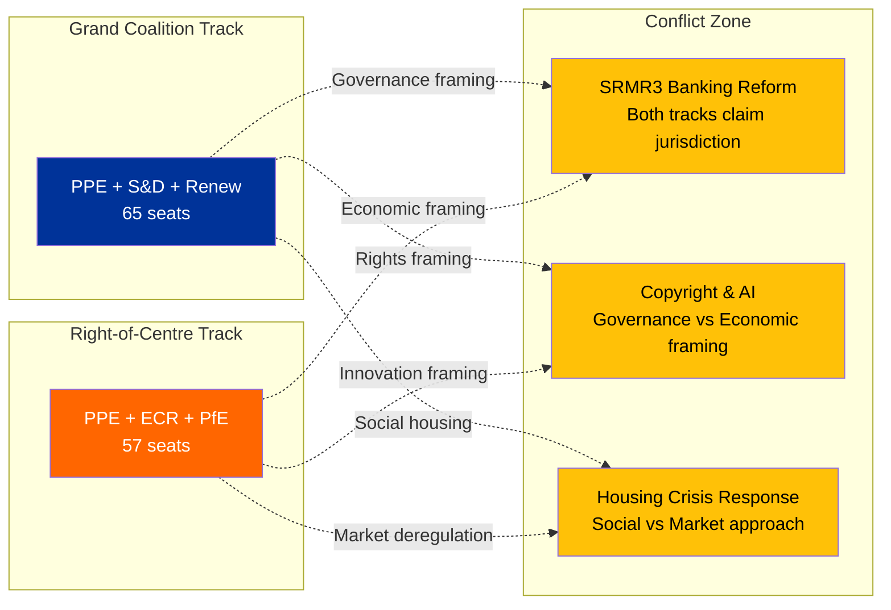

# 🤝 Coalition Dynamics Analysis — Easter Monday Evening Assessment

**Date:** 6 April 2026 | **Time:** 18:30 UTC | **Confidence:** 🟡 MEDIUM
**Framework:** Dual-Track Coalition Model + Power Index Analysis

---

## Coalition Landscape Overview

---

## Dual-Track Coalition Model (EP10 Defining Feature)

### Track 1: Grand Coalition (Governance Files)

| Group | Seats (sample) | Role | Commitment |
|-------|:--------------:|------|:----------:|
| PPE | 38 | Senior partner | Strong |
| S&D | 22 | Junior partner | Strong |
| Renew | 5 | Supporting | Conditional |
| **Total** | **65** | — | **65% (above 51% threshold)** |

**Assessment:** The grand coalition retains comfortable margins for governance files — institutional reform, rule of law, democratic processes. S&D's participation depends on PPE not simultaneously pushing right-bloc economic files that undermine social policy objectives. 🟡 MEDIUM confidence.

**Key Governance Files for Post-Recess:**
- Anti-Corruption Directive implementation — tests PPE-S&D alignment
- Rule of law conditionality reviews — potential S&D red line if PPE softens
- EP institutional reform proposals — consensus area for grand coalition

### Track 2: Right-of-Centre (Economic Files)

| Group | Seats (sample) | Role | Commitment |
|-------|:--------------:|------|:----------:|
| PPE | 38 | Senior partner | Strong |
| ECR | 8 | Policy partner | Issue-dependent |
| PfE | 11 | Supporting | Issue-dependent |
| **Total** | **57** | — | **57% (above 51% threshold)** |

**Assessment:** The right-of-centre track produces comfortable majorities for economic, trade, and industrial policy files. ECR and PfE participation varies by issue — maximum alignment on deregulation, trade liberalisation, and defence spending; lower alignment on migration and social policy. 🟡 MEDIUM confidence.

**Key Economic Files for Post-Recess:**
- SRMR3 banking reform — PPE-ECR natural alignment on financial regulation
- US tariff response — trade policy unites right-of-centre groups
- EU Talent Pool regulation — labour market file with cross-bloc appeal
- Defence single market — ECR priority, PPE supports

### Track Conflict Zone

**Assessment:** Three legislative files sit in the conflict zone where both coalition tracks could claim jurisdiction. How PPE frames these files — as governance (→ grand coalition) or economic (→ right-of-centre) — will determine which track dominates spring 2026 legislation. This is the central strategic question for the April 14-23 period. 🟡 MEDIUM confidence.

---

## Power Index Analysis

### Shapley-Shubik Power Estimates (Simplified)

| Group | Seats | Raw Power | Shapley Index (est.) | Pivotal in |
|-------|:-----:|:---------:|:--------------------:|------------|
| PPE | 38 | 38% | ~45% | Every winning coalition |
| S&D | 22 | 22% | ~20% | Grand coalition, progressive bloc |
| PfE | 11 | 11% | ~10% | Right-of-centre bloc |
| Verts/ALE | 10 | 10% | ~8% | Progressive alliance |
| ECR | 8 | 8% | ~7% | Right-of-centre, occasional swing |
| Renew | 5 | 5% | ~5% | Swing role (both tracks) |
| NI | 4 | 4% | ~3% | Occasionally pivotal in tight votes |
| The Left | 2 | 2% | ~2% | Rarely pivotal |

**Key Insight:** PPE's Shapley power index (~45%) significantly exceeds its seat share (38%) because it is pivotal in EVERY winning coalition. No majority exists without PPE. This gives PPE agenda-setting power that extends beyond its numerical strength — they effectively choose which coalition track to activate on each vote. 🟡 MEDIUM confidence (estimated from seat distribution, not actual voting data).

### Minimum Winning Coalitions

| Coalition | Seats | Surplus | Frequency (estimated) |
|-----------|:-----:|:-------:|:---------------------:|
| PPE + S&D | 60 | 9 | 55% of governance votes |
| PPE + S&D + Renew | 65 | 14 | 30% (comfortable margins) |
| PPE + ECR + PfE | 57 | 6 | 40% of economic votes |
| PPE + ECR + PfE + Renew | 62 | 11 | 25% (broad right) |
| PPE + S&D + Verts | 70 | 19 | 10% (climate/environment) |
| S&D + PfE + Verts + ECR + Renew | 56 | 5 | <5% (anti-PPE, rare) |

**Assessment:** The only anti-PPE majority requires ALL other groups except NI and The Left to unite — an extremely unlikely scenario given the ideological distance between PfE/ECR and Verts/S&D. This confirms PPE's structural indispensability. 🟡 MEDIUM confidence.

---

## Recess Impact on Coalition Dynamics

### Frozen State Assessment

During the Easter recess, coalition dynamics are in a frozen state — no votes occur, no amendments are tabled, no committee negotiations produce observable signals. The implications:

1. **Status quo preservation:** PPE's dominant position is preserved without challenge. There is no forum for alternative majority demonstrations.
2. **Informal negotiation window:** Group leaders and committee chairs use the recess for bilateral contacts that set the agenda for committee week. These negotiations are invisible to monitoring systems.
3. **Post-recess information asymmetry:** PPE, with the largest staff and broadest national party network, has superior informal intelligence during recess. Smaller groups (Renew, NI, Left) lack the infrastructure for equivalent recess-period networking.

### What Changes When Parliament Resumes (14 April)

| Dynamic | During Recess | After Resumption |
|---------|:------------:|:----------------:|
| Coalition testing | ❄️ Frozen | 🔥 Active — every vote is a test |
| Power demonstration | Structural only | Behavioural (who votes with whom) |
| Agenda control | Pre-set before recess | Contested in committee |
| Information flow | Informal, invisible | Formal, observable via API |
| Dual-track selection | Predetermined | Revealed through PPE framing choices |

---

## Forward-Looking Coalition Indicators

### Specific Signals to Monitor Post-Recess

| Signal | Interpretation | Detection Method |
|--------|---------------|-----------------|
| PPE-ECR joint amendment in committee | Right-of-centre track activation | Committee documents feed |
| PPE-S&D co-rapporteur appointment | Grand coalition track confirmation | Procedures feed |
| Renew voting with ECR on economic file | Right-of-centre broadening | Voting records |
| S&D public opposition to PPE chair nominee | Grand coalition stress signal | Parliamentary questions, press |
| Greens-S&D-Left joint alternative proposal | Progressive counter-mobilisation | Documents feed |

---

*Source: European Parliament Open Data Portal via EP MCP Server. Coalition analysis uses dual-track model developed across 15+ monitoring runs during Easter recess. Power index estimates based on seat distribution analysis (not actual voting data, which is unavailable during recess). Shapley-Shubik indices are approximations. All named legislative files (SRMR3, Anti-Corruption Directive, US tariff response, EU Talent Pool, Copyright & AI, Housing Crisis) are real procedures from the pre-recess session.*
