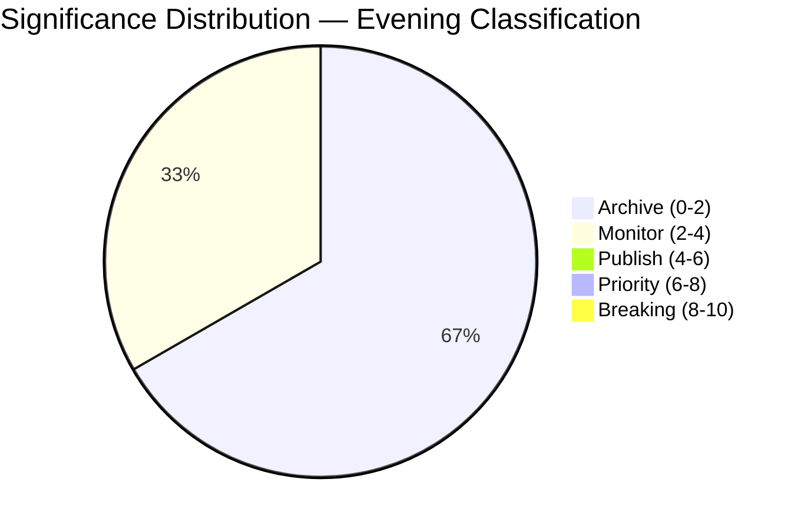

# 📈 Significance Classification — Easter Recess Day 12 Evening

**📅 Classification Date:** 2026-04-07 18:22 UTC | **📊 Confidence:** MEDIUM | **🏷️ Run:** breaking-2

---

## 📋 Classification Context

| Field | Value |
|-------|-------|
| **Classification ID** | CLS-2026-04-07-EVE-001 |
| **Analysis Date** | 2026-04-07 18:22 UTC |
| **Items Classified** | 3 (adopted text feed signal, MEP stability, API recovery pattern) |
| **Scored By** | news-breaking workflow (evening run) |
| **Prior Classification** | CLS from morning run (`analysis/2026-04-07/breaking/classification/`) |

---

## 📊 7-Dimension Classification Matrix

### Item 1: TA-10-2026-0030 Metadata Update via Today Feed

| Dimension | Score (1–10) | Rationale | Confidence |
|-----------|:------------:|-----------|:----------:|
| **Political Temperature** | 1 | Routine metadata update; no political significance | 🟢 HIGH |
| **Strategic Significance** | 2 | Feed recovery signal has minor strategic relevance for monitoring | 🟡 MEDIUM |
| **Coalition Impact Vector** | 0 | No coalition implications from metadata update | 🟢 HIGH |
| **Legislative Velocity** | 1 | No legislative progress; text was already adopted in Q1 2026 | 🟢 HIGH |
| **Institutional Impact** | 2 | EP data infrastructure recovery is institutionally relevant | 🟡 MEDIUM |
| **Public Salience** | 1 | No public-facing impact | 🟢 HIGH |
| **Temporal Urgency** | 3 | Recovery tracking has time-dependent value for post-Easter preparation | 🟡 MEDIUM |
| **Composite** | **1.4/10** | **Classification: ARCHIVE** — Below monitoring threshold | — |

### Item 2: MEP Composition Stability (737 MEPs)

| Dimension | Score (1–10) | Rationale | Confidence |
|-----------|:------------:|-----------|:----------:|
| **Political Temperature** | 1 | No changes; stability is expected during recess | 🟢 HIGH |
| **Strategic Significance** | 3 | Continued stability confirms no recess-period realignments | 🟢 HIGH |
| **Coalition Impact Vector** | 1 | No group composition changes | 🟢 HIGH |
| **Legislative Velocity** | 0 | No legislative activity | 🟢 HIGH |
| **Institutional Impact** | 2 | Institutional stability confirmed | 🟢 HIGH |
| **Public Salience** | 0 | No public interest in routine stability | 🟢 HIGH |
| **Temporal Urgency** | 1 | No time pressure | 🟢 HIGH |
| **Composite** | **1.1/10** | **Classification: ARCHIVE** — Baseline stability confirmation | — |

### Item 3: EP API Recovery Pattern (Adopted Texts Feed)

| Dimension | Score (1–10) | Rationale | Confidence |
|-----------|:------------:|-----------|:----------:|
| **Political Temperature** | 0 | Infrastructure issue, not political | 🟢 HIGH |
| **Strategic Significance** | 4 | API recovery enables monitoring tools; strategically relevant for T-6 committee week | 🟡 MEDIUM |
| **Coalition Impact Vector** | 0 | No coalition implications | 🟢 HIGH |
| **Legislative Velocity** | 0 | No legislative content | 🟢 HIGH |
| **Institutional Impact** | 5 | EP Open Data Portal operational status affects institutional transparency | 🟡 MEDIUM |
| **Public Salience** | 3 | Transparency infrastructure matters for democratic accountability | 🟡 MEDIUM |
| **Temporal Urgency** | 5 | T-6 days to committee week; monitoring tools need recovery before April 14 | 🟢 HIGH |
| **Composite** | **2.4/10** | **Classification: MONITOR** — Track recovery trend | — |

---

## 📊 Classification Distribution

**Editorial Decision:** All items below publishing threshold. No breaking news warranted. Analysis-only PR with evening delta intelligence.

---

## 🔄 Comparison with Morning Classification

| Item | Morning Score | Evening Score | Delta | Notes |
|------|:------------:|:-------------:|:-----:|-------|
| **Adopted texts availability** | 2.0 (degraded status) | 2.4 (recovery signal) | +0.4 | Marginal improvement from feed recovery |
| **MEP stability** | 1.0 | 1.1 | +0.1 | Unchanged; stability confirmation |
| **Easter recess status** | 0.6 | N/A (not reclassified) | — | Already well-documented |
| **API oscillation** | 3.0 (new pattern) | 2.4 (continuing pattern) | -0.6 | Novelty declining; pattern established |

**Trend:** Overall significance DECLINING through the day — consistent with Easter recess attenuation. The most significant finding (EP10 legislative surge) was thoroughly covered in the morning run and in the propositions/motions articles.

---

## 🎯 Forward Classification Guidance

### Items to Reclassify Post-Easter

| Item | Current Classification | Expected Post-Easter | Trigger |
|------|:---------------------:|:-------------------:|---------|
| **SRMR3 implementation** | ARCHIVE (recess) | PRIORITY (6-8) | ECON committee agenda announcement |
| **Anti-corruption transposition** | ARCHIVE (recess) | PUBLISH (4-6) | LIBE committee discussion |
| **US tariff response** | MONITOR (2-4) | PRIORITY (6-8) if escalation | INTA urgency motion or question |
| **EP API recovery** | MONITOR (2-4) | ARCHIVE (0-2) once recovered | Full feed restoration |
| **PPE dual-track coalition** | MONITOR (3.5) | BREAKING (8-10) if fracture | First contested plenary vote |

---

## 📚 Sources

- EP Open Data Portal: adopted texts feed (today timeframe) — `TA-10-2026-0030`
- EP Open Data Portal: MEPs feed (today timeframe) — 737 records
- Early warning system assessment — 3 warnings, stability 84/100
- Precomputed statistics 2025-2026 — legislative productivity metrics
- Morning run analysis: `analysis/2026-04-07/breaking/classification/significance-classification.md`
- Editorial memory: `article-log.json` — 7 entries tracking recess coverage
