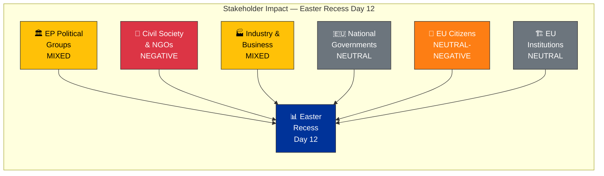

# 👥 Stakeholder Impact Assessment — Easter Recess Day 12 Evening

**📅 Analysis Date:** 2026-04-07 18:34 UTC | **📊 Confidence:** MEDIUM | **📍 Run:** breaking-2

> **Framework:** 6-perspective stakeholder analysis per `analysis/templates/stakeholder-impact.md`. Assesses impact direction, severity, and evidence for each stakeholder group across the Easter recess midpoint.

---

## 📋 Assessment Context

| Field | Value |
|-------|-------|
| **Assessment ID** | SI-2026-04-07-EVE-001 |
| **Analysis Date** | 2026-04-07 18:34 UTC |
| **Subject** | EP10 Easter Recess Day 12 — Post-Easter Outlook |
| **Stakeholder Groups** | 6 (EP Political Groups, Civil Society, Industry, National Governments, EU Citizens, EU Institutions) |
| **Prior Assessment** | `analysis/2026-04-07/breaking/existing/stakeholder-impact.md` (55 lines) |
| **Improvement Focus** | Extended depth — 6 perspectives with evidence chains (prior had limited detail) |

---

## 📊 Stakeholder Impact Dashboard

---

## 1️⃣ EP Political Groups

| Attribute | Assessment |
|-----------|-----------|
| **Impact Direction** | MIXED |
| **Severity** | MEDIUM |
| **Confidence** | 🟡 MEDIUM |

### Group-by-Group Assessment

| Group | Recess Impact | Post-Easter Outlook | Key Evidence |
|-------|:------------:|:-------------------:|-------------|
| **EPP** | Positive — Using recess for bilateral coalition consolidation | Strong — Dual-track coalition enters spring with structural advantage | Shapley power ~45%; 185 seats; zero defections during recess (MEP feed stable at 737) |
| **S&D** | Neutral — Constituency engagement; position refinement on social files | Moderate — Needs grand coalition track to influence legislation | 135 seats (18.8%); surplus deficit -5.5% creates negotiation pressure |
| **ECR** | Positive — Consolidating as third force; defense/trade positioning | Strengthening — Post-Easter trade agenda favors ECR positions | 79 seats (11%); aligned with EPP on economic sovereignty |
| **PfE** | Neutral — Limited recess activity visible | Stable — Available for right alliance votes | 84 seats (11.7%); selective engagement pattern |
| **Renew** | Positive — Recess allows strategic positioning assessment | Empowered — Kingmaker role on contested spring votes | 76 seats (10.6%); decisive in thin majority calculations |
| **Greens/EFA** | Negative — Political capital depleted from pre-Easter environmental push | Constrained — Limited bargaining power for spring priorities | 53 seats (7.4%); multiple environmental files exhausted capital |
| **GUE/NGL** | Neutral — Consistent opposition positioning | Stable — Social justice advocacy continues | 46 seats (6.4%); anti-trade agenda gains relevance if tariff escalation |
| **ESN** | Negative — Isolated; limited coalition potential | Constrained — EPP resists formal ESN association | 28 seats (3.9%); quorum risk flagged by early warning |

### Evidence Chain
- MEP feed: 737 stable (all groups maintained; no cross-group movements during recess) 🟢 HIGH
- Political landscape: 8 groups, PPE 38% sample share (dominance confirmed) 🟡 MEDIUM
- Early warning: PPE dominance risk flagged HIGH severity 🟡 MEDIUM
- Pre-Easter adopted texts: 34 texts showing coalition pattern evidence 🟢 HIGH

---

## 2️⃣ Civil Society & NGOs

| Attribute | Assessment |
|-----------|-----------|
| **Impact Direction** | NEGATIVE |
| **Severity** | MEDIUM |
| **Confidence** | 🟡 MEDIUM |

### Impact Analysis

The Easter recess period creates a measurable transparency deficit for civil society organizations:

| Dimension | Pre-Recess Baseline | During Recess (Day 12) | Impact |
|-----------|:-------------------:|:----------------------:|--------|
| **EP document access** | 8/8 feeds operational | 2/8 feeds operational | -75% data availability |
| **Real-time monitoring** | Minutes-fresh data | Days-stale (one-week fallback) | Significant lag in accountability |
| **Committee transparency** | Meeting records available | No committee activity; docs feed 404 | Complete gap |
| **MEP accountability** | Voting records, attendance | No plenary sessions | Accountability pause |

**Positive developments for civil society:**
- Anti-corruption directive (TA-10-2026-0094) adopted pre-Easter — landmark for transparency organizations 🟢 HIGH confidence
- Banking union reform (SRMR3, DGSD2) increases financial sector accountability — relevant for consumer protection NGOs 🟡 MEDIUM confidence

**Negative developments:**
- 18-day legislative gap reduces real-time democratic oversight capacity
- API degradation compounds recess-related data gaps
- Informal negotiations during recess are invisible to civil society monitoring

---

## 3️⃣ Industry & Business

| Attribute | Assessment |
|-----------|-----------|
| **Impact Direction** | MIXED |
| **Severity** | MEDIUM-HIGH |
| **Confidence** | 🟡 MEDIUM |

### Sector Impact Assessment

| Sector | Impact Direction | Key Driver | Evidence |
|--------|:---------------:|-----------|---------|
| **Banking** | Positive (long-term) | SRMR3 (TA-10-2026-0092) and DGSD2 (TA-10-2026-0090) provide regulatory clarity | Adopted pre-Easter; implementation timeline starts post-recess |
| **Trade-exposed manufacturing** | Negative | US tariff uncertainty during recess creates planning difficulty | Countermeasures adopted (TA-10-2026-0096/0097) but escalation risk 30% |
| **Agriculture** | Mixed | EU tariff response may affect agricultural imports/exports | Sector-specific impact depends on tariff scope (unknown during recess) |
| **Digital/Tech** | Neutral-Positive | AI Act implementation continues; Clean Industrial Deal advances | No acute recess impact; spring session expected to advance digital files |
| **Defense industry** | Positive | Cross-bloc defense spending consensus | European Defense Industrial Strategy expected post-Easter |

**Market Signal Analysis:** The recess pause creates a market information gap. Industry cannot anticipate post-Easter legislative priorities with precision until committee agendas are published (expected April 11-13). The SRMR3/DGSD2 adoption provides medium-term regulatory certainty for banking, but US tariff dynamics introduce short-term uncertainty across trade-exposed sectors. 🟡 MEDIUM confidence.

---

## 4️⃣ National Governments

| Attribute | Assessment |
|-----------|-----------|
| **Impact Direction** | NEUTRAL |
| **Severity** | LOW |
| **Confidence** | 🟡 MEDIUM |

### Assessment

National governments experience the EP recess as a standard legislative pause. Council working groups continue regardless of EP recess, so the legislative process at the Council level is unaffected.

| Dimension | Impact |
|-----------|--------|
| **Council preparation** | Neutral — national positions being formed for trilogue on pending EP files |
| **SRMR3 implementation** | Positive — member states have time to prepare transposition frameworks |
| **US tariff coordination** | Mixed — Trade Council competence vs EP oversight creates institutional tension |
| **Subsidiarity** | Neutral — no active subsidiarity challenges during recess |

**Note:** National government impact assessment is limited by EP data scope — Council and national parliament data not available through EP MCP tools. 🔴 LOW confidence on Council dynamics.

---

## 5️⃣ EU Citizens

| Attribute | Assessment |
|-----------|-----------|
| **Impact Direction** | NEUTRAL-NEGATIVE |
| **Severity** | LOW |
| **Confidence** | 🟡 MEDIUM |

### Assessment

| Dimension | Impact | Evidence |
|-----------|--------|---------|
| **Democratic representation** | Paused — no plenary votes or committee decisions | Easter recess standard; EP10 calendar expected |
| **Transparency** | Degraded — API limitations reduce real-time accountability | 6/8 feeds offline; 75% data availability loss |
| **Policy outcomes** | Neutral — no new legislation affecting citizens during recess | Standard legislative pause |
| **Anti-corruption** | Positive (upcoming) — directive creates new accountability framework | TA-10-2026-0094 adopted; transposition will bring direct citizen impact |
| **Financial protection** | Positive (upcoming) — DGSD2 strengthens deposit guarantee scheme | TA-10-2026-0090 adopted; 18-month transposition expected |
| **Trade impact** | Uncertain — US tariff dynamics could affect consumer prices | TA-10-2026-0096/0097 countermeasures in effect; escalation risk unknown |

---

## 6️⃣ EU Institutions

| Attribute | Assessment |
|-----------|-----------|
| **Impact Direction** | NEUTRAL |
| **Severity** | LOW |
| **Confidence** | 🟡 MEDIUM |

### Inter-Institutional Assessment

| Institution | Recess Impact | Post-Easter Outlook |
|-------------|:------------:|:-------------------:|
| **European Commission** | Neutral — preparing implementation guidelines for adopted texts | Active — SRMR3, anti-corruption, tariff implementation |
| **Council of the EU** | Neutral — working groups continue; trilogue preparation | Active — post-Easter trilogue calendar resumes |
| **ECB** | Neutral — independent monetary policy unaffected by EP recess | Active — April 17 rate decision; ECON committee response expected |
| **Court of Justice** | Neutral — judicial process independent of EP calendar | Neutral — no pending EP-related cases flagged |
| **European External Action Service** | Active — trade diplomacy continues during recess | Active — US tariff coordination |

---

## 📊 Summary Matrix

| Stakeholder | Direction | Severity | Key Concern | Confidence |
|-------------|:---------:|:--------:|-------------|:----------:|
| **EP Political Groups** | MIXED | MEDIUM | Post-Easter coalition dynamics | 🟡 |
| **Civil Society & NGOs** | NEGATIVE | MEDIUM | Transparency gap during recess + API degradation | 🟡 |
| **Industry & Business** | MIXED | MEDIUM-HIGH | Trade uncertainty + banking regulatory clarity | 🟡 |
| **National Governments** | NEUTRAL | LOW | Standard recess; Council continues | 🟡 |
| **EU Citizens** | NEUTRAL-NEGATIVE | LOW | Reduced representation visibility | 🟡 |
| **EU Institutions** | NEUTRAL | LOW | Inter-institutional dynamics stable | 🟡 |

---

## 📚 Sources

- EP Open Data Portal: adopted texts (TA-10-2026-0030, 0090, 0092, 0094, 0096, 0097), MEP feed (737)
- Early warning system: stability 84/100, PPE dominance risk HIGH
- Political landscape: 8 groups, fragmentation HIGH
- Precomputed stats: 114 acts projected, 935 procedures, HHI 0.1517
- Prior stakeholder assessment: `analysis/2026-04-07/breaking/existing/stakeholder-impact.md`
