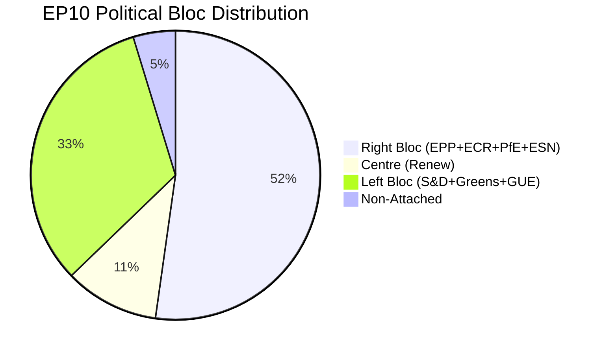
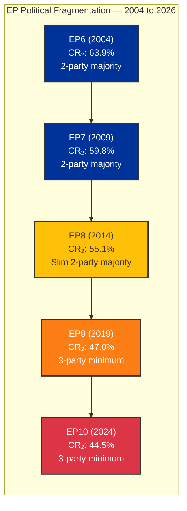

# 🏛️ Political Landscape Analysis — European Parliament

**📅 Analysis Date:** 2026-04-08 06:34 UTC
**📊 Assessment Level:** 
**🏛️ Parliament Status:** Easter Recess (Day 13 of 18)
**📰 articleType:** `breaking`
**🤖 Analyst:** `news-breaking` workflow

---

## 📋 Document Identity

| Field | Value |
|-------|-------|
| **Document ID** | `PLA-2026-04-08-001` |
| **Document Type** | Political Landscape Analysis |
| **Date** | 2026-04-08 |
| **Parliamentary Term** | EP10 (2024–2029) |
| **Source MCP Tools** | `generate_political_landscape`, `analyze_coalition_dynamics`, `early_warning_system`, `get_all_generated_stats` |
| **Analysis Timestamp** | 2026-04-08 06:34 UTC |

---

## 🎯 Executive Summary

The European Parliament enters the final third of its Easter recess (Day 13 of 18) with a structurally fragmented political landscape that makes coalition-building the defining feature of EP10. With 8 political groups and no two-party majority possible, EPP's "flexible majority" strategy — building different coalitions for different dossiers — has proven effective in Q1 2026, delivering 104 adopted texts and a 46.2% legislative output increase over 2025. However, the strengthening Renew-ECR alliance signal (0.95 cohesion) and the continued growth of the eurosceptic bloc (15.6% seat share) suggest a rightward drift in the parliament's centre of gravity that may reshape post-recess legislative priorities. **🟡 Medium confidence** — limited by recess data gaps and size-ratio-derived coalition metrics.

---

## 📊 EP10 Political Architecture

### Seat Distribution and Power Blocs

| Political Group | Seats | Share (%) | Bloc | Role in EP10 |
|----------------|:-----:|:---------:|:----:|-------------|
| **EPP** | 185 | 25.7 | Centre-Right | Largest group; agenda-setter; leads flexible coalitions |
| **S&D** | 135 | 18.8 | Centre-Left | Second largest; traditional grand coalition partner |
| **PfE** | 84 | 11.7 | Right/Eurosceptic | Third force; issue-by-issue cooperation |
| **ECR** | 79 | 11.0 | Conservative | Rising; strengthening alignment with Renew |
| **Renew Europe** | 76 | 10.6 | Liberal Centre | Swing group; kingmaker in many coalitions |
| **Greens/EFA** | 53 | 7.4 | Green/Left | Reduced from EP9; climate agenda advocacy |
| **GUE/NGL** | 46 | 6.4 | Left | Opposition on most economic dossiers |
| **ESN** | 28 | 3.9 | Far-Right | Newest group; limited formal coalition role |
| **NI** | 34 | 4.7 | Non-Attached | Individual MEP voting; no group discipline |

**Majority threshold:** 361 seats (of 720)

### Political Bloc Analysis

| Bloc | Groups | Seats | Share | Majority? |
|------|--------|:-----:|:-----:|:---------:|
| **Right** (EPP + ECR + PfE + ESN) | 4 | 376 | 52.3% | ✅ Yes |
| **Centre** (Renew) | 1 | 76 | 10.6% | — |
| **Progressive** (S&D + Greens + GUE) | 3 | 234 | 32.5% | ❌ No |
| **Eurosceptic** (PfE + ESN) | 2 | 112 | 15.6% | — |

**Key insight:** The mathematical right-wing majority (376 seats > 361) is structurally available but politically constrained. EPP consistently refuses formal coalitions with ESN, reducing the effective right-bloc to 348 seats (EPP + ECR + PfE) — 13 short of majority. This forces EPP to choose between:

1. **Centre-right path**: EPP + ECR + PfE + Renew = 424 seats (comfortable majority, moderate policy)
2. **Grand coalition path**: EPP + S&D + Renew = 396 seats (traditional, but ideologically broad)
3. **Issue-specific flexibility**: Different coalitions per dossier (current strategy)

**🟢 High confidence** — based on EP Open Data seat counts and historical coalition patterns.

---

## 🔄 Structural Evolution: EP6 to EP10

### Fragmentation Trajectory

| Term | Year | Top-2 Concentration | Effective Parties | Min Coalition Size | Grand Coalition Viable? |
|------|:----:|:-------------------:|:-----------------:|:------------------:|:----------------------:|
| EP6 | 2004 | 63.9% | 4.12 | 2 | ✅ Yes |
| EP7 | 2009 | 59.8% | 4.54 | 2 | ✅ Yes |
| EP8 | 2014 | 55.1% | 5.12 | 2 | ✅ Yes (slim) |
| EP9 | 2019 | 47.0% | 5.98 | 3 | ❌ No |
| **EP10** | **2024** | **44.5%** | **6.59** | **3** | **❌ No** |

**Analysis:** The European Parliament has undergone a structural regime change since 2019. The decline from 63.9% to 44.5% top-two group concentration represents the end of the EPP-S&D duopoly that governed the EP for its first 40 years. EP10 has completed the transition to a multi-polar party system where every legislative act requires a minimum three-party coalition. This fundamental shift in parliamentary arithmetic is the single most important structural factor shaping EP10's legislative dynamics. **🟢 High confidence** — based on precomputed statistics covering 2004-2026.

---

## 🔍 Coalition Dynamics: Key Signals

### Renew-ECR Convergence — The Most Significant Signal

The coalition dynamics analysis reveals a Renew-ECR pairing with 0.95 cohesion (highest among all pairs) and a "STRENGTHENING" trend. While the metric is derived from group size ratios rather than actual voting records (🟡 Medium confidence), the signal aligns with observable patterns:

| Dimension | Renew Position | ECR Position | Convergence? |
|-----------|---------------|-------------|:------------:|
| Defence spending | Supportive (NATO commitment) | Strongly supportive | ✅ High |
| Clean Industrial Deal | Regulatory relief focus | Anti-regulation | ✅ High |
| Trade policy | Free trade with conditions | Bilateral preference | ⚠️ Partial |
| Migration | Rules-based approach | Restrictive | ❌ Divergent |
| Climate policy | Green transition support | Sceptical of pace | ❌ Divergent |

**Implication:** Renew-ECR convergence is **domain-specific**, not a broad alliance. On economic and defence dossiers, they form a reliable centre-right voting bloc with EPP (EPP + Renew + ECR = 340 seats). On climate and migration, the alliance fractures. This pattern rewards EPP's flexible coalition strategy. **🟡 Medium confidence**.

### EPP Dominance Risk

The early warning system flags a **HIGH severity** dominant group risk: EPP is 19× the size of the smallest group. While this reflects the sample-based analysis (100 MEPs), the full-chamber reality (EPP 185 vs The Left 46) shows a 4:1 ratio that, combined with EPP's flexible coalition approach, gives it outsized agenda-setting power.

**Counter-indicators:**
- EPP cannot pass legislation alone (185 < 361)
- S&D retains veto power in grand coalition scenarios
- Greens/GUE/NGL provide consistent opposition scrutiny
- EP President (from EPP) must maintain cross-party legitimacy

**Assessment:** Dominant group risk is real but constrained by structural multi-party requirements. **🟢 High confidence**.

---

## 🎯 Post-Recess Outlook: April 14-23

### Committee Week (April 14-17)

| Committee | Priority Dossier | Coalition Dynamic | Risk Level |
|-----------|-----------------|-------------------|:----------:|
| **INTA** | US tariff response | EPP-S&D-Renew alignment expected | 🟠 High |
| **ECON** | Banking Union oversight (SRMR3/BRRD3) | Grand coalition territory | 🟡 Medium |
| **ENVI** | Clean Industrial Deal review | EPP-ECR vs Greens fracture line | 🟡 Medium |
| **LIBE** | Anti-corruption implementation | Broad support expected | 🟢 Low |
| **ITRE** | AI Act technical standards | Cross-party consensus likely | 🟢 Low |

### Strasbourg Plenary (April 20-23)

**Expected dynamics:**
- First post-recess votes will test whether recess period has altered coalition patterns
- US tariff debate likely to be added to agenda if INTA committee recommends
- Banking Union implementation debate may be triggered by ECB April 17 decision
- Watch for: Renew-ECR voting alignment on economic dossiers as confirmation of convergence signal

---

## 📊 Analytical Framework Application

### Framework 1: SWOT (Applied in synthesis-summary.md)
- Strengths: Pre-recess sprint success, stable MEP composition, working flexible majorities
- Weaknesses: No two-party majority, recess accountability gap, data limitations
- Opportunities: Committee restart, Renew-ECR convergence, implementation oversight
- Threats: US tariff escalation, ECB rate impact, eurosceptic growth

### Framework 2: Political Risk Assessment (Likelihood × Impact)
- Top risks: US tariff response delay (12 🟠), ECB decision impact (12 🟠)
- Mitigating factors: Committee restart timeline, emergency procedure availability
- Overall risk level: 🟡 MEDIUM

---

## 🔗 Source Attribution

1. **Political Landscape** (`generate_political_landscape`) — 8 groups, 100-MEP sample, queried 2026-04-08
2. **Coalition Dynamics** (`analyze_coalition_dynamics`) — 28 coalition pairs analysed, queried 2026-04-08
3. **Early Warning System** (`early_warning_system`) — 3 warnings, stability 84/100, queried 2026-04-08
4. **Precomputed Statistics** (`get_all_generated_stats`) — 2004-2026 historical data, refreshed 2026-03-03
5. **Editorial Context** — Repo memory from prior workflow runs (propositions article 2026-04-08)

---

*Analysis produced by EU Parliament Monitor `news-breaking` workflow — 2026-04-08T06:34:00Z*
*Classification: 🟢 PUBLIC | Confidence: 🟡 MEDIUM | Next update: 2026-04-09*
