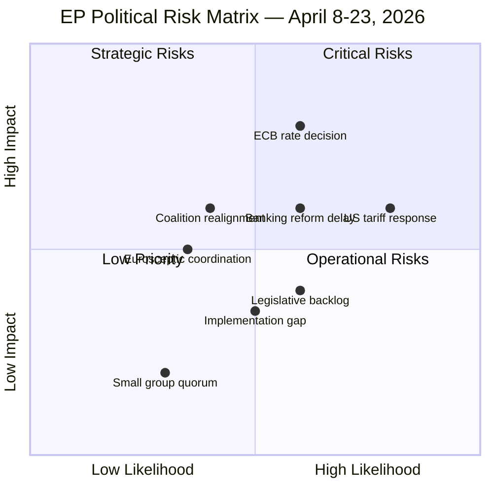
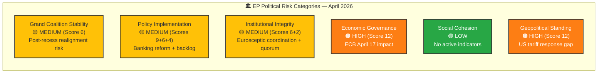

# ⚠️ Political Risk Assessment — European Parliament

**📅 Analysis Date:** 2026-04-08 06:35 UTC
**📊 Overall Risk Level:** 
**🏛️ Parliament Status:** Easter Recess (Day 13 of 18)
**📰 articleType:** `breaking`
**🤖 Analyst:** `news-breaking` workflow

---

## 📋 Assessment Context

| Field | Value |
|-------|-------|
| **Assessment ID** | `RSK-2026-04-08-001` |
| **Methodology** | Likelihood × Impact (5×5 matrix) — per `political-risk-methodology.md` |
| **Risk Categories** | 6 EP political risk categories assessed |
| **Time Horizon** | Short-term (April 8-23, 2026) — recess through first post-recess plenary |
| **Produced By** | `news-breaking` |
| **Overall Confidence** | **MEDIUM** 🟡 — limited by recess data gaps |
| **articleType** | `breaking` |

---

## 🎯 Executive Summary

The European Parliament faces **MEDIUM** overall political risk during the Easter recess period and immediate post-recess return. The two highest-scoring risks — US tariff escalation response delay (Score 12) and ECB April 17 decision impact (Score 12) — are both externally driven and exploit the structural vulnerability of a parliamentary recess: the inability to respond through normal legislative channels. The internal political landscape is relatively stable (voting anomalies: NONE, group stability: 100), but the external pressure environment has intensified since the March 26 pre-recess plenary. The key question for April 14 committee restart is whether external pressures will force agenda modifications or whether Parliament can resume planned business. **🟡 Medium confidence**.

---

## 📊 Comprehensive Risk Register

### Risk Matrix Visualisation

### Detailed Risk Scoring

| # | Risk | Category | L | I | Score | Tier | Trend | Confidence |
|:-:|------|----------|:-:|:-:|:-----:|:----:|:-----:|:----------:|
| R1 | **US tariff escalation response delay** | geopolitical-standing | 4 | 3 | 12 | 🟠 High | ↑ Rising | 🟡 Medium |
| R2 | **ECB April 17 decision — Banking Union pressure** | economic-governance | 3 | 4 | 12 | 🟠 High | ↗ Rising | 🟡 Medium |
| R3 | **Banking reform implementation delay (SRMR3/BRRD3)** | policy-implementation | 3 | 3 | 9 | 🟡 Medium | → Stable | 🟡 Medium |
| R4 | **Post-recess coalition realignment** | grand-coalition-stability | 2 | 3 | 6 | 🟡 Medium | ↗ Rising | 🟡 Medium |
| R5 | **Legislative backlog after recess** | policy-implementation | 3 | 2 | 6 | 🟡 Medium | ↗ Rising | 🟢 High |
| R6 | **Eurosceptic bloc coordination** | institutional-integrity | 2 | 3 | 6 | 🟡 Medium | → Stable | 🔴 Low |
| R7 | **Implementation gap — 18 adopted texts** | policy-implementation | 2 | 2 | 4 | 🟢 Low | → Stable | 🟡 Medium |
| R8 | **Small group quorum failure** | institutional-integrity | 2 | 1 | 2 | 🟢 Low | → Stable | 🟢 High |

**Aggregate Risk Summary:**
- 🟠 High risks: 2 (R1, R2) — both externally driven
- 🟡 Medium risks: 4 (R3, R4, R5, R6) — mix of internal and external
- 🟢 Low risks: 2 (R7, R8) — routine operational
- Overall portfolio score: 57/200 = **MEDIUM** risk

---

## 🔍 Risk Deep-Dive: Top 3 Risks

### R1: US Tariff Escalation Response Delay (Score: 12 🟠)

**Risk description:** Escalating US trade actions during Easter recess create a parliamentary response void. INTA committee cannot convene emergency hearings until April 14. Commission may act under delegated authority, reducing parliamentary oversight of trade countermeasures.

**Political dynamics:**
- **EPP:** Favours measured response; wants to protect EU export industries while maintaining transatlantic relationship
- **S&D:** Emphasises worker protection and social impact of tariff retaliation; may push for emergency social fund
- **ECR:** Split between trade hawks and pro-US members; may resist countermeasures targeting allies
- **Renew:** Free trade advocacy conflicts with political pressure for EU assertiveness
- **Greens/GUE:** Opportunity to link trade policy with environmental standards; may condition support

**Cascading risk:** If Commission acts on trade countermeasures without parliamentary consultation during recess, this creates an **institutional-integrity** secondary risk (Parliament's co-legislative role weakened by timing).

| Indicator | Current Value | Threshold | Status |
|-----------|:------------:|:---------:|:------:|
| US tariff action frequency | Escalating | >2 actions/week | ⚠️ Watch |
| Commission emergency communication | None during recess | Any publication | ✅ Normal |
| INTA chair public statement | None | Formal statement | ✅ Normal |
| MEP social media trade debate | Low | >20 MEPs engaging | ✅ Normal |

**Mitigation pathway:** INTA committee hearing April 14-15; emergency plenary debate procedure available under Rule 162; Commission obliged to report to EP before final countermeasure implementation.

**🟡 Medium confidence** — based on editorial context and institutional procedure knowledge. US trade policy trajectory is inherently unpredictable.

---

### R2: ECB April 17 Decision — Banking Union Pressure (Score: 12 🟠)

**Risk description:** ECB monetary policy decision on April 17 falls during committee restart week. Rate adjustment could create immediate pressure on the recently adopted Banking Union package (SRMR3: TA-10-2026-0092, BRRD3: TA-10-2026-0094) by altering the macro-financial context under which the legislation was calibrated.

**Political dynamics:**
- **ECON committee:** Primary oversight body; may request emergency ECB hearing if rate decision is surprising
- **EPP-S&D:** Grand coalition alignment on Banking Union — both supported March 26 adoption
- **ECR-PfE:** May use rate decision to question Banking Union's regulatory approach
- **Impact on SRMR3 transposition:** Member states may delay or modify transposition if macro-conditions shift

**Cascading risk:** A significant rate change could trigger:
1. ECON emergency hearing → agenda disruption in committee week
2. Banking sector lobbying for implementation timeline extension
3. Political pressure to reopen recently adopted texts (constitutionally difficult but politically damaging)

| Indicator | Current Value | Threshold | Status |
|-----------|:------------:|:---------:|:------:|
| ECB forward guidance | Cautious easing | Unexpected reversal | ⚠️ Watch |
| Eurozone CPI | Within target range | Surprise deviation | ✅ Normal |
| Bank stress indicators | Stable | CDS spread widening | ✅ Normal |
| ECON committee scheduling | Planned | Emergency session added | ✅ Normal |

**🟡 Medium confidence** — ECB decisions are inherently uncertain; impact assessment based on institutional analysis of SRMR3/BRRD3 adoption context.

---

### R3: Banking Reform Implementation Delay (Score: 9 🟡)

**Risk description:** The SRMR3/BRRD3/DGSD2 package adopted in the March 26 pre-recess sprint faces a 24-month transposition period. During this period, member states must align national banking resolution frameworks with the new EU rules. Delays in technical standard publication by EBA/ECB could create implementation bottlenecks.

**Political dynamics:**
- Broad cross-party support for Banking Union remains intact
- Industry lobbying for extended compliance timelines expected
- Southern European member states may face greater implementation burden
- ECON committee oversight role during transposition period is critical

**Assessment:** This is a routine policy-implementation risk with moderate but manageable consequences. The political will for Banking Union completion is strong across the EPP-S&D-Renew coalition, reducing the likelihood of deliberate obstruction. **🟡 Medium confidence**.

---

## 📊 Risk Category Summary

---

## 🔮 Risk Trajectory: Next 15 Days

| Date | Event | Risk Impact | Watch For |
|------|-------|:----------:|-----------|
| Apr 8-13 | Easter recess continues | → | External pressure accumulation |
| Apr 14 | Committee week starts | ↗ | INTA/ECON urgent agendas |
| Apr 15-16 | Committee deliberations | ↗ | Trade debate intensity |
| Apr 17 | ECB rate decision | ↑ | Market/policy reaction |
| Apr 18 | Post-ECB assessment | ↗ | ECON emergency scheduling |
| Apr 20-23 | Strasbourg plenary | ↑ | First post-recess votes; coalition test |

---

## 🔗 Source Attribution

1. **Voting Anomalies** (`detect_voting_anomalies`) — stability 100, risk LOW, queried 2026-04-08
2. **Coalition Dynamics** (`analyze_coalition_dynamics`) — 28 pairs, Renew-ECR 0.95, queried 2026-04-08
3. **Early Warning System** (`early_warning_system`) — 3 warnings, stability 84, queried 2026-04-08
4. **Precomputed Statistics** (`get_all_generated_stats`) — legislative output metrics, 2025-2026
5. **Adopted Texts Feed** (`get_adopted_texts_feed`) — TA-10-2026-0087 to TA-10-2026-0104
6. **Political Risk Methodology** — `analysis/methodologies/political-risk-methodology.md` v2.1

---

*Risk assessment produced by EU Parliament Monitor `news-breaking` workflow — 2026-04-08T06:35:00Z*
*Classification: 🟢 PUBLIC | Confidence: 🟡 MEDIUM | Next review: 2026-04-09*
*Methodology: Likelihood × Impact 5×5 matrix per political-risk-methodology.md v2.1*
