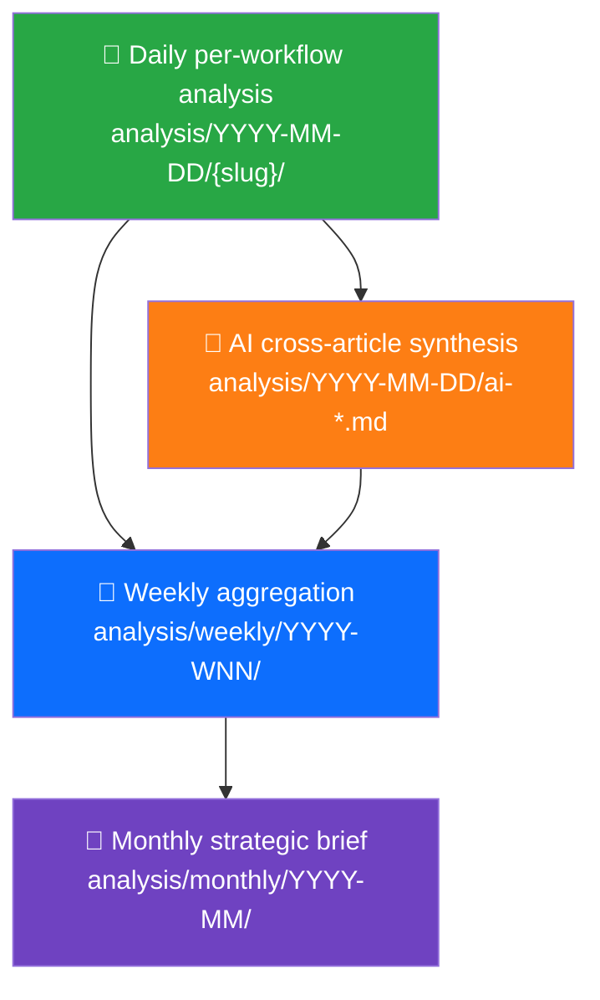

<p align="center">
  
</p>

<h1 align="center">🔬 EU Parliament Monitor — Analysis Directory</h1>

<p align="center">
  <strong>📊 Intermediate Analysis Artifacts for Agentic Political Intelligence Workflows</strong><br>
  <em>🎯 Daily · Weekly · Monthly · Templates · Methodologies · Reference</em>
</p>

<p align="center">
  <a href="#"></a>
  <a href="#"></a>
  <a href="#"></a>
  <a href="#"></a>
</p>

**📋 Document Owner:** CEO | **📄 Version:** 2.0 | **📅 Last Updated:** 2026-03-30 (UTC)
**🔄 Review Cycle:** Quarterly | **⏰ Next Review:** 2026-06-30
**🏢 Owner:** Hack23 AB (Org.nr 5595347807) | **🏷️ Classification:** Public

---

## 🎯 Purpose

The `analysis/` directory stores **intermediate analysis artifacts** produced and consumed by EU Parliament Monitor's agentic workflows. These artifacts bridge raw European Parliament data (sourced via the European Parliament MCP Server) and the final published political intelligence articles, news summaries, and dashboards.

Analysis artifacts are **not** final content — they are structured intermediate products that enable:

- 🔄 **Workflow composition**: Upstream agents deposit analysis; downstream agents consume it
- 📐 **Consistent methodology**: Templates enforce analytical rigor across 14 languages
- 📊 **Full data analysis**: Every downloaded MCP file receives comprehensive per-file analysis
- 🧠 **Reusable intelligence**: Cross-workflow pattern sharing and knowledge accumulation
- 🎯 **Quality assurance**: Structured templates enable validation before article generation
- 🔀 **Collision-free design**: Per-workflow directories prevent merge conflicts
- 📅 **Temporal aggregation**: Daily → Weekly → Monthly intelligence roll-ups

---

## 📁 Directory Structure

```
analysis/
├── README.md                          ← This file
├── methodologies/                     ← 6 detailed methodology guides
│   ├── political-classification-guide.md  ← 7-dimension EP event classification
│   ├── political-risk-methodology.md      ← Likelihood × Impact scoring for EP
│   ├── political-threat-framework.md      ← Multi-framework threat analysis (STRIDE + 5 more)
│   ├── political-swot-framework.md        ← Evidence-based SWOT for EP landscape
│   ├── political-style-guide.md           ← Writing standards and depth levels
│   └── ai-driven-analysis-guide.md        ← Per-file AI analysis protocol and quality gates
├── templates/                         ← 8 reusable analysis templates (AI fills these)
│   ├── political-classification.md    ← Event classification template
│   ├── risk-assessment.md             ← Political risk template
│   ├── threat-analysis.md             ← Multi-framework threat template
│   ├── swot-analysis.md               ← SWOT quadrant template
│   ├── stakeholder-impact.md          ← Stakeholder impact template
│   ├── significance-scoring.md        ← Significance scoring template
│   ├── synthesis-summary.md           ← Daily synthesis template (aggregates all above)
│   └── per-file-political-intelligence.md ← Per-file AI analysis template
├── reference/                         ← 4 ISMS adaptation mappings
│   ├── isms-classification-adaptation.md  ← ISMS → Political classification mapping
│   ├── isms-risk-assessment-adaptation.md ← ISMS → Political risk mapping
│   ├── isms-threat-modeling-adaptation.md ← ISMS → Political threat mapping (multi-framework)
│   └── isms-style-guide-adaptation.md     ← ISMS → Political writing standards mapping
├── daily/                             ← Per-day analysis artifacts (YYYY-MM-DD/)
│   └── README.md                      ← Daily directory conventions
├── weekly/                            ← Per-week aggregations (YYYY-WNN/)
│   └── README.md                      ← Weekly directory conventions
├── monthly/                           ← Per-month strategic briefs (YYYY-MM/)
│   └── README.md                      ← Monthly directory conventions
└── YYYY-MM-DD/                        ← Date-stamped output directory
    ├── ai-*.md                        ← AI-driven cross-article synthesis (date root)
    ├── {article-type-slug}/           ← Per-workflow subdirectory (NEVER overwrite other workflows)
    │   ├── manifest.json              ← Run metadata
    │   ├── classification/            ← Political classification results
    │   ├── threat-assessment/         ← Multi-framework threat results
    │   ├── risk-scoring/              ← Risk assessment results
    │   ├── existing/                  ← Existing analysis outputs
    │   └── data/                      ← MCP data for this workflow
    │       ├── adopted-texts/
    │       ├── committee-documents/
    │       ├── events/
    │       ├── meps/
    │       ├── procedures/
    │       ├── questions/
    │       ├── speeches/
    │       ├── votes/
    │       └── ...
    └── ...
```

### Directory Layout Notes

- **AI synthesis artifacts** (`ai-*.md`) live at the **date root** because they synthesise data across all article types
- **Workflow outputs** live under **per-article-type subdirectories** (`{article-type-slug}/`) to prevent merge conflicts
- **MCP data** is scoped per-workflow at `{article-type-slug}/data/`
- **NEVER overwrite** another workflow's analysis — each workflow has its own directory

---

## 🚨 Critical Rules for Agentic Workflows

### Rule 1: Per-Workflow Directory Isolation

Every agentic workflow **MUST** write to its own separate directory. No workflow may overwrite another workflow's analysis:

```
✅ news-breaking       → analysis/2026-03-30/breaking-news/
✅ news-weekly-review   → analysis/2026-03-30/weekly-review/
✅ news-committee-reports → analysis/2026-03-30/committee-reports/
❌ news-breaking overwrites news-weekly-review output → PROHIBITED
```

### Rule 2: AI Must Read Methodology, Then Analyse — Never Script

AI agents must:
1. **Read ALL 6 methodology documents** in `analysis/methodologies/` before any analysis
2. **Read ALL 8 templates** in `analysis/templates/` to understand output format
3. **Analyse the actual data** — produce original intelligence, not scripted boilerplate
4. **Follow the templates exactly** — structured tables, Mermaid diagrams, evidence citations, confidence labels

> **🚫 "Scripted crap content" is REJECTED.** Generic summaries, templates filled with placeholder text, or analysis that doesn't engage with the specific data are unacceptable. The AI must demonstrate genuine analytical engagement with the source material.

### Rule 3: Multi-Framework Threat Analysis

STRIDE alone is insufficient. AI agents must use **at least two threat frameworks** for any threat rated MODERATE or above:
- STRIDE (baseline)
- Attack Trees (systemic threats)
- LINDDUN (privacy/data)
- PESTLE (macro-environmental)
- Scenario Planning (forward-looking)
- Political Kill Chain (influence campaigns)

See [methodologies/political-threat-framework.md](methodologies/political-threat-framework.md).

### Rule 4: Evidence-Based Only

Every factual claim must have a source citation. Every non-factual assessment must have a confidence level. Opinion-only entries are REJECTED.

---

## 🤖 Per-File AI Analysis (Primary Analysis Mode)

The primary analysis mode is **per-file AI analysis**: for every downloaded EP MCP data file, the AI agent produces a deep analysis markdown file stored alongside it.

### How It Works


| Step | Action | Reference |
|:----:|--------|-----------|
| 1 | Download EP MCP data to `data/` subdirectory | EP MCP Server tools |
| 2 | Catalog files needing analysis | Scan `data/` for unanalysed files |
| 3 | AI reads ALL methodology docs before analysis | `analysis/methodologies/*.md` (6 files) |
| 4 | Per-file deep analysis following template | `analysis/templates/per-file-political-intelligence.md` |
| 5 | Save analysis alongside data file | `{id}.analysis.md` next to `{id}.json` |
| 6 | Compose daily synthesis from per-file analyses | `analysis/templates/synthesis-summary.md` |
| 7 | Weekly/monthly aggregation | `analysis/weekly/`, `analysis/monthly/` |

> **Quality Standard:** Every per-file analysis must match [SWOT.md](../SWOT.md) and [THREAT_MODEL.md](../THREAT_MODEL.md) formatting quality — Hack23 header badges, color-coded Mermaid diagrams, evidence tables with confidence labels, and actionable intelligence.

---

## 📐 Methodology Documents (AI Must Read Before Analysing)

| Priority | Document | Key Content |
|:--------:|----------|-------------|
| 🔴 1 | [political-swot-framework.md](methodologies/political-swot-framework.md) | Evidence hierarchy, confidence levels, temporal decay, aggregation |
| 🔴 2 | [political-risk-methodology.md](methodologies/political-risk-methodology.md) | 5×5 Likelihood × Impact matrix, EU calibration examples |
| 🔴 3 | [political-threat-framework.md](methodologies/political-threat-framework.md) | 6-framework threat analysis: STRIDE + Attack Trees + LINDDUN + PESTLE + Scenario Planning + Kill Chain |
| 🟠 4 | [political-classification-guide.md](methodologies/political-classification-guide.md) | Sensitivity levels, EP domain taxonomy, urgency matrix |
| 🟠 5 | [political-style-guide.md](methodologies/political-style-guide.md) | Writing standards, 3 depth levels, evidence density, anti-patterns |
| 🟠 6 | [ai-driven-analysis-guide.md](methodologies/ai-driven-analysis-guide.md) | Per-file protocol, quality gates, document-type focus, conflict resolution |

---

## 📐 Template Usage Guide

### Template Quick Reference

| Template | When to Use | Key Output |
|----------|-------------|------------|
| `political-classification.md` | New EP event or document | Sensitivity + urgency + domain |
| `risk-assessment.md` | Coalition/policy risk spike | Risk scores + mitigation map |
| `threat-analysis.md` | Democratic threat review | Multi-framework threat inventory |
| `swot-analysis.md` | Strategic landscape assessment | Quadrant entries with evidence |
| `stakeholder-impact.md` | Policy decision announced | Impact by stakeholder group |
| `significance-scoring.md` | Publication prioritisation | Composite score → publish/skip |
| `synthesis-summary.md` | Daily synthesis (aggregation) | Combined intelligence dashboard |
| `per-file-political-intelligence.md` | Per-file AI analysis | Full deep analysis per document |

### Template Selection by Data Category

| MCP Data Category | Primary Templates | Supporting Templates |
|------------------|-------------------|---------------------|
| `adopted-texts/` | Political Classification + Risk Assessment | Significance Scoring |
| `committee-documents/` | Stakeholder Impact + Risk Assessment | Political Classification |
| `procedures/` | Risk Assessment + SWOT Analysis | Significance Scoring |
| `votes/` | Political Classification + SWOT + Threat Analysis | Risk Assessment |
| `speeches/` | Stakeholder Impact + Significance Scoring | Political Classification |
| `questions/` | Political Classification + Significance Scoring | Stakeholder Impact |
| `events/` | Significance Scoring + Risk Assessment | Stakeholder Impact |
| `meps/` | Stakeholder Impact + Political Classification | Significance Scoring |
| `declarations/` | Threat Analysis (I-Disclosure) + Risk Assessment | Political Classification |
| `plenary-documents/` | Political Classification + Risk Assessment | All templates |
| `osint/` | SWOT Analysis + Threat Analysis | Risk Assessment |
| `world-bank/` | Risk Assessment (economic) + SWOT Analysis | Significance Scoring |

---

## 📅 Naming Conventions

| Scope | Format | Example | Description |
|-------|--------|---------|-------------|
| Daily | `YYYY-MM-DD` | `2026-03-30/` | ISO 8601 calendar date |
| Weekly | `YYYY-WNN` | `2026-W14/` | ISO 8601 week number (Mon–Sun) |
| Monthly | `YYYY-MM` | `2026-03/` | ISO 8601 year-month |
| Ad-hoc | descriptive | `coalition-risk/` | Named topic directories when needed |

**Rules:**
- All directory names use zero-padded numbers (`W03`, not `W3`)
- Weekly directories align with ISO 8601: weeks start **Monday**
- Never use locale-specific date formats (no `30/3/2026` or `Mar-30`)

---

## 🤖 Workflow Integration

The following agentic workflows produce analysis artifacts. All workflows **MUST** follow the per-file AI analysis protocol — read methodology documents, then analyze each downloaded file individually:

| Workflow | Article Type Slug | Primary Output | Key MCP Data |
|----------|-------------------|---------------|-------------|
| `news-week-ahead` | `week-ahead` | Week-ahead prospective | Events, procedures, plenary sessions |
| `news-weekly-review` | `weekly-review` | Week-in-review retrospective | Adopted texts, votes, speeches |
| `news-month-ahead` | `month-ahead` | Month-ahead strategic outlook | Procedures, events, committee docs |
| `news-monthly-review` | `monthly-review` | Month-in-review comprehensive | All data categories |
| `news-breaking` | `breaking-news` | Breaking news articles | Feed endpoints, voting anomalies |
| `news-committee-reports` | `committee-reports` | Committee report analysis | Committee documents, procedures |
| `news-propositions` | `propositions` | Legislative proposition analysis | Procedures, adopted texts |
| `news-motions` | `motions` | Parliamentary motion analysis | Procedures, votes, MEP data |
| `news-article-generator` | `article-generator` | Generic article generation | All data categories |

### Temporal Aggregation



- **Daily**: Each workflow writes to `analysis/{date}/{article-type-slug}/`
- **Weekly**: `news-week-ahead` aggregates the week's daily analyses into `analysis/weekly/YYYY-WNN/`
- **Monthly**: End-of-month aggregation produces strategic briefs in `analysis/monthly/YYYY-MM/`

---

## 🔒 ISMS Adaptation Reference

The `reference/` directory maps ISMS security frameworks to political intelligence:

| Reference Document | Source ISMS Document | Political Adaptation |
|-------------------|---------------------|---------------------|
| [isms-classification-adaptation.md](reference/isms-classification-adaptation.md) | [CLASSIFICATION.md](https://github.com/Hack23/ISMS-PUBLIC/blob/main/CLASSIFICATION.md) | Confidentiality → Sensitivity, Integrity → Accuracy, Availability → Urgency |
| [isms-risk-assessment-adaptation.md](reference/isms-risk-assessment-adaptation.md) | [Risk_Assessment_Methodology.md](https://github.com/Hack23/ISMS-PUBLIC/blob/main/Risk_Assessment_Methodology.md) | CIA Triad → Political Triad (Accountability, Policy Fidelity, Democratic Continuity) |
| [isms-threat-modeling-adaptation.md](reference/isms-threat-modeling-adaptation.md) | [Threat_Modeling.md](https://github.com/Hack23/ISMS-PUBLIC/blob/main/Threat_Modeling.md) | STRIDE + ATT&CK + Attack Trees + LINDDUN → EU democratic threat landscape |
| [isms-style-guide-adaptation.md](reference/isms-style-guide-adaptation.md) | [STYLE_GUIDE.md](https://github.com/Hack23/ISMS-PUBLIC/blob/main/STYLE_GUIDE.md) | ISMS writing standards → Political intelligence writing standards |

---

## 📚 Related Documentation

- [📐 docs/analysis-methodology/](../docs/analysis-methodology/) — Higher-level methodology guides for article generation
- [📐 ARCHITECTURE.md](../ARCHITECTURE.md) — System architecture overview
- [🧠 MINDMAP.md](../MINDMAP.md) — Conceptual relationship map
- [🔄 FLOWCHART.md](../FLOWCHART.md) — Data flow diagrams
- [🛡️ THREAT_MODEL.md](../THREAT_MODEL.md) — Platform threat analysis (**formatting exemplar**)
- [💼 SWOT.md](../SWOT.md) — Platform strategic analysis (**formatting exemplar**)
- [🔐 SECURITY_ARCHITECTURE.md](../SECURITY_ARCHITECTURE.md) — Security controls

---

**Document Control:**
- **Repository:** https://github.com/Hack23/euparliamentmonitor
- **Path:** `/analysis/README.md`
- **Format:** Markdown
- **Classification:** Public
- **Next Review:** 2026-06-30
