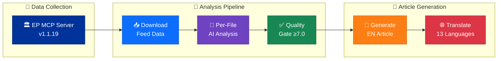
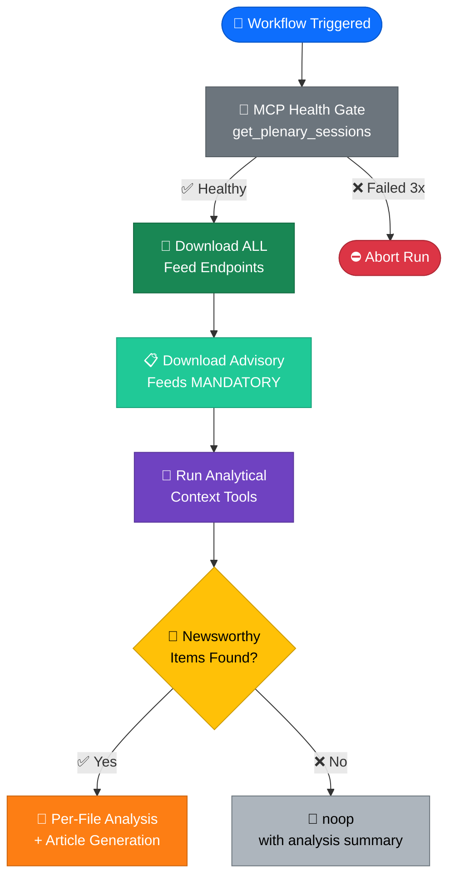
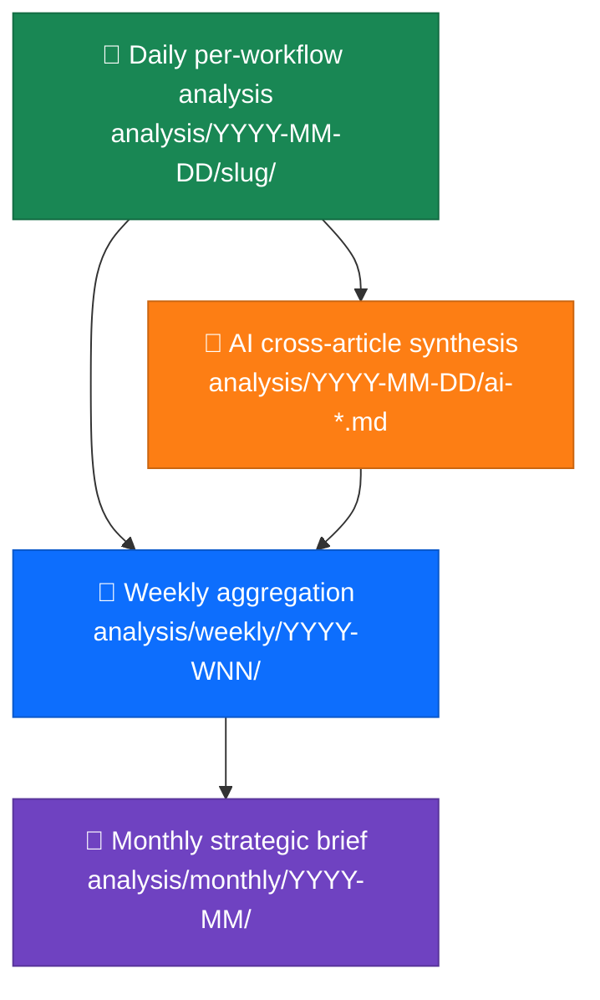

<p align="center">
  
</p>

<h1 align="center">🔬 EU Parliament Monitor — Analysis Directory</h1>

<p align="center">
  <strong>📊 Political Intelligence Analysis Framework for European Parliament Agentic Workflows</strong><br>
  <em>🎯 Evidence-Based · Multi-Framework · Per-Document · Temporal Aggregation</em>
</p>

<p align="center">
  <a href="#"></a>
  <a href="#"></a>
  <a href="#"></a>
  <a href="#"></a>
</p>

**📋 Document Owner:** CEO | **📄 Version:** 3.0 | **📅 Last Updated:** 2026-03-31 (UTC)
**🔄 Review Cycle:** Quarterly | **⏰ Next Review:** 2026-06-30
**🏢 Owner:** Hack23 AB (Org.nr 5595347807) | **🏷️ Classification:** Public

---

## 📚 Architecture Documentation Map

<div class="documentation-map">

| Document | Focus | Description | Documentation Link |
| --- | --- | --- | --- |
| **[Architecture](../ARCHITECTURE.md)** | 🏛️ Architecture | C4 model showing current system structure | [View Source](https://github.com/Hack23/euparliamentmonitor/blob/main/ARCHITECTURE.md) |
| **[Security Architecture](../SECURITY_ARCHITECTURE.md)** | 🛡️ Security | Security controls and compliance mapping | [View Source](https://github.com/Hack23/euparliamentmonitor/blob/main/SECURITY_ARCHITECTURE.md) |
| **[Threat Model](../THREAT_MODEL.md)** | 🎯 Security | Political Threat Landscape analysis | [View Source](https://github.com/Hack23/euparliamentmonitor/blob/main/THREAT_MODEL.md) |
| **[SWOT Analysis](../SWOT.md)** | 💼 Business | Strategic assessment (**formatting exemplar**) | [View Source](https://github.com/Hack23/euparliamentmonitor/blob/main/SWOT.md) |
| **[Workflows](../WORKFLOWS.md)** | ⚙️ DevOps | CI/CD and agentic workflow documentation | [View Source](https://github.com/Hack23/euparliamentmonitor/blob/main/WORKFLOWS.md) |
| **[Analysis Methodologies](methodologies/README.md)** | 📐 Methodology | 6 political intelligence analysis frameworks | [View Source](https://github.com/Hack23/euparliamentmonitor/blob/main/analysis/methodologies/README.md) |
| **[Analysis Templates](templates/README.md)** | 📋 Templates | 8 structured analysis output templates | [View Source](https://github.com/Hack23/euparliamentmonitor/blob/main/analysis/templates/README.md) |

</div>

---

## 🔐 ISMS Policy Alignment

| **ISMS Policy** | **Analysis Implementation** |
| --- | --- |
| [🛠️ Secure Development Policy](https://github.com/Hack23/ISMS-PUBLIC/blob/main/Secure_Development_Policy.md) | Quality gates enforce evidence-based analysis; anti-pattern rejection prevents low-quality output |
| [🤖 AI Policy](https://github.com/Hack23/ISMS-PUBLIC/blob/main/AI_Policy.md) | AI agents MUST read methodology docs before analysis; per-file protocol ensures reproducibility |
| [📝 Classification Policy](https://github.com/Hack23/ISMS-PUBLIC/blob/main/Classification_Policy.md) | 7-dimension classification adapted from ISMS for EP political events (see [reference/](reference/)) |
| [🔍 Vulnerability Management](https://github.com/Hack23/ISMS-PUBLIC/blob/main/Vulnerability_Management.md) | Political threat analysis uses 6 purpose-built dimensions, NOT software-centric models |
| [🔓 Open Source Policy](https://github.com/Hack23/ISMS-PUBLIC/blob/main/Open_Source_Policy.md) | All methodology documents published under project license for transparency |

---

## 🎯 Purpose

The `analysis/` directory stores **intermediate political intelligence artifacts** produced and consumed by EU Parliament Monitor's 10 agentic workflows. These artifacts bridge raw European Parliament data (sourced via the **European Parliament MCP Server v1.1.19**) and the final published political intelligence articles across 14 languages.



Analysis artifacts are **not** final content — they are structured intermediate products that enable:

- 🔄 **Workflow composition**: Upstream agents deposit analysis; downstream agents consume it
- 📐 **Consistent methodology**: 6 frameworks + 8 templates enforce analytical rigor
- 📊 **Full data analysis**: Every downloaded MCP file receives per-file deep analysis
- 🧠 **Reusable intelligence**: Cross-workflow pattern sharing and knowledge accumulation
- 🎯 **Quality assurance**: Minimum 7.0/10 quality gate before article generation
- 🔀 **Collision-free design**: Per-workflow directories prevent merge conflicts
- 📅 **Temporal aggregation**: Daily → Weekly → Monthly intelligence roll-ups

---

## 📁 Directory Structure

```
analysis/
├── README.md                          ← This file
├── methodologies/                     ← 6 detailed methodology guides
│   ├── README.md                      ← Methodology catalog and pipeline overview
│   ├── political-classification-guide.md  ← 7-dimension EP event classification
│   ├── political-risk-methodology.md      ← Likelihood × Impact scoring for EP
│   ├── political-threat-framework.md      ← Political Threat Landscape (6 dims) + 5 frameworks
│   ├── political-swot-framework.md        ← Evidence-based SWOT for EP landscape
│   ├── political-style-guide.md           ← Writing standards, depth levels, anti-patterns
│   └── ai-driven-analysis-guide.md        ← Per-file AI analysis protocol and quality gates
├── templates/                         ← 8 reusable analysis templates (AI fills these)
│   ├── README.md                      ← Template catalog and selection guide
│   ├── political-classification.md    ← Event classification template
│   ├── risk-assessment.md             ← Political risk template
│   ├── threat-analysis.md             ← Multi-framework threat template
│   ├── swot-analysis.md               ← SWOT quadrant template
│   ├── stakeholder-impact.md          ← Stakeholder impact template
│   ├── significance-scoring.md        ← Significance scoring template
│   ├── synthesis-summary.md           ← Daily synthesis template (aggregates all above)
│   └── per-file-political-intelligence.md ← Per-file AI analysis template
├── reference/                         ← 4 ISMS adaptation mappings
│   ├── isms-classification-adaptation.md  ← ISMS → Political classification mapping
│   ├── isms-risk-assessment-adaptation.md ← ISMS → Political risk mapping
│   ├── isms-threat-modeling-adaptation.md ← ISMS → Political threat mapping
│   └── isms-style-guide-adaptation.md     ← ISMS → Political writing standards mapping
├── daily/                             ← Per-day analysis artifacts
│   └── README.md                      ← Daily directory conventions
├── weekly/                            ← Per-week aggregations
│   └── README.md                      ← Weekly directory conventions
├── monthly/                           ← Per-month strategic briefs
│   └── README.md                      ← Monthly directory conventions
└── YYYY-MM-DD/                        ← Date-stamped output directory
    ├── ai-*.md                        ← AI cross-article synthesis (date root)
    └── {article-type-slug}/           ← Per-workflow subdirectory
        ├── manifest.json              ← Run metadata
        ├── classification/            ← Political classification results
        ├── threat-assessment/         ← Political Threat Landscape results
        ├── risk-scoring/              ← Risk assessment results
        └── data/                      ← MCP data for this workflow
```

---

## 🚨 Critical Rules for Agentic Workflows

### Rule 1: Mandatory Data Download — ALWAYS Before Analysis

**Every agentic workflow MUST download EP data before deciding whether to produce an article.** Data collection is NEVER optional:



**Key rules:**
- `timeframe: "today"` first, fallback to `"one-week"` for empty/error/timeout feeds
- EP API can take 30–90+ seconds per call — NEVER abort slow responses
- Partial data is better than no data — continue with other feeds on individual failures
- Even on `noop`, all data collection and analysis MUST complete first

### Rule 2: Per-Workflow Directory Isolation

Every agentic workflow **MUST** write to its own separate directory:

```
✅ news-breaking         → analysis/2026-03-31/breaking/
✅ news-weekly-review     → analysis/2026-03-31/week-in-review/
✅ news-committee-reports → analysis/2026-03-31/committee-reports/
✅ news-motions           → analysis/2026-03-31/motions/
❌ news-breaking overwrites news-weekly-review output → PROHIBITED
```

### Rule 3: AI Must Read Methodology Then Analyse — Never Script

AI agents must:
1. **Read ALL 6 methodology documents** in `analysis/methodologies/` before any analysis
2. **Read ALL 8 templates** in `analysis/templates/` to understand output format
3. **Analyse the actual data** — produce original intelligence, not scripted boilerplate
4. **Follow the templates exactly** — structured tables, Mermaid diagrams, evidence citations, confidence labels

> **🚫 "Scripted crap content" is REJECTED.** Generic summaries or templates filled with placeholder text are unacceptable.

### Rule 4: Political Threat Landscape — NOT STRIDE

Software-centric threat models (STRIDE, DREAD, PASTA) are **explicitly rejected**. Use the **Political Threat Landscape** (6 dimensions):

| Dimension | Monitors | Example |
|-----------|----------|---------|
| 🔄 **Coalition Shifts** | Political group realignment, defection patterns | EPP–S&D grand coalition weakening |
| 🔍 **Transparency Deficit** | Access-to-information gaps, lobbying opacity | Committee meeting minutes delayed |
| ⏪ **Policy Reversal** | Legislative rollback, position changes | Green Deal implementation weakened |
| 🏛️ **Institutional Pressure** | Inter-institutional friction, mandate conflicts | Council blocking EP amendments |
| 🚧 **Legislative Obstruction** | Procedure stalling, amendment flooding | 1000+ amendments on AI Act |
| 🗳️ **Democratic Erosion** | Participation decline, representation gaps | EP election turnout decreasing |

Layer **Diamond Model**, **Attack Trees**, **PESTLE**, **Scenario Planning**, and **Kill Chain** for threats rated MODERATE or above.

### Rule 5: Evidence-Based Only

Every factual claim must have a source citation. Every non-factual assessment must have a confidence level (HIGH/MEDIUM/LOW). Opinion-only entries are REJECTED.

---

## 🤖 Workflow-Specific Data Requirements

Each agentic workflow downloads **unique data** tailored to its article type:

```mermaid
flowchart TD
    subgraph "📡 EP MCP Server v1.1.19"
        F1["get_adopted_texts_feed"]
        F2["get_events_feed"]
        F3["get_procedures_feed"]
        F4["get_meps_feed"]
        F5["get_documents_feed"]
        F6["get_committee_documents_feed"]
        F7["get_plenary_documents_feed"]
        F8["get_parliamentary_questions_feed"]
        F9["get_plenary_session_documents_feed"]
    end

    subgraph "📰 Agentic Workflows"
        W1["🔴 Breaking News"]
        W2["📋 Motions"]
        W3["📜 Propositions"]
        W4["🏛️ Committee Reports"]
        W5["📅 Week Ahead"]
        W6["📊 Weekly Review"]
        W7["📆 Month Ahead"]
        W8["📈 Monthly Review"]
    end

    F1 --> W1 & W2 & W3 & W6 & W8
    F2 --> W1 & W5 & W7
    F3 --> W1 & W2 & W3 & W5 & W6 & W7 & W8
    F4 --> W1 & W2
    F5 --> W1 & W3 & W4
    F6 --> W4
    F7 --> W4 & W5 & W6
    F8 --> W1 & W2 & W6
    F9 --> W5

    style W1 fill:#dc3545,stroke:#b02a37,color:#fff
    style W2 fill:#fd7e14,stroke:#ca6510,color:#fff
    style W3 fill:#ffc107,stroke:#cc9a06,color:#000
    style W4 fill:#198754,stroke:#146c43,color:#fff
    style W5 fill:#0d6efd,stroke:#0a58ca,color:#fff
    style W6 fill:#6f42c1,stroke:#59359a,color:#fff
    style W7 fill:#d63384,stroke:#ab296a,color:#fff
    style W8 fill:#0dcaf0,stroke:#0aa2c0,color:#000
```



### Detailed Workflow Data Matrix

| Workflow | Slug | Primary Feeds | Analytical Tools | Unique Focus |
|----------|------|---------------|-----------------|--------------|
| **news-breaking** | `breaking` | adopted_texts, events, procedures, meps (today→one-week fallback) | detect_voting_anomalies, analyze_coalition_dynamics, early_warning_system, generate_political_landscape | **⚡ Real-time events**: Items published TODAY only; 6-hour cycle |
| **news-motions** | `motions` | adopted_texts, parliamentary_questions, meps, procedures | detect_voting_anomalies, analyze_coalition_dynamics, get_voting_records, compare_political_groups | **🗳️ Specific resolutions**: Individual motion IDs, vote breakdowns by group |
| **news-propositions** | `propositions` | procedures, documents, adopted_texts, plenary_documents | search_documents, monitor_legislative_pipeline, track_legislation, analyze_legislative_effectiveness | **📜 Legislative tracking**: Procedure stages, committee assignments, rapporteur analysis |
| **news-committee-reports** | `committee-reports` | committee_documents, plenary_documents, adopted_texts, procedures | get_committee_info, monitor_legislative_pipeline, analyze_legislative_effectiveness | **🏛️ Committee deep-dive**: Per-committee output, meeting agendas, document analysis |
| **news-week-ahead** | `week-ahead` | events, procedures, plenary_documents, plenary_session_documents | get_plenary_sessions (future), get_committee_info, monitor_legislative_pipeline, generate_political_landscape | **📅 Prospective**: Next week's agenda, scheduled votes, upcoming hearings |
| **news-weekly-review** | `week-in-review` | adopted_texts, procedures, plenary_documents, parliamentary_questions | get_voting_records, detect_voting_anomalies, generate_political_landscape | **📊 Retrospective**: Week's accomplishments, vote outcomes, legislative progress |
| **news-month-ahead** | `month-ahead` | events, procedures, plenary_documents, committee_documents, adopted_texts, plenary_session_documents, meps | get_plenary_sessions, get_committee_info, monitor_legislative_pipeline, generate_political_landscape, compare_political_groups, analyze_country_delegation | **📆 Strategic outlook**: Upcoming legislative calendar, committee programming |
| **news-monthly-review** | `month-in-review` | adopted_texts, procedures, plenary_documents, parliamentary_questions | get_voting_records, detect_voting_anomalies, generate_political_landscape, compare_political_groups, analyze_legislative_effectiveness | **📈 Comprehensive review**: Month's legislative output, political trends |
| **news-translate** | (n/a) | — | — | **🌐 Translation only**: Translates EN articles to 13 languages |

---

## 📊 Per-File AI Analysis (Primary Analysis Mode)

The primary analysis mode is **per-file AI analysis**: for every downloaded EP MCP data file, the AI agent produces a deep analysis markdown file stored alongside it.


| Step | Action | Quality Check |
|:----:|--------|---------------|
| 1 | Download EP MCP data to `data/` subdirectory | All mandatory feeds queried |
| 2 | Catalog files needing analysis | No file missed |
| 3 | AI reads ALL 6 methodology docs | Evidence: methodology citations in output |
| 4 | Per-file deep analysis following template | Mermaid diagrams, evidence tables, confidence labels |
| 5 | Save analysis alongside data file | `{id}.analysis.md` next to `{id}.json` |
| 6 | Compose daily synthesis | Aggregates all per-file analyses |
| 7 | Weekly/monthly aggregation | Temporal pattern detection |

### Quality Gate

Every per-file analysis must score **≥ 7.0/10** across 5 weighted dimensions:

| Dimension | Weight | Minimum | Description |
|-----------|--------|---------|-------------|
| **Evidence density** | 30% | 6/10 | Citations per claim, source variety |
| **Analytical depth** | 25% | 6/10 | Multi-framework application, insight quality |
| **Structural completeness** | 20% | 7/10 | All template sections filled, Mermaid diagrams present |
| **Political relevance** | 15% | 6/10 | EP-specific insights, stakeholder identification |
| **Writing quality** | 10% | 7/10 | Style guide compliance, clarity, no boilerplate |

---

## 📐 Methodology & Template Cross-Reference

### Methodology Documents (AI Must Read Before Analysing)

| Priority | Document | Key Content |
|:--------:|----------|-------------|
| 🔴 1 | [political-swot-framework.md](methodologies/political-swot-framework.md) | Evidence hierarchy, confidence levels, temporal decay, aggregation |
| 🔴 2 | [political-risk-methodology.md](methodologies/political-risk-methodology.md) | 5×5 Likelihood × Impact matrix, EU calibration examples |
| 🔴 3 | [political-threat-framework.md](methodologies/political-threat-framework.md) | Political Threat Landscape (6 dimensions) + Diamond Model + Attack Trees + PESTLE + Scenario Planning + Kill Chain |
| 🟠 4 | [political-classification-guide.md](methodologies/political-classification-guide.md) | Sensitivity levels, EP domain taxonomy, urgency matrix |
| 🟠 5 | [political-style-guide.md](methodologies/political-style-guide.md) | Writing standards, 3 depth levels, evidence density, anti-patterns |
| 🟠 6 | [ai-driven-analysis-guide.md](methodologies/ai-driven-analysis-guide.md) | Per-file protocol, quality gates, document-type focus, conflict resolution |

### Template Selection by Data Category

| MCP Data Category | Primary Templates | Supporting Templates |
|------------------|-------------------|---------------------|
| `adopted-texts/` | Political Classification + Risk Assessment | Significance Scoring |
| `committee-documents/` | Stakeholder Impact + Risk Assessment | Political Classification |
| `procedures/` | Risk Assessment + SWOT Analysis | Significance Scoring |
| `votes/` | Political Classification + SWOT + Threat Analysis | Risk Assessment |
| `speeches/` | Stakeholder Impact + Significance Scoring | Political Classification |
| `questions/` | Political Classification + Significance Scoring | Stakeholder Impact |
| `events/` | Significance Scoring + Risk Assessment | Stakeholder Impact |
| `meps/` | Stakeholder Impact + Political Classification | Significance Scoring |
| `plenary-documents/` | Political Classification + Risk Assessment | All templates |

---

## 📅 Temporal Aggregation



| Scope | Format | Example | Cadence |
|-------|--------|---------|---------|
| Daily | `YYYY-MM-DD` | `2026-03-31/` | Every workflow run |
| Weekly | `YYYY-WNN` | `2026-W14/` | `news-weekly-review` aggregation |
| Monthly | `YYYY-MM` | `2026-03/` | `news-monthly-review` aggregation |
| Cross-article | `ai-*.md` | `ai-daily-synthesis.md` | Date root synthesis |

---

## 🔒 ISMS Adaptation Reference

The `reference/` directory maps ISMS security frameworks to political intelligence:

| Reference Document | Source ISMS Document | Political Adaptation |
|-------------------|---------------------|---------------------|
| [isms-classification-adaptation.md](reference/isms-classification-adaptation.md) | [CLASSIFICATION.md](https://github.com/Hack23/ISMS-PUBLIC/blob/main/CLASSIFICATION.md) | Confidentiality → Sensitivity, Integrity → Accuracy, Availability → Urgency |
| [isms-risk-assessment-adaptation.md](reference/isms-risk-assessment-adaptation.md) | [Risk_Assessment_Methodology.md](https://github.com/Hack23/ISMS-PUBLIC/blob/main/Risk_Assessment_Methodology.md) | CIA Triad → Political Triad (Accountability, Policy Fidelity, Democratic Continuity) |
| [isms-threat-modeling-adaptation.md](reference/isms-threat-modeling-adaptation.md) | [Threat_Modeling.md](https://github.com/Hack23/ISMS-PUBLIC/blob/main/Threat_Modeling.md) | Political Threat Landscape + Attack Trees + Diamond Model |
| [isms-style-guide-adaptation.md](reference/isms-style-guide-adaptation.md) | [STYLE_GUIDE.md](https://github.com/Hack23/ISMS-PUBLIC/blob/main/STYLE_GUIDE.md) | ISMS writing standards → Political intelligence writing standards |

---

## 📚 Related Documentation

| Document | Focus | Link |
|----------|-------|------|
| 📐 **Analysis Methodologies** | 6 political intelligence frameworks | [methodologies/README.md](methodologies/README.md) |
| 📋 **Analysis Templates** | 8 structured analysis templates | [templates/README.md](templates/README.md) |
| 🏛️ **Architecture** | C4 system architecture | [ARCHITECTURE.md](../ARCHITECTURE.md) |
| ⚙️ **Workflows** | CI/CD and agentic workflows | [WORKFLOWS.md](../WORKFLOWS.md) |
| 🚀 **Future Workflows** | Workflow evolution roadmap | [FUTURE_WORKFLOWS.md](../FUTURE_WORKFLOWS.md) |
| 🛡️ **Threat Model** | Platform threat analysis | [THREAT_MODEL.md](../THREAT_MODEL.md) |
| 💼 **SWOT Analysis** | Strategic assessment | [SWOT.md](../SWOT.md) |
| 🔐 **Security Architecture** | Security controls | [SECURITY_ARCHITECTURE.md](../SECURITY_ARCHITECTURE.md) |

---

**Document Control:**
- **Repository:** https://github.com/Hack23/euparliamentmonitor
- **Path:** `/analysis/README.md`
- **Format:** Markdown
- **Classification:** Public
- **Next Review:** 2026-06-30
