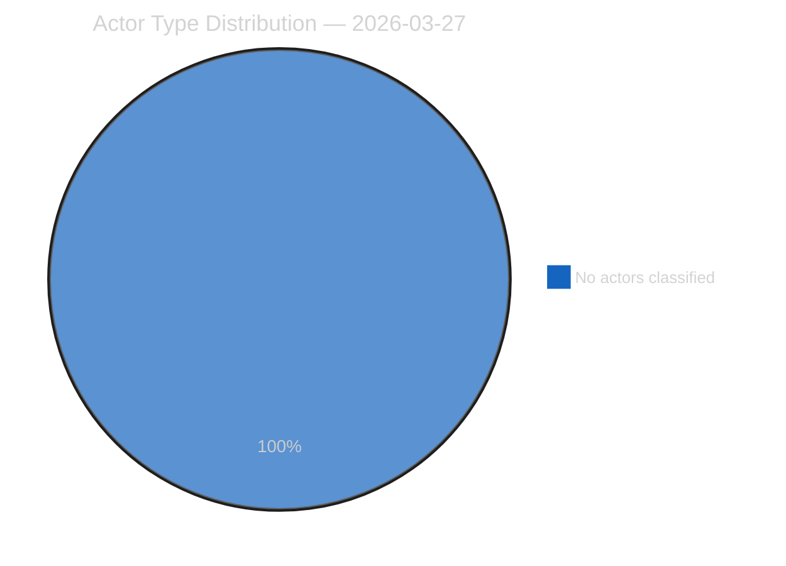
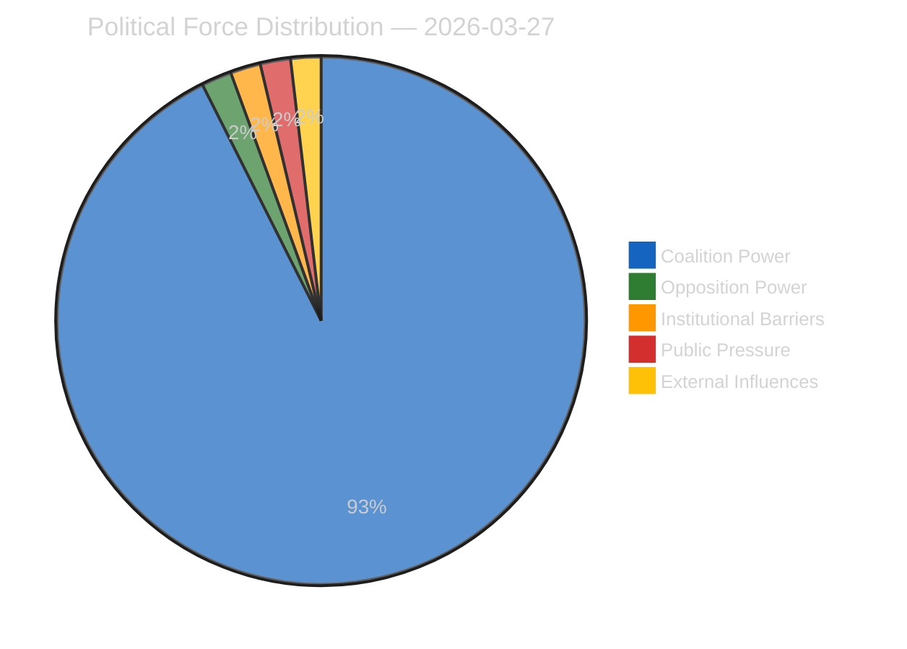
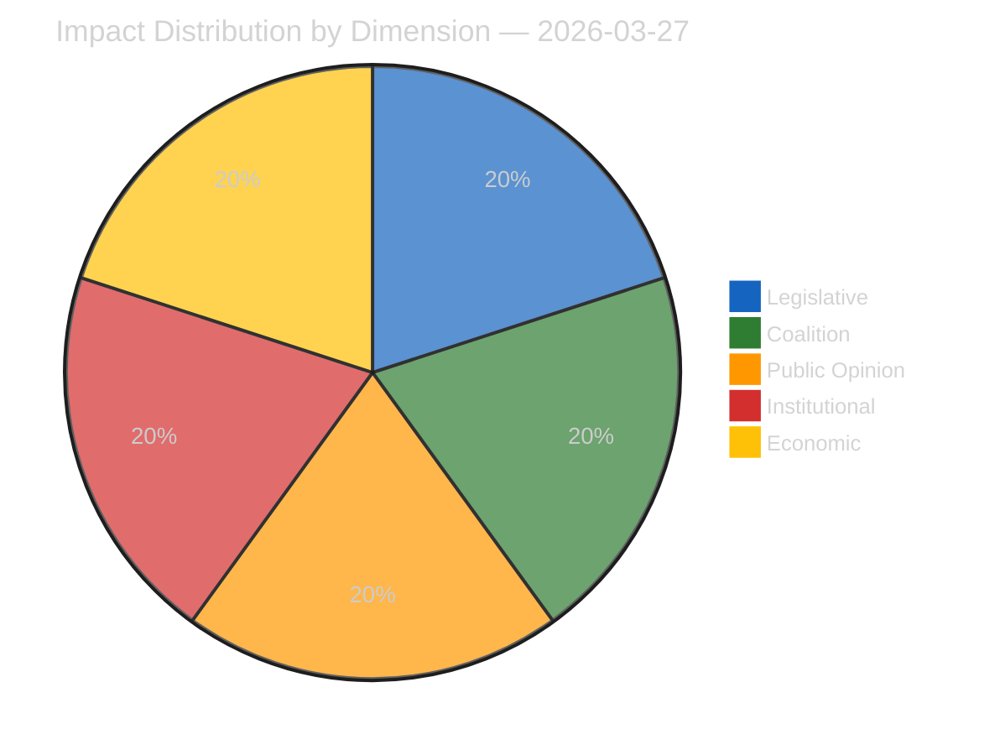
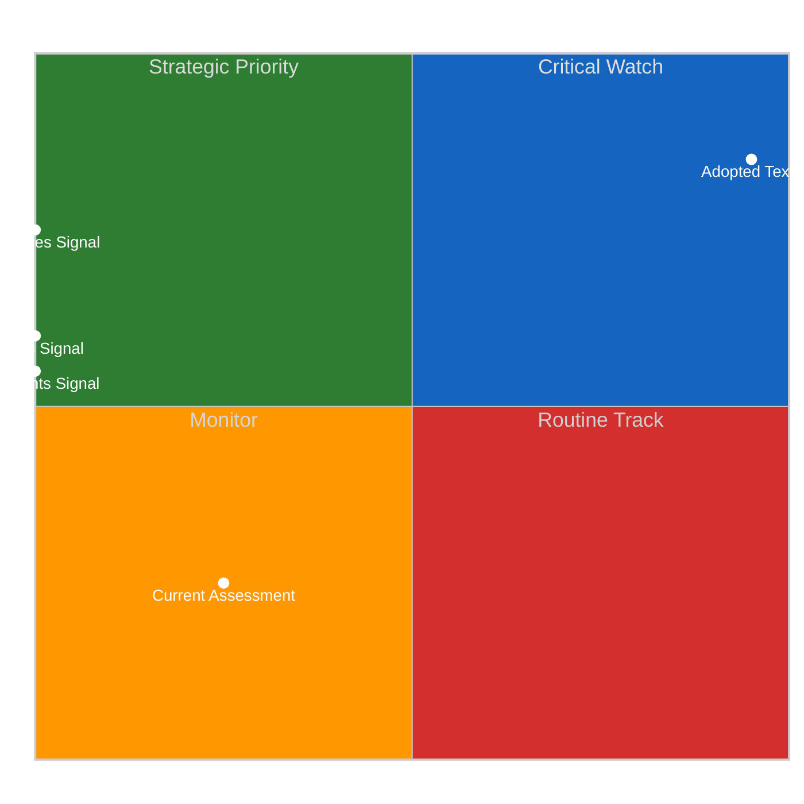
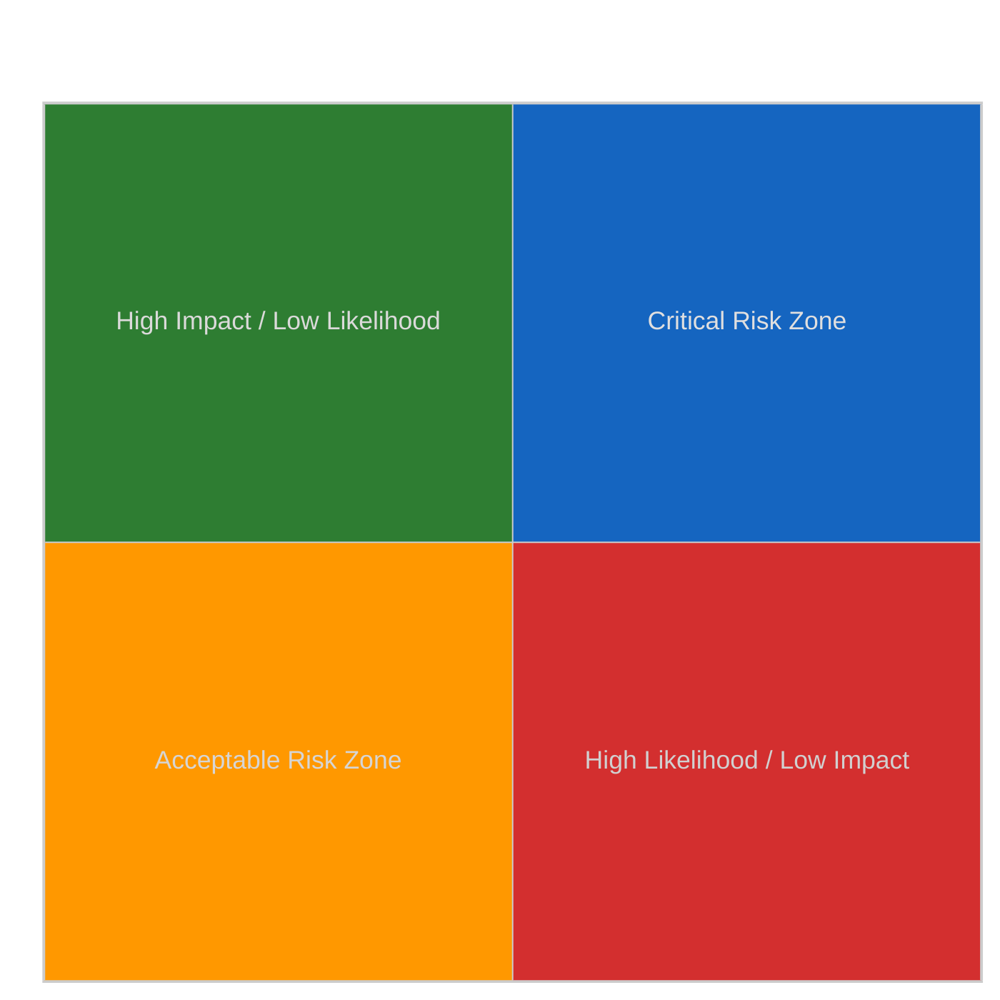
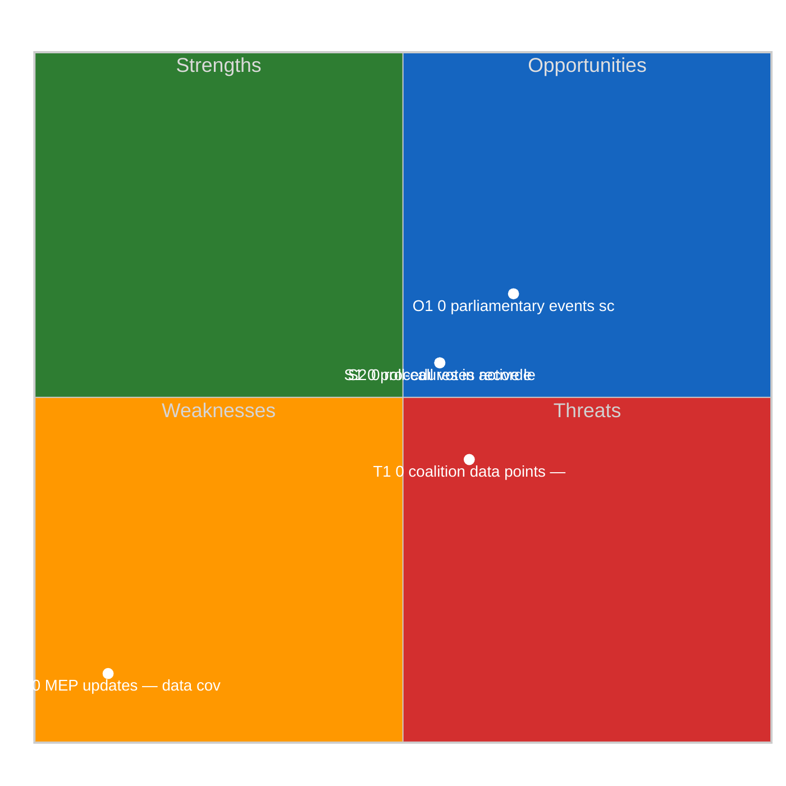
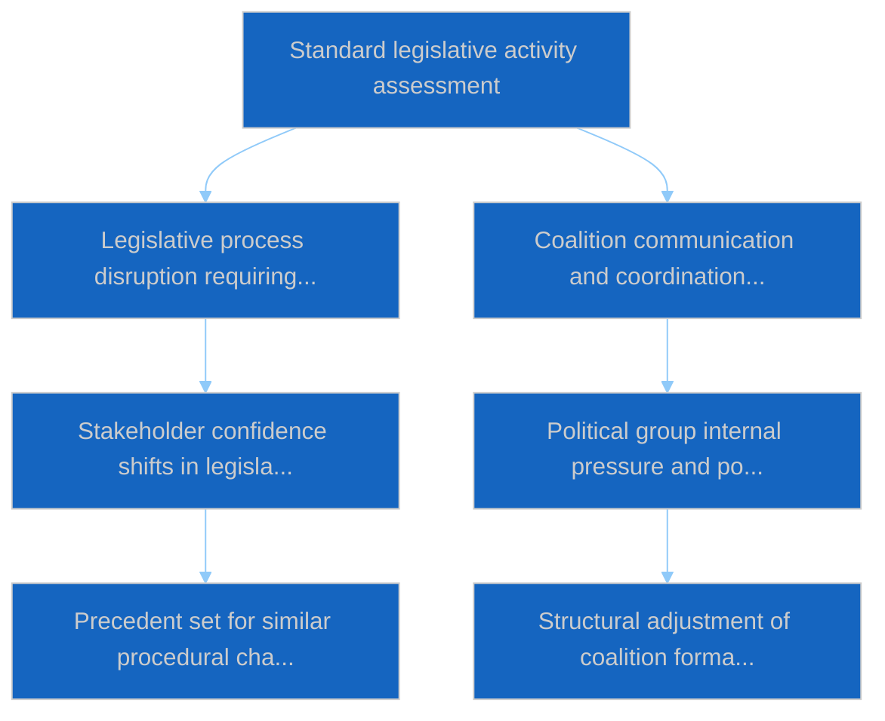

# Breaking — 2026-03-27

<h2 id="reader-intelligence-guide">Reader Intelligence Guide</h2>

Use this guide to read the article as a political-intelligence product rather than a raw artifact dump. High-value reader lenses appear first; technical provenance remains available in the audit appendices.

| Reader need | What you'll get | Source artifact |
|---|---|---|
| [Coalitions and voting](#section-coalitions-voting) | political group alignment, voting evidence, and coalition pressure points | `existing/voting-patterns.md` |
| [Risk assessment](#section-risk) | policy, institutional, coalition, communications, and implementation risk register | `risk-scoring/risk-matrix.md` |

<h2 id="section-actors-forces">Actors & Forces</h2>

### Actor Mapping

### Actors Identified: 0

### Actor Classification

| Actor | Type | Influence | Position | Role |
|-------|------|-----------|----------|------|
| — | — | — | — | — |

### Type Counts

| Type | Count |
|------|-------|
| — | 0 |

### Date: 2026-03-27

### Forces Analysis

### Forces Data

| Force | Trend | Strength | Key Actors | Confidence |
|-------|-------|----------|------------|------------|
| Coalition Power | stable | 50% | — | low |
| Opposition Power | stable | 0% | — | low |
| Institutional Barriers | stable | 0% | — | low |
| Public Pressure | stable | 0% | — | low |
| External Influences | stable | 0% | — | low |

### Balance

| Metric | Value |
|--------|-------|
| Coalition vs Opposition | 50% vs 1% |
| Dominant force | Coalition |
| Date | 2026-03-27 |

### Date: 2026-03-27

### Impact Matrix

### Overall Significance: **ROUTINE**

### Impact Dimensions

| Dimension | Level | Indicator | Numeric |
|-----------|-------|-----------|---------|
| Legislative | none | 🟢 | 5 |
| Coalition | none | 🟢 | 5 |
| Public Opinion | none | 🟢 | 5 |
| Institutional | none | 🟢 | 5 |
| Economic | none | 🟢 | 5 |

### Summary

| Metric | Value |
|--------|-------|
| Overall significance | ROUTINE |
| Highest impact | Legislative |
| Date | 2026-03-27 |

### Date: 2026-03-27

### Significance Assessment

### Overall Significance: **ROUTINE**

### 5-Signal Model Scores

| Signal | Raw Data | Score |
|--------|----------|-------|
| Volume | 0 events, 0 documents | 0.0/5 |
| Pipeline | 0 procedures | 0.0/5 |
| Output | 17 adopted texts | 3.4/5 |
| Anomalies | Pattern deviation detection | — |
| Coalition | Group alignment analysis | — |

### Data Summary

| Metric | Value |
|--------|-------|
| Computed significance | ROUTINE |
| Total data points | 17 |
| Events | 0 |
| Documents | 0 |
| Procedures | 0 |
| Adopted texts | 17 |
| Date | 2026-03-27 |

### Date: 2026-03-27

<h2 id="section-coalitions-voting">Coalitions & Voting</h2>

### Voting Patterns

### Overview
Detection and analysis of voting trends across European Parliament proceedings.

### Detected Trends
| Trend ID | Direction | Confidence | Data Points |
|----------|-----------|------------|-------------|
| No trend data available | — | — | — |

### Summary
- **Trends identified**: 0
- **Records analysed**: 0
- **Date**: 2026-03-27

<h2 id="section-risk">Risk Assessment</h2>

### Risk Matrix

### Overview

Quantitative risk scoring across 0 identified political dimensions.
This matrix uses a standardized likelihood × impact framework to quantify and
prioritize political risks affecting the European Parliament legislative process.

### Risk Heat Map

### Risk Matrix

| Risk ID | Description | Likelihood | Impact | Score | Level |
|---------|-------------|------------|--------|-------|-------|
| — | — | — | — | — | — |

> **Risk Score** = Likelihood × Impact. **Levels**: 🟢 LOW (≤1.0), 🟡 MEDIUM (≤2.0), 🟠 HIGH (≤3.5), 🔴 CRITICAL (>3.5)

### Risk Assessment Details

| — | — | — | — | — | — |

### Risk Mitigation Framework

| Risk Level | Count | Tolerance | Action Required |
|------------|-------|-----------|-----------------|
| 🔴 CRITICAL | 0 | Zero tolerance | Immediate escalation |
| 🟠 HIGH | 0 | Low tolerance | Active mitigation |
| 🟡 MEDIUM | 0 | Moderate | Enhanced monitoring |
| 🟢 LOW | 0 | Acceptable | Routine tracking |

### Date: 2026-03-27

### Quantitative Swot

### Executive Summary

**Strategic Position Score**: 2.3/10
**Overall Assessment**: Weak strategic position: weaknesses and threats dominate — urgent mitigation needed.
**Analysis Date**: 2026-03-27

> This SWOT analysis is derived from 0 procedures, 0 events, 17 adopted texts, 0 documents, 0 voting records, and 0 coalition data points fetched from the European Parliament.

### SWOT Quadrant Chart

### SWOT Overview

| Category | Items | Avg Score | Trend |
|----------|-------|-----------|-------|
| 🟢 Strengths | 2 | 0.0 | stable |
| 🔴 Weaknesses | 1 | 4.0 | stable |
| 🔵 Opportunities | 1 | 1.5 | stable |
| 🟠 Threats | 1 | 0.9 | stable |

### 🟢 Strengths

#### S1: 0 procedures in active legislative pipeline
- **Score**: 0.0/5
- **Confidence**: low
- **Trend**: stable
- **Evidence**:
  - 0 procedures tracked in current period
  - 17 texts adopted
  - 0 documents published

#### S2: 0 roll-call votes recorded with 0 questions
- **Score**: 0.0/5
- **Confidence**: low
- **Trend**: stable
- **Evidence**:
  - 0 voting records available
  - 0 parliamentary questions filed
  - 10 MEP activity updates

### 🔴 Weaknesses

#### W1: 10 MEP updates — data coverage gap assessment
- **Score**: 4.0/5
- **Confidence**: medium
- **Trend**: stable
- **Evidence**:
  - 10 MEP updates in current period
  - 0 documents vs 0 procedures ratio
  - Data freshness depends on EP feed update frequency

### 🔵 Opportunities

#### O1: 0 parliamentary events scheduled
- **Score**: 1.5/5
- **Confidence**: medium
- **Trend**: stable
- **Evidence**:
  - 0 events in analysis period
  - 17 texts adopted indicates legislative throughput
  - 0 procedures in various stages

### 🟠 Threats

#### T1: 0 coalition data points — cohesion monitoring
- **Score**: 0.9/5
- **Confidence**: low
- **Trend**: stable
- **Evidence**:
  - 0 coalition observations recorded
  - Cross-reference with 0 voting records
  - 0 procedures may be affected by coalition shifts

### Cross-Impact Matrix

| Interaction | Net Effect | Rationale |
|-------------|-----------|----------|
| strength #1 × threat #1 | 0.00 | Strength "0 procedures in active legislative pipeline" partially mitigates threat "0 coalition data points — cohesion monitoring" |
| strength #2 × threat #1 | 0.00 | Strength "0 roll-call votes recorded with 0 questions" partially mitigates threat "0 coalition data points — cohesion monitoring" |
| weakness #1 × threat #1 | 0.60 | Weakness "10 MEP updates — data coverage gap assessment" amplifies threat "0 coalition data points — cohesion monitoring" |

### Strategic Priorities Matrix

### Data Summary

| Data Source | Count |
|-------------|-------|
| Procedures | 0 |
| Events | 0 |
| Documents | 0 |
| Voting Records | 0 |
| Adopted Texts | 17 |
| Coalitions | 0 |
| Questions | 0 |
| MEP Updates | 10 |
| **Total Data Points** | **17** |

### Date: 2026-03-27

### Political Capital Risk

### Data Inventory for Capital Risk Assessment
| Data Source | Count | Relevance |
|-------------|-------|-----------|
| Coalition data points | 0 | Group cohesion indicators |
| Voting records | 0 | Voting alignment metrics |
| Voting patterns | 0 | Trend and anomaly data |
| Active procedures | 0 | Legislative engagement |

### Date: 2026-03-27

### Legislative Velocity Risk

### Overview
Risk assessment based on legislative processing speed for 0 procedures.

### Top Velocity Risks
| Procedure | Title | Stage | Days (actual/expected) | Risk Score | Level |
|-----------|-------|-------|----------------------|------------|-------|
| — | — | — | — | — | — |

### Summary
- **Procedures analysed**: 0
- **High/Critical risks**: 0
- **Date**: 2026-03-27

### Agent Risk Workflow

### Risk Heat Map

| Impact ↓ / Likelihood → | Rare | Unlikely | Possible | Likely | Almost Certain |
|--------------------------|------|----------|----------|--------|----------------|
| **Severe** | 🟢 | 🟡 | 🟠 | 🟠 | 🔴 |
| **Major** | 🟢 | 🟡 | 🟡 | 🟠 | 🔴 |
| **Moderate** | 🟢 | 🟢 | 🟡 | 🟠 | 🟠 |
| **Minor** | 🟢 | 🟢 | 🟢 | 🟡 | 🟡 |
| **Negligible** | 🟢 | 🟢 | 🟢 | 🟢 | 🟢 |

### Identified Risks

#### RISK-W00: Baseline political risk
- **Likelihood**: rare (0.1) | **Impact**: minor (2) | **Score**: 0.2 (LOW) | **Confidence**: low
- **Evidence**: Routine parliamentary activity
- **Mitigating Factors**: Stable institutional framework

### Risk Evaluation Matrix

| Rank | Risk ID | Description | Score | Level | Confidence |
|------|---------|-------------|-------|-------|------------|
| 1 | RISK-W00 | Baseline political risk | 0.2 | LOW | low |

### Risk Treatment Plan

- Monitor legislative velocity indicators
- Track coalition voting patterns

### Recommendations

- Monitor legislative velocity indicators
- Track coalition voting patterns

<h2 id="section-threat">Threat Landscape</h2>

### Actor Threat Profiles

### Overview
Individual threat profiles for 0 political actors.

### Actor Threat Matrix
| Actor | Type | Capability | Motivation | Opportunity | Threat Level |
|-------|------|------------|------------|-------------|--------------|
| — | — | — | — | — | — |

### Date: 2026-03-27

### Consequence Trees

### Overview
Structured analysis of action-consequence chains for 0 legislative procedures.

### No procedures available for consequence analysis

### Date: 2026-03-27

### Legislative Disruption

### Overview
Identification of factors disrupting the normal legislative process.

### Disruption Assessment
| Procedure ID | Title | Stage | Resilience | Disruption Points |
|-------------|-------|-------|-----------|-------------------|
| — | — | — | — | — |

### Date: 2026-03-27

### Political Stride Assessment

### Political STRIDE Analysis

#### Coalition Shifts (S)
**Threat Level**: 🟢 Low

Coalition stability appears maintained. No significant realignment signals.

**Evidence:**
- No coalition shift signals detected in available data

#### Transparency Concerns (T)
**Threat Level**: ⚠️ Moderate

Transparency concerns at moderate level. Review committee meeting records and public documentation.

**Evidence:**
- No committee activity data available — potential information gap

#### Policy Reversals (R)
**Threat Level**: 🟢 Low

Legislative trajectory appears stable. No major reversal signals.

**Evidence:**
- No significant policy reversal signals detected

#### Institutional Threats (I)
**Threat Level**: 🟢 Low

Institutional balance appears maintained. Power distribution within normal parameters.

**Evidence:**
- No institutional threat signals detected

#### Legislative Delays (D)
**Threat Level**: 🟢 Low

Legislative pace within normal parameters. No obstruction signals.

**Evidence:**
- No significant legislative delay signals detected

#### Democratic Erosion (E)
**Threat Level**: 🟢 Low

Democratic norms appear stable. Institutional processes functioning within expected parameters.

**Evidence:**
- Democratic norms appear stable. No systematic erosion signals.

### Actor Threat Profiles

*No actor threat profiles generated from available data.*

### Consequence Trees

#### Consequence Tree: Standard legislative activity assessment

**Mitigating Factors:**
- Institutional resilience mechanisms
- Cross-party dialogue channels

**Amplifying Factors:**
- No significant amplifying factors identified

### Legislative Disruption Analysis

#### Procedure: General legislative pipeline

**Current Stage**: proposal | **Resilience**: high

| Stage | Threat Category | Likelihood | Risk Level |
|-------|----------------|------------|------------|
| proposal | delay | 8% | 🟢 Low |
| committee | transparency | 18% | 🟢 Low |
| plenary first reading | shift | 22% | 🟢 Low |
| council position | delay | 12% | 🟢 Low |
| plenary second reading | shift | 21% | 🟢 Low |
| conciliation | reversal | 17% | 🟢 Low |
| adoption | delay | 5% | 🟢 Low |

**Alternative Pathways:**
- Commission resubmission with revised proposal
- Enhanced informal trilogue engagement
- Interim resolution as procedural bridge

### Key Findings

- No high-priority threats detected across Political STRIDE categories

### Recommendations

- Continue routine monitoring of parliamentary activity

---
*Assessment generated by EU Parliament Monitor Political Threat Assessment Pipeline.*  
*Based on public European Parliament data. GDPR-compliant.*

<h2 id="section-continuity">Cross-Run Continuity</h2>

### Cross Session Intelligence

### Overview
Analysis of coalition stability patterns across multiple plenary sessions.

### Stability Report
- **Overall Stability**: 0.0%
- **Forecast**: volatile
- **Patterns Analysed**: 0

### Group Analysis
- **Stable Groups**: None identified
- **Declining Groups**: None identified

### Date: 2026-03-27

<h2 id="section-deep-analysis">Deep Analysis</h2>

### Raw Data Inventory
| Data Source | Count |
|-------------|-------|
| Events | 0 |
| Procedures | 0 |
| Documents | 0 |
| Adopted Texts | 17 |
| Questions | 0 |
| MEP Updates | 10 |
| **Total** | **27** |

### Stakeholder Groups for AI Analysis
| Stakeholder Group | Data Points Available |
|-------------------|---------------------|
| Political Groups | 17 (procedures + adopted texts) |
| Civil Society | 0 (documents + questions) |
| Industry | 0 (procedures) |
| National Governments | 17 (adopted texts) |
| Citizens | 10 (questions + MEP updates) |
| EU Institutions | 0 (events + procedures) |

### Date: 2026-03-27

<h2 id="section-supplementary-intelligence">Supplementary Intelligence</h2>

### Coalition Analysis

### Overview
Analysis of political group cohesion and coalition dynamics.

### Coalition Metrics
- **Overall Stability**: 0.0%
- **Forecast**: volatile
- **Patterns Analysed**: 0

### Group Analysis
- **Stable Groups**: No stable groups identified
- **Declining Groups**: No declining groups identified

### Coalition Intelligence
- **Patterns Evaluated**: 0

### Date: 2026-03-27

### Stakeholder Analysis

### Data Available for Stakeholder Assessment
| Stakeholder Group | Primary Data Sources | Data Points |
|-------------------|---------------------|-------------|
| Political Groups | Procedures, Adopted Texts, Voting Records, Coalitions | 17 |
| Civil Society | Documents, Questions, Events | 0 |
| Industry | Procedures, Adopted Texts | 17 |
| National Governments | Adopted Texts, Procedures, Coalitions | 17 |
| Citizens | Questions, MEP Updates, Events | 10 |
| EU Institutions | Events, Procedures, Adopted Texts, Voting Records | 17 |

### Data Source Summary
| Source | Count |
|--------|-------|
| patterns | 0 |
| votingRecords | 0 |
| events | 0 |
| documents | 0 |
| adoptedTexts | 17 |
| procedures | 0 |
| mepUpdates | 10 |
| plenaryDocuments | 0 |
| committeeDocuments | 0 |
| plenarySessionDocuments | 0 |
| externalDocuments | 0 |
| questions | 0 |
| declarations | 0 |
| corporateBodies | 0 |

### Date: 2026-03-27

> **Provenance & Audit**
>
> - **Article type:** `breaking`
> - **Run date:** 2026-03-27
> - **Run id:** `77fc920c-3a76-4813-9db5-43a7e9acc25e`
> - **Gate result:** `PENDING`
> - **Analysis tree:** [analysis/daily/2026-03-27](https://github.com/Hack23/euparliamentmonitor/tree/main/analysis/daily/2026-03-27)
> - **Manifest:** [manifest.json](https://github.com/Hack23/euparliamentmonitor/blob/main/analysis/daily/2026-03-27/manifest.json)

<h2 id="aggregator-tradecraft-references">Tradecraft References</h2>

This article is produced under the [Hack23 AB](https://hack23.com) intelligence tradecraft library. Every methodology and artifact template applied to this run is linked below.

### Methodologies

- [README](https://github.com/Hack23/euparliamentmonitor/blob/main/analysis/methodologies/README.md)
- [Ai Driven Analysis Guide](https://github.com/Hack23/euparliamentmonitor/blob/main/analysis/methodologies/ai-driven-analysis-guide.md)
- [Analytical Supplementary Methodology](https://github.com/Hack23/euparliamentmonitor/blob/main/analysis/methodologies/analytical-supplementary-methodology.md)
- [Artifact Catalog](https://github.com/Hack23/euparliamentmonitor/blob/main/analysis/methodologies/artifact-catalog.md)
- [Electoral Cycle Methodology](https://github.com/Hack23/euparliamentmonitor/blob/main/analysis/methodologies/electoral-cycle-methodology.md)
- [Electoral Domain Methodology](https://github.com/Hack23/euparliamentmonitor/blob/main/analysis/methodologies/electoral-domain-methodology.md)
- [Forward Projection Methodology](https://github.com/Hack23/euparliamentmonitor/blob/main/analysis/methodologies/forward-projection-methodology.md)
- [Imf Indicator Mapping](https://github.com/Hack23/euparliamentmonitor/blob/main/analysis/methodologies/imf-indicator-mapping.md)
- [Osint Tradecraft Standards](https://github.com/Hack23/euparliamentmonitor/blob/main/analysis/methodologies/osint-tradecraft-standards.md)
- [Per Artifact Methodologies](https://github.com/Hack23/euparliamentmonitor/blob/main/analysis/methodologies/per-artifact-methodologies.md)
- [Per Document Methodology](https://github.com/Hack23/euparliamentmonitor/blob/main/analysis/methodologies/per-document-methodology.md)
- [Political Classification Guide](https://github.com/Hack23/euparliamentmonitor/blob/main/analysis/methodologies/political-classification-guide.md)
- [Political Risk Methodology](https://github.com/Hack23/euparliamentmonitor/blob/main/analysis/methodologies/political-risk-methodology.md)
- [Political Style Guide](https://github.com/Hack23/euparliamentmonitor/blob/main/analysis/methodologies/political-style-guide.md)
- [Political Swot Framework](https://github.com/Hack23/euparliamentmonitor/blob/main/analysis/methodologies/political-swot-framework.md)
- [Political Threat Framework](https://github.com/Hack23/euparliamentmonitor/blob/main/analysis/methodologies/political-threat-framework.md)
- [Strategic Extensions Methodology](https://github.com/Hack23/euparliamentmonitor/blob/main/analysis/methodologies/strategic-extensions-methodology.md)
- [Structural Metadata Methodology](https://github.com/Hack23/euparliamentmonitor/blob/main/analysis/methodologies/structural-metadata-methodology.md)
- [Synthesis Methodology](https://github.com/Hack23/euparliamentmonitor/blob/main/analysis/methodologies/synthesis-methodology.md)
- [Worldbank Indicator Mapping](https://github.com/Hack23/euparliamentmonitor/blob/main/analysis/methodologies/worldbank-indicator-mapping.md)

### Artifact templates

- [README](https://github.com/Hack23/euparliamentmonitor/blob/main/analysis/templates/README.md)
- [Actor Mapping](https://github.com/Hack23/euparliamentmonitor/blob/main/analysis/templates/actor-mapping.md)
- [Actor Threat Profiles](https://github.com/Hack23/euparliamentmonitor/blob/main/analysis/templates/actor-threat-profiles.md)
- [Analysis Index](https://github.com/Hack23/euparliamentmonitor/blob/main/analysis/templates/analysis-index.md)
- [Coalition Dynamics](https://github.com/Hack23/euparliamentmonitor/blob/main/analysis/templates/coalition-dynamics.md)
- [Coalition Mathematics](https://github.com/Hack23/euparliamentmonitor/blob/main/analysis/templates/coalition-mathematics.md)
- [Commission Wp Alignment](https://github.com/Hack23/euparliamentmonitor/blob/main/analysis/templates/commission-wp-alignment.md)
- [Comparative International](https://github.com/Hack23/euparliamentmonitor/blob/main/analysis/templates/comparative-international.md)
- [Consequence Trees](https://github.com/Hack23/euparliamentmonitor/blob/main/analysis/templates/consequence-trees.md)
- [Cross Reference Map](https://github.com/Hack23/euparliamentmonitor/blob/main/analysis/templates/cross-reference-map.md)
- [Cross Run Diff](https://github.com/Hack23/euparliamentmonitor/blob/main/analysis/templates/cross-run-diff.md)
- [Cross Session Intelligence](https://github.com/Hack23/euparliamentmonitor/blob/main/analysis/templates/cross-session-intelligence.md)
- [Data Download Manifest](https://github.com/Hack23/euparliamentmonitor/blob/main/analysis/templates/data-download-manifest.md)
- [Deep Analysis](https://github.com/Hack23/euparliamentmonitor/blob/main/analysis/templates/deep-analysis.md)
- [Devils Advocate Analysis](https://github.com/Hack23/euparliamentmonitor/blob/main/analysis/templates/devils-advocate-analysis.md)
- [Economic Context](https://github.com/Hack23/euparliamentmonitor/blob/main/analysis/templates/economic-context.md)
- [Executive Brief](https://github.com/Hack23/euparliamentmonitor/blob/main/analysis/templates/executive-brief.md)
- [Forces Analysis](https://github.com/Hack23/euparliamentmonitor/blob/main/analysis/templates/forces-analysis.md)
- [Forward Indicators](https://github.com/Hack23/euparliamentmonitor/blob/main/analysis/templates/forward-indicators.md)
- [Forward Projection](https://github.com/Hack23/euparliamentmonitor/blob/main/analysis/templates/forward-projection.md)
- [Historical Baseline](https://github.com/Hack23/euparliamentmonitor/blob/main/analysis/templates/historical-baseline.md)
- [Historical Parallels](https://github.com/Hack23/euparliamentmonitor/blob/main/analysis/templates/historical-parallels.md)
- [Imf Vintage Audit](https://github.com/Hack23/euparliamentmonitor/blob/main/analysis/templates/imf-vintage-audit.md)
- [Impact Matrix](https://github.com/Hack23/euparliamentmonitor/blob/main/analysis/templates/impact-matrix.md)
- [Implementation Feasibility](https://github.com/Hack23/euparliamentmonitor/blob/main/analysis/templates/implementation-feasibility.md)
- [Intelligence Assessment](https://github.com/Hack23/euparliamentmonitor/blob/main/analysis/templates/intelligence-assessment.md)
- [Legislative Disruption](https://github.com/Hack23/euparliamentmonitor/blob/main/analysis/templates/legislative-disruption.md)
- [Legislative Pipeline Forecast](https://github.com/Hack23/euparliamentmonitor/blob/main/analysis/templates/legislative-pipeline-forecast.md)
- [Legislative Velocity Risk](https://github.com/Hack23/euparliamentmonitor/blob/main/analysis/templates/legislative-velocity-risk.md)
- [Mandate Fulfilment Scorecard](https://github.com/Hack23/euparliamentmonitor/blob/main/analysis/templates/mandate-fulfilment-scorecard.md)
- [Mcp Reliability Audit](https://github.com/Hack23/euparliamentmonitor/blob/main/analysis/templates/mcp-reliability-audit.md)
- [Media Framing Analysis](https://github.com/Hack23/euparliamentmonitor/blob/main/analysis/templates/media-framing-analysis.md)
- [Methodology Reflection](https://github.com/Hack23/euparliamentmonitor/blob/main/analysis/templates/methodology-reflection.md)
- [Parliamentary Calendar Projection](https://github.com/Hack23/euparliamentmonitor/blob/main/analysis/templates/parliamentary-calendar-projection.md)
- [Per File Political Intelligence](https://github.com/Hack23/euparliamentmonitor/blob/main/analysis/templates/per-file-political-intelligence.md)
- [Pestle Analysis](https://github.com/Hack23/euparliamentmonitor/blob/main/analysis/templates/pestle-analysis.md)
- [Political Capital Risk](https://github.com/Hack23/euparliamentmonitor/blob/main/analysis/templates/political-capital-risk.md)
- [Political Classification](https://github.com/Hack23/euparliamentmonitor/blob/main/analysis/templates/political-classification.md)
- [Political Threat Landscape](https://github.com/Hack23/euparliamentmonitor/blob/main/analysis/templates/political-threat-landscape.md)
- [Presidency Trio Context](https://github.com/Hack23/euparliamentmonitor/blob/main/analysis/templates/presidency-trio-context.md)
- [Quantitative Swot](https://github.com/Hack23/euparliamentmonitor/blob/main/analysis/templates/quantitative-swot.md)
- [Reference Analysis Quality](https://github.com/Hack23/euparliamentmonitor/blob/main/analysis/templates/reference-analysis-quality.md)
- [Risk Assessment](https://github.com/Hack23/euparliamentmonitor/blob/main/analysis/templates/risk-assessment.md)
- [Risk Matrix](https://github.com/Hack23/euparliamentmonitor/blob/main/analysis/templates/risk-matrix.md)
- [Scenario Forecast](https://github.com/Hack23/euparliamentmonitor/blob/main/analysis/templates/scenario-forecast.md)
- [Seat Projection](https://github.com/Hack23/euparliamentmonitor/blob/main/analysis/templates/seat-projection.md)
- [Session Baseline](https://github.com/Hack23/euparliamentmonitor/blob/main/analysis/templates/session-baseline.md)
- [Significance Classification](https://github.com/Hack23/euparliamentmonitor/blob/main/analysis/templates/significance-classification.md)
- [Significance Scoring](https://github.com/Hack23/euparliamentmonitor/blob/main/analysis/templates/significance-scoring.md)
- [Stakeholder Impact](https://github.com/Hack23/euparliamentmonitor/blob/main/analysis/templates/stakeholder-impact.md)
- [Stakeholder Map](https://github.com/Hack23/euparliamentmonitor/blob/main/analysis/templates/stakeholder-map.md)
- [Swot Analysis](https://github.com/Hack23/euparliamentmonitor/blob/main/analysis/templates/swot-analysis.md)
- [Synthesis Summary](https://github.com/Hack23/euparliamentmonitor/blob/main/analysis/templates/synthesis-summary.md)
- [Term Arc](https://github.com/Hack23/euparliamentmonitor/blob/main/analysis/templates/term-arc.md)
- [Threat Analysis](https://github.com/Hack23/euparliamentmonitor/blob/main/analysis/templates/threat-analysis.md)
- [Threat Model](https://github.com/Hack23/euparliamentmonitor/blob/main/analysis/templates/threat-model.md)
- [Voter Segmentation](https://github.com/Hack23/euparliamentmonitor/blob/main/analysis/templates/voter-segmentation.md)
- [Voting Patterns](https://github.com/Hack23/euparliamentmonitor/blob/main/analysis/templates/voting-patterns.md)
- [Wildcards Blackswans](https://github.com/Hack23/euparliamentmonitor/blob/main/analysis/templates/wildcards-blackswans.md)
- [Workflow Audit](https://github.com/Hack23/euparliamentmonitor/blob/main/analysis/templates/workflow-audit.md)

<h2 id="aggregator-analysis-index">Analysis Index</h2>

Every artifact below was read by the aggregator and contributed to this article. The raw [manifest.json](https://github.com/Hack23/euparliamentmonitor/blob/main/analysis/daily/2026-03-27/manifest.json) carries the full machine-readable list, including gate-result history.

| Section | Artifact | Path |
|---|---|---|
| section-actors-forces | [actor-mapping](https://github.com/Hack23/euparliamentmonitor/blob/main/analysis/daily/2026-03-27/classification/actor-mapping.md) | `classification/actor-mapping.md` |
| section-actors-forces | [forces-analysis](https://github.com/Hack23/euparliamentmonitor/blob/main/analysis/daily/2026-03-27/classification/forces-analysis.md) | `classification/forces-analysis.md` |
| section-actors-forces | [impact-matrix](https://github.com/Hack23/euparliamentmonitor/blob/main/analysis/daily/2026-03-27/classification/impact-matrix.md) | `classification/impact-matrix.md` |
| section-actors-forces | [significance-assessment](https://github.com/Hack23/euparliamentmonitor/blob/main/analysis/daily/2026-03-27/classification/significance-assessment.md) | `classification/significance-assessment.md` |
| section-coalitions-voting | [voting-patterns](https://github.com/Hack23/euparliamentmonitor/blob/main/analysis/daily/2026-03-27/existing/voting-patterns.md) | `existing/voting-patterns.md` |
| section-risk | [risk-matrix](https://github.com/Hack23/euparliamentmonitor/blob/main/analysis/daily/2026-03-27/risk-scoring/risk-matrix.md) | `risk-scoring/risk-matrix.md` |
| section-risk | [quantitative-swot](https://github.com/Hack23/euparliamentmonitor/blob/main/analysis/daily/2026-03-27/risk-scoring/quantitative-swot.md) | `risk-scoring/quantitative-swot.md` |
| section-risk | [political-capital-risk](https://github.com/Hack23/euparliamentmonitor/blob/main/analysis/daily/2026-03-27/risk-scoring/political-capital-risk.md) | `risk-scoring/political-capital-risk.md` |
| section-risk | [legislative-velocity-risk](https://github.com/Hack23/euparliamentmonitor/blob/main/analysis/daily/2026-03-27/risk-scoring/legislative-velocity-risk.md) | `risk-scoring/legislative-velocity-risk.md` |
| section-risk | [agent-risk-workflow](https://github.com/Hack23/euparliamentmonitor/blob/main/analysis/daily/2026-03-27/risk-scoring/agent-risk-workflow.md) | `risk-scoring/agent-risk-workflow.md` |
| section-threat | [actor-threat-profiles](https://github.com/Hack23/euparliamentmonitor/blob/main/analysis/daily/2026-03-27/threat-assessment/actor-threat-profiles.md) | `threat-assessment/actor-threat-profiles.md` |
| section-threat | [consequence-trees](https://github.com/Hack23/euparliamentmonitor/blob/main/analysis/daily/2026-03-27/threat-assessment/consequence-trees.md) | `threat-assessment/consequence-trees.md` |
| section-threat | [legislative-disruption](https://github.com/Hack23/euparliamentmonitor/blob/main/analysis/daily/2026-03-27/threat-assessment/legislative-disruption.md) | `threat-assessment/legislative-disruption.md` |
| section-threat | [political-stride-assessment](https://github.com/Hack23/euparliamentmonitor/blob/main/analysis/daily/2026-03-27/threat-assessment/political-stride-assessment.md) | `threat-assessment/political-stride-assessment.md` |
| section-continuity | [cross-session-intelligence](https://github.com/Hack23/euparliamentmonitor/blob/main/analysis/daily/2026-03-27/existing/cross-session-intelligence.md) | `existing/cross-session-intelligence.md` |
| section-deep-analysis | [deep-analysis](https://github.com/Hack23/euparliamentmonitor/blob/main/analysis/daily/2026-03-27/existing/deep-analysis.md) | `existing/deep-analysis.md` |
| section-supplementary-intelligence | [coalition-analysis](https://github.com/Hack23/euparliamentmonitor/blob/main/analysis/daily/2026-03-27/existing/coalition-analysis.md) | `existing/coalition-analysis.md` |
| section-supplementary-intelligence | [stakeholder-analysis](https://github.com/Hack23/euparliamentmonitor/blob/main/analysis/daily/2026-03-27/existing/stakeholder-analysis.md) | `existing/stakeholder-analysis.md` |

