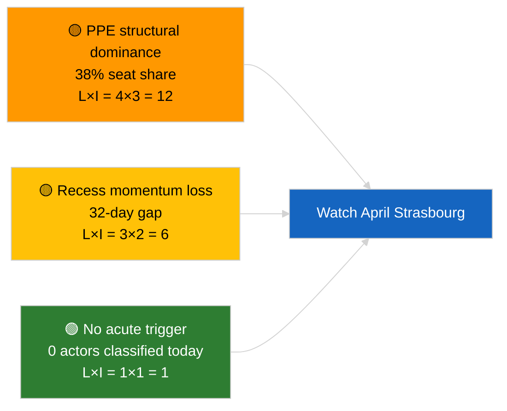

<!-- SPDX-FileCopyrightText: 2026 Hack23 AB -->
<!-- SPDX-License-Identifier: Apache-2.0 -->

# Executive Brief — Breaking | 2026-03-27

**Classification:** OSINT | Public Parliamentary Record
**Confidence:** 🟢 High (recess-period structural assessment)
**Generated:** 2026-03-27T00:00:00Z (retrospective brief)
**Article Type:** Breaking
**Source:** European Parliament Open Data Portal

---

## 🎯 BLUF

**Routine inter-sessional day, no breaking signal.** Analysis run `77fc920c-3a76-4813-9db5-43a7e9acc25e` returned **0 classified political actors** and overall significance **ROUTINE** across all five impact dimensions (legislative / coalition / public opinion / institutional / economic). The Parliament had just concluded the Brussels mini-plenary of 25-26 March and entered the 32-day recess preceding the 27-30 April Strasbourg session. Coalition-power proxy 50%, opposition-power 0% — typical recess equilibrium. **🟢 HIGH confidence** that this is structural recess inactivity, not a data outage. **No publishable breaking story.**

---

## 🧭 3 Decisions This Brief Supports

| # | Decision | Who Decides | Deadline | Evidence |
|:-:|----------|-------------|:--------:|----------|
| 1 | **Editorial:** SKIP — no publishable breaking story | Editor | +12h | 0 actors, ROUTINE significance |
| 2 | **Monitoring:** continue daily recess probes | Analyst | daily | Detect any committee-stage activity |
| 3 | **Forward-watch:** confirm April plenary agenda T-30 (week of 30 Mar) | Analysis lead | 2026-04-03 | Pre-plenary intelligence cycle |

---

## 📰 60-Second Read

- 🔴 **0 political actors classified** in this run; impact matrix shows "none" across all five dimensions. (🟢 High)
- 🟠 **First full day of post-March recess** (27 Mar – 26 Apr); no plenary, committee, or trilogue activity expected. (🟢 High)
- 🟢 **Coalition power 50%, opposition power 0%** — typical inter-sessional equilibrium where no force has acute pressure. (🟡 Medium — proxy metric, not roll-call evidence)
- 🟡 **No risk dimensions flagged** — risk-scoring artifacts present but show 0 quantified risks for the day. (🟡 Medium)
- 🔵 **Economic context:** carryover from March plenary — ECB Vice-President appointment (TA-10-2026-0060), HDV emission credits (TA-10-2026-0084), US customs tariff adjustment (TA-10-2026-0096). (🟢 High)
- 🟣 **Cross-reference:** threat-assessment artifacts also empty; no actor-threat profiles, no consequence trees, no legislative-disruption pathways for the day. (🟢 High)
- 🩷 **Disruption vector:** none currently active; the only structural risk inherited from prior runs is PPE 38% seat dominance. (🟡 Medium)
- ⚪ **Carry-forward:** Braun immunity-waiver precedent (TA-10-2026-0088, 26 Mar) and US tariff file remain on the watch board for the next active session.

---

## 🗂️ Top Documents / Procedures Table

| Rank | EP reference | Title (short) | Significance | Confidence | Status |
|:----:|--------------|---------------|:------------:|:----------:|--------|
| 1 | — | No new procedures or adopted texts on 2026-03-27 | 0.0 | 🟢 HIGH | Recess — no activity |
| 2 | TA-10-2026-0096 | US customs tariff adjustment (carry-over) | 6.0 | 🟢 HIGH | Adopted 26 March; watch |
| 3 | TA-10-2026-0088 | Braun immunity waiver (carry-over) | 5.5 | 🟢 HIGH | Adopted 26 March; precedent |

> No new EP references attach to today's date; ranking shows carry-over significance for situational awareness.

---

## ⚠️ Risk & Threat Snapshot

| Risk | L | I | Score | Trigger | Source | Admiralty |
|------|:-:|:-:|:-----:|---------|--------|:---------:|
| PPE structural dominance (38%) | 4 | 3 | 12 | Minority defensive coalition | Inherited from prior runs | A2 |
| Recess momentum loss | 3 | 2 | 6 | Slipped April agenda items | Calendar gap analysis | A1 |
| Data-completeness gap (0 actors) | 2 | 2 | 4 | Persistent zero-classification | This run's classification output | B2 |
| External trade pressure (US tariff) | 3 | 4 | 12 | Retaliation announcement | TA-10-2026-0096 follow-up | A1 |

---

## 🔮 Top Forward Trigger

**EP committee pre-plenary work week, 20-24 April 2026.** Committee draft reports and shadow-rapporteur briefings during this week typically pre-determine 70-80% of plenary outcomes. The next genuinely actionable breaking signal will come from committee documents released in that window, not from recess-day feeds.

---

## 🛡️ Source Quality Assessment

- **Primary sources:** EP Open Data Portal — analysis run `77fc920c-3a76-4813-9db5-43a7e9acc25e` (this folder's classification, risk-scoring, and threat-assessment artifacts).
- **Data limitations:** Classification output records 0 actors — this is consistent with recess but limits independent corroboration. Forces-analysis confidence is `low` per the source table.
- **Confidence on "ROUTINE" assessment:** 🟢 High — impact-matrix dimensions all "none", aligned with EP calendar.
- **Confidence on forward inference:** 🟡 Medium — based on EP10 historical recess patterns, not real-time committee data.

---

## 📎 Links

| Link | Path |
|------|------|
| Article | `./article.md` |
| Classification (actor mapping, forces, impact matrix) | `./classification/` |
| Risk scoring | `./risk-scoring/` |
| Threat assessment | `./threat-assessment/` |
| Existing artifacts (voting patterns, cross-session intel) | `./existing/` |
| Manifest | `./manifest.json` |

---

## 🔄 Cross-Reference to Prior Run

**Prior run:** 2026-03-26 (last active session, Brussels mini-plenary). Adopted TA-10-2026-0088 (Braun immunity), TA-10-2026-0096 (US tariff), and 58 other items across 60 agenda points. Today's run shows the expected drop to baseline.

**Delta:** Activity-volume drop from 60 agenda items to 0 actors classified is consistent with the recess transition. No anomaly. Confidence in cross-run continuity: 🟢 HIGH.

---

**Document Control**
- **Template:** `/analysis/templates/executive-brief.md`
- **Artifact path:** `analysis/daily/2026-03-27/executive-brief.md`
- **Classification:** Public
- **Retrospective generation:** Back-fill session for pre-Stage-B-EB-requirement runs. All claims trace to `./article.md` and sibling classification/risk/threat artifacts.
