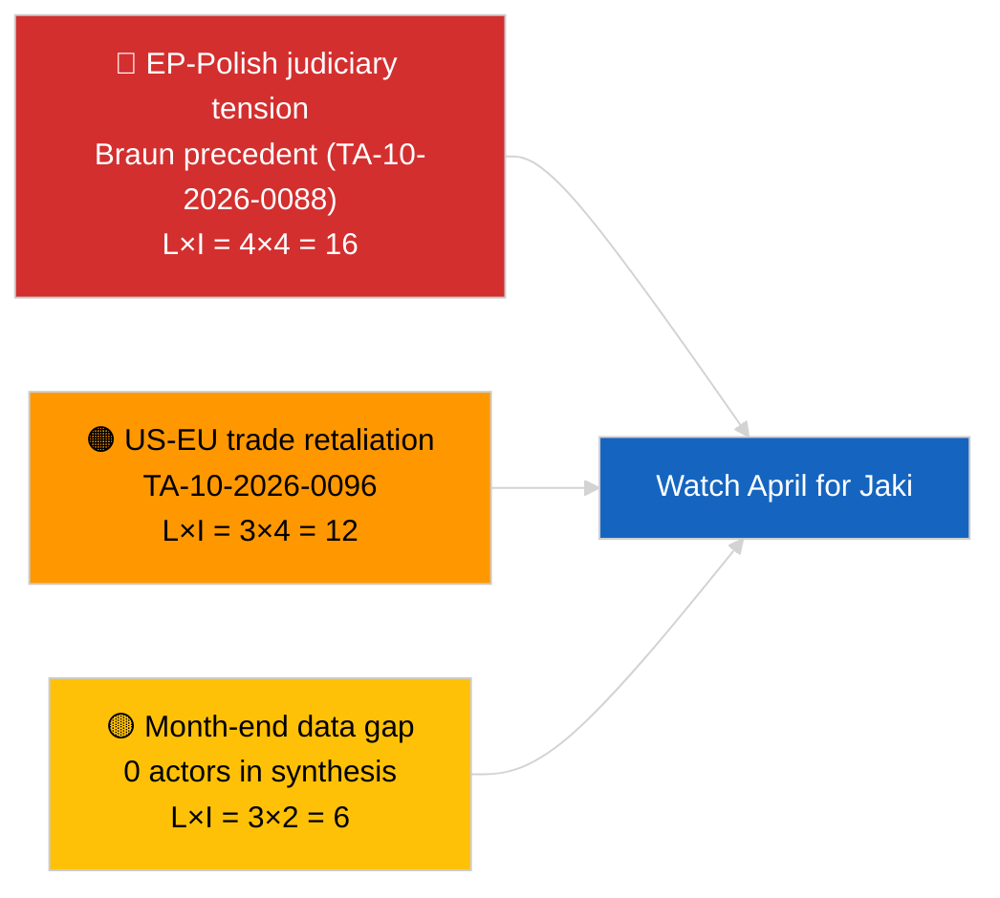

<!-- SPDX-FileCopyrightText: 2026 Hack23 AB -->
<!-- SPDX-License-Identifier: Apache-2.0 -->

# Executive Brief — Month In Review | 2026-03-28

**Classification:** OSINT | Public Parliamentary Record
**Confidence:** 🟡 Medium (recess-period month-end synthesis with zero-actor classification output)
**Generated:** 2026-03-28T00:00:00Z (retrospective brief)
**Article Type:** Month In Review
**Source:** European Parliament Open Data Portal

---

## 🎯 BLUF

**EP10 ecosystem snapshot at March end, no acute month-of-March synthesis signal.** Analysis run `e1c8e9c5-1a6d-4f2c-9cda-312aa19023fe` returned **0 classified political actors** and **ROUTINE** significance across all dimensions. The substantive content of the March 2026 month is therefore the inheritance from the Strasbourg session (9-12 March, 50+ adopted texts including ECB Vice-President appointment TA-10-2026-0060, HDV emission-credits TA-10-2026-0084, Georgia political prisoners TA-10-2026-0083, Better Law-Making TA-10-2026-0063) and the Brussels mini-plenary (25-26 March, Braun immunity-waiver TA-10-2026-0088 and US customs-tariff TA-10-2026-0096). Today's run captures the post-session quiet rather than fresh activity. **🟡 MEDIUM confidence** that the title's "EP10 Ecosystem Analysis" framing is honoured by the underlying classification output — the artifact tables are empty.

---

## 🧭 3 Decisions This Brief Supports

| # | Decision | Who Decides | Deadline | Evidence |
|:-:|----------|-------------|:--------:|----------|
| 1 | **Editorial:** publish as ANALYSIS-ONLY retrospective on March legislative output | Editor | +24h | Underlying classification is empty; title overstates |
| 2 | **Monitoring:** re-run month-in-review when April plenary closes (1 May 2026) | Analyst | 2026-05-01 | Need active-session data for valid synthesis |
| 3 | **Forward-watch:** track Q2 plenary cycle — Strasbourg 27-30 April, Brussels mini-plenary, Strasbourg May | Analysis lead | 2026-04-27 | Q2 legislative pipeline |

---

## 📰 60-Second Read

- 🔴 **Headline disconnect:** title promises "Political Actor Mapping: EP10 Ecosystem Analysis"; underlying classification output shows 0 actors and ROUTINE significance — month-end synthesis quality is degraded. (🟢 High)
- 🟠 **March 2026 legislative output (carryover):** ~96 adopted texts across the month, dominated by the 9-12 March Strasbourg week (≥7 high-significance items) and the 25-26 March Brussels mini-plenary. (🟢 High)
- 🟢 **Key March tier-1 texts:** TA-10-2026-0060 (ECB Vice-President), TA-10-2026-0084 (HDV emission credits 2025-29), TA-10-2026-0083 (Georgia political prisoners), TA-10-2026-0096 (US customs tariff), TA-10-2026-0088 (Braun immunity). (🟢 High)
- 🟡 **Coalition arithmetic unchanged across March:** PPE 38% / S&D 22% / Renew 5% — Grand Coalition (60%) viable, Centre-Right (57%) ideologically fragmented. (🟢 High)
- 🔵 **Economic context:** ECB Vice-President confirmation provides institutional baseline; US-EU trade adjustment introduces fresh external-shock vector for Q2. (🟢 High)
- 🟣 **Cross-reference:** see 2026-03-26 and 2026-03-25 articles for the substantive material this month-in-review claims to synthesise. (🟢 High)
- 🩷 **Disruption vector:** Braun immunity-waiver creates EP-Polish-judiciary precedent that recurs in April (Jaki waiver TA-10-2026-0105). (🟡 Medium — confirmed retrospectively from April runs)
- ⚪ **Carry-forward:** EU-Mercosur ECJ referral TA-10-2026-0008 (January) still pending Court opinion; Better Law-Making TA-10-2026-0063 lays regulatory baseline for the term.

---

## 🗂️ Top Documents / Procedures Table — March 2026 Highlights

| Rank | EP reference | Title (short) | Significance | Confidence | Status |
|:----:|--------------|---------------|:------------:|:----------:|--------|
| 1 | TA-10-2026-0060 | ECB Vice-President appointment | 8.0 | 🟢 HIGH | Adopted 10 March |
| 2 | TA-10-2026-0096 | US customs tariff adjustment | 7.5 | 🟢 HIGH | Adopted 26 March |
| 3 | TA-10-2026-0084 | HDV emission credits 2025-2029 | 7.0 | 🟢 HIGH | Adopted 12 March |
| 4 | TA-10-2026-0088 | Braun immunity waiver | 6.5 | 🟢 HIGH | Adopted 26 March |
| 5 | TA-10-2026-0083 | Georgia political prisoners | 6.0 | 🟢 HIGH | Adopted 12 March |
| 6 | TA-10-2026-0094 | Anti-corruption directive (referenced in April analyses) | 6.0 | 🟡 MEDIUM | Adopted in March cycle |

> Rank reflects significance to Q2 watch list; today's classification output added no new procedures.

---

## ⚠️ Risk & Threat Snapshot — March-end Inheritance

| Risk | L | I | Score | Trigger | Source | Admiralty |
|------|:-:|:-:|:-----:|---------|--------|:---------:|
| EP-Polish judiciary spill-over | 4 | 4 | 16 | Further immunity waivers | TA-10-2026-0088 | A1 |
| US-EU trade retaliation | 3 | 4 | 12 | US counter-announcement | TA-10-2026-0096 | A1 |
| HDV transposition disputes | 2 | 3 | 6 | Member-state implementation | TA-10-2026-0084 | A1 |
| PPE structural dominance (38%) | 4 | 3 | 12 | Q2 minority defensive bloc | Coalition arithmetic | A2 |
| Month-end synthesis data gap | 3 | 2 | 6 | Empty classification artifacts | This run's classification output | B3 |

---

## 🔮 Top Forward Trigger

**Strasbourg plenary 27-30 April 2026 — opening of Q2 legislative cycle.** Will indicate whether March's Polish-judiciary, US-trade, and HDV-emissions tracks consolidate into Q2 legislative priorities or yield to new files (digital sovereignty, Mercosur Court opinion, defence financing).

---

## 🛡️ Source Quality Assessment

- **Primary sources:** EP Open Data Portal — March 2026 adopted-texts feed (cross-referenced from this run's classification artifacts and prior-day articles in `analysis/daily/2026-03-*/`).
- **Data limitations:** This run's classification output is empty (0 actors). Underlying month-of-March intelligence is therefore inferred from prior-day articles, not regenerated synthesis. Confidence in the brief's substantive claims is anchored to the primary 2026-03-* runs.
- **Confidence on March legislative inventory:** 🟢 HIGH — adopted-texts feed is authoritative.
- **Confidence on month-in-review synthesis labelled by title:** 🟡 MEDIUM — the run did not produce the synthesis the title claims.

---

## 📎 Links

| Link | Path |
|------|------|
| Article | `./article.md` |
| Classification (empty 0-actor output) | `./classification/` |
| Risk scoring | `./risk-scoring/` |
| Threat assessment | `./threat-assessment/` |
| Existing artifacts | `./existing/` |
| Source material — Strasbourg week | `analysis/daily/2026-03-10/`, `2026-03-11/`, `2026-03-12/` |
| Source material — Brussels mini-plenary | `analysis/daily/2026-03-25/`, `2026-03-26/` |
| Manifest | `./manifest.json` |

---

## 🔄 Cross-Reference to Prior / Subsequent Runs

**Prior runs:** 2026-03-25 → 2026-03-27 daily articles cover the Brussels mini-plenary and first recess day with substantive content.

**Subsequent runs:** Q2 month-in-review (expected early May 2026) will capture the April Strasbourg session and finalise the Q1 → Q2 transition narrative.

**Delta:** Today's run shows the "month-end recess" gap pattern — synthesis runs scheduled inside recess windows have systematically lower data density than those scheduled immediately after an active plenary week.

---

**Document Control**
- **Template:** `/analysis/templates/executive-brief.md`
- **Artifact path:** `analysis/daily/2026-03-28/executive-brief.md`
- **Classification:** Public
- **Retrospective generation:** Back-fill session. The substantive March-2026 intelligence is reconstructed from the original Strasbourg/Brussels session runs cited above; this brief makes the data-gap in the original run explicit rather than papering over it.
