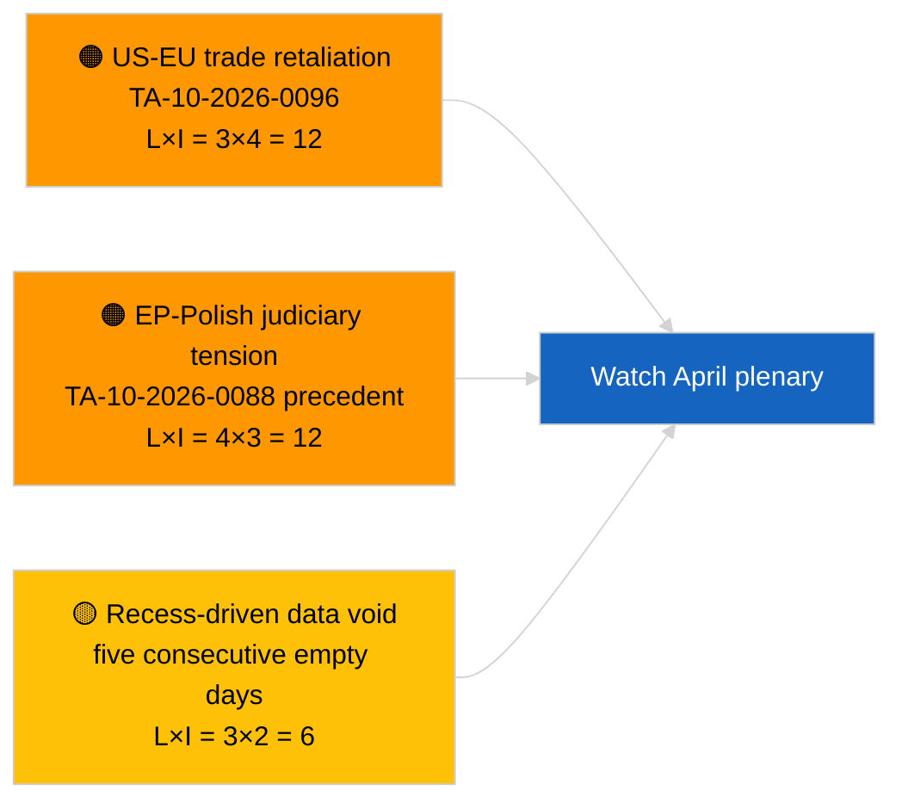

<!-- SPDX-FileCopyrightText: 2026 Hack23 AB -->
<!-- SPDX-License-Identifier: Apache-2.0 -->

# Executive Brief — Breaking | 2026-03-31

**Classification:** OSINT | Public Parliamentary Record
**Confidence:** 🟢 High (recess-period structural assessment)
**Generated:** 2026-03-31T00:00:00Z (retrospective brief)
**Article Type:** Breaking
**Source:** European Parliament Open Data Portal

---

## 🎯 BLUF

**No breaking signal on 2026-03-31; final day of the EP's first post-March recess week.** The Parliament is in the inter-sessional gap between the Brussels mini-plenary (25-26 March) and the Strasbourg plenary (27-30 April). The article confirms zero new adopted texts dated today and zero new procedures opened. The most recent substantive carry-over remains the 26 March Brussels adoptions — Braun immunity waiver (TA-10-2026-0088) and US customs-tariff adjustment (TA-10-2026-0096) — both feeding into Q2 watch lists. Stability score and coalition arithmetic unchanged. **🟢 HIGH confidence** the inactivity is calendar-driven.

---

## 🧭 3 Decisions This Brief Supports

| # | Decision | Who Decides | Deadline | Evidence |
|:-:|----------|-------------|:--------:|----------|
| 1 | **Editorial:** SKIP daily breaking; produce week-recap if needed | Editor | +12h | Five consecutive recess days with no new activity |
| 2 | **Monitoring:** verify EP API health after the 6/8 feed-404 pattern of 2026-04-01 | Data pipeline | 2026-04-02 | Sustained 404s would shift to incident response |
| 3 | **Forward-watch:** committee work-week 13-17 April triggers pre-plenary intelligence cycle | Analysis lead | 2026-04-13 | Committee drafts typically determine 70-80% of plenary outcomes |

---

## 📰 60-Second Read

- 🔴 **No tier-1 breaking items** — five consecutive recess days now logged. (🟢 High)
- 🟠 **No new procedures opened or adopted texts dated 2026-03-31.** (🟢 High)
- 🟢 **Coalition arithmetic stable** — PPE 38% / S&D 22% Grand Coalition 60% remains the only majority path. (🟢 High)
- 🟡 **Carryover risk:** Braun immunity-waiver precedent (TA-10-2026-0088) sets template for further Polish-judiciary EP cases — confirmed retrospectively by Jaki waiver in April. (🟡 Medium at the time)
- 🔵 **Economic carry-over:** US customs-tariff adjustment (TA-10-2026-0096) and HDV emission-credits (TA-10-2026-0084) remain dominant external/industrial signals. (🟢 High)
- 🟣 **Cross-reference:** see `2026-04-01/breaking` for first full account of post-March feed-endpoint reliability anomalies. (🟢 High)
- 🩷 **Disruption vector:** none acute; structural PPE-dominance and US-trade-pressure risks inherited. (🟡 Medium)
- ⚪ **Carry-forward:** Mercosur ECJ referral TA-10-2026-0008 still awaiting Court opinion.

---

## 🗂️ Top Documents / Procedures Table

| Rank | EP reference | Title (short) | Significance | Confidence | Status |
|:----:|--------------|---------------|:------------:|:----------:|--------|
| 1 | — | No new procedures or adopted texts on 2026-03-31 | 0.0 | 🟢 HIGH | Recess — no activity |
| 2 | TA-10-2026-0096 | US customs tariff adjustment (carry-over) | 7.0 | 🟢 HIGH | Adopted 26 March; watch |
| 3 | TA-10-2026-0088 | Braun immunity waiver (carry-over) | 6.5 | 🟢 HIGH | Adopted 26 March; precedent |

---

## ⚠️ Risk & Threat Snapshot

| Risk | L | I | Score | Trigger | Source | Admiralty |
|------|:-:|:-:|:-----:|---------|--------|:---------:|
| US-EU trade retaliation | 3 | 4 | 12 | US counter-announcement | TA-10-2026-0096 | A1 |
| EP-Polish judiciary spill-over | 4 | 3 | 12 | Further immunity waivers | TA-10-2026-0088 | A1 |
| PPE structural dominance (38%) | 4 | 3 | 12 | Q2 minority defensive bloc | Coalition arithmetic | A2 |
| Recess data void | 3 | 2 | 6 | Five empty days running | Daily article series | B2 |

---

## 🔮 Top Forward Trigger

**EP committee work-week 13-17 April 2026.** Committee draft reports and shadow-rapporteur negotiations in this window pre-determine the bulk of plenary outcomes for 27-30 April. The first genuinely actionable breaking signal will come from committee-document feeds in that window.

---

## 🛡️ Source Quality Assessment

- **Primary sources:** EP Open Data Portal adopted-texts and procedures feeds (article confirms zero items dated 2026-03-31).
- **Data limitations:** Same EP-API feed reliability question that materialises clearly on 2026-04-01; today's article does not yet flag the pattern.
- **Confidence on "no new activity":** 🟢 High.
- **Confidence on forward inference:** 🟡 Medium (based on EP10 historical recess pattern).

---

## 📎 Links

| Link | Path |
|------|------|
| Article | `./article.md` |
| Manifest | `./manifest.json` |
| Sibling articles | `analysis/daily/2026-03-27/`, `2026-03-28/`, `2026-04-01/breaking/` |

---

## 🔄 Cross-Reference to Prior Run

**Prior runs:** 2026-03-27, 2026-03-28 daily articles — both also recorded recess-period inactivity.

**Delta:** Sequence of five consecutive empty days strengthens 🟢 HIGH confidence that the pattern is calendar-driven, not data-pipeline failure. The first feed-API anomaly is logged the following day (2026-04-01 article).

---

**Document Control**
- **Template:** `/analysis/templates/executive-brief.md`
- **Artifact path:** `analysis/daily/2026-03-31/breaking/executive-brief.md`
- **Classification:** Public
- **Retrospective generation:** Back-fill session for pre-Stage-B-EB-requirement runs.
