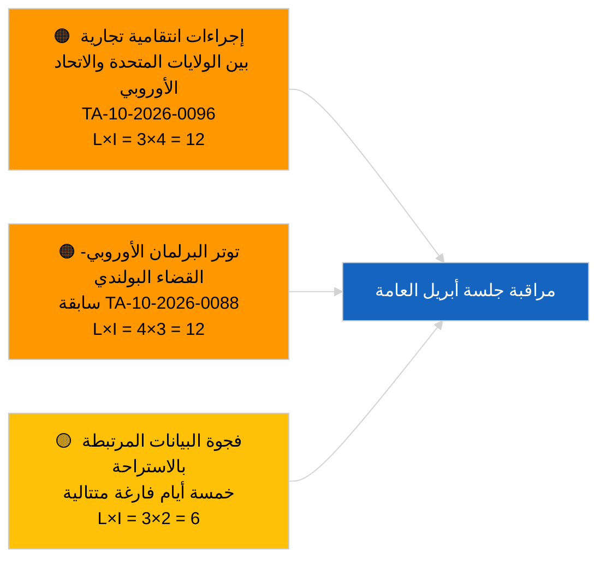

<!-- SPDX-FileCopyrightText: 2026 Hack23 AB -->
<!-- SPDX-License-Identifier: Apache-2.0 -->

# الإحاطة التنفيذية — أخبار عاجلة | 2026-03-31

**التصنيف:** المصادر المفتوحة | السجل البرلماني العام
**الثقة:** 🟢 عالية (تقييم هيكلي لفترة الاستراحة)
**تاريخ الإنشاء:** 2026-03-31T00:00:00Z (إحاطة استرجاعية)
**نوع المقال:** أخبار عاجلة
**المصدر:** بوابة البيانات المفتوحة للبرلمان الأوروبي

---

## 🎯 الملخص

**لا توجد إشارة عاجلة في 31.3.2026؛ آخر يوم في أسبوع الاستراحة الأول للبرلمان الأوروبي عقب مارس.** يوجد البرلمان في توقف ما بين الدورات بين الجلسة العامة المصغّرة في بروكسل (25–26 مارس) وجلسة ستراسبورغ (27–30 أبريل). تؤكد الإحاطة عدم وجود نصوص معتمدة جديدة بتاريخ اليوم وعدم فتح أي إجراء جديد. أبرز إشارة إرجاء تبقى من اعتمادات بروكسل في 26 مارس — رفع حصانة براون (TA-10-2026-0088) ولائحة تعديل التعريفات الأمريكية (TA-10-2026-0096) — وكلاهما وثيق الصلة بقوائم المراقبة للربع الثاني. يبقى مؤشر الاستقرار وحسابات التحالف دون تغيير. **🟢 ثقة عالية** بأن الخمول ذو طابع تقويمي.

---

## 🧭 ثلاثة قرارات تدعمها هذه الإحاطة

| # | القرار | صاحب القرار | الموعد | الأدلة |
|:-:|--------|-------------|:------:|--------|
| 1 | **تحريري:** تخطّي النشرة اليومية؛ إعداد ملخص أسبوعي عند الحاجة | المحرر | +12 ساعة | خمسة أيام متتالية في الاستراحة دون أي نشاط جديد |
| 2 | **المراقبة:** التحقق من حالة واجهة برمجة تطبيقات البرلمان الأوروبي بعد نمط أخطاء 404 (6 من 8) في 2026-04-01 | خط البيانات | 2026-04-02 | الأخطاء المستمرة تتصاعد إلى استجابة حوادث |
| 3 | **الاستشراف:** أسبوع عمل اللجان 13–17 أبريل يطلق دورة الأخبار قبيل الجلسة العامة | رئيسة التحليل | 2026-04-13 | مسودات اللجان تحدد عادةً 70–80 % من نتائج الجلسة العامة |

---

## 📰 القراءة الستينية

- 🔴 **لا توجد مقالات من المستوى الأول** — خمسة أيام متتالية في الاستراحة مسجّلة الآن. (🟢 عالية)
- 🟠 **لم يُفتح أي إجراء جديد ولم تُعتمد أي نصوص بتاريخ 2026-03-31.** (🟢 عالية)
- 🟢 **حسابات التحالف مستقرة** — التحالف الكبير حزب الشعب الأوروبي 38 % / الاشتراكيون 22 %، مجموعه 60 %، يبقى المسار الوحيد للحصول على الأغلبية. (🟢 عالية)
- 🟡 **خطر الإرجاء:** سابقة رفع حصانة براون (TA-10-2026-0088) تُرسي نموذجاً لقضايا البرلمان الأوروبي المتعلقة بالقضاء البولندي — مؤكَّدة استرجاعياً برفع حصانة ياكي في أبريل. (🟡 متوسطة في حينه)
- 🔵 **إرجاء اقتصادي:** لائحة تعديل التعريفات الأمريكية (TA-10-2026-0096) وائتمانات انبعاثات المركبات الثقيلة (TA-10-2026-0084) تبقى الإشارتين الخارجية والصناعية المهيمنتين. (🟢 عالية)
- 🟣 **إسناد متقاطع:** انظر `2026-04-01/breaking` للتقرير الأول الكامل عن شذوذ موثوقية نقاط نهاية التغذيات بعد مارس. (🟢 عالية)
- 🩷 **ناقل التعطيل:** لا حالة طارئة؛ الهيمنة الهيكلية لحزب الشعب الأوروبي ومخاطر الضغط التجاري الأمريكي مُستمَرة. (🟡 متوسطة)
- ⚪ **إحالة:** طلب إحكام محكمة العدل الأوروبية بشأن ميركوسور TA-10-2026-0008 لا يزال ينتظر الرأي.

---

## 🗂️ أبرز الوثائق / جدول الإجراءات

| الترتيب | مرجع البرلمان | العنوان (مختصر) | الأهمية | الثقة | الحالة |
|:-------:|---------------|-----------------|:-------:|:-----:|--------|
| 1 | — | لا توجد إجراءات أو نصوص معتمدة جديدة في 2026-03-31 | 0,0 | 🟢 عالية | استراحة — لا نشاط |
| 2 | TA-10-2026-0096 | لائحة تعديل التعريفات الأمريكية (إرجاء) | 7,0 | 🟢 عالية | اعتُمدت 26 مارس؛ قيد المراقبة |
| 3 | TA-10-2026-0088 | رفع حصانة براون (إرجاء) | 6,5 | 🟢 عالية | اعتُمدت 26 مارس؛ سابقة |

---

## ⚠️ لمحة المخاطر والتهديدات

| المخاطر | الاحتمال | التأثير | النتيجة | المحرّك | المصدر | تقييم أميرالية |
|---------|:--------:|:-------:|:-------:|---------|--------|----------------|
| إجراءات انتقامية تجارية بين الولايات المتحدة والاتحاد الأوروبي | 3 | 4 | 12 | إعلان مضاد أمريكي | TA-10-2026-0096 | A1 |
| امتداد توتر البرلمان الأوروبي-القضاء البولندي | 4 | 3 | 12 | رفع حصانات إضافية | TA-10-2026-0088 | A1 |
| الهيمنة الهيكلية لحزب الشعب الأوروبي (38 %) | 4 | 3 | 12 | كتلة الدفاع الأقلوية ر2 | حسابات التحالف | A2 |
| فجوة بيانات الاستراحة | 3 | 2 | 6 | خمسة أيام فارغة متتالية | سلسلة مقالات يومية | B2 |

---

## 🔮 أبرز المحفزات المستقبلية

**أسبوع عمل لجان البرلمان الأوروبي 13–17 أبريل 2026.** مسودات اللجان ومفاوضات المقررين الظل خلال هذه الفترة تحدد إلى حد بعيد نتائج الجلسة العامة 27–30 أبريل. ستصدر الإشارة الأولى القابلة للتنفيذ فعلياً من تغذيات وثائق اللجان في هذه النافذة الزمنية.

---

## 🛡️ تقييم جودة المصادر

- **المصادر الأولية:** بوابة البيانات المفتوحة للبرلمان الأوروبي: تغذيات النصوص المعتمدة والإجراءات (تؤكد الإحاطة عدم وجود مدخلات مؤرخة في 2026-03-31).
- **قيود البيانات:** نفس إشكالية موثوقية تغذية واجهة برمجة التطبيقات للبرلمان الأوروبي التي تظهر بجلاء في 2026-04-01؛ إحاطة اليوم لا تُعلّم النمط بعد.
- **الثقة في غياب النشاط:** 🟢 عالية.
- **الثقة في الاستدلال التقدمي:** 🟡 متوسطة (مستندة إلى نمط استراحة البرلمان الأوروبي EP10 التاريخي).

---

## 📎 الروابط

| الرابط | المسار |
|--------|--------|
| المقال | `./article.md` |
| البيان | `./manifest.json` |
| الإحاطات الشقيقة | `analysis/daily/2026-03-27/`, `2026-03-28/`, `2026-04-01/breaking/` |

---

## 🔄 الإسناد المتقاطع مع التشغيل السابق

**التشغيلات السابقة:** مقالات يومية 2026-03-27 و2026-03-28 — كلاهما سجّل خمول فترة الاستراحة.

**الفارق:** تسلسل خمسة أيام فارغة متتالية يعزز 🟢 الثقة العالية بأن النمط تقويمي وليس عطلاً في خط البيانات. تُسجَّل أول شذوذ في واجهة برمجة تطبيقات التغذية في اليوم التالي (مقال 2026-04-01).

---

**التحكم الوثائقي**
- **النموذج:** `/analysis/templates/executive-brief.md`
- **مسار الأثر:** `analysis/daily/2026-03-31/breaking/executive-brief.md`
- **التصنيف:** عام
- **الإنشاء الاسترجاعي:** جلسة تعبئة للتشغيلات السابقة لمتطلب الإحاطة التنفيذية من المرحلة ب.
