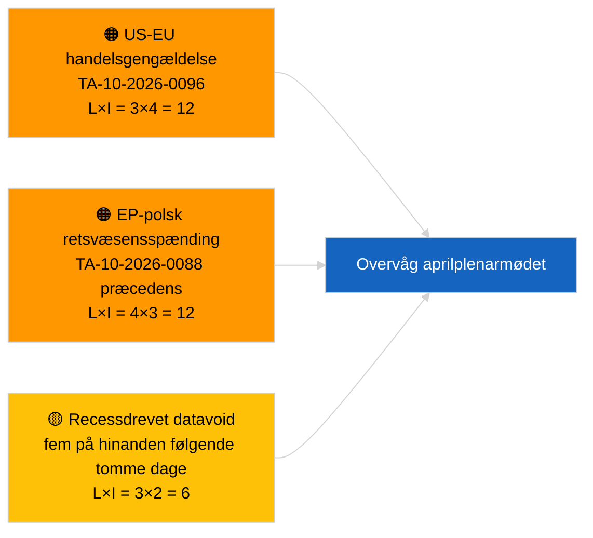

<!-- SPDX-FileCopyrightText: 2026 Hack23 AB -->
<!-- SPDX-License-Identifier: Apache-2.0 -->

# Ledelsesorientering — Seneste nyt | 2026-03-31

**Klassificering:** OSINT | Offentlig parlamentarisk registrering
**Konfidens:** 🟢 Høj (strukturel vurdering for recessperiode)
**Genereret:** 2026-03-31T00:00:00Z (retrospektiv orientering)
**Artikeltype:** Seneste nyt
**Kilde:** Europa-Parlamentets åbne dataportal

---

## 🎯 BLUF

**Intet nyhedssignal den 2026-03-31; sidste dag i EP's første recessuge efter marts.** Parlamentet befinder sig i den inter-sessionelle pause mellem Brussels mini-plenum (25.-26. marts) og Strasbourg-plenarmødet (27.-30. april). Artiklen bekræfter nul nye vedtagne tekster dateret i dag og nul nye åbnede procedurer. Det seneste substantielle carryover-signal er fortsat fra de Bruxelles-vedtagne tekster den 26. marts — Braun-immunitetsophævningen (TA-10-2026-0088) og justeringen af amerikanske toldtariffer (TA-10-2026-0096) — begge bidrager til overvågningslister for Q2. Stabilitetspoint og koalitionsaritmetik uændrede. **🟢 HØJ konfidens** om at inaktiviteten er kalenderdriven.

---

## 🧭 3 beslutninger som denne orientering understøtter

| # | Beslutning | Beslutningstager | Frist | Bevis |
|:-:|------------|------------------|:-----:|-------|
| 1 | **Redaktionelt:** SPRING daglig nyhed over; udarbejd ugeoversigt om nødvendigt | Redaktør | +12t | Fem på hinanden følgende recessdage uden ny aktivitet |
| 2 | **Overvågning:** verificer EP API-sundhed efter 6/8 feed-404-mønsteret den 2026-04-01 | Datapipeline | 2026-04-02 | Vedvarende 404-fejl skifter til hændelsesrespons |
| 3 | **Fremtidsovervågning:** udvalgenes arbejdsuge 13.-17. april udløser pre-plenareftereretningscyklus | Analyseansvarlig | 2026-04-13 | Udvalgsudkast bestemmer typisk 70-80 % af plenarresultaterne |

---

## 📰 60 sekunders læsning

- 🔴 **Ingen tier-1-nyheder** — fem på hinanden følgende recessdage nu registreret. (🟢 Høj)
- 🟠 **Ingen nye procedurer åbnet eller vedtagne tekster dateret 2026-03-31.** (🟢 Høj)
- 🟢 **Koalitionsaritmetik stabil** — PPE 38 % / S&D 22 % Storkoalition 60 % forbliver den eneste majoritetsvej. (🟢 Høj)
- 🟡 **Carryover-risiko:** Braun-immunitetsophævningspræcedens (TA-10-2026-0088) opstiller skabelon for yderligere polsk-retsvæsen EP-sager — bekræftet retrospektivt af Jaki-ophævningen i april. (🟡 Middel på daværende tidspunkt)
- 🔵 **Økonomisk carryover:** Justering af amerikanske toldtariffer (TA-10-2026-0096) og HDV-udledningskreditter (TA-10-2026-0084) forbliver dominerende eksterne/industrielle signaler. (🟢 Høj)
- 🟣 **Krydsreference:** se `2026-04-01/breaking` for første fuldstændige redegørelse for pålidelighedsanomalier i post-marts feed-endpoints. (🟢 Høj)
- 🩷 **Forstyrrelsesvektorer:** ingen akutte; strukturel PPE-dominans og amerikanske handelspres-risici er arvede. (🟡 Middel)
- ⚪ **Fremadrettet:** Mercosur ECJ-forelæggelse TA-10-2026-0008 afventer stadig domstolsudtalelse.

---

## 🗂️ Topdokumenter / proceduretabel

| Rang | EP-reference | Titel (kort) | Betydning | Konfidens | Status |
|:----:|--------------|--------------|:---------:|:---------:|--------|
| 1 | — | Ingen nye procedurer eller vedtagne tekster den 2026-03-31 | 0,0 | 🟢 HØJ | Recess — ingen aktivitet |
| 2 | TA-10-2026-0096 | Justering af amerikanske toldtariffer (carryover) | 7,0 | 🟢 HØJ | Vedtaget 26. marts; overvågning |
| 3 | TA-10-2026-0088 | Braun-immunitetsophævning (carryover) | 6,5 | 🟢 HØJ | Vedtaget 26. marts; præcedens |

---

## ⚠️ Risiko- og trusseloversigt

| Risiko | S | P | Score | Udløser | Kilde | Admiralitetsgrad |
|--------|:-:|:-:|:-----:|---------|-------|:----------------:|
| USA-EU handelsgengældelse | 3 | 4 | 12 | Amerikansk modtiltag | TA-10-2026-0096 | A1 |
| EP-polsk retsvæsen-afsmitning | 4 | 3 | 12 | Yderligere immunitetsophævninger | TA-10-2026-0088 | A1 |
| PPE strukturel dominans (38 %) | 4 | 3 | 12 | Q2 minoritetsdefensivt blok | Koalitionsaritmetik | A2 |
| Recessdatavoid | 3 | 2 | 6 | Fem tomme dage i træk | Daglig artikkelserie | B2 |

---

## 🔮 Top fremtidsudløser

**EP-udvalgenes arbejdsuge 13.-17. april 2026.** Udvalgsudkast og skyggeordførersforhandlinger i dette vindue forudbestemmer størstedelen af plenarresultaterne for 27.-30. april. Det første genuint handlingsbare nyhedssignal vil komme fra udvalgs-dokumentfeeds i dette vindue.

---

## 🛡️ Vurdering af kildekvalitet

- **Primære kilder:** EP's åbne dataportal: vedtagne tekster og procedurefeeds (artiklen bekræfter nul elementer dateret 2026-03-31).
- **Databegrænsninger:** Samme spørgsmål om EP API-feedpålidelighed, der tydeligt materialiseres den 2026-04-01; dagens artikel flagger endnu ikke mønsteret.
- **Konfidens for "ingen ny aktivitet":** 🟢 Høj.
- **Konfidens for fremadrettet inferens:** 🟡 Middel (baseret på EP10's historiske recessmønster).

---

## 📎 Links

| Link | Sti |
|------|-----|
| Artikel | `./article.md` |
| Manifest | `./manifest.json` |
| Søsterartikler | `analysis/daily/2026-03-27/`, `2026-03-28/`, `2026-04-01/breaking/` |

---

## 🔄 Krydsreference til forrige kørsel

**Tidligere kørsler:** 2026-03-27, 2026-03-28 daglige artikler — begge registrerede recessperiodens inaktivitet.

**Delta:** Sekvensen af fem på hinanden følgende tomme dage styrker 🟢 HØJ konfidens om, at mønsteret er kalenderdrevet og ikke en datapipelinefejl. Den første feed-API-anomali registreres den følgende dag (artikel 2026-04-01).

---

**Dokumentkontrol**
- **Skabelon:** `/analysis/templates/executive-brief.md`
- **Artefaktsti:** `analysis/daily/2026-03-31/breaking/executive-brief.md`
- **Klassificering:** Offentlig
- **Retrospektiv generering:** Tilbagefyldningssession for kørsler forud for Stage-B-EB-kravet.
